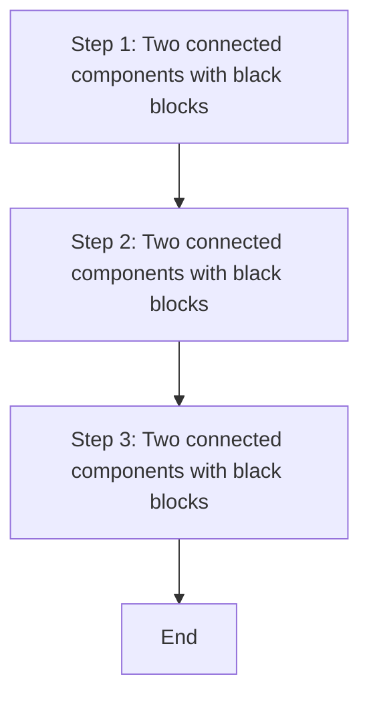
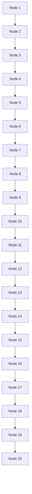

# Acceptability of Electronic Assemblies

Developed by

Association Connecting Electronics Industries

# The Principles of Standardization

In May 1995 the IPC's Technical Activities Executive Committee (TAEC) adopted Principles of Standardization as a guiding principle of IPC's standardization efforts.

# Standards Should:

• Show relationship to Design for Manufacturability (DFM) and Design for the Environment (DFE)  
- Minimize time to market  
- Contain simple (simplified) language  
- Just include spec information  
• Focus on end product performance  
- Include a feedback system on use and problems for future improvement

# Standards Should Not:

- Inhibit innovation  
- Increase time-to-market  
- Keep people out  
- Increase cycle time  
• Tell you how to make something  
- Contain anything that cannot be defended with data

# Notice

IPC Standards and Publications are designed to serve the public interest through eliminating misunderstandings between manufacturers and purchasers, facilitating interchangeability and improvement of products, and assisting the purchaser in selecting and obtaining with minimum delay the proper product for his particular need. Existence of such Standards and Publications shall not in any respect preclude any member or nonmember of IPC from manufacturing or selling products not conforming to such Standards and Publication, nor shall the existence of such Standards and Publications preclude their voluntary use by those other than IPC members, whether the standard is to be used either domestically or internationally.

Recommended Standards and Publications are adopted by IPC without regard to whether their adoption may involve patents on articles, materials, or processes. By such action, IPC does not assume any liability to any patent owner, nor do they assume any obligation whatever to parties adopting the Recommended Standard or Publication. Users are also wholly responsible for protecting themselves against all claims of liabilities for patent infringement.

# IPC Position Statement on Specification Revision Change

It is the position of IPC's Technical Activities Executive Committee that the use and implementation of IPC publications is voluntary and is part of a relationship entered into by customer and supplier. When an IPC publication is updated and a new revision is published, it is the opinion of the TAEC that the use of the new revision as part of an existing relationship is not automatic unless required by the contract. The TAEC recommends the use of the latest revision. Adopted October 6, 1998

# Why is there a charge for this document?

Your purchase of this document contributes to the ongoing development of new and updated industry standards and publications. Standards allow manufacturers, customers, and suppliers to understand one another better. Standards allow manufacturers greater efficiencies when they can set up their processes to meet industry standards, allowing them to offer their customers lower costs.

IPC spends hundreds of thousands of dollars annually to support IPC's volunteers in the standards and publications development process. There are many rounds of drafts sent out for review and the committees spend hundreds of hours in review and development. IPC's staff attends and participates in committee activities, typesets and circulates document drafts, and follows all necessary procedures to qualify for ANSI approval.

IPC's membership dues have been kept low to allow as many companies as possible to participate. Therefore, the standards and publications revenue is necessary to complement dues revenue. The price schedule offers a $50\%$ discount to IPC members. If your company buys IPC standards and publications, why not take advantage of this and the many other benefits of IPC membership as well? For more information on membership in IPC, please visit www.ipc.org or call 847/597-2872.

Thank you for your continued support.

# Acceptability of Electronic Assemblies

If a conflict occurs between the English language and translated versions of this document, the English version will take precedence.

Developed by the IPC-A-610 Task Group (7-31b) of the Acceptability Subcommittee (7-31) of the Product Assurance Committee (7-30) of IPC

# Supersedes:

IPC-A-610F WAM1 - February 2016

IPC-A-610F - July 2014

IPC-A-610E - April 2010

IPC-A-610D - February 2005

IPC-A-610C - January 2000

IPC-A-610B - December 1994

IPC-A-610A - March 1990

IPC-A-610 - August 1983

Users of this publication are encouraged to participate in the development of future revisions.

Contact:

IPC

3000 Lakeside Drive, Suite 105N

Bannockburn, Illinois

60015-1249

Tel 847 615.7100

Fax 847 615.7105

# ADOPTION NOTICE

IPC-A610, "Acceptability of Electronic Assemblies", was adopted on 12-FEB-02 for use by the Department of Defense (DoD). Proposed changes by DoD activities must be submitted to the DoD Adopting Activity: Commander, US Army Tank-Automotive and Armaments Command, ATTN: AMSTA-TR-E/IE, Warren, MI 48397-5000. Copies of this document may be purchased from the The Institute for Interconnecting and Packaging Electronic Circuits, 2215 Sanders Rd, Suite 200 South, Northbrook, IL 60062. http://www.ipc.org/

# Custodians:

Army - AT

Navy - AS

Air Force - 11

# Adopting Activity:

Army - AT

(Project SOLD-0060)

# Reviewer Activities:

Army - AV, MI

# Acknowledgment

Any document involving a complex technology draws material from a vast number of sources across many continents. While the principal members of the IPC-A-610 Task Group (7-31b) of the Acceptability Subcommittee (7-31) of the Product Assurance Committee (7-30) are shown below, it is not possible to include all of those who assisted in the evolution of this Standard. To each of them, the members of the IPC extend their gratitude.

# Product Assurance Committee

Chair

Robert Cooke

NASA Johnson Space Center

Vice Chair

Debbie Wade

Advanced Rework Technology Ltd.-A.R.T.

# Acceptability Subcommittee

Chair

Constantino J. Gonzalez

ACME Training & Consulting

# IPC-A-610 Task Group

Co-Chairs

Constantino J. Gonzalez

ACME Training & Consulting

Mary Muller

Crane Aerospace & Electronics

Robert Fornefeld

L-3 Technologies

# Technical Liaison of the IPC Board of Directors

Bob Neves

Microtek (Changzhou) Laboratories

# Contributing Members of IPC-A-610 Task Group

Ted Faulkner

Gaston Hidalgo

Muhammet Ozcan

Mel Parrish

Sezgin Sezer

Arye Grushka, A. A. Training Consulting and Trade A.G. Ltd.

Neil Wolford, AbelConn, LLC

Ross Dillman, ACI Technologies, Inc.

Constantino J. Gonzalez, ACME Training & Consulting

John Vickers, Advanced Rework Technology-A.R.T.

Debbie Wade, Advanced Rework Technology-A.R.T.

Karen Tellefsen, Alpha Assembly Solutions

Steven Bowles, ALL Flex LLC

Russell Steiner, Allegion

Bradley Smith, Allegro MicroSystems Inc.

Mitchell Holtzer, Alpha Assembly Solutions

Claus Molgaard, ALPHA-elektronik A/S

Sean Keating, Amphenol Limited (UK)

Bruce Hughes, AMRDEC MS&T EPPT

Michael Aldrich, Analog Devices Inc.

Scott Venhaus, Arrow Electronics Inc.

David Greer, AssembleTronics LLC

Bill Strachan, ASTA - Portsmouth University

Erik Bjerke, BAE Systems

Tim Gallagher, BAE Systems

Joseph Kane, BAE Systems

Agnieszka Ozarowski, BAE Systems

Darrell Sensing, BAE Systems

Gary Morgan, Ball Aerospace & Technologies Corp.

Jonathon Vermillion, Ball Aerospace & Technologies Corp.

Gerald Leslie Bogert, Bechtel Plant Machinery, Inc.

James Barnhart, BEST Inc.

Norman Mier, BEST Inc.

Dorothy Cornell, Blackfox Training Institute

Vincent Price, Blackfox Training Institute

Karl Mueller, Boeing Company

Brandy Tharp, Carlisle Interconnect Technologies

Zenaida Valianu, Celestica

Steven Perng, Cisco Systems Inc.

Robert Priore, Cisco Systems Inc.

Marilyn Lawrence, Conformance Technologies, Inc.

Hans-Otto Fickenscher, Conti Temic Microelectronic GmbH

Indira Vazquez, Continental Automotive

Miguel Dominguez, Continental Temic SA de CV

Rafael Leon, Continental Temic SA de CV

Jose Servin Olivares, Continental Temic SA de CV

Michael Meigh, Copper and Optic Terminations

Mary Muller, Crane Aerospace & Electronics

Symon Franklin, Custom Interconnect Ltd

Wallace Ables, Dell Inc.

Dan Stein, Dell Inc.

Anitha Sinkfield, Delphi Electronics and Safety

Vicki Hagen, Delta Group Electronics, Inc.

Irene Romero, Delta Group Electronics Inc.

Cengiz Oztunc, DNZ Ltd.

Nick Barnes, DVR Ltd

# Acknowledgment (cont.)

Timothy McFadden, EEI Manufacturing Services

Leo Lambert, EPTAC Corporation

Helena Pasquito, EPTAC Corporation

Ramon Essers, ETECH-trainingen

Ramon Koch, ETECH-trainingen

Joachim Schuett, FED-Fachverband Elektronik Design e.V.

Eric Camden, Foresite, Inc.

Francisco Fourcade, Fourcad, Inc

Stephen Fribbins, Fribbins Training Services

Kenneth Schmid, GE Aviation

Milea Kammer, Honeywell Aerospace

John Mastorides, Honeywell Aerospace

Richard Rumas, Honeywell Canada

Kristen Troxel, HP Inc.

Elizabeth Benedetto, HP Inc.

Jennie Hwang, H-Technologies Group

Poul Juul, HYTEK

Kelly Kovalovsky, i3 Electronics

Linda Tucker-Evoniuk, Independent Training and Consultation

Ana Ferrari Felippi, Instituto de Pesquisas Eldorado

Jagadeesh Radhakrishnan, Intel Corporation

Ife Hsu, Intel Corporation

Jon Roberts, J.F. Drake State Technical College

Kentaro Kono, Japan Unix Co., Ltd.

Yusaku Kono, Japan Unix Co., Ltd.

Toshiyasu Takei, Japan Unix Co., Ltd.

David Barastegui, JBC Soldering, S.L.

David Reyes, JBC Tools, USA

Reza Ghaffarian, Jet Propulsion Laboratory

Akikazu Shibata, JPCA-Japan Electronics Packaging and Circuits Association

Craig Pfefferman, JRI, Inc.

Kevin Boblits, K&M Manufacturing Solutions, LLC

Sue Powers-Hartman, Killdeer Mountain Manufacturing, Inc.

Nancy Bullock-Ludwig, Kimball Electronics

Kevin Schuld, Kontron America

Shaun Wurzner, Korry Electronics Co.

Augustin Stan, L&G Advice Serv SRL

Robert Fornefeld, L-3 Technologies

Shelley Holt, L-3 Technologies

Frederick Beltran, L-3 Technologies

Victor Powell, L-3 Communications Aviation Recorders

Daniel Lipps, L-3 Fuzing and Ordnance Systems, Cincinnati

Keld Maaloee, LEGO Systems A/S

Josh Goolsby, Lockheed Martin Missiles & Fire Control

Ben Gumpert, Lockheed Martin Missile & Fire Control

Sharissa Johns, Lockheed Martin Missiles & Fire Control

Vijay Kumar, Lockheed Martin Missile & Fire Control

Christopher LaVine, Lockheed Martin Missiles & Fire Control

Ann Marie Tully, Lockheed Martin Missile & Fire Control

Ekaterina Stees, Lockheed Martin Missile & Fire Control

David Mitchell, Lockheed Martin Mission Systems & Training

Pamela Petcosky, Lockheed Martin Mission Systems & Training

Kimberly Shields, Lockheed Martin Mission Systems & Training

Keith Walker, Lockheed Martin Mission Systems & Training

Jamie Albin, Lockheed Martin Space Systems Company

Linda Woody, LWC Consulting

Younes Jellali, MacDonald Dettwiler & Associates Corp.

Ann Thompson, Madison College

Michael Durkan, Mentor Graphics Corporation

Gregg Owens, Millenium Space Systems

William Pfingston, Miraco, Inc.

Daniel Foster, Missile Defense Agency

Bill Kasprzak, Moog Inc.

Mary Lou Sachenik, Moog Inc.

Edward Rios, Motorola Solutions

Gerd Fischer, NASA Goddard Space Flight Center

Chris Fitzgerald, Nasa Goddard Space Flight Center

Robert Cooke, NASA Johnson Space Center

James Blanche, NASA Marshall Space Flight Center

Alvin Boutte, NASA Marshall Space Flight Center

Charles Gamble, NASA Marshall Space Flight Center

Adam Gowan, NASA Marshall Space Flight Center

Garry McGuire, NASA Marshall Space Flight Center

Zackary Fava, NAVAIR

Jennie Smith, Naval Air Warfare Center Weapons Division

Wayne Thomas, Nexteer Automotive

Darrin Dodson, Nokia

Joseph Smetana, Nokia

Mahendra Gandhi, Northrop Grumman Aerospace Systems

Rene Martinez, Northrop Grumman Aerospace Systems

Randy McNutt, Northrop Grumman Aerospace Systems

Robert Cass, Northrop Grumman Amherst Systems

Cathy Cross, Northrop Grumman Corp. (WRRSC)

Adi Lang, Northrop Grumman Corporation

Doris McGee, Northrop Grumman Corporation

Callie Olague, Northrop Grumman Systems Corporation

Donald McFarland, NSF ISR, Ltd.

Kim Mason, NSWC Crane

# Acknowledgment (cont.)

William May, NSWC Crane

Daniel McCormick, NSWC Crane

Joseph Sherfick, NSWC Crane

Angela Pennington, NuWaves Engineering

Toshiyuki Sugiyama, Omron Corporation-Inspection Systems Business Division

Alistair Gooch, Optilia Instruments AB

Michael Jawitz, Orbital ATK

Daniel Morin, Orbital ATK

Mark Shireman, Orbital ATK

Juan Castro, Pacific Testing Laboratories, Inc.

Gustavo Arredondo, Para Tech Coating Inc.

Jan Kolsters, Philips Lighting Electronics

Matt Garrett, Phonon Corporation

Ron Fonsaer, PIEK International Education Centre (I.E.C.) BV

Frank Huijsmans, PIEK International Education Centre (I.E.C.) BV

Rob Walls, PIEK International Education Centre (I.E.C.) BV

Gene Dunn, Plexus Corporation

Toby Stecher, Pole Zero Corporation

Catherine Hanlin, Precision Manufacturing Company, Inc.

Gabriel Rosin, QGR

Steven Corkery, Raytheon Company

James Daggett, Raytheon Company

Giuseppe Favazza, Raytheon Company

Charles Gibbons, Raytheon Company

Amy Hagnauer, Raytheon Company

Lisa Maciolek, Raytheon Company

David Magee, Raytheon Company

William Ortloff, Raytheon Company

James Saunders, Raytheon Company

Fonda Wu, Raytheon Company

Lance Brack, Raytheon Missile Systems

Kathy Johnston, Raytheon Missile Systems

George Millman, Raytheon Missile Systems

Martin Scionti, Raytheon Missile Systems

Patrick Kane, Raytheon System Technology

Paula Jackson, Raytheon UK

Udo Welzel, Robert Bosch GmbH

David Adams, Rockwell Collins

Caroline Ehlinger, Rockwell Collins

David Hillman, Rockwell Collins

Douglas Pauls, Rockwell Collins

Debie Vorwald, Rockwell Collins

Casimir Budzinski, Safari Circuits Inc.

Gary Latta, SAIC

Erik Quam, Schlumberger Well Services

Richard Henrick, SCI Technology, Inc.

Larisa Vishkovetsky, Seagate Technology

Robert Jackson, Semi-Kinetics

Vern Solberg, Solberg Technical Consulting

Gerard O'Brien, Solderability Testing & Solutions, Inc.

Finn Skaanning, SQC DENMARK (Skaanning Quality & Certification)

Paul Pidgeon, STEM Training

Patricia Scott, STI Electronics, Inc.

Rainer Taube, Taube Electronic GmbH

Cary Schmidt, Teknetix Inc.

Arnaud Grivon, Thales Global Services

Heriberto Alanis, The Chamberlain Group, Inc.

Thomas Ahrens, Trainalytics GmbH

Kevin Motson, TTM Technologies, Inc.

Tapas Yagnik, TTM Technologies, Inc.

David Carlton, U.S. Army Aviation & Missile Command

Sharon Ventress, U.S. Army Aviation & Missile Command

Emma Hudson, UL International UK Ltd.

Alan Christmas, Ultra Electronics Communication & Integrated Systems

William Cardinal, UTC Aerospace Systems

Scott Meyer, UTC Aerospace Systems

Constantin Hudon, Varitron Technologies Inc.

Dave Harrell, ViaSat Inc.

Gerjan Diepstraten, Vitronics Soltec

Didem Caliskan, VLE Elektronik Otomotiv San. ve Tic. A.S.

Jeffrey Black, Westinghouse Electric Co., LLC

Zhe (Jacky) Liu, ZTE Corporation

# A special acknowledgement is given to the following members who provided pictures and illustrations that are used in this revision.

Jennifer Day

Mel Parrish

Constantino J. Gonzalez, ACME Training & Consulting

Jonathon Vermillion, Ball Aerospace & Technologies Corp.

Cynthia Gomez, Continental Temic SA de CV

Anitha Sinkfield, Delphi Electronics and Safety

Jack Zhao, Emerson Network Power Co. Ltd.

Omar Karin Hernandez, Flextronics Manufacturing Mex, SA de CV

He DaPeng, Huawei Technologies Co., LTD.

# Acknowledgment (cont.)

Zhou HuiLing, Huawei Technologies Co., LTD.

Zhang Yuan, Huawei Technologies Co., LTD.

Alex Christensen, HYTEK

Bert El-Bakri, Inovar, Inc.

Luca Moliterni, Istituto Italiano della Saldatura

Wang Renhua, Jabil Circuit, Shanghai

Nancy Bullock-Ludwig, Kimball Electronics Group

C. Don Dupriest, Lockheed Martin Missiles and Fire Control

Linda Woody

Hue Green, Lockheed Martin Space Systems Company

Daniel Foster, Missile Defense Agency

Robert Cooke, NASA Johnson Flight Center

Darrin Dodson, Nokia

Donald McFarland, NSF ISR, Ltd.

Ken Moore, Omni Training Corp. $^{1}$

Rob Walls, PIEK International Education Centre BV

Julie Pitsch, Plexus Corp.

James Daggett, Raytheon Company

David Nelson, Raytheon Company

Kathy Johnston, Raytheon Missile Systems

Paula Jackson, Raytheon UK

Marcin Sudomir, RENEX

David Hillman, Rockwell Collins

Douglas Pauls, Rockwell Collins

David Decker, Samtec

Bob Willis, SMART Group $^{2}$

Patricia Scott, STI Electronics

Bee-Eng Sarafyn, Strataflex Corporation

Thomas Ahrens, Trainalytics GmbH

Philipp Hechenberger, TridonicAtco GmbH & Co KG

# Table of Contents

1 General 1-1

1.1 Scope 1-2

1.2 Purpose 1-3

1.3 Classification 1-3

1.4 Measurement Units and Applications 1-3

1.4.1 Verification of Dimensions 1-3

1.5 Definition of Requirements 1-3

1.5.1 Acceptance Criteria 1-4

1.5.1.1 Target Condition 1-4

1.5.1.2 Acceptable Condition 1-4

1.5.1.3 Defect Condition 1-4

1.5.1.3.1 Disposition 1-4

1.5.1.4 Process Indicator Condition 1-4

1.5.1.5 Combined Conditions 1-4

1.5.1.6 Conditions Not Specified 1-4

1.5.1.7 Specialized Designs 1-5

1.6 Process Control Methodologies 1-5

1.7 Order of Precedence 1-5

1.7.1 Clause References 1-5

1.7.2 Appendices 1-5

1.8 Terms and Definitions 1-5

1.8.1 Board Orientation 1-5

1.8.1.1 \*Primary Side 1-5

1.8.1.2 \*Secondary Side 1-5

1.8.1.3 Solder Source Side 1-5

1.8.1.4 Solder Destination Side 1-5

1.8.2 \*Cold Solder Connection 1-6

1.8.3 Diameter 1-6

1.8.4 Electrical Clearance 1-6

1.8.5 FOD (Foreign Object Debris) 1-6

1.8.6 High Voltage 1-6

1.8.7 Intrusive Solder 1-6

1.8.8 Locking Mechanism 1-6

1.8.9 Meniscus (Component) 1-6

1.8.10 \*Nonfunctional Land 1-6

1.8.11 Pin-in-Paste 1-6

1.8.12 Solder Balls 1-6

1.8.13 \*Stress Relief 1-6

1.8.14 Wire Overlap 1-6

1.8.15 Wire Overwrap 1-6

1.9 Requirements Flowdown 1-6

1.10 Personnel Proficiency 1-7

1.11 Acceptance Requirements 1-7

1.12 Inspection Methodology 1-7

1.12.1 Lighting 1-7

1.12.2 Magnification Aids 1-7

2 Applicable Documents 2-1

2.1 IPC Documents 2-1

2.2 Joint Industry Documents 2-1

2.3 Electrostatic Association Documents 2-2

2.4 JEDEC 2-2

2.5 International Electrotechnical Commission Documents 2-2

2.6 ASTM 2-2

2.7 Military Standards 2-2

3 Handling Electronic Assemblies 3-1

3.1 EOS/ESD Prevention 3-2

3.1.1 Electrical Overstress (EOS) 3-3

3.1.2 Electrostatic Discharge (ESD) 3-4

3.1.3 Warning Labels 3-5

3.1.4 Protective Materials 3-6

3.2 EOS/ESD Safe Workstation/EPA 3-7

3.3 Handling Considerations 3-9

3.3.1 Guidelines 3-9

3.3.2 Physical Damage 3-10

3.3.3 Contamination 3-10

3.3.4 Electronic Assemblies 3-11

3.3.5 After Soldering 3-11

3.3.6 Gloves and Finger Cots 3-12

4 Hardware 4-1

4.1 Hardware Installation 4-2

4.1.1 Electrical Clearance 4-2

4.1.2 Interference 4-3

4.1.3 Component Mounting – High Power 4-4

4.1.4 Heatsinks 4-6

4.1.4.1 Insulators and Thermal Compounds 4-6

4.1.4.2 Contact 4-8

4.1.5 Threaded Fasteners and Other Threaded Hardware 4-9

4.1.5.1 Torque 4-11

4.1.5.2 Wires 4-13

# Table of Contents (cont.)

# 4.2 Jackpost Mounting 4-15

# 4.3 Connector Pins 4-16

4.3.1 Edge Connector Pins 4-16

4.3.2 Press Fit Pins 4-17

4.3.2.1 Soldering 4-20

# 4.4 Wire Bundle Securing 4-23

4.4.1 General 4-23

4.4.2 Lacing 4-26

4.4.2.1 Damage 4-27

# 4.5 Routing - Wires and Wire Bundles 4-28

4.5.1 Wire Crossover 4-28

4.5.2 Bend Radius 4-29

4.5.3 Coaxial Cable 4-30

4.5.4 Unused Wire Termination 4-31

4.5.5 Ties over Splices and Ferrules 4-32

# 5 Soldering 5-1

# 5.1 Soldering Acceptability Requirements ...... 5-3

# 5.2 Soldering Anomalies 5-4

5.2.1 Exposed Basis Metal 5-4

5.2.2 Pin Holes/Blow Holes 5-6

5.2.3 Reflow of Solder Paste 5-7

5.2.4 Nonwetting 5-8

5.2.5 Cold/Rosin Connection 5-9

5.2.6 Dewetting 5-9

5.2.7 Excess Solder 5-10

5.2.7.1 Solder Balls 5-11

5.2.7.2 Bridging 5-12

5.2.7.3 Solder Webbing/Splashes 5-13

5.2.8 Disturbed Solder 5-14

5.2.9 Fractured Solder 5-15

5.2.10 Solder Projections 5-16

5.2.11 Lead-Free Fillet Lift 5-17

5.2.12 Lead-Free Hot Tear/Shrink Hole 5-18

5.2.13 Probe Marks and Other Similar Surface Conditions in Solder Joints 5-19

5.2.14 Partially Visible or Hidden Solder Connections 5-20

# 6 Terminal Connections 6-1

# 6.1 Swaged Hardware 6-3

6.1.1 Terminals 6-3

6.1.1.1 Terminal Base to Land Separation 6-3

6.1.1.2 Turret 6-5

6.1.1.3 Bifurcated 6-6

6.1.2 Rolled Flange 6-7

6.1.3 Flared Flange 6-8

6.1.4 Controlled Split 6-9

6.1.5 Solder 6-10

# 6.2 Insulation 6-12

6.2.1 Damage 6-12

6.2.1.1 Presolder 6-12

6.2.1.2 Post-Solder 6-14

6.2.2 Clearance 6-15

6.2.3 Insulation 6-17

6.2.3.1 Placement 6-17

6.2.3.2 Damage 6-19

# 6.3 Conductor 6-20

6.3.1 Deformation 6-20

6.3.2 Damage 6-21

6.3.2.1 Stranded Wire 6-21

6.3.2.2 Solid Wire 6-22

6.3.3 Strand Separation (Birdcaging) – Presolder 6-22

6.3.4 Strand Separation (Birdcaging) – Post-Solder 6-23

6.3.5 Tinning 6-24

# 6.4 Service Loops 6-26

# 6.5 Stress Relief 6-27

6.5.1 Bundle 6-27

6.5.2 Lead/Wire Bend 6-28

# 6.6 Lead/Wire Placement - General Requirements 6-30

# 6.7 Solder - General Requirements 6-31

# 6.8 Turrets and Straight Pins 6-33

6.8.1 Lead/Wire Placement 6-33

6.8.2 Solder 6-35

# 6.9 Bifurcated 6-36

6.9.1 Lead/Wire Placement – Side Route Attachments 6-36

6.9.2 Lead/Wire Placement – Staked Wires 6-39

6.9.3 Lead/Wire Placement – Bottom and Top Route Attachments 6-40

6.9.4 Solder 6-41

# 6.10 Slotted 6-44

6.10.1 Lead/Wire Placement 6-44

6.10.2 Solder 6-45

# Table of Contents (cont.)

# 6.11 Pierced/Perforated 6-46

6.11.1 Lead/Wire Placement 6-46

6.11.2 Solder 6-48

# 6.12 Hook 6-49

6.12.1 Lead/Wire Placement 6-49

6.12.2 Solder 6-51

# 6.13 Solder Cups 6-52

6.13.1 Lead/Wire Placement 6-52

6.13.2 Solder 6-54

# 6.14 AWG 30 and Smaller Diameter Wires - Lead/Wire Placement 6-56

6.15 Series Connected 6-57

6.16 Edge Clip - Position 6-58

# 7 Through-Hole Technology 7-1

# 7.1 Component Mounting 7-2

7.1.1 Orientation 7-2

7.1.1.1 Orientation - Horizontal 7-3

7.1.1.2 Orientation - Vertical 7-5

7.1.2 Lead Forming 7-6

7.1.2.1 Bend Radius 7-6

7.1.2.2 Space between Seal/Weld and Bend 7-7

7.1.2.3 Stress Relief 7-8

7.1.2.4 Damage 7-10

7.1.3 Leads Crossing Conductors 7-11

7.1.4 Hole Obstruction 7-12

7.1.5 DIP/SIP Devices and Sockets 7-13

7.1.6 Radial Leads – Vertical 7-15

7.1.6.1 Spacers 7-16

7.1.7 Radial Leads – Horizontal 7-18

7.1.8 Connectors 7-19

7.1.8.1 Right Angle 7-21

7.1.8.2 Vertical Shrouded Pin Headers and Vertical Receptacle Connectors 7-22

7.1.9 Conductive Cases 7-23

# 7.2 Component Securing 7-23

7.2.1 Mounting Clips 7-23

7.2.2 Adhesive Bonding 7-25

7.2.2.1 Adhesive Bonding – Nonelevated Components 7-26

7.2.2.2 Adhesive Bonding – Elevated Components 7-29

7.2.3 Other Devices 7-30

# 7.3 Supported Holes 7-31

7.3.1 Axial Leaded - Horizontal 7-31

7.3.2 Axial Leaded - Vertical 7-33

7.3.3 Wire/Lead Protrusion 7-35

7.3.4 Wire/Lead Clinches 7-36

7.3.5 Solder 7-38

7.3.5.1 Vertical Fill (A) 7-41

7.3.5.2 Solder Destination Side – Lead to Barrel (B) 7-43

7.3.5.3 Solder Destination Side – Land Area Coverage (C) 7-45

7.3.5.4 Solder Source Side – Lead to Barrel (D) ..... 7-46

7.3.5.5 Solder Source Side – Land Area Coverage (E) 7-47

7.3.5.6 Solder Conditions – Solder in Lead Bend ..... 7-48

7.3.5.7 Solder Conditions – Touching Through-Hole Component Body 7-49

7.3.5.8 Solder Conditions – Meniscus in Solder ..... 7-50

7.3.5.9 Lead Cutting after Soldering 7-52

7.3.5.10 Coated Wire Insulation in Solder 7-53

7.3.5.11 Interfacial Connection without Lead – Vias .... 7-54

7.3.5.12 Board in Board 7-55

# 7.4 Unsupported Holes 7-58

7.4.1 Axial Leads - Horizontal 7-58

7.4.2 Axial Leads - Vertical 7-59

7.4.3 Wire/Lead Protrusion 7-60

7.4.4 Wire/Lead Clinches 7-61

7.4.5 Solder 7-63

7.4.6 Lead Cutting after Soldering 7-65

# 7.5 Jumper Wires 7-66

7.5.1 Wire Selection 7-66

7.5.2 Wire Routing 7-67

7.5.3 Wire Staking 7-69

7.5.4 Supported Holes 7-71

7.5.4.1 Supported Holes – Lead in Hole 7-71

7.5.5 Wrapped Attachment 7-72

7.5.6 Lap Soldered 7-73

# 8 Surface Mount Assemblies 8-1

# 8.1 Staking Adhesive 8-3

8.1.1 Component Bonding 8-3

8.1.2 Mechanical Strength 8-4

# 8.2 SMT Leads 8-6

8.2.1 Plastic Components 8-6

8.2.2 Damage 8-6

8.2.3 Flattening 8-7

# Table of Contents (cont.)

# 8.3 SMT Connections 8-7

# 8.3.1 Chip Components - Bottom Only Terminations 8-8

8.3.1.1 Side Overhang (A) 8-9

8.3.1.2 End Overhang (B) 8-10

8.3.1.3 End Joint Width (C) 8-11

8.3.1.4 Side Joint Length (D) 8-12

8.3.1.5 Maximum Fillet Height (E) 8-13

8.3.1.6 Minimum Fillet Height (F) 8-13

8.3.1.7 Solder Thickness (G) 8-14

8.3.1.8 End Overlap (J) 8-14

# 8.3.2 Rectangular or Square End Chip Components - 1, 2, 3 or 5 Side Termination(s) 8-15

8.3.2.1 Side Overhang (A) 8-16

8.3.2.2 End Overhang (B) 8-18

8.3.2.3 End Joint Width (C) 8-19

8.3.2.4 Side Joint Length (D) 8-21

8.3.2.5 Maximum Fillet Height (E) 8-22

8.3.2.6 Minimum Fillet Height (F) 8-23

8.3.2.7 Solder Thickness (G) 8-24

8.3.2.8 End Overlap (J) 8-25

8.3.2.9 Termination Variations 8-26

8.3.2.9.1 Mounting on Side (Billboarding) 8-26

8.3.2.9.2 Mounting Upside Down 8-28

8.3.2.9.3 Stacking 8-29

8.3.2.9.4 Tombstoning 8-30

8.3.2.10 Center Terminations 8-31

8.3.2.10.1 Solder Width of Side Termination 8-31

8.3.2.10.2 Minimum Fillet Height of Side Termination ... 8-32

# 8.3.3 Cylindrical End Cap Terminations 8-33

8.3.3.1 Side Overhang (A) 8-34

8.3.3.2 End Overhang (B) 8-35

8.3.3.3 End Joint Width (C) 8-36

8.3.3.4 Side Joint Length (D) 8-37

8.3.3.5 Maximum Fillet Height (E) 8-38

8.3.3.6 Minimum Fillet Height (F) 8-39

8.3.3.7 Solder Thickness (G) 8-40

8.3.3.8 End Overlap (J) 8-41

# 8.3.4 Castellated Terminations 8-42

8.3.4.1 Side Overhang (A) 8-43

8.3.4.2 End Overhang (B) 8-44

8.3.4.3 Minimum End Joint Width (C) 8-44

8.3.4.4 Minimum Side Joint Length (D) 8-45

8.3.4.5 Maximum Fillet Height (E) 8-45

8.3.4.6 Minimum Fillet Height (F) 8-46

8.3.4.7 Solder Thickness (G) 8-46

# 8.3.5 Flat Gull Wing Leads 8-47

8.3.5.1 Side Overhang (A) 8-47

8.3.5.2 Toe Overhang (B) 8-51

8.3.5.3 Minimum End Joint Width (C) 8-52

8.3.5.4 Minimum Side Joint Length (D) 8-54

8.3.5.5 Maximum Heel Fillet Height (E) 8-56

8.3.5.6 Minimum Heel Fillet Height (F) 8-57

8.3.5.7 Solder Thickness (G) 8-58

8.3.5.8 Coplanarity 8-59

# 8.3.6 Round or Flattened (Coined) Gull Wing Leads 8-60

8.3.6.1 Side Overhang (A) 8-61

8.3.6.2 Toe Overhang (B) 8-62

8.3.6.3 Minimum End Joint Width (C) 8-62

8.3.6.4 Minimum Side Joint Length (D) 8-63

8.3.6.5 Maximum Heel Fillet Height (E) 8-64

8.3.6.6 Minimum Heel Fillet Height (F) 8-65

8.3.6.7 Solder Thickness (G) 8-66

8.3.6.8 Minimum Side Joint Height (Q) 8-66

8.3.6.9 Coplanarity 8-67

# 8.3.7 J Leads 8-68

8.3.7.1 Side Overhang (A) 8-68

8.3.7.2 Toe Overhang (B) 8-70

8.3.7.3 End Joint Width (C) 8-70

8.3.7.4 Side Joint Length (D) 8-72

8.3.7.5 Maximum Heel Fillet Height (E) 8-73

8.3.7.6 Minimum Heel Fillet Height (F) 8-74

8.3.7.7 Solder Thickness (G) 8-76

8.3.7.8 Coplanarity 8-76

# 8.3.8 Butt/I Connections 8-77

8.3.8.1 Modified Through-Hole Terminations 8-77

8.3.8.1.1 Maximum Side Overhang (A) 8-78

8.3.8.1.2 Toe Overhang (B) 8-78

8.3.8.1.3 Minimum End Joint Width (C) 8-79

8.3.8.1.4 Minimum Side Joint Length (D) 8-79

8.3.8.1.5 Maximum Fillet Height (E) 8-79

8.3.8.1.6 Minimum Fillet Height (F) 8-80

8.3.8.1.7 Solder Thickness (G) 8-80

8.3.8.2 Solder Charged Terminations 8-81

8.3.8.2.1 Maximum Side Overhang (A) 8-82

8.3.8.2.2 Maximum Toe Overhang (B) 8-82

8.3.8.2.3 Minimum End Joint Width (C) 8-83

8.3.8.2.4 Minimum Fillet Height (F) 8-83

# Table of Contents (cont.)

8.3.9 Flat Lug Leads and Flat Unformed Leads ..... 8-84

8.3.10 Tall Profile Components Having Bottom Only Terminations 8-86

8.3.11 Inward Formed L-Shaped Ribbon Leads ..... 8-87

8.3.12 Surface Mount Area Array 8-89

8.3.12.1 Alignment 8-90

8.3.12.2 Solder Ball Spacing 8-90

8.3.12.3 Solder Connections 8-91

8.3.12.4 Voids 8-93

8.3.12.5 Underfill/Staking 8-93

8.3.12.6 Package on Package 8-94

8.3.13 Bottom Termination Components (BTC) 8-96

8.3.14 Components with Bottom Thermal Plane Terminations 8-98

8.3.15 Flattened Post Connections 8-100

8.3.15.1 Maximum Termination Overhang – Square Solder Land 8-100

8.3.15.2 Maximum Termination Overhang – Round Solder Land 8-101

8.3.15.3 Maximum Fillet Height 8-101

8.3.16 P-Style Connections 8-102

8.3.16.1 Maximum Side Overhang (A) 8-103

8.3.16.2 Maximum Toe Overhang (B) 8-103

8.3.16.3 Minimum End Joint Width (C) 8-104

8.3.16.4 Minimum Side Joint Length (D) 8-104

8.3.16.5 Minimum Fillet Height (F) 8-105

8.4 Specialized SMT Terminations 8-106

8.5 Surface Mount Connectors 8-107

8.6 Jumper Wires 8-108

8.6.1 SMT 8-109

8.6.1.1 Chip and Cylindrical End Cap Components 8-109

8.6.1.2 Gull Wing 8-110

8.6.1.3 J Lead 8-111

8.6.1.4 Castellations 8-111

8.6.1.5 Land 8-112

9 Component Damage 9-1

9.1 Loss of Metallization 9-2

9.2 Chip Resistor Element 9-3

9.3 Leaded/Leadless Devices 9-4

9.4 Ceramic Chip Capacitors 9-8

9.5 Connectors 9-10

9.6 Relays 9-13

9.7 Magnetic Components 9-13

9.8 Connectors, Handles, Extractors, Latches ..... 9-14

9.9 Edge Connector Pins 9-15

9.10 Press Fit Pins 9-16

9.11 Backplane Connector Pins 9-17

9.12 Heat Sink Hardware 9-18

9.13 Threaded Items and Hardware 9-19

10 Printed Circuit Boards and Assemblies 10-1

10.1 Non-Soldered Contact Areas 10-2

10.1.1 Contamination 10-2

10.1.2 Damage 10-4

10.2 Laminate Conditions 10-4

10.2.1 Measling and Crazing 10-5

10.2.2 Blistering and Delamination 10-7

10.2.3 Weave Texture/Weave Exposure 10-9

10.2.4 Haloing 10-10

10.2.5 Edge Delamination, Nicks and Crazing ..... 10-12

10.2.6 Burns 10-14

10.2.7 Bow and Twist 10-15

10.2.8 Depanelization 10-16

10.3 Conductors/Lands 10-18

10.3.1 Reduction 10-18

10.3.2 Lifted 10-19

10.3.3 Mechanical Damage 10-21

10.4 Flexible and Rigid-Flex Printed Circuitry ..... 10-22

10.4.1 Damage 10-22

10.4.2 Delamination/Blister 10-24

10.4.2.1 Flex 10-24

10.4.2.2 Flex to Stiffener 10-25

10.4.3 Solder Wicking 10-26

10.4.4 Attachment 10-27

# Table of Contents (cont.)

# 10.5 Marking 10-28

10.5.1 Etched (Including Hand Printing) 10-30

10.5.2 Screened 10-31

10.5.3 Stamped 10-33

10.5.4 Laser 10-34

10.5.5 Labels 10-35

10.5.5.1 Bar Coding/Data Matrix 10-35

10.5.5.2 Readability 10-36

10.5.5.3 Labels – Adhesion and Damage 10-37

10.5.5.4 Position 10-37

10.5.6 Radio Frequency Identification (RFID) Tags 10-38

# 10.6 Cleanliness 10-39

10.6.1 Flux Residues 10-40

10.6.2 Foreign Object Debris (FOD) 10-41

10.6.3 Chlorides, Carbonates and White Residues 10-42

10.6.4 Flux Residues – No-Clean Process – Appearance 10-44

10.6.5 Surface Appearance 10-45

# 10.7 Solder Mask Coating 10-46

10.7.1 Wrinkling/Cracking 10-47

10.7.2 Voids, Blisters, Scratches 10-49

10.7.3 Breakdown 10-50

10.7.4 Discoloration 10-51

# 10.8 Conformal Coating 10-51

10.8.1 General 10-51

10.8.2 Coverage 10-52

10.8.3 Thickness 10-54

10.8.4 Electrical Insulation Coating 10-55

10.8.4.1 Coverage 10-55

10.8.4.2 Thickness 10-55

# 10.9 Encapsulation 10-56

# 11 Discrete Wiring 11-1

# 11.1 Solderless Wrap 11-2

11.1.1 Number of Turns 11-3

11.1.2 Turn Spacing 11-4

11.1.3 End Tails and Insulation Wrap 11-5

11.1.4 Raised Turns Overlap 11-7

11.1.5 Connection Position 11-8

11.1.6 Wire Dress 11-10

11.1.7 Wire Slack 11-11

11.1.8 Wire Plating 11-12

11.1.9 Damaged Insulation 11-13

11.1.10 Damaged Conductors and Terminals 11-14

# 12 High Voltage 12-1

# Appendix A Minimum Electrical Clearance - Electrical Conductor Spacing ...... A-1

Index ...... Index-1

# General

The following topics are addressed in this section:

1.1 Scope 1-2

1.2 Purpose 1-3

1.3 Classification 1-3

1.4 Measurement Units and Applications ...... 1-3

1.4.1 Verification of Dimensions 1-3

1.5 Definition of Requirements 1-3

1.5.1 Acceptance Criteria 1-4

1.5.1.1 Target Condition 1-4

1.5.1.2 Acceptable Condition 1-4

1.5.1.3 Defect Condition 1-4

1.5.1.3.1 Disposition 1-4

1.5.1.4 Process Indicator Condition 1-4

1.5.1.5 Combined Conditions 1-4

1.5.1.6 Conditions Not Specified 1-4

1.5.1.7 Specialized Designs 1-5

1.6 Process Control Methodologies 1-5

1.7 Order of Precedence 1-5

1.7.1 Clause References 1-5

1.7.2 Appendices 1-5

1.8 Terms and Definitions 1-5

1.8.1 Board Orientation 1-5

1.8.1.1 \*Primary Side 1-5

1.8.1.2 \*Secondary Side 1-5

1.8.1.3 Solder Source Side 1-5

1.8.1.4 Solder Destination Side 1-5

1.8.2 \*Cold Solder Connection 1-6

1.8.3 Diameter 1-6

1.8.4 Electrical Clearance 1-6

1.8.5 FOD (Foreign Object Debris) 1-6

1.8.6 High Voltage 1-6

1.8.7 Intrusive Solder 1-6

1.8.8 Locking Mechanism 1-6

1.8.9 Meniscus (Component) 1-6

1.8.10 \*Nonfunctional Land 1-6

1.8.11 Pin-in-Paste 1-6

1.8.12 Solder Balls 1-6

1.8.13 \*Stress Relief 1-6

1.8.14 Wire Overlap 1-6

1.8.15 Wire Overwrap 1-6

1.9 Requirements Flowdown 1-6

1.10 Personnel Proficiency 1-7

1.11 Acceptance Requirements 1-7

1.12 Inspection Methodology 1-7

1.12.1 Lighting 1-7

1.12.2 Magnification Aids 1-7

# General (cont.)

1.1 Scope This Standard is a collection of visual quality acceptability requirements for electronic assemblies. This Standard does not provide criteria for cross-section evaluation.

This document presents acceptance requirements for the manufacture of electrical and electronic assemblies. Historically, electronic assembly standards contained a more comprehensive tutorial addressing principles and techniques. For a more complete understanding of this document's recommendations and requirements, one may use this document in conjunction with IPC-HDBK-001, IPC-AJ-820 and IPC J-STD-001.

The criteria in this Standard are not intended to define processes to accomplish assembly operations nor is it intended to authorize repair/modification or change of the customer's product. For instance, the presence of criteria for adhesive bonding of components does not imply/authorize/require the use of adhesive bonding and the depiction of a lead wrapped clockwise around a terminal does not imply/authorize/require that all leads/wires be wrapped in the clockwise direction.

Users of this Standard should be knowledgeable of the applicable requirements of the document and how to apply them, see 1.3.

IPC-A-610 has criteria outside the scope of IPC J-STD-001 defining handling, mechanical and other workmanship requirements. Table 1-1 is a summary of related documents.

IPC-AJ-820 is a supporting document that provides information regarding the intent of this specification content and explains or amplifies the technical rationale for transition of limits through Target to Defect condition criteria. In addition, supporting information is provided to give a broader understanding of the process considerations that are related to performance but not commonly distinguishable through visual assessment methods.

Table 1-1 Summary of Related Documents

<table><tr><td>Document Purpose</td><td>Spec.#</td><td>Definition</td></tr><tr><td>Design Standard</td><td>IPC-2220-FAMIPC-7351IPC-CM-C770</td><td>Design requirements reflecting three levels of complexity (Levels A, B, and C) indicating finer geometries, greater densities, more process steps to produce the product.Component and Assembly Process Guidelines to assist in the design of the bare board and the assembly where the bare board processes concentrate on land patterns for surface mount and the assembly concentrates on surface mount and through-hole principles which are usually incorporated into the design process and the documentation.</td></tr><tr><td>PCB - Printed Circuit Board - Requirements</td><td>IPC-6010-FAMIPC-A-600</td><td>Requirements and acceptance documentation for rigid, rigid flex, flex and other types of substrates.</td></tr><tr><td>End Item Documentation</td><td>IPC-D-325</td><td>Documentation depicting bare board specific end product requirements designed by the customer or end item assembly requirements. Details may or may not reference industry specifications or workmanship standards as well as customer&#x27;s own preferences or internal standard requirements.</td></tr><tr><td>Process Requirement Standard</td><td>J-STD-001</td><td>Requirements for soldered electrical and electronic assemblies depicting minimum end product acceptable characteristics as well as methods for evaluation (test methods), frequency of testing and applicable ability of process control requirements.</td></tr><tr><td>Acceptability Standard</td><td>IPC-A-610</td><td>Pictorial interpretive document indicating various characteristics of the board and/or assembly as appropriate relating to desirable conditions that exceed the minimum acceptable characteristics indicated by the end item performance standard and reflect various out-of-control (process indicator or defect) conditions to assist the shop process evaluators in judging need for corrective action.</td></tr><tr><td>Training Programs (Optional)</td><td></td><td>Documented training requirements for teaching and learning process procedures and techniques for implementing acceptance requirements of either end item standards, acceptability standards, or requirements detailed on the customer documentation.</td></tr><tr><td>Rework and Repair</td><td>IPC-7711/7721</td><td>Documentation providing the procedures to accomplish conformal coating and component removal and replacement, solder resist repair, and modification/repair of laminate material, conductors, and plated through-holes.</td></tr></table>

# General (cont.)

The explanations provided in IPC-AJ-820 should be useful in determining disposition of conditions identified as Defect, processes associated with Process Indicators, as well as answering questions regarding clarification in use and application for defined content of this specification. Contractual reference to IPC-A-610 does not additionally impose the content of IPC-AJ-820 unless specifically referenced in contractual documentation.

1.2 Purpose The visual standards in this document reflect the requirements of existing IPC and other applicable specifications. In order for the user to apply and use the content of this document, the assembly/product should comply with other existing IPC requirements, such as IPC-7351, IPC-2220-FAM, IPC-6010-FAM and IPC-A-600. If the assembly does not comply with these or with equivalent requirements, the acceptance criteria shall be defined between the customer (User) and Supplier.

The illustrations in this document portray specific points noted in the title of each page. A brief description follows each illustration. It is not the intent of this document to exclude any acceptable procedure for component placement or for applying flux and solder used to make the electrical connection, however, the methods used shall produce completed solder connections conforming to the acceptability requirements described in this document.

In the case of a discrepancy, the description or written criteria always takes precedence over the illustrations.

Standards may be updated at any time, including with the use of amendments. The use of an amendment or newer revision is not automatically required.

1.3 Classification The customer (User) has the ultimate responsibility for identifying the class to which the assembly is evaluated. If the User does not establish and document the acceptance class, the Manufacturer may do so.

Accept and/or reject decisions shall be based on applicable documentation such as contracts, drawings, specifications, standards and reference documents. Criteria defined in this document reflect three classes, which are as follows:

# Class 1 - General Electronic Products

Includes products suitable for applications where the major requirement is function of the completed assembly.

# Class 2 - Dedicated Service Electronic Products

Includes products where continued performance and extended life is required, and for which uninterrupted service is desired but not critical. Typically the end-use environment would not cause failures.

# Class 3 - High Performance Electronic Products

Includes products where continued high performance or performance-on-demand is critical, equipment downtime cannot be tolerated, end-use environment may be uncommonly harsh, and the equipment must function when required, such as life support or other critical systems.

1.4 Measurement Units and Applications This Standard uses International System of Units (SI) units per ASTM SI10-10, IEEE/ASTM SI 10, Section 3 [Imperial English equivalent units are in brackets for convenience]. The SI units used in this Standard are millimeters (mm) [in] for dimensions and dimensional tolerances, Celsius (°C) [°F] for temperature and temperature tolerances, grams (g) [oz] for weight, and lux (lx) [footcandles] for illuminance.

Note: This Standard uses other SI prefixes (ASTM SI10-10, Section 3.2) to eliminate leading zeroes (for example, 0.0012 mm becomes 1.2 $\mu$ m) or as alternative to powers-of-ten (3.6 × 10 $^{3}$ mm becomes 3.6 m).

1.4.1 Verification of Dimensions Actual measurement of specific part mounting and solder fillet dimensions and determination of percentages are not required except for referee purposes. For determining conformance to the specifications in this Standard, round all observed or calculated values “to the nearest unit” in the last right-hand digit used in expressing the specification limit, in accordance with the rounding method of ASTM Practice E29. For example, specifications of 2.5 mm max, 2.50 mm max, or 2.500 mm max, round the measured value to the nearest 0.1 mm, 0.01 mm, or 0.001 mm, respectively, and then compare to the specification number cited.

1.5 Definition of Requirements This document provides acceptance criteria for completed electronic assemblies. Where a requirement is presented that cannot be defined by the acceptable, process indicator, and defect conditions, the word “shall” is

# General (cont.)

used to identify the requirement. Unless otherwise specified herein, the word “shall” in this document invokes a requirement for manufacturers of all classes of product, and failure to comply with the requirement is a noncompliance to this Standard.

Many of the examples (illustrations) shown are grossly exaggerated in order to depict the reasons for this rating.

It is necessary that users of this Standard pay particular attention to the subject of each section to avoid misinterpretation.

1.5.1 Acceptance Criteria Criteria are given for each class in four conditions: Target, Acceptable, Defect or Process Indicator. "Not Established" means that there are no specified criteria for that class and may need to be established between Manufacturer and User.

1.5.1.1 Target Condition A condition that is close to perfect/preferred, however, it is a desirable condition and not always achievable and may not be necessary to ensure reliability of the assembly in its service environment.

1.5.1.2 Acceptable Condition This characteristic indicates a condition that, while not necessarily perfect, will maintain the integrity and reliability of the assembly in its service environment.

1.5.1.3 Defect Condition A defect is a condition that may be insufficient to ensure the form, fit or function of the assembly in its end use environment. Defect conditions shall be dispositioned by the manufacturer based on design, service, and customer requirements.

It is the responsibility of the User to define unique defect categories applicable to the product.

A defect for Class 1 automatically implies a defect for Class 2 and 3. A defect for Class 2 implies a defect for Class 3. (Note this would not be the case where criteria for a particular class have not been established).

1.5.1.3.1 Disposition The determination of how defects should be treated. Dispositions include, but are not limited to, rework, use as is, scrap or repair. Repair or “use as is” may require customer concurrence.

1.5.1.4 Process Indicator Condition A process indicator is a condition (not a defect) that identifies a characteristic that does not affect the form, fit or function of a product:

- Such condition is a result of material, design and/or operator/machine related causes that create a condition that neither fully meets the acceptance criteria nor is a defect.  
- Process indicators should be monitored as part of the process control system. When the number of process indicators indicate abnormal variation in the process or identify an undesirable trend, then the process should be analyzed. This may result in action to reduce the variation and improve yields.  
- Disposition of individual process indicators is not required.

1.5.1.5 Combined Conditions Cumulative conditions shall be considered in addition to the individual characteristics for product acceptability even though they are not individually considered defective. The significant number of combinations that could occur does not allow full definition in the content and scope of this specification but manufacturers should be vigilant for the possibility of combined and cumulative conditions and their impact upon product performance.

Conditions of acceptability provided in this specification are individually defined and created with separate consideration for their impact upon reliable operation for the defined production classification. Where related conditions can be combined, the cumulative performance impact for the product may be significant, e.g., minimum solder fillet quantity when combined with maximum side overhang and minimum end overlap may cause a significant degradation of the mechanical attachment integrity. The Manufacturer is responsible for identification of such conditions.

The User is responsible to identify combined conditions where there is significant concern based upon end use environment and product performance requirements.

1.5.1.6 Conditions Not Specified Conditions that are not specified as defective or as a process indicator may be considered acceptable unless it can be established that the condition affects user defined form, fit or function.

# General (cont.)

1.5.1.7 Specialized Designs IPC-A-610, as an industry consensus document, cannot address all of the possible components and product design combinations. Where uncommon or specialized technologies are used, it may be necessary to develop unique acceptance criteria. However, where similar characteristics exist, this document may provide guidance for product acceptance criteria. Often, unique definition is necessary to consider the specialized characteristics while considering product performance criteria. The development should include customer involvement or consent. For Classes 2 and 3 the criteria shall include agreed definition of product acceptance.

Whenever possible these criteria should be submitted to the IPC Technical Committee to be considered for inclusion in upcoming revisions of this Standard.

1.6 Process Control Methodologies Process control methodologies should be used in the planning, implementation and evaluation of the manufacturing processes used to produce soldered electrical and electronic assemblies. The philosophy, implementation strategies, tools and techniques may be applied in different sequences depending on the specific company, operation, or variable under consideration to relate process control and capability to end product requirements. The manufacturer needs to maintain objective evidence of a current process control/continuous improvement plan that is available for review.

1.7 Order of Precedence When IPC-A-610 is cited or required by contract as a stand-alone document for inspection and/or acceptance, the requirements of IPC J-STD-001 “Requirements for Soldered Electrical and Electronic Assemblies” do not apply unless separately and specifically required.

In the event of conflict, the following order of precedence applies:

1. Procurement as agreed and documented between customer and supplier.  
2. Master drawing or master assembly drawing reflecting the customer's detailed requirements.  
3. When invoked by the customer or per contractual agreement, IPC-A-610.

When documents other than IPC-A-610 are cited, the order of precedence shall be defined in the procurement documents.

The User has the opportunity to specify alternate acceptance criteria.

1.7.1 Clause References When a clause in this document is referenced, its subordinate clauses also apply.

1.7.2 Appendices Appendices to this Standard are not binding requirements unless separately and specifically required by the applicable contracts, assembly drawing(s), documentation or purchase orders.

1.8 Terms & Definitions Items noted with an \* are quoted from IPC-T-50.

1.8.1 Board Orientation The following terms are used throughout this document to determine the board side. The source/destination side shall be considered when applying some criteria, such as that in Tables 7-4, 7-5 and 7-7.

1.8.1.1 \*Primary Side The side of a packaging and interconnecting structure that is so defined on the master drawing. (It is usually the side that contains the most complex or the most number of components.) (This side is sometimes referred to as the component side or solder destination side in through-hole mounting technology.)

1.8.1.2 \*Secondary Side That side of a packaging and interconnecting structure that is opposite the primary side. (This side is sometimes referred to as the solder side or solder source side in through-hole mounting technology.)

1.8.1.3 Solder Source Side The solder source side is that side of the PCB to which solder is applied. The solder source side is normally the secondary side of the PCB when wave, dip, or drag soldering are used. The solder source side may be the primary side of the PCB when hand soldering operations are conducted.

1.8.1.4 Solder Destination Side The solder destination side is that side of the PCB that the solder flows toward in a through-hole application. The destination is normally the primary side of the PCB when wave, dip or drag soldering is used. The destination side may be the secondary side of the PCB when hand-soldering operations are conducted.

# 1 Acceptability of Electronics

# General (cont.)

1.8.2 \*Cold Solder Connection A solder connection that exhibits poor wetting, and that is characterized by a grayish porous appearance. (This is due to excessive impurities in the solder, inadequate cleaning prior to soldering, and/or the insufficient application of heat during the soldering process.)

# 1.8.3 Diameter

- Conductor Diameter The conductor diameter is the outside diameter of wire, either stranded or solid, without the insulation.  
- Wire Diameter Wire diameter is the outside diameter of wire, either stranded or solid, including insulation if present.

1.8.4 Electrical Clearance Throughout this document the minimum spacing between non-common uninsulated conductors, e.g., patterns, materials, hardware, or residue, is referred to as “minimum electrical clearance.” It is defined in the applicable design standard or on the approved or controlled documentation. Insulating material needs to provide sufficient electrical isolation. In the absence of a known design standard use Appendix A (derived from IPC-2221). Any violation of minimum electrical clearance is a defect condition for all classes.  
1.8.5 FOD (Foreign Object Debris) A generic term for a substance, debris, particulate matter or article alien to the assembly or system.  
1.8.6 High Voltage The term “high voltage” will vary by design and application. The high voltage criteria in this document are only applicable when specifically required in the drawings/procurement documentation.  
1.8.7 Intrusive Solder A process in which the solder paste for the through-hole components is applied using a stencil or syringe to accommodate through-hole components that are inserted and reflow-soldered together with the surface-mount components.  
1.8.8 Locking Mechanism A method of preventing loosening or disconnection of a mated part, e.g., a fastener or connector, either by use of a device integral to the part, e.g., a polymer insert, a design feature, e.g., a spring clip, latch, twist detent, or push-pull, or an additive material, e.g., threadlocking adhesive, safety wire.  
1.8.9 Meniscus (Component) Sealant or encapsulant on a lead, protruding from the seating plane of the component. This includes materials such as ceramic, epoxy or other composites, and flash from molded components.  
1.8.10 \*Nonfunctional Land A land that is not connected electrically to the conductive pattern on its layer.  
1.8.11 Pin-in-Paste See Intrusive Solder  
1.8.12 Solder Balls Solder balls are spheres of solder that remain after the soldering process. This includes small balls of solder paste that have splattered around the connection during the reflow process.  
1.8.13 \*Stress Relief Slack in a component lead or wire that is formed in such a way as to minimize mechanical stresses.  
1.8.14 Wire Overlap A wire/lead that is wrapped more than $360^{\circ}$ and crosses over itself, i.e., does not remain in contact with the terminal post, Figure 6-67B.  
1.8.15 Wire Overwrap A wire/lead that is wrapped more than $360^{\circ}$ and remains in contact with the terminal post, Figure 6-67A.  
1.9 Requirements Flowdown When this Standard is contractually required, the applicable requirements of this Standard (including product class, see 1.3) shall be imposed on all applicable subcontracts, assembly drawing(s), documentation and purchase orders. Unless otherwise specified the requirements of this Standard are not imposed on the procurement of commercial-off-the-shelf (COTS or catalog) assemblies or subassemblies.

# General (cont.)

When a part is adequately defined by a specification, then the requirements of this Standard should be imposed on the Manufacturer of that part only when necessary to meet end-item requirements. When it is unclear where flowdown should stop, it is the responsibility of the Manufacturer to establish that determination with the User.

When an assembly, e.g., daughterboard, is procured, that assembly should meet the requirements of this Standard. The connections from the procured assembly to the manufactured assembly shall meet the requirements of this Standard. If the assembly is manufactured by the same manufacturer, the solder requirements are as stated in the contract for the entire assembly.

The design and workmanship of COTS items should be evaluated and modified as required to ensure the end-item meets contract performance requirements. Modifications shall meet the applicable requirements of this Standard.

1.10 Personnel Proficiency All instructors, operators, and inspection personnel shall be proficient in the tasks to be performed. Objective evidence of that proficiency shall be maintained and available for review. Objective evidence should include records of training to the applicable job functions being performed, work experience, testing to the requirements of this Standard, and/or results of periodic reviews of proficiency. Supervised on-the-job training is acceptable until proficiency is demonstrated.

1.11 Acceptance Requirements All products shall meet the requirements of the assembly drawing(s)/ documentation and the requirements for the applicable product class specified herein. Missing hardware or components are a Defect for all classes.

1.12 Inspection Methodology Accept and/or reject decisions shall be based on applicable documentation such as contract, drawings, specifications and referenced documents.

The use of any non-visual inspection methods, other than those already detailed in Sections 8.3.12 and 8.3.13 are not specifically covered by this Standard and shall be used as agreed between User and Manufacturer.

The inspector does not select the class for the assembly under inspection, see 1.3. Documentation that specifies the applicable class for the assembly under inspection shall be provided to the inspector.

Automated Inspection, e.g., AOI, AXI, is a viable support to visual inspection and complements automated test equipment. Many characteristics in this document can be inspected with an automated system.

If the customer desires the use of industry standard requirements for frequency of inspection and acceptance, J-STD-001 is recommended for further soldering requirement details.

1.12.1 Lighting Lighting shall be adequate for the feature being inspected.

Illumination at the surface of workstations should be at least 1000 lux [approximately 93 foot-candles]. Light sources should be selected to prevent shadows.

Note: In selecting a light source, the color temperature of the light is an important consideration. Light ranges from 3000-5000 K enable users to distinguish conditions and colors of various printed circuit assembly features and contaminates with increased clarity.

1.12.2 Magnification Aids For visual inspection, some individual specifications may call for magnification aids for examining printed board assemblies.

The tolerance for magnification aids is $\pm$ 15% of the selected magnification power. Magnification aids, if used for inspection, shall be appropriate with the item by the being inspected. Unless magnification requirements are otherwise specified by contractual documentation, the magnifications in Tables 1-2, 1-3, and 1-4 are determined by the feature being inspected.

If the presence of a defect cannot be determined at the appropriate magnification power defined in Tables 1-2, 1-3, or 1-4, the item is acceptable. The referee magnification power is intended for use only after a defect has been determined but is not completely identifiable at the inspection power.

For assemblies with mixed land sizes, the greater magnification power may be used for the entire assembly. For assemblies with mixed wire sizes, the greater magnification power may be used.

# 1 Acceptability of Electronics

# General (cont.)

Table 1-2 Inspection Magnification (Land Width)

<table><tr><td rowspan="2">Land Widths or Land Diameters1</td><td colspan="2">Magnification Power</td></tr><tr><td>Inspection Range</td><td>Maximum Referee</td></tr><tr><td>&gt; 1 mm [0.04 in]</td><td>1.5X to 3X</td><td>4X</td></tr><tr><td>&gt; 0.5 to ≤ 1 mm [0.02 to 0.04 in]</td><td>3X to 7.5X</td><td>10X</td></tr><tr><td>≥ 0.25 to ≤ 0.5 mm [0.01 to 0.02 in]</td><td>7.5X to 10X</td><td>20X</td></tr><tr><td>&lt; 0.25 mm [0.01 in]</td><td>20X</td><td>40X</td></tr></table>

Note 1: A portion of a conductive pattern used for the connection and/or attachment of components.

Table 1-3 Magnification Aid Applications For Wires And Wire Connections $^{1}$

<table><tr><td rowspan="2">Wire Size AWG Diameter mm [inch]</td><td colspan="2">Magnification Power</td></tr><tr><td>Inspection Range</td><td>Maximum Referee</td></tr><tr><td>larger than 14 AWG&gt;1.63 mm [0.064 in]</td><td>N/A</td><td>1.75X</td></tr><tr><td>14 to 22 AWG1.63 – 0.64 mm[0.064 to 0.025 in]</td><td>1.5X – 3X</td><td>4X</td></tr><tr><td>&lt; 22 to 28 AWG&lt; 0.64 mm – 0.32 mm[&lt; 0.025 – 0.013 in]</td><td>3X – 7.5X</td><td>10X</td></tr><tr><td>Smaller than 28 AWG&lt; 0.32 mm [&lt; 0.013 in]</td><td>10X</td><td>20X</td></tr></table>

Note 1: Referee magnification power is to be used only to verify a product rejected at the inspection magnification. For assemblies with mixed wire size, the greater magnification may be (but is not required to be) used.

Table 1-4 Magnification Aid Applications – Other

<table><tr><td>Cleanliness (with or without cleaning processes)</td><td>Magnification not required, see Note 1</td></tr><tr><td>Cleanliness (no-clean processes)</td><td>Note 1</td></tr><tr><td>Conformal Coating/Encapsulation, Staking</td><td>Note 2</td></tr><tr><td>Marking</td><td>Note 2</td></tr><tr><td>Other (Component and wire damage, etc.)</td><td>Note 1</td></tr></table>

Note 1: Visual inspection may require the use of magnification, e.g. when fine pitch or high density assemblies are present, magnification may be needed to determine if contamination affects form, fit or function.  
Note 2: If magnification is used it is limited to 4X maximum.

# 2 Applicable Documents

The following documents of the issue currently in effect form a part of this document to the extent specified herein.

# 2.1 IPC Documents $^{1}$

IPC-HDBK-001 Handbook & Guide to Supplement J-STD-001

IPC-T-50 Terms and Definitions for Interconnecting and Packaging Electronic Circuits

IPC-CH-65 Guidelines for Cleaning of Printed Boards and Assemblies

IPC-D-279 Design Guidelines for Reliable Surface Mount Technology Printed Board Assemblies

IPC-D-325 Documentation Requirements for Printed Boards

IPC-A-600 Acceptability of Printed Boards

IPC/WHMA-A-620 Requirements & Acceptance for Cable & Wire Harness Assemblies

IPC-TM-650 Test Methods Manual

IPC-CM-770 Component Mounting Guidelines for Printed Boards

IPC-SM-785 Guidelines for Accelerated Reliability Testing of Surface Mount Attachments

IPC-AJ-820 Assembly & Joining Handbook

IPC-CC-830 Qualification and Performance of Electrical Insulating Compound for Printed Board Assemblies

IPC-HDBK-830 Guidelines for Design, Selection and Application of Conformal Coatings

IPC-SM-840 Qualification and Performance of Permanent Solder Mask

IPC-1601 Printed Board Handling and Storage Guidelines

IPC-2220-FAM Design Standards for Printed Boards

IPC-6010-FAM IPC-6010 Printed Board Performance Specifications

IPC-7093 Design and Assembly Process Implementation for Bottom Termination Components

IPC-7095 Design and Assembly Process Implementation for BGAs

IPC-7351 Generic Requirements for Surface Mount Design and Land Pattern Standard

IPC-7711/7721 Rework, Repair and Modification of Electronic Assemblies

IPC-9691 User Guide for the IPC-TM-650, Method 2.6.25, Conductive Anodic Filament (CAF) Resistance Test (Electrochemical Migration Testing)

IPC-9701 Performance Test Methods and Qualification Requirements for Surface Mount Solder Attachments

# 2.2 Joint Industry Documents $^{2}$

J-STD-001 Requirements for Soldered Electrical and Electronic Assemblies

EIA/IPC/JEDEC J-STD-002 Solderability Tests for Component Leads, Terminations, Lugs, Terminals and Wires

J-STD-003 Solderability Tests for Printed Boards

J-STD-004 Requirements for Soldering Fluxes

IPC/JEDEC J-STD-020 Moisture/Reflow Sensitivity Classification for Plastic Integrated Circuit Surface Mount Devices

IPC/JEDEC J-STD-033 Standard for Handling, Packing, Shipping and Use of Moisture Sensitive Surface Mount Devices

ECA/IPC/JEDEC J-STD-075 Classification of Non-IC Electronic Components for Assembly Processes

# 2.3 Electrostatic Association Documents $^{3}$

ANSI/ESD S8.1 ESD Awareness Symbols

ANSI/ESD-S-20.20 Protection of Electrical and Electronic Parts, Assemblies and Equipment

# 2.4 JEDEC $^{4}$

JEDEC JESD471 Symbol and Label for Electrostatic Sensitive Devices

# 2.5 International Electrotechnical Commission Documents $^{4}$

IEC 61340-5-3 Electrostatics – Part 5-3, Protection of Electronic Devices from Electrostatic Phenomena – Properties and Requirements Classification for Packaging Intended for Electrostatic Discharge Sensitive Devices

# 2.6 ASTM $^{6}$

ASTM E29 Standard Practice for Using Significant Digits in Test Data to Determine Conformance with Specifications

# 2.7 Military Standards

MIL-STD-1686 Electrostatic Discharge Control Program For Protection Of Electrical And Electronic Parts, Assemblies And Equipment (Excluding Electrically Initiated Explosive Devices)

MIL-STD-2073 Department of Defense Standard Practice for Military Packaging

# 3 Handling Electronic Assemblies

# Protecting the Assembly – EOS/ESD and Other Handling Considerations

The following topics are addressed in this section:

# 3.1 EOS/ESD Prevention 3-2

3.1.1 Electrical Overstress (EOS) 3-3  
3.1.2 Electrostatic Discharge (ESD) 3-4  
3.1.3 Warning Labels 3-5  
3.1.4 Protective Materials 3-6

# 3.2 EOS/ESD Safe Workstation/EPA 3-7

# 3.3 Handling Considerations 3-9

3.3.1 Guidelines 3-9  
3.3.2 Physical Damage 3-10  
3.3.3 Contamination 3-10  
3.3.4 Electronic Assemblies 3-11  
3.3.5 After Soldering 3-11  
3.3.6 Gloves and Finger Cots 3-12

Information in this section is intended to be general in nature. Additional information can be found in ANSI/ESD-S-20.20, IEC-61340-5, MIL-STD-1686 and other related documents.

# 3 Handling Electronic Assemblies

# 3.1 EOS/ESD Prevention

Electrostatic Discharge (ESD) is the rapid transfer of a static electric charge from one object to another of a different potential that was created from electrostatic sources. When an electrostatic charge is allowed to come in contact with or close to a sensitive component it can cause damage to the component.

Electrical Overstress (EOS) is the internal result of an unwanted application of electrical energy that results in damaged components. This damage can be from many different sources, such as electrically powered process equipment or ESD occurring during handling or processing.

Electrostatic Discharge Sensitive (ESDS) components are those components that are affected by these high-electrical energy surges. The relative sensitivity of a component to ESD is dependent upon its construction and materials. As components become smaller and operate faster, the sensitivity increases.

ESDS components can fail to operate or change in value as a result of improper handling or processing. These failures can be immediate or latent. The result of immediate failure can be additional testing and rework or scrap. However, the consequences of latent failure are the most serious. Even though the product may have passed inspection and functional test, it may fail after it has been delivered to the customer.

It is important to build protection for ESDS components into circuit designs and packaging. In the manufacturing and assembly areas, work is often done with unprotected electronic assemblies (such as test fixtures) that are attached to the ESDS components. It is important that ESDS items be removed from their protective enclosures only at EOS/ESD safe workstations within Electrostatic Protected Areas (EPA). This section is dedicated to safe handling of these unprotected electronic assemblies.

# 3.1.1 EOS/ESD Prevention - Electrical Overstress (EOS)

Electrical components can be damaged by unwanted electrical energy from many different sources. This unwanted electrical energy can be the result of ESD potentials or the result of electrical spikes caused by the tools we work with, such as soldering irons, soldering extractors, testing instruments or other electrically operated process equipment. Some devices are more sensitive than others. The degree of sensitivity is a function of the design of the device. Generally speaking, higher speed and smaller devices are more susceptible than their slower, larger predecessors. The purpose or family of the device also plays an important part in component sensitivity. This is because the design of the component can allow it to react to smaller electrical sources or wider frequency ranges. With today's products in mind, we can see that EOS is a more serious problem than it was even a few years ago. It will be even more critical in the future.

When considering the susceptibility of the product, we must keep in mind the susceptibility of the most sensitive component in the assembly. Applied unwanted electrical energy can be processed or conducted just as an applied signal would be during circuit performance.

Before handling or processing sensitive components, it is important to be sure that tools and equipment will not generate damaging energy, including spike voltages. Current research indicates that voltages and spikes less than 0.5 volt are acceptable. However, an increasing number of extremely sensitive components require that soldering irons, solder extractors, test instruments and other equipment must never generate spikes greater than 0.3 volt.

As required by most ESD specifications, periodic testing may be warranted to preclude damage as equipment performance may degrade with use over time. Maintenance programs are also necessary for process equipment to ensure the continued ability to not cause EOS damage.

EOS damage is certainly similar in nature to ESD damage, since damage is the result of undesirable electrical energy.

# 3.1.2 EOS/ESD Prevention - Electrostatic Discharge (ESD)

The best ESD damage prevention is a combination of preventing static charges and eliminating static charges if they do occur. All ESD protection techniques and products address one or both of the two issues.

ESD damage is the result of electrical energy that was generated from static sources either being applied or in close proximity to ESDS devices. Static sources are all around us. The degree of static generated is relative to the characteristics of the source. To generate energy, relative motion is required. This could be contacting, separation, or rubbing of the material.

Most of the serious offenders are insulators since they concentrate energy where it was generated or applied rather than allowing it to spread across the surface of the material. See Table 3-1. Common materials such as plastic bags or Styrofoam containers are serious static generators and are not appropriate in processing areas especially static safe/Electrostatic Protected Areas (EPA). Peeling adhesive tape from a roll can generate 20,000 volts. Even compressed air nozzles that move air over insulating surfaces generate charges.

Table 3-1 Typical Static Charge Sources

<table><tr><td>Work surfaces</td><td>Waxed, painted or varnished surfacesUntreated vinyl and plasticsGlass</td></tr><tr><td>Floors</td><td>Sealed concreteWaxed or finished woodFloor tile and carpeting</td></tr><tr><td>Clothes and personnel</td><td>Non-ESD smocksSynthetic materialsNon-ESD ShoesHair</td></tr><tr><td>Chairs</td><td>Finished woodVinylFiberglassNonconductive wheels</td></tr><tr><td>Packaging and handling materials</td><td>Plastic bags, wraps, envelopesBubble wrap, foamStyrofoamNon-ESD totes, trays, boxes, parts bins</td></tr><tr><td>Assembly tools and materials</td><td>Pressure spraysCompressed airSynthetic brushesHeat guns, blowersCopiers, printers</td></tr></table>

Destructive static charges are often induced on nearby conductors, such as human skin, and discharged into conductors on the assembly. This can happen when a person having an electrostatic charge potential touches a printed board assembly. The electronic assembly can be damaged as the discharge passes through the conductive pattern to an ESDS component. Electrostatic discharges may be too low to be felt by humans (less than static 3500 volts), and still damage ESDS components.

Typical static voltage generation is included in Table 3-2.

Table 3-2 Typical Static Voltage Generation

<table><tr><td>Source</td><td>10-20% Humidity</td><td>65-90% Humidity</td></tr><tr><td>Walking on carpet</td><td>35,000 volts</td><td>1,500 volts</td></tr><tr><td>Walking on vinyl flooring</td><td>12,000 volts</td><td>250 volts</td></tr><tr><td>Worker at a bench</td><td>6,000 volts</td><td>100 volts</td></tr><tr><td>Vinyl envelopes (work instructions)</td><td>7,000 volts</td><td>600 volts</td></tr><tr><td>Plastic bag picked up from the bench</td><td>20,000 volts</td><td>1,200 volts</td></tr><tr><td>Work chair with foam pad</td><td>18,000 volts</td><td>1,500 volts</td></tr></table>

# 3.1.3 EOS/ESD Prevention - Warning Labels

natural_image

Yellow hand holding a yellow tape inside a black triangular warning triangle (no text or symbols)

①

natural_image

Symbolic illustration of a hand holding a yellow object inside a black triangle with a circular border (no text or symbols)

②  
Figure 3-1  
1. ESD Susceptibility Symbol  
2. ESD Protective Symbol

Warning labels are available for posting in facilities and placement on devices, assemblies, equipment and packages to alert people to the possibility of inflicting electrostatic or electrical overstress damage to the devices they are handling. Examples of frequently encountered labels are shown in Figure 3-1.

Symbol (1) ESD susceptibility symbol is a triangle with a reaching hand and a slash across it. This is used to indicate that an electrical or electronic device or assembly is susceptible to damage from an ESD event.

Symbol (2) ESD protective symbol differs from the ESD susceptibility symbol in that it has an arc around the outside of the triangle and no slash across the hand. This is used to identify items that are specifically designed to provide ESD protection for ESD sensitive assemblies and devices.

Symbols (1) and (2) identify devices or an assembly as containing devices that are ESD sensitive, and that they must be handled accordingly. The design and use of these symbols is detailed in ANSI/ESD S8.1 as well as in IEC 61340-5-1, JEDEC DESD471, MIL-STD-2073, and other standards.

Note that the absence of a symbol does not necessarily mean that the assembly is not ESD sensitive. When doubt exists about the sensitivity of an assembly, it must be handled as a sensitive device until it is determined otherwise.

# 3.1.4 EOS/ESD Prevention - Protective Materials

ESDS components and assemblies must be protected from static sources when not being worked on in static safe environments or workstations. This protection could be conductive static-shielding boxes, protective caps, bags or wraps.

ESDS items must be removed from their protective enclosures only at static safe workstations.

It is important to understand the difference between the three types of protective enclosure material: (1) static shielding (or barrier packaging), (2) antistatic, and (3) static dissipative materials.

Static shielding packaging will prevent an electrostatic discharge from passing through the package and into the assembly causing damage.

Antistatic (low charging) packaging materials are used to provide inexpensive cushioning and intermediate packaging for ESDS items. Antistatic materials do not generate charges when motion is applied. However, if an electrostatic discharge occurs, it could pass through the packaging and into the part or assembly, causing EOS/ESD damage to ESDS components.

Static dissipative materials have enough conductivity to allow applied charges to dissipate over the surface relieving hot spots of energy. Parts leaving an EOS/ESD protected work area must be overpacked in static shielding materials, which normally also have static dissipative and antistatic materials inside.

Do not be misled by the “color” of packaging materials. It is widely assumed that “black” packaging is static shielding or conductive and that “pink” packaging is antistatic in nature. While that may be generally true, it can be misleading. In addition, there are many clear materials now on the market that may be antistatic and even static shielding. At one time, it could be assumed that clear packing materials introduced into the manufacturing operation would represent an EOS/ESD hazard. This is not necessarily the case now.

Caution: Some static shielding and antistatic materials and some topical antistatic solutions may affect the solderability of assemblies, components, and materials in process. Care should be taken to select only packaging and handling materials that will not contaminate the assembly and use them with regard for the vendor's instructions. Solvent cleaning of static dissipative or anti-static surfaces can degrade their ESD performance. Follow the manufacturer's recommendations for cleaning.

# 3.2 EOS/ESD Safe Workstation/EPA

An EOS/ESD safe workstation prevents damage to sensitive components from spikes and static discharges while operations are being performed. Safe workstations should include EOS damage prevention by avoiding spike generating repair, manufacturing or testing equipment. Soldering irons, solder extractors and testing instruments can generate energy of sufficient levels to destroy extremely sensitive components and seriously degrade others.

For ESD protection, a path-to-ground must be provided to neutralize static charges that might otherwise discharge to a device or assembly. ESD safe workstations/EPAs also have static dissipative or antistatic work surfaces that are connected to a common ground. Provisions are also made for grounding the worker's skin, preferably via a wrist strap to eliminate charges generated on the skin or clothing.

Provision must be made in the grounding system to protect the worker from live circuitry as the result of carelessness or equipment failure. This is commonly accomplished through resistance in line with the ground path, which also slows the charge decay time to prevent sparks or surges of energy from ESD sources. Additionally, a survey must be performed of the available voltage sources that could be encountered at the workstation to provide adequate protection from personnel electrical hazards.

For maximum allowable resistance and discharge times for static safe operations, see Table 3-3.

Table 3-3 Maximum Allowable Resistance and Discharge Times for Static Safe Operations

<table><tr><td>Reading from Operator Through</td><td>Maximum Tolerable Resistance</td><td>Maximum Acceptable Discharge Time</td></tr><tr><td>Floor mat to ground</td><td>1000 Megohms</td><td>less than 1 sec.</td></tr><tr><td>Table mat to ground</td><td>1000 Megohms</td><td>less than 1 sec.</td></tr><tr><td>Wrist strap to ground</td><td>35 Megohms</td><td>less than 0.1 sec.</td></tr></table>

Note: The selection of resistance values is based on the available voltages at the station to ensure personnel safety as well as to provide adequate decay or discharge time for ESD potentials.

# 3.2 EOS/ESD Safe Workstation/EPA (cont.)

Examples of acceptable workstations are shown in Figures 3-2 and 3-3. When necessary, air ionizers may be required for more sensitive applications. The selection, location, and use procedures for ionizers must be followed to ensure their effectiveness.

text_image

①
1 M Ohm 10%
②
③
1 M Ohm 10%
④
⑤
⑥
⑦

Figure 3-2 Series Connected Wrist Strap

1. Personal wrist strap  
2. EOS protective trays, shunts, etc.  
3. EOS protective table top  
4. EOS protective floor or mat  
5. Building floor  
6. Common ground point  
7. Ground

Keep workstation(s) free of static generating materials such as Styrofoam, plastic solder removers, sheet protectors, plastic or paper notebook folders, and employees' personal items.

Periodically check workstations/EPAs to make sure they work. EOS/ESD assembly and personnel hazards can be caused by improper grounding methods or by an oxide build-up on grounding connectors. Tools and equipment must be periodically checked and maintained to ensure proper operation.

Note: Because of the unique conditions of each facility, particular care must be given to “third wire” ground terminations. Frequently, instead of being at workbench or earth potential, the third wire ground may have a “floating” potential of 80 to 100 volts. This 80 to 100 volt potential between an electronic assembly on a properly grounded EOS/ESD workstation/EPA and a third wire grounded electrical tool may damage EOS sensitive components or could cause injury to personnel. Most ESD specifications also require these potentials to be electrically common. The use of ground fault interrupter (GFI) electrical outlets at EOS/ESD workstations/EPAs is highly recommended.

text_image

1 M Ohm 10%
1 M Ohm 10%
1 M Ohm 10%
①
②
③
④
⑤
⑥
⑦

Figure 3-3 Parallel Connected Wrist Strap

1. Personal wrist strap  
2. EOS protective trays, shunts, etc.  
3. EOS protective table top  
4. EOS protective floor or mat  
5. Building floor  
6. Common ground point  
7. Ground

# 3.3 Handling Considerations

# 3.3.1 Handling Considerations - Guidelines

Avoid contaminating solderable surfaces prior to soldering. Whatever comes in contact with these surfaces must be clean. When boards are removed from their protective wrappings, handle them with great care. Touch only the edges away from any edge connector tabs. Where a firm grip on the board is required due to any mechanical assembly procedure, gloves meeting EOS/ESD requirements may be required. These principles are especially critical when no-clean processes are employed.

Care must be taken during assembly and acceptability inspections to ensure product integrity at all times. Table 3-4 provides general guidance.

Table 3-4 Recommended Practices for Handling Electronic Assemblies

<table><tr><td>1. Keep workstations clean and neat. There must not be any eating, drinking, or use of tobacco products, including the use of e-cigarettes, in the work area.</td></tr><tr><td>2. Minimize the handling of electronic assemblies and components to prevent damage.</td></tr><tr><td>3. When gloves are used, change as frequently as necessary to prevent contamination from dirty gloves.</td></tr><tr><td>4. Do not handle solderable surfaces with bare hands or fingers. Body oils and salts reduce solderability, promote corrosion and dendritic growth. They can also cause poor adhesion of subsequent coatings or encapsulants.</td></tr><tr><td>5. Do not use hand creams or lotions containing silicone since they can cause solderability and conformal coating adhesion problems.</td></tr><tr><td>6. Never stack electronic assemblies or physical damage may occur. Special racks may be provided in assembly areas for temporary storage.</td></tr><tr><td>7. Always assume the items are ESDS even if they are not marked.</td></tr><tr><td>8. Personnel must be trained and follow appropriate ESD practices and procedures.</td></tr><tr><td>9. Never transport ESDS devices unless proper packaging is applied.</td></tr></table>

Printed circuit boards and commonly used plastic components absorb and release moisture at different rates. During the soldering process heat causes expansion of the moisture that can damage the ability of the materials to perform as required for the product requirements. This damage (crack, internal delamination, popcorning) may not be visible and can occur during original soldering as well as during rework operations.

To prevent laminate issues, if the level of moisture is unknown, PCBs should be baked to reduce the internal moisture content. The baking temperature selection and duration should be controlled to prevent reduction of solderability through intermetallic growth, surface oxidation or other internal component damage.

Moisture sensitive components (as classified by IPC/JEDEC J-STD-020, ECA/IPC/JEDEC J-STD-075 or equivalent documented procedure) should be handled in a manner consistent with IPC/JEDEC J-STD-033 or an equivalent documented procedure. IPC-1601 provides moisture control, handling and packing of PCBs.

# 3.3.2 Handling Considerations - Physical Damage

Improper handling can readily damage components and assemblies, e.g., cracked, chipped or broken components and connectors, bent or broken terminals, badly scratched board surfaces and conductor lands. Physical damage of this type can ruin the entire assembly or attached components.

# 3.3.3 Handling Considerations - Contamination

Many times product is contaminated during the manufacturing process due to careless or poor handling practices causing soldering and coating problems; body salts and oils, and unauthorized hand creams are typical contaminants. Body oils and acids can reduce solderability, promote corrosion and dendritic growth. They can also cause poor adhesion of subsequent coatings or encapsulants. Normal cleaning procedures may not remove all contaminants. Therefore, it is important to minimize the opportunities for contamination. The best solution is prevention. Frequently washing ones hands and handling boards only by the edges without touching the lands or pads will aid in reducing contamination. When required, the use of pallets and carriers will also aid in reducing contamination during processing.

The use of gloves or finger cots many times creates a false sense of protection and within a short time can become more contaminated than bare hands. When gloves or finger cots are used they should be discarded and replaced often. Gloves and finger cots need to be carefully chosen and properly utilized.

# 3.3.4 Handling Considerations – Electronic Assemblies

Even if no ESDS markings are on an assembly, it still should to be handled as if it were an ESDS assembly. However, ESDS components and electronic assemblies need to be identified by suitable EOS/ESD labels, see Figure 3-1. Many sensitive assemblies will also be marked on the assembly itself, usually on an edge connector. To prevent ESD and EOS damage to sensitive components, all handling, unpacking, assembly and testing shall be performed at a static controlled workstation, see Figures 3-2 and 3-3.

# 3.3.5 Handling Considerations – After Soldering

After soldering and cleaning operations, the handling of electronic assemblies still requires great care. Fingerprints are extremely hard to remove and will often show up in conformally coated boards after humidity or environmental testing. Gloves or other protective handling devices may be used to prevent such contamination. Use mechanical racking or baskets with full ESD protection when handling during cleaning operations.

# 3.3.6 Handling Considerations - Gloves and Finger Cots

The use of gloves or finger cots may be required under contract to prevent contamination of parts and assemblies. Gloves and finger cots must be carefully chosen to maintain EOS/ESD protection.

natural_image

Close-up of gloved hands holding a green printed circuit board (no visible text or symbols)

Figure 3-4

natural_image

Close-up of hands holding a green printed circuit board (no visible text or symbols)

Figure 3-5

# Figure 3-4 and 3-5 provide examples of:

- Handling with clean gloves and full EOS/ESD protection.  
- Handling during cleaning procedures using solvent resistant gloves meeting all EOS/ESD requirements.  
- Handling with clean hands by board edges using full EOS/ESD protection.

Note: Any assembly related component if handled without EOS/ESD protection may damage electrostatic sensitive components. This damage could be in the form of latent failures, or product degradation not detectable during initial test or catastrophic failures found at initial test.

# 4 Hardware

This section illustrates several types of hardware used to mount electronic devices to a printed circuit assembly (PCA) or any other types of assemblies requiring the use of any of the following: screws, bolts, nuts, washers, fasteners, clips, component studs, tie downs, rivets, connector pins, etc. This section is primarily concerned with visual assessment of proper securing (tightness), and also with damage to the devices, hardware, and the mounting surface that can result from hardware mounting.

Process documentation (drawings, prints, parts list and build process) will specify what to use; deviations need to have prior customer approval.

Note: Criteria in this section do not apply to attachments with self-tapping screws.

Visual inspection is performed in order to verify the following conditions:

a. Correct parts and hardware.  
b. Correct sequence of assembly.  
c. Correct security and tightness of parts and hardware.  
d. No discernible damage.  
e. Correct orientation of parts and hardware.

The following topics are addressed in this section:

4.1 Hardware Installation 4-2  
4.1.1 Electrical Clearance 4-2  
4.1.2 Interference 4-3  
4.1.3 Component Mounting – High Power 4-4  
4.1.4 Heatsinks 4-6  
4.1.4.1 Insulators and Thermal Compounds 4-6  
4.1.4.2 Contact 4-8  
4.1.5 Threaded Fasteners and Other Threaded Hardware 4-9  
4.1.5.1 Torque 4-11  
4.1.5.2 Wires 4-13  
4.2 Jackpost Mounting 4-15  
4.3 Connector Pins 4-16  
4.3.1 Edge Connector Pins 4-16  
4.3.2 Press Fit Pins 4-17  
4.3.2.1 Soldering 4-20  
4.4 Wire Bundle Securing 4-23  
4.4.1 General 4-23  
4.4.2 Lacing 4-26  
4.4.2.1 Damage 4-27  
4.5 Routing - Wires and Wire Bundles 4-28  
4.5.1 Wire Crossover 4-28  
4.5.2 Bend Radius 4-29  
4.5.3 Coaxial Cable 4-30  
4.5.4 Unused Wire Termination 4-31  
4.5.5 Ties over Splices and Ferrules 4-32

# 4.1 Hardware Installation

# 4.1.1 Hardware Installation - Electrical Clearance

Also see 1.8.4.

text_image

Technical diagram of a mechanical assembly with numbered components and labeled parts

Figure 4-1  
1. Metallic hardware  
2. Conductive pattern  
3. Specified minimum electrical clearance  
4. Mounted component  
5. Conductor

text_image

Technical diagram showing mechanical assembly with numbered components and labeled parts

Figure 4-2  
1. Metallic hardware  
2. Conductive pattern  
3. Spacing less than electrical clearance requirements  
4. Mounted component  
5. Conductor

# Acceptable - Class 1,2,3

\- Spacing between noncommon conductors does not violate specified minimum electrical clearance (3). This is shown in Figure 4-1 as the distances between (1) & (2) and (1) & (5).

# Defect - Class 1,2,3

\- Hardware reduces spacing to less than specified minimum electrical clearance.

# 4.1.2 Hardware Installation - Interference

natural_image

Close-up of a circular, metallic ring with a dark outer ring and a small indentation labeled 'CJ6' (no other text or symbols visible)

Figure 4-3

# Acceptable - Class 1,2,3

\- Mounting area clear of obstructions to assembly requirements.

# Defect - Class 1,2,3

\- Excess solder (uneven) on mounting holes where mechanical assembly will be affected.

\- Anything that interferes with mounting of required hardware.

# 4.1.3 Hardware Installation - Component Mounting - High Power

Figures 4-4 and 4-5 show typical mounting parts.  

text_image

Technical diagram of a mechanical assembly with numbered components for identification

Figure 4-4  
1. Metal  
2. Terminal lug  
3. Component case  
4. Nut  
5. Lock washer  
6. Screw  
7. Nonmetal

text_image

Technical diagram of a mechanical assembly with numbered components for identification

Figure 4-5  
1. High power component  
2. Insulating washer (when required)  
3. Heat sink (may be metal or nonmetal)  
4. Terminal lug  
5. Lock washer  
6. Insulator sleeve  
- Hardware in proper sequence.  
- Leads on components attached by fastening devices are not clinched (not shown).  
• Insulating washer provides electrical isolation when required.  
- Thermal compound, if used, does not interfere with formation of required solder connections.  
Note: Where a thermal conductor is specified, it is placed between mating surfaces of the power device and the heat sink. Thermal conductors may consist of a thermally conductive washer or of an insulating washer with a thermally conductive compound.

# Acceptable - Class 1,2,3

# 4.1.3 Hardware Installation - Component Mounting - High Power (cont.)

natural_image

3D mechanical assembly diagram showing a bolted joint mounted on a base plate (no text or symbols)

Figure 4-6
1. Lock washer between terminal lug and component case

text_image

Technical diagram of a mechanical assembly with numbered components labeled ①, ②, and ③.

Figure 4-7  
1. Sharp edge of washer against insulator  
2. Terminal lug  
3. Metal heat sink

# Defect - Class 1,2,3

- Improper hardware sequence, see Figure 4-6.  
- Sharp edge of washer is against insulator, see Figure 4-7.  
- Hardware is not secure.  
- Thermal compound, if used, does not permit formation of required solder connections.

# 4.1.4 Hardware Installation - Heatsinks

# 4.1.4.1 Hardware Installation - Heatsinks - Insulators and Thermal Compounds

This section illustrates various types of heatsink mounting. Bonding with thermally conductive adhesives may be specified in place of hardware.

Visual inspection includes hardware security, component damage, and correct sequence of assembly.

The following additional issues shall be considered:

- The component has good contact with the heatsink.  
- The hardware secures the component to the heatsink.  
- The component and heatsink are flat and parallel to each other.  
- The thermal compound/insulator (mica, silicone grease, plastic film, etc.) is applied properly.

# 4.1.4.1 Hardware Installation - Heatsinks - Insulators and Thermal Compounds (cont.)

natural_image

Pure mechanical component diagram without any text, numbers, or symbols

Figure 4-8

# Target - Class 1,2,3

\- Uniform border of mica, plastic film or thermal compound showing around edges of component.

natural_image

Technical diagram of a mechanical component with green and yellow protective casing (no text or symbols)

Figure 4-9

# Acceptable - Class 1,2,3

\- Not uniform but evidence of mica, plastic film or thermal compound showing around edges of component.

natural_image

Cross-sectional diagram of a mechanical component with green and gray parts, no visible text or symbols

Figure 4-10

# Defect - Class 1,2,3

- No evidence of insulating materials, or thermal compound (if required).  
- Thermal compound precludes formation of required solder connection.

# 4.1.4.2 Hardware Installation - Heatsinks - Contact

text_image

Technical diagram of a mechanical assembly with labeled component A

Figure 4-11

# Target - Class 1,2,3

- Component and heatsink are in full contact with the mounting surface, see Figure 4-11-A.  
- Hardware meets specified attachment requirements.

text_image

A

Figure 4-12

# Acceptable - Class 1,2,3

- Component not flush, see Figure 4-12-A.  
• Minimum 75% contact with mounting surface.  
- Hardware meets mounting torque requirements if specified.

text_image

Technical diagram showing a mechanical assembly with labeled component A and structural elements

Figure 4-13

# Defect - Class 1,2,3

- Component has less than $75\%$ contact with mounting surface, see Figure 4-13-A.  
- Hardware is loose.

# 4.1.5 Hardware Installation - Threaded Fasteners and Other Threaded Hardware

Both the order and orientation of mounting hardware need to be considered during assembly. Devices such as “star” or “tooth” washers may have one side with sharp edges intended to cut into the mating surface to keep the hardware from coming loose in operation. Figure 4-15 is an example of this kind of lock washer. Unless otherwise specified the sharp edges of the lock washer should be against the flat washer.

text_image

Technical diagram showing two mechanical assembly components with numbered parts labeled 1 through 4.

Figure 4-14  
1. Lock washer, sharp edge showing towards flat washer  
2. Flat washer  
3. Nonconductive material (laminate, etc.)  
4. Metal (not conductive pattern or foil)

text_image

Labeled diagram of a mechanical assembly showing three components: green base, metallic bolt, and wire with metal fastener.

Figure 4-15  
1. Solder lug  
2. Flat washer  
3. Lock washer, sharp edge towards flat washer  
- Proper hardware sequence and orientation, see Figures 4-14 and 4-15.  
- Slot or hole are covered with flat washer, see Figure 4-16.

# Acceptable - Class 1,2,3

# Acceptable - Class 1

# Defect - Class 2,3

\- Less than one and one-half threads extend beyond the threaded hardware, e.g., nut, unless otherwise specified by engineering drawing.

# 4.1.5 Hardware Installation - Threaded Fasteners and Other Threaded Hardware (cont.)

text_image

Technical diagram showing two 3D mechanical assembly views with numbered components and directional arrows indicating movement or force.

Figure 4-16  
1. Slot or hole  
2. Lock washer  
3. Flat washer

text_image

Technical diagram showing two mechanical assembly steps with numbered components and cross-sectional views

Figure 4-17  
1. Lock washer  
2. Nonmetal  
3. Metal (not conductive pattern or foil)

text_image

Technical diagram showing two mechanical assembly steps with labeled components

Figure 4-18  
1. Slot or hole  
2. Lock washer  
- Thread extension interferes with adjacent component.  
- Hardware material or sequence not in conformance with drawing.  
- Lock washer against nonmetal/laminate.  
- Flat washer missing, see Figures 4-17 and 4-18.  
- Hardware missing or improperly installed, see Figure 4-19.  
- Hardware is not seated, see Figure 4-22.

# Defect - Class 1,2,3

natural_image

Close-up of a metallic mechanical component with threaded spring and mounting base (no visible text or symbols)

Figure 4-19

# 4.1.5.1 Hardware Installation - Threaded Fasteners and Other Threaded Hardware - Torque

In addition to threaded fasteners used for installation of an item onto an assembly, there are other types of threaded items that may be used on individual parts within an assembly. These may require tightening to a specified torque value, or standard industry practice, to preclude loosening or part damage. Such items include, but are not limited to, connector coupling nuts, connector strain relief clamps/potting/molding boots, etc., fuse holder mounting nuts, and any other similar threaded items.

Where torque requirements are not specified, follow standard industry practices. However, some of these threaded items may be made of plastic or other material that can be damaged if excessive torque is applied during assembly, and for these items, it may be necessary to tighten the item to a specified torque value.

natural_image

Two 3D mechanical assembly diagrams showing bolted components with green and gray sections (no text or symbols)

Figure 4-20

# Acceptable - Class 1,2,3

- Fasteners are tight and split-ring lock washers, when used, are fully compressed.  
- Fastener torque value, if specified, is within limits.  
- No evidence of damage resulting from over-tightening of the threaded item.  
- Torque stripe on fasteners (witness/anti-tampering stripe), when required, see Figure 4-21:

- Is continuous between the fastener and the substrate.  
- Extends from the top of the fastener onto the adjacent substrate (at minimum).  
- Is aligned with the center line of the fastener.  
– Is undisturbed (indicating no movement of the fastener and stripe after torquing).

natural_image

Close-up of a metallic hexagonal nut with a red string attached to its side (no text or symbols visible)

Figure 4-21

# 4.1.5.1 Hardware Installation - Threaded Fasteners and Other Threaded Hardware - Torque (cont.)

natural_image

Close-up of a metallic screw fastener inserted into a textured surface, mounted on a metal bracket (no text or symbols visible)

Figure 4-22

natural_image

Close-up of a metallic screw mounted on a green circuit board with a red arrow pointing to it (no text or symbols visible)

Figure 4-23

natural_image

Close-up of a metal mechanical component with a circular base and central hole, resting on a textured surface (no text or symbols visible)

Figure 4-24

# Defect - Class 1,2,3

- Split ring lock washer, if used, is not compressed, see Figure 4-22.  
- Fastener torque value, if specified, is not within limits.  
- Hardware is loose, see Figure 4-22.  
- Evidence of damage to the parts being secured.  
- Required torque stripe is not continuous between the fastener and the substrate.  
- Required torque stripe does not extend from the top of the fastener onto the adjacent substrate (at minimum).  
- Required torque stripe is not aligned with the center line of the fastener.  
- Required torque stripe is disturbed (indicating movement of the fastener and stripe after torquing).

# 4.1.5.2 Hardware Installation - Threaded Fasteners and Other Threaded Hardware - Wires

When the use of terminal lugs is not required, wires are wrapped around screw type terminals in a manner that precludes loosening when the screw is tightened, and the ends of the wire are kept short to preclude shorting to ground or other current carrying conductors.

If a washer is used, the wire/lead is mounted under the washer.

Unless otherwise noted, all requirements apply to both stranded and solid wires.

Special hardware staking/securing criteria may be required.

natural_image

Close-up of a metallic ring with a green tool inserted, placed on a textured surface (no text or symbols visible)

Figure 4-25

# Target - Class 1,2,3

- Original lay of the strands is not disturbed (stranded wire).  
- Wire wrapped a minimum of $270^{\circ}$ around the screw body.  
- Wire end secured under screw head.  
- Wire wrapped in the correct direction.  
- All strands are under screw head.

# 4.1.5.2 Hardware Installation - Threaded Fasteners and Other Threaded Hardware - Wires (cont.)

natural_image

Close-up of a medical or surgical instrument inside a circular opening, with a green tool inserted (no visible text or symbols)

Figure 4-26  

natural_image

Close-up of a medical or laboratory procedure showing a metallic tool interacting with a dark, curved object (no visible text or symbols)

Figure 4-27

text_image

A
B
C
D
E

Figure 4-28

# Acceptable - Class 1,2,3

- Less than one-third of the wire diameter protrudes from under the screw head.  
- Wire extending outside the screw head does not violate minimum electrical clearance.  
- Mechanical attachment of the wire is in contact between the screw head and the contact surface for a minimum of $180^{\circ}$ around the screw head.  
- No insulation in the contact area.  
- Wire does not overlap itself.

# Defect - Class 1,2,3

- More than one-third of the wire diameter protrudes from under the screw head.  
- Wire not wrapped around screw body, see Figure 4-28-A.  
- Wire is wrapped more than $360^{\circ}$ , see Figure 4-28-B.  
- Solid wire wrapped in wrong direction, see Figure 4-28-C.  
- Stranded wire wrapped in wrong direction (tightening the screw unwinds the twisted wire), see Figure 4-28-D.  
• Insulation in the contact area, see Figure 4-28-E.  
- Stranded wire is tinned, see Figure 4-28-A.  
- Missing solder or adhesive as required per customer requirements (not shown).

# 4.2 Jackpost Mounting

This section covers the height relationship of the face of the jackpost to the associated connector face. This is critical to obtain maximum connector pin contact.

Note: “C” style retaining clips will add the thickness of the clip to the jackpost height.

Note: A trial mating may be required for final acceptance.

natural_image

Close-up of a metallic mechanical component with textured surfaces and a cylindrical end, showing no visible text or symbols.

Figure 4-29

# Acceptable - Class 1,2,3

- The jackposts can be above or below the face of the connector, depending on the design, providing the connector and jackposts mate correctly.  
- Height is obtained by adding or removing washers in accordance with manufacturer's instructions.

natural_image

Close-up of a mechanical component with two arrows pointing to features, no visible text or symbols

Figure 4-30

# Defect - Class 1,2,3

\- The jackposts are above or below the face of the connector, depending on the design, and the connector and jackposts do not mate correctly. (No figure showing the defect condition.)

natural_image

Close-up of a metallic mechanical component with two bolts and a threaded end, showing no visible text or symbols.

Figure 4-31

# 4.3 Connector Pins

This section covers two types of pin installations; edge connector pins and press fit connector pins. Installation of these devices is usually done with automated equipment. Visual inspection of this mechanical operation includes: correct pins, damaged pins, bent and broken pins, damaged spring contacts and damage to the substrate or conductive pattern. For connector mounting criteria see 7.1.8. For connector damage criteria see 9.5.

# 4.3.1 Connector Pins - Edge Connector Pins

text_image

Technical diagram showing two mechanical assembly configurations labeled A and B, with component C and a central tool or fixture.

Figure 4-32

# Acceptable - Class 1,2,3

- Contact is contained within the insulator, see Figure 4-32-A.  
- Gap is within specified tolerance, see Figure 4-32-B.

Note: To provide allowance for an extraction tool, the gap between the contact shoulder and the land needs to be adequate for each manufacturer's repair tooling.

# Defect - Class 1,2,3

- Contact is above insulator, see Figure 4-32-C.  
- Gap between contact shoulder and land is greater than specified, see Figure 4-32-B.

# 4.3.2 Connector Pins - Press Fit Pins

text_image

Diagram illustrating three steps of a mechanical assembly with labeled components and directional arrows

Figure 4-33  
1. No discernible damage  
2. Land  
3. No discernible twist

natural_image

Two technical diagrams showing a green base with yellow vertical rods and an orange base with multiple cylindrical pins, labeled ① and ② (no text or symbols on the diagrams themselves)

Figure 4-34  
1. Pin height tolerance  
2. Less than 50% pin thickness

# Target - Class 1,2,3

\- Pins are straight, not twisted and properly seated.

# Acceptable - Class 1,2,3

\- Pins are bent off center by $50\%$ pin thickness or less.

\- Pin height is within tolerance.

Note: Nominal height tolerance is per pin connector or master drawing specification. The connector pins and mating connector must have a good electrical contact.

# 4.3.2 Connector Pins - Press Fit Pins (cont.)

natural_image

Close-up of two electronic circuit boards: one showing gold-coated components, the other showing a green printed circuit board with metal traces (no visible text or symbols)

Figure 4-35

# Defect - Class 1,2,3

- Pin is bent out of alignment – bent off center greater than 50% pin thickness, see Figure 4-35.  
- Pin visibly twisted, see Figure 4-36.  
- Pin height is out of tolerance as to specification, see Figure 4-37.

natural_image

3D diagram of a mechanical assembly with orange rods and a black arrow indicating direction (no text or symbols)

Figure 4-36

natural_image

Diagram of five vertical orange pillars mounted on a green base, with dashed lines indicating horizontal support (no text or symbols)

Figure 4-37

# 4.3.2 Connector Pins - Press Fit Pins (cont.)

text_image

Diagram illustrating four steps of a mechanical or electrical component assembly with labeled parts and directional arrows.

Figure 4-38  
1. Land lifted 75% ring or less  
2. Land with conductor  
3. Land not fractured  
4. Land lifted, fractured but firmly attached land without conductor (nonfunctional)

text_image

Diagram illustrating three steps of a mechanical or electrical component assembly with labeled parts and directional arrows.

Figure 4-39  
1. Land fractured  
2. Functional land lifted greater than 75% of land width  
3. Land lifted

# Target - Class 1,2,3

\- No lifted or fractured annular rings with press fit pins.

# Acceptable - Class 1,2

\- Protrusion side land lifted less than or equal to $75\%$ of the width (W) of the annular ring, Figure 4-38.

# Acceptable - Class 2

\- No visual evidence of lifted land on insertion side.

# Acceptable - Class 3

\- No lifted or fractured annular rings.

# Defect - Class 1,2

\- Any protrusion side functional land lifted more than $75\%$ of the width (W).

# Defect - Class 2

\- Any evidence of lifted lands on the insertion side.

# Defect - Class 3

\- Any lifted or fractured annular rings with press fit pins.

Note: For additional information see 10.3.2.

# 4.3.2.1 Press Fit Pins - Soldering

The term “press fit pins” is generic in nature and many types of pressure inserted pins, e.g., connector, staked, etc., are not intended to be soldered. If soldering is required the following criteria are applicable.

natural_image

Close-up of a metallic electronic component with visible soldering and surface damage (no text or symbols)

Figure 4-40

# Target - Class 1,2,3

\- A $360^{\circ}$ solder fillet is evident on the protrusion side of the assembly.

Note: Solder fillet or fill on insertion side is not required.

text_image

Diagram of a mechanical assembly with numbered components and labeled parts, including a yellow cylindrical component and a gold coin icon.

Figure 4-41  
1. Bottom view  
2. Side view  
3. Land  
4. Top view  
5. PCB

# 4.3.2.1 Press Fit Pins - Soldering (cont.)

text_image

Diagram of a mechanical assembly with numbered components and labeled parts, including a yellow cylindrical component and a green bar.

Figure 4-42  
1. Bottom view  
2. Side view  
3. Land  
4. Top view  
5. PCB

text_image

2.5 mm [0.1 in]

Figure 4-43

# Acceptable - Class 1,2

\- Solder fillet or coverage (protrusion side) is present on two adjacent sides of the pin.

# Acceptable - Class 3

\- A $330^{\circ}$ solder fillet is evident on the protrusion side of the assembly.

# Acceptable - Class 1

\- Solder wicking is permitted above 2.5 mm [0.1 in] on sides of pins provided there is no solder buildup that interferes with subsequent attachments to the pin.

# Acceptable - Class 2,3

\- Solder wicking on sides of pins is less than 2.5 mm [0.1 in], provided the solder does not interfere with subsequent attachments to the pin.

# 4.3.2.1 Press Fit Pins - Soldering (cont.)

text_image

Diagram of a mechanical assembly with numbered components and labeled parts, including a yellow component and a gold square icon.

Figure 4-44  
1. Bottom view  
2. Side view  
3. Land  
4. Top view  
5. PCB

text_image

Diagram showing a mechanical assembly with labeled components and directional arrows

# Defect - Class 1,2

\- Solder fillet or coverage is evident on less than two adjacent sides of the pin on the protrusion side.

# Defect - Class 3

\- Less than $330^{\circ}$ solder fillet on the protrusion side of the assembly.

# Defect - Class 1,2,3

\- Solder build up interferes with subsequent attachments to the pin.

# Defect - Class 2,3

\- Solder wicking exceeds 2.5 mm [0.1 in].

# 4.4 Wire Bundle Securing

Additional criteria can be found in IPC/WHMA-A-620.

# 4.4.1 Wire Bundle Securing - General

Note: Do not subject wax impregnated lacing tape to cleaning solvents. Beeswax is unacceptable for Class 3.

natural_image

Two coiled metal pipes with black clips against a green background (no text or symbols)

Figure 4-45

# Target - Class 1,2,3

- Restraining devices are neat and tight, and spaced to keep the wires secured in a tight neat bundle.  
- Restraining devices do not move.  
- Restraining devices do not cause noticeable indentation or distortion of the wires of the assembly.

# 4.4.1 Wire Bundle Securing - General (cont.)

natural_image

3D rendering of a black mechanical clip attached to a green corrugated metal strip, with dimension lines and arrows indicating measurement (no text or symbols)

Figure 4-46

# Acceptable - Class 1,2,3

- The end of the tie wrap/strap, see Figure 4-46:  
- Protrudes a maximum of one tie wrap/strap thickness.  
- Is cut reasonably square to the face of the wrap.  
- The wires are secured in the wire bundle.  
- Lacing or tie wraps/straps are placed on both sides of a wire breakout.  
- Spot tie wraps/straps are neat and tight, see Figure 4-47.  
- The wires are secured in the wire bundle.  
- Square knot, surgeons knot or other approved knot is used to secure the lacing.  
- Restraining device does not have any longitudinal movement, but may rotate.

natural_image

Coiled cable with red and white connectors attached to a purple wire, against a green background (no text or symbols)

Figure 4-47

# 4.4.1 Wire Bundle Securing - General (cont.)

natural_image

Illustration of blue cable being attached to a yellow cable with black clip, alongside a close-up of its cable (no text or symbols)

Figure 4-48

# Acceptable - Class 1

# Process Indicator - Class 2

# Defect - Class 3

- The wire is under stress at the wrap, see Figure 4-48 left side.  
- Spot ties or wraps/straps are under sleeving or markers.  
- Cut end of tie wrap/strap is greater than one wrap/strap thickness, see Figure 4-48 right side.

natural_image

Close-up of a black wire loop with coiled metal bands against a green background (no text or symbols)

Figure 4-49

natural_image

Illustration of two purple ribbon-like objects on a green striped background (no text or symbols)

Figure 4-50

# Defect - Class 1,2,3

- Spot tie wrap/strap or knot is loose.  
- Spot tie wrap/strap cuts into the insulation.  
- Wire bundle is loose.  
- Cable tied with an improper knot. This tie may eventually loosen.  
- Bundle is distorted by the restraining devices.  
- Insulation is compressed by more than $20\%$ (see 6.2.1) or damaged by the restraining device.  
- Restraining devices move longitudinally.

# 4.4.2 Wire Bundle Securing - Lacing

Lacing differs from cable ties because it is a continuous lace. Lacing has closer spacing than cable ties. Criteria for cable ties apply to lacing.

Note: Do not subject wax impregnated lacing tape to cleaning solvents. Beeswax is unacceptable for Class 3.

natural_image

Illustration of a metallic cylindrical pipe with purple connectors, set against a solid green background (no text or symbols)

Figure 4-51

# Acceptable - Class 1,2,3

- Lacing begins and ends with a locking knot.  
- Lacing is tight and wires are kept secure in a neat bundle.

natural_image

Two-step rope knotting diagram showing two stages of cord winding and clamping (no text or symbols)

Figure 4-52

# Defect - Class 1,2,3

- Lacing is loose, leaving wires loose in the wire bundle (1).  
- Wire insulation is damaged, see 6.2.1.

# 4.4.2.1 Wire Bundle Securing - Lacing - Damage

natural_image

Coiled cable with striped insulation against a solid green background (no text or symbols)

Figure 4-53

# Target - Class 1,2,3

- Restraining devices are not worn, frayed, nicked, or broken in any location.  
- Restraining devices do not have sharp edges that may be a hazard to personnel or equipment.

# Acceptable - Class 1,2

\- Restraining devices exhibit minor fraying, nicks, or wear of less than $25\%$ of the device thickness.

text_image

A
B
C

Figure 4-54

# Defect - Class 1,2

\- Damage or wear to restraining device greater than 25% of the device thickness, see Figure 4-54-A.

# Defect - Class 3

- Damage or wear to restraining device, see Figure 4-54-A.  
- Cut end of lacing has not been heat seared.  
- Heat searing touches knot.  
• Ends of lacing tape is frayed.

# Defect - Class 1,2,3

- Sharp edges that are a hazard to personnel or equipment, see Figure 4-54-B.  
- Broken lacing ends are not tied off using a square knot, surgeons knot, or other approved knot, see Figure 4-54-C.

# 4.5 Routing - Wires and Wire Bundles

These criteria are applicable to single wires or wire bundles.

Wires in wire bundles are positioned to minimize crossover and maintain a uniform appearance.

# 4.5.1 Routing - Wires and Wire Bundles - Wire Crossover

natural_image

Close-up of a yellow and white cable with black connectors against a blue textured background (no text or symbols visible)

Figure 4-55

# Target - Class 1,2,3

- Wire lay is essentially parallel to the axis of the bundle with no crossover.  
- Coaxial cable secured with tie wraps/straps.

# Acceptable - Class 1,2,3

\- Wires twist and crossover, but bundle is essentially uniform in diameter.

natural_image

Coiled electrical cable with red, yellow, and brown wires against a blue background (no text or symbols visible)

Figure 4-56

# Acceptable - Class 1

# Process Indicator - Class 2

# Defect - Class 3

\- Wires twist and crossover underneath a tie wrap/strap.

natural_image

Coiled electrical cable with exposed copper, yellow, and red wires against a blue background (no text or symbols visible)

Figure 4-57

# Acceptable - Class 1

# Defect - Class 2,3

- Bundle is not uniform in diameter.  
- Excessive crossover.

# Defect - Class 1,2,3

- Any kinks that violate minimum bend radius.  
- Wire insulation is damaged, see 6.2.1.

# 4.5.2 Routing - Wires and Wire Bundles - Bend Radius

Bend radius is measured along the inside curve of the wire or wire bundles.

The minimum bend radius of a harness assembly shall not be less than whichever wire/cable in the assembly has the largest bend radius defined in Table 4-1.

Table 4-1 Minimum Bend Radius Requirements

<table><tr><td>Cable Type</td><td>Class 1</td><td>Class 2</td><td>Class 3</td></tr><tr><td>Coaxial Flexible Cable $^{3}$ </td><td> $10X\ OD^{1}$ </td><td> $10X\ OD^{1}$ </td><td> $10X\ OD^{1}$ </td></tr><tr><td>Coaxial Fixed Cable $^{2}$ </td><td> $5X\ OD^{1}$ </td><td> $5X\ OD^{1}$ </td><td> $5X\ OD^{1}$ </td></tr><tr><td>Semi-rigid Coax</td><td colspan="3">Not less than manufacturer&#x27;s stated minimum bend radius</td></tr><tr><td>Cable bundles with coax cables</td><td> $5X\ OD^{1}$ </td><td> $5X\ OD^{1}$ </td><td> $5X\ OD^{1}$ </td></tr><tr><td>Cable bundles with no coax cables</td><td> $2X\ OD^{1}$ </td><td> $2X\ OD^{1}$ </td><td> $2X\ OD^{1}$ </td></tr><tr><td>Ethernet cable</td><td> $4X\ OD^{1}$ </td><td> $4X\ OD^{1}$ </td><td> $4X\ OD^{1}$ </td></tr><tr><td>Shielded Wires and Cables</td><td colspan="2">No Requirement Established</td><td> $5X\ OD^{1}$ </td></tr><tr><td>Unshielded Cable</td><td colspan="2">No Requirement Established</td><td> $3X\ OD\ for \le AWG\ 10$  $5X\ OD\ for >AWG\ 10$ </td></tr><tr><td>Insulated wire and flat ribbon cable</td><td> $2X\ OD^{1}$ </td><td> $2X\ OD^{1}$ </td><td> $2X\ OD^{1}$ </td></tr><tr><td>Polyimide Insulated Wires (Shielded or Unshielded)</td><td colspan="2">No Requirement Established</td><td> $10X\ OD^{1}$ </td></tr><tr><td>Bare bus or enamel insulated wire</td><td> $2X\ OD^{1}$ </td><td> $2X\ OD^{1}$ </td><td> $2X\ OD^{1}$ </td></tr><tr><td>Fiber Optic Cable – Buffered and Jacketed Single Fiber</td><td>25 mm [1 in] or as specified by the manufacturer</td><td>25 mm [1 in] or as specified by the manufacturer</td><td>25 mm [1 in] or as specified by the manufacturer</td></tr></table>

Note 1: OD is the outer diameter of the wire or cable, including insulation.  
Note 2: Coaxial Fixed Cable – Coaxial cable that is secured to prevent movement; not expected to have the cable repeatedly flexed during operation of the equipment.  
Note 3: Coaxial Flexible Cable – Coaxial cable that is or may be flexed during operation of the equipment.

# Acceptable - Class 1,2,3

\- Minimum bend radius meets requirements of Table 4-1.

# Defect - Class 1,2,3

\- Bend radius is less than the minimum bend radius requirements of Table 4-1.

# 4.5.3 Routing - Wires and Wire Bundles - Coaxial Cable

natural_image

Close-up of bundled white and red wires with yellow connectors against a blue background (no text or symbols visible)

Figure 4-58

# Acceptable - Class 1,2,3

\- Inside bend radius meets the criteria of Table 4-1.

natural_image

Close-up of two copper-colored cables with yellow insulation and white tape wrapped around them, against a dark textured background (no text or symbols visible)

Figure 4-59

# Defect - Class 1,2,3

\- Inside bend radius does not meet the criteria of Table 4-1.

# Defect - Class 3

\- Tie wraps/straps that cause any deformation of coaxial cables.

# 4.5.4 Routing - Wires and Wire Bundles - Unused Wire Termination

natural_image

Close-up of a multicolored cable with labeled sections A and B, showing coiled bands (no text or symbols beyond labels)

Figure 4-60

natural_image

Close-up of a green cable with yellow insulation and two labeled points A and B on its ends (no text or symbols on the cable itself)

Figure 4-61

# Target - Class 1,2,3

- Sleeving extends three wire diameters past end of wire, see Figure 4-60-A.  
- Unused wire is folded back and tied into the wire bundle, see Figure 4-61-A.

# Acceptable - Class 1,2,3

- Ends of unused wires are covered with shrink sleeving, see Figure 4-60-A.  
- Wire may extend straight down length of bundle, see Figure 4-60, or be folded back, see Figure 4-61-A.  
- Sleeving extends at least two wire diameters beyond end of wire, see Figure 4-61-B.  
- Sleeving extends onto the wire insulation for a minimum of four wire diameters or 6 mm [0.24 in], whichever is greater, see Figure 4-61-B-A.  
- Unused wire is tied into the wire bundle.

# Process Indicator - Class 2

# Defect - Class 3

- Insulating sleeving extends beyond end of wire less than two wire diameters.  
- Insulating sleeving extends onto wire insulation less than four wire diameters or 6 mm [0.24 in], whichever is greater.

natural_image

Close-up of a green and red cable with yellow insulation, wrapped around its ends (no text or symbols visible)

Figure 4-62

# Defect - Class 1,2,3

- Ends of unused wires are exposed.  
- Unused wire is not tied into the wire bundle.

# 4.5.5 Routing - Wires and Wire Bundles - Ties over Splices and Ferrules

natural_image

Close-up of a yellow cable with white connectors and black insulation, labeled A and B (no text or symbols on the cable itself)

Figure 4-63

# Acceptable - Class 1,2,3

- Tie wraps/straps are placed near splices or solder ferrules contained in the wire bundle.  
- No stress on wires exiting splices, see Figure 4-63-A.

# Acceptable - Class 1

# Process Indicator - Class 2

# Defect - Class 3

\- Tie wraps/straps are placed over splices or solder ferrules contained in the wire bundle, see Figure 4-63-B.

natural_image

Close-up of white and yellow adhesive strips with a yellow band, against a blue textured background (no text or symbols visible)

Figure 4-64

# Defect - Class 1,2,3

\- Tie wrap/strap is placing stress on the wire(s) exiting the splice.

natural_image

Close-up of dental prosthetic teeth with blue and white bands, no visible text or symbols

Figure 4-65

# 5 Soldering

This section establishes the acceptability requirements for soldered connections of all types, e.g., SMT, terminals, through-hole, etc. Although Class 1, 2 and 3 applications and environments have been considered, the nature of the soldering process may dictate that an acceptable connection will have the same characteristics for all three classes, and an unacceptable connection would be rejected for all three classes.

Where appropriate, the type of soldering process used has been addressed specifically in the criteria description. In any case, the connection criteria apply regardless of which methods of soldering have been utilized, for example:

- Soldering irons.  
- Resistance soldering apparatus.  
- Induction, wave, or drag soldering.  
- Reflow soldering.  
- Intrusive soldering.

As an exception to the above, there are specialized soldering finishes, e.g., immersion tin, palladium, gold, etc., that require the creation of special acceptance criteria other than as stated in this document. The criteria should be based on design, process capability, and performance requirements.

Wetting cannot always be judged by surface appearance. The wide range of solder alloys in use may exhibit from low or near zero degree contact angles to nearly $90^{\circ}$ contact angles as typical. The acceptable solder connection shall indicate evidence of wetting and adherence where the solder blends to the soldered surface.

The solder connection wetting angle (solder to component and solder to PCB termination) shall not exceed 90°, see Figure 5-1 A, B. As an exception, the solder connection to a termination may exhibit a wetting angle exceeding 90° (convex), see Figure 5-1 C, D, when it is created by the solder contour extending over the edge of the solderable termination area or solder mask.

  
A

  
B

  
C

  
D  
Figure 5-1

# 5 Soldering (cont.)

The following topics are addressed in this section:

# 5.1 Soldering Acceptability Requirements 5-3

# 5.2 Soldering Anomalies 5-4

5.2.1 Exposed Basis Metal 5-4  
5.2.2 Pin Holes/Blow Holes 5-6  
5.2.3 Reflow of Solder Paste 5-7  
5.2.4 Nonwetting 5-8  
5.2.5 Cold/Rosin Connection 5-9  
5.2.6 Dewetting 5-9  
5.2.7 Excess Solder 5-10  
5.2.7.1 Solder Balls 5-11  
5.2.7.2 Bridging 5-12  
5.2.7.3 Solder Webbing/Splashes 5-13  
5.2.8 Disturbed Solder 5-14  
5.2.9 Fractured Solder 5-15  
5.2.10 Solder Projections 5-16  
5.2.11 Lead-Free Fillet Lift 5-17  
5.2.12 Lead-Free Hot Tear/Shrink Hole 5-18  
5.2.13 Probe Marks and Other Similar Surface Conditions in Solder Joints 5-19  
5.2.14 Partially Visible or Hidden Solder Connections 5-20

# 5.1 Soldering Acceptability Requirements

See 5.2 for examples of soldering anomalies.

text_image

1
θ
θ
2

Figure 5-2

text_image

Pb

Figure 5-3

# Target - Class 1,2,3

- Solder fillet appears generally smooth and exhibits good wetting of the solder to the parts being joined.  
• Outline of the lead is easily determined.  
- Solder at the part being joined creates a feathered edge.  
- Fillet is concave in shape.

# Acceptable - Class 1,2,3

- There are materials and processes, e.g., lead-free alloys and slow cooling with large mass PCBs, that may produce dull matte, gray, or grainy appearing solders that are normal for the material or process involved. These solder connections are acceptable.  
- The solder connection wetting angle (solder to component and solder to PCB termination, see Figure 5-2) do not exceed $90^{\circ}$ , see Figure 5-1 A, B.  
- As an exception, the solder connection to a termination may exhibit a wetting angle exceeding $90^{\circ}$ , see Figure 5-1 C, D when it is created by the solder contour extending over the edge of the solderable termination area or solder mask.

The primary difference between the solder connections created with processes using tin-lead alloys and processes using lead-free alloys is related to the visual appearance of the solder. This Standard provides visual criteria for inspections of both tin-lead and lead-free connections. In this Standard, figures specific to lead-free connections will be identified with the symbol shown in Figure 5-3.

Acceptable lead-free and tin-lead connections may exhibit similar appearances but lead-free alloys are more likely to have surface roughness (grainy or dull) or greater wetting contact angles.

Solder fillet criteria for SnPb and lead-free alloys are the same.

Typical tin-lead connections have from a shiny to a satin luster, generally smooth appearance and exhibit wetting as exemplified by a concave meniscus between the objects being soldered. High temperature solders may have a dull appearance. Touch-up (rework) of soldered connections is performed with discretion to avoid causing additional problems, and to produce results that exhibit the acceptability criteria of the applicable class.

# 5.2 Soldering Anomalies

# 5.2.1 Soldering Anomalies - Exposed Basis Metal

Some printed circuit board and conductor finishes have different wetting characteristics and may exhibit solder wetting only to specific areas. Exposed basis metal or surface finishes should be considered normal under these circumstances, provided the achieved wetting characteristics of the solder connection areas are acceptable.

natural_image

Close-up of two metallic electronic components with a green dome and black arrows pointing to them, placed on a green surface (no text or symbols visible)

Figure 5-4

# Acceptable - Class 1,2,3

\- Exposed basis metal on:

\- Vertical conductor edges.

\- Cut ends of component leads or wires.

\- Organic Solderability Preservative (OSP) coated lands.

\- Exposed surface finishes that are not part of the required solder fillet area.

natural_image

Close-up of a green circuit board with a metallic component and yellow components, no visible text or symbols.

Figure 5-5

natural_image

Close-up of a microfluidic chip array with metallic ridges and embedded components (no visible text or symbols)

Figure 5-6

# 5.2.1 Soldering Anomalies - Exposed Basis Metal (cont.)

natural_image

3D diagram showing a pipe joint being welded onto a flange, with no text or symbols present

Figure 5-7

# Acceptable - Class 1

# Process Indicator - Class 2,3

\- Exposed basis metal on component leads, conductors or land surfaces from nicks or scratches provided conditions do not exceed the requirements of 7.1.2.4 and 8.2.2 for leads and 10.3.1 for conductors and lands.

natural_image

Close-up of a metallic mechanical component with textured surfaces, alongside a close-up of a textured blue box (no visible text or symbols)

Figure 5-8

# Defect - Class 1,2,3

\- Exposed basis metal on component leads (see Figure 5-8 arrow), conductors or land surfaces from nicks, scratches or other conditions exceed the requirements of 7.1.2.4 and 8.2.2 for leads and 10.3.1 for conductors and lands.

# 5.2.2 Soldering Anomalies - Pin Holes/Blow Holes

natural_image

Close-up of a green circular container with a metallic rod inserted, showing internal granular texture (no text or symbols visible)

Figure 5-9  

natural_image

Close-up of a metallic object with a central hole, possibly a droplet or droplet on a textured surface (no text or symbols visible)

Figure 5-10  

natural_image

Close-up of a metallic square object with a central hole, resting on a dark surface (no text or symbols visible)

Figure 5-11  

natural_image

Close-up of a metallic mechanical component with visible wear and surface texture (no text or symbols)

Figure 5-12

natural_image

Close-up of a metallic mechanical component with a circular hole, resting on a dark surface (no text or symbols visible)

Figure 5-13

# Acceptable - Class 1

# Process Indicator - Class 2,3

\- Blowholes, see Figures 5-9 and 5-10 pinholes, see Figure 5-11 voids, see Figures 5-12, 13, etc., providing the solder connection meets all other requirements.

# Defect - Class 1,2,3

\- Solder connections where pin holes, blow holes, voids, etc., reduce the connections below minimum requirements (not shown).

# 5.2.3 Soldering Anomalies - Reflow of Solder Paste

natural_image

Close-up of a microchip with visible soldering and surface-mount components (no text or symbols)

Figure 5-14

Defect - Class 1,2,3

\- Incomplete reflow of solder paste.

text_image

2210

Figure 5-15

natural_image

Close-up of a mechanical component with a central cylindrical shaft and flange, mounted on a green surface (no visible text or symbols)

Figure 5-16

natural_image

Top-down view of a rectangular electronic component with white bands on its surface, placed on a green surface (no text or symbols visible)

Figure 5-17

# 5.2.4 Soldering Anomalies - Nonwetting

IPC-T-50 defines nonwetting as the inability of molten solder to form a metallic bond with the basis metal. In this Standard, that includes surface finishes, see 5.2.1.

natural_image

Close-up of a metallic surface with a central oval feature, mounted on a green circuit board (no text or symbols visible)

Figure 5-18

# Defect - Class 1,2,3

- Solder has not wetted to the land or termination where solder is required, see Figures 5-18, 5-19, 5-20 component terminations, Figure 5-21 shield termination, and Figure 5-22 wire termination.  
- Solder coverage does not meet requirements for the termination type.

natural_image

Two views of a metallic mechanical component: one with a conical tip and the other showing a cutaway view (no text or symbols visible)

Figure 5-19

natural_image

Close-up of a metallic tool tip on a green surface, no visible text or symbols

Figure 5-20

natural_image

Close-up of a circuit board with two green components and a central metallic component (no visible text or symbols)

Figure 5-21

natural_image

Close-up of a metallic pushpin with a white cable inserted into a small cylindrical component (no text or symbols visible)

Figure 5-22

# 5.2.5 Soldering Anomalies - Cold/Rosin Connection

IPC-T-50 defines cold solder connection as “A solder connection that exhibits poor wetting, and that is characterized by a grayish, porous appearance. (This is due to excessive impurities in the solder, inadequate cleaning prior to soldering, and/or the insufficient application of heat during the soldering process.)” A rosin solder connection is defined in IPC-T-50 as “A solder connection that has practically the same appearance as does a cold solder connection, but that also shows evidence of entrapped rosin separating the surfaces to be joined.”

natural_image

Close-up of a metallic object with reflective surface and circular patterns, no visible text or symbols

Figure 5-23

# Defect - Class 1,2,3

\- Nonwetting or incomplete wetting as a result of a cold, see Figure 5-23, or rosin (not shown) connection.

# 5.2.6 Soldering Anomalies - Dewetting

IPC-T-50 defines dewetting as a condition that results when molten solder coats a surface and then recedes to leave irregularly-shaped mounds of solder that are separated by areas that are covered with a thin film of solder and with the basis metal or surface finish not exposed.

natural_image

Close-up of two metallic mechanical components with green brackets and central holes, no visible text or symbols

Figure 5-24

# Defect - Class 1,2,3

\- Evidence of dewetting that causes the solder connection to not meet the fillet requirements.

# 5.2.6 Soldering Anomalies - Dewetting (cont.)

natural_image

Close-up of a green printed circuit board with metallic components and gold contacts (no visible text or symbols)

Figure 5-25

natural_image

Close-up of a metal component with a dark hole and a small circular mark, mounted on a green surface (no text or symbols visible)

Figure 5-26

natural_image

Close-up of a metallic mechanical component with a pointed tip and circular holes, against a dark blue background (no text or symbols visible)

Figure 5-27

# 5.2.7 Soldering Anomalies - Excess Solder

text_image

CDWR 0330
JV2907A

Figure 5-28

# Metal Lidded Components

Solder splashes or tinning on a metalized package body, see Figure 5-28, should be evaluated for impact upon hermetic and radiation hardening performance of the component considering the intended performance environment. Solder splashes on the metalized surfaces may be acceptable if the extended electrical performance is not required or compromised.

In the following criteria, the words “entrapped,” “encapsulated,” and “attached” are intended to mean that the service environment of the product will not cause particulate matter to become dislodged. The method to determine if the FOD could break loose in the service environment should be agreed between the Manufacturer and User.

# 5.2.7.1 Soldering Anomalies - Excess Solder - Solder Balls

Solder balls are spheres of solder that remain after the soldering process. This includes small balls of the original solder paste metal screen size that have splattered around the connection during the reflow process.

The method used to determine if conductive particulate matter (solder balls, fines, or splash) will become dislodged should be as agreed between Manufacturer and User.

natural_image

Close-up of a green printed circuit board with multiple electronic components and gold contacts (no readable text or symbols)

Figure 5-29

# Target - Class 1,2,3

\- No evidence of solder balls on the printed wiring assembly.

natural_image

Close-up of greenish liquid with small white bubbles and dark spots (no text or symbols visible)

Figure 5-30

# Acceptable - Class 1,2,3

- Solder balls are entrapped, encapsulated or attached, e.g., in no-clean residue, with conformal coating, soldered to a metal surface, embedded in the solder mask or under a component.  
- Solder balls do not violate minimum electrical clearance.

natural_image

Close-up of a microchip with metallic pins and printed labels (no readable text or symbols beyond part numbers)

Figure 5-31

# Defect - Class 1,2,3

- Solder balls are not entrapped, encapsulated or attached or can become dislodged in the service environment.  
- Solder balls violate minimum electrical clearance.

text_image

225

Figure 5-32

natural_image

Close-up of a textured brown surface with scattered white specks, partially separated by a dark rectangular edge (no text or symbols visible)

Figure 5-33

natural_image

Abstract green textured surface with blurred white patterns and a central circular highlight (no text or symbols)

Figure 5-34

# 5.2.7.2 Soldering Anomalies - Excess Solder - Bridging

natural_image

Close-up of a metallic mechanical component with grooves and holes (no visible text or symbols)

Figure 5-35

# Defect - Class 1,2,3

- A solder connection across conductors that should not be joined.  
- Solder has bridged to adjacent noncommon conductor or component.

natural_image

Close-up of three metallic mechanical components with textured surfaces, no visible text or symbols

Figure 5-36

natural_image

Close-up of a metallic tool with red and brown components, no visible text or symbols

Figure 5-37

natural_image

Close-up of metallic mechanical components on a yellow background (no text or symbols visible)

Figure 5-38

# 5.2.7.3 Soldering Anomalies - Excess Solder - Solder Webbing/Splashes

# Target - Class 1,2,3

\- No solder splashes or webbing.

# Acceptable - Class 1,2,3

- Solder splashes or metallic particles meet the following criteria:  
- Attached/entrapped/encapsulated on the PCA surface or solder mask, or soldered to metallic surface.  
- Do not violate minimum electrical clearance.

natural_image

Close-up of soldering wires on a circuit board with visible metallic components (no text or symbols)

Figure 5-39  

natural_image

Close-up of a green circuit board with yellow and blue traces, showing no text or symbols

Figure 5-40

# Defect - Class 1,2,3

- Solder webbing.  
- Solder splashes that are not attached, entrapped, encapsulated.  
- Solder splashes on metal component surfaces impact form, fit or function, e.g., damages lid seal on hermetic components.  
- Violate minimum electrical clearance.

# 5.2.8 Soldering Anomalies - Disturbed Solder

Surface appearance with cooling lines as shown in Acceptable Figures 5-41 (lead-free) and 5-42 (SnPb) are more likely to occur in lead-free alloys and are not a disturbed solder condition.

natural_image

Close-up of two electronic components with visible metallic traces and copper contacts, placed on a green circuit board (no text or symbols)

Figure 5-41

# Acceptable - Class 1,2,3

\- Lead-free and tin-lead solder connections exhibit:

– Cooling lines, see Figure 5-41.  
– Secondary reflow, see Figure 5-42.

natural_image

Close-up of a metallic tool tip with textured surface next to a square base, alongside a close-up of its metallic tip (no text or symbols visible)

Figure 5-42

natural_image

Close-up of a metallic mechanical component with reflective surface (no visible text or symbols)

Figure 5-43

# Defect - Class 1,2,3

\- Disturbed solder joint characterized by uneven surface from movement in the solder connection during cooling.

natural_image

Close-up of a metallic, crumpled material sample with a blue handle against a dark background (no text or symbols visible)

Figure 5-44

# 5.2.9 Soldering Anomalies - Fractured Solder

natural_image

Close-up of a green circuit board with a yellow component and a black arrow pointing to a specific area (no readable text or symbols)

Figure 5-45

Defect - Class 1,2,3

• Fractured or cracked solder.

natural_image

Close-up of a metallic mechanical component with a black arrow pointing to a bright spot, no visible text or symbols.

Figure 5-46

natural_image

Close-up of a metallic tool interacting with a dark, glossy, curved surface inside a reddish-brown pipe (no text or symbols visible)

Figure 5-47

# 5.2.10 Soldering Anomalies - Solder Projections

natural_image

Close-up of a black conical object on a green surface (no text or symbols visible)

Figure 5-48

# Defect - Class 1,2,3

- Solder projection violates assembly maximum height requirements or lead protrusion requirements, see Figure 5-48.  
- Projection violates minimum electrical clearance, see Figures 5-49-A and 5-50.

text_image

A

Figure 5-49

natural_image

Close-up of a small electronic component on a circuit board (no visible text or symbols)

Figure 5-50

# 5.2.11 Soldering Anomalies - Lead-Free Fillet Lift

These criteria are applicable to plated through-hole connections.

natural_image

Close-up of a metallic tool tip pressing into a circular base on a green surface (no text or symbols visible)

Figure 5-51

# Acceptable - Class 1,2.3

\- Fillet Lifting – separation of the bottom of the solder and the top of the land. The connection with the lifted fillet must meet all other acceptance criteria.

Note: (From IPC-T-50) Fillet lifting is the phenomenon in which the solder fillet is lifted off from the land on a board mainly during the flow solder process. The phenomenon is more likely to occur on the primary (solder destination) side rather than on the secondary (solder source) side which is exposed to flow soldering. Figure 5-52 is a microsection view of fillet lifting.

There is no defect associated with this anomaly.

Note: See 10.3.2 for criteria related to land damage that may be caused by fillet lifting.

natural_image

Microscopic cross-section of a material sample showing layered structure and texture (no text or symbols)

Figure 5-52

# 5.2.12 Soldering Anomalies - Lead-Free Hot Tear/Shrink Hole

There is no defect associated with the anomaly provided the connection meets all other acceptance criteria. Figures 5-53 and 5-54 are examples of hot tear. Hot tear/shrinkage voids are generally found on the surface of the solder joint. The connection with the hot tear/shrinkage void shall meet all other acceptance criteria.

natural_image

Close-up of a circular metallic object with textured surface and green rim, no visible text or symbols

Figure 5-53

# Acceptable - Class 1,2,3

\- Hot Tear/Shrinkage Void – a crevice or void in the solder joint due to the solidification of the lead-free solder alloy during assembly process.

natural_image

Close-up of a metallic circular sample with granular texture and a small dark defect, no visible text or symbols.

Figure 5-54

# 5.2.13 Probe Marks and Other Similar Surface Conditions in Solder Joints

# Target - Class 1,2,3

\- The solder joint is free of any probe marks and other similar surface conditions.

natural_image

Close-up of a small metallic component on a green circuit board (no visible text or symbols)

Figure 5-55

# Acceptable - Class 1,2,3

\- Probe marks and other similar surface conditions that do not violate other requirements.

natural_image

Close-up of soldering wires on a green circuit board with yellow-green traces (no text or symbols visible)

Figure 5-56

# Defect - Class 1,2,3

\- Probe marks and other similar surface conditions cause damage in excess of requirements.

# 5.2.14 Partially Visible or Hidden Solder Connections

A partially visible solder connection shall be inspected on the visible portion, and shall be compliant with the criteria stated herein for that type of connection. The non-visible portion of the connection should be maintained in accordance with Clause 1.6.

Note: Nondestructive evaluation (NDE) may be used or as agreed between Manufacturer and User to verify the specified dimensions that are not visible through normal visual means.

# 6 Terminal Connections

These criteria apply to both wires and component leads. The target wrap conditions achieve a mechanical connection between the lead/wire and the terminal sufficient to assure that the lead/wire does not move during the soldering operation. Typically the mechanical connection includes a $180^{\circ}$ mechanical wrap to effect mechanical connection.

As an exception to the wrap conditions described above, it is acceptable when attaching leads/wires to bifurcated, slotted, pierced, punched or perforated terminals for the lead/wire to extend straight through the opening of the terminal with no wrap. Except for slotted terminals (6.10) leads/wires with no wrap need to be staked, bonded, or constrained to a degree that the attachment is mechanically supported, see 6.9.1 and 6.9.2. The purpose is to prevent transmission of shock, vibration, and movement of the attached wires that could degrade the solder connection.

The criteria in this section are grouped together in sixteen main subsections. Not all combinations of wire/lead types and terminal types can possibly be covered explicitly, so criteria is typically stated in general terms to apply to all similar combinations. For example, a resistor lead and a multistranded jumper wire connected to turret terminals have the same wrap and placement requirements, but only the multistranded wire could be subject to birdcaging.

In addition to the criteria in this section the criteria of Section 5 are applicable.

The following topics are addressed in this section:

# 6.1 Swaged Hardware 6-3

6.1.1 Terminals 6-3

6.1.1.1 Terminal Base to Land Separation 6-3

6.1.1.2 Turret 6-5

6.1.1.3 Bifurcated 6-6

6.1.2 Rolled Flange 6-7

6.1.3 Flared Flange 6-8

6.1.4 Controlled Split 6-9

6.1.5 Solder 6-10

# 6.2 Insulation 6-12

6.2.1 Damage 6-12

6.2.1.1 Presolder 6-12

6.2.1.2 Post-Solder 6-14

6.2.2 Clearance 6-15

6.2.3 Insulation 6-17

6.2.3.1 Placement 6-17

6.2.3.2 Damage 6-19

# 6.3 Conductor 6-20

6.3.1 Deformation 6-20

6.3.2 Damage 6-21

6.3.2.1 Stranded Wire 6-21

6.3.2.2 Solid Wire 6-22

6.3.3 Strand Separation (Birdcaging) – Presolder 6-22

6.3.4 Strand Separation (Birdcaging) – Post-Solder 6-23

6.3.5 Tinning 6-24

# 6 Terminal Connections (cont.)

# 6.4 Service Loops 6-26

# 6.5 Stress Relief 6-27

6.5.1 Bundle 6-27

6.5.2 Lead/Wire Bend 6-28

# 6.6 Lead/Wire Placement - General Requirements 6-30

# 6.7 Solder - General Requirements 6-31

# 6.8 Turrets and Straight Pins 6-33

6.8.1 Lead/Wire Placement 6-33

6.8.2 Solder 6-35

# 6.9 Bifurcated 6-36

6.9.1 Lead/Wire Placement – Side Route Attachments 6-36

6.9.2 Lead/Wire Placement – Staked Wires 6-39

6.9.3 Lead/Wire Placement – Bottom and Top Route Attachments 6-40

6.9.4 Solder 6-41

# 6.10 Slotted 6-44

6.10.1 Lead/Wire Placement 6-44

6.10.2 Solder 6-45

# 6.11 Pierced/Perforated 6-46

6.11.1 Lead/Wire Placement 6-46

6.11.2 Solder 6-48

# 6.12 Hook 6-49

6.12.1 Lead/Wire Placement 6-49

6.12.2 Solder 6-51

# 6.13 Solder Cups 6-52

6.13.1 Lead/Wire Placement 6-52

6.13.2 Solder 6-54

# 6.14 AWG 30 and Smaller Diameter Wires - Lead/Wire Placement 6-56

6.15 Series Connected 6-57

6.16 Edge Clip - Position 6-58

# 6.1 Swaged Hardware

This section contains criteria for the basic types of swaged hardware.

# Terminals

Swaged hardware that overhangs the land is acceptable if it does not violate minimum electrical clearance, see 1.8.4.

# Solderability

Plating and solderability of swaged hardware should be consistent with appropriate plating and solderability specifications. See EIA/IPC/JEDEC J-STD-002 and IPC J-STD-003 for solderability requirements.

# 6.1.1 Swaged Hardware - Terminals

This section shows mechanical assembly of turret and bifurcated terminals. Terminals that are to be soldered to a land may be mounted so that they can be turned by hand, but are vertically stable.

# 6.1.1.1 Swaged Hardware - Terminal Base to Land Separation

natural_image

Cross-sectional diagram of a mechanical joint or connector with green mesh and red bar, no visible text or symbols

Figure 6-1

# Target - Class 1,2,3

- Terminal base circumference is in full contact with the land, with no evidence of mechanical distortion of land.  
- Terminal may be rotated by finger force once swaged.  
- Terminal is vertically stable (no vertical movement).

# Acceptable - Class 1,2,3

- Terminal may be rotated by finger force once swaged.  
- Terminal is vertically stable (no vertical movement).

# Acceptable - Class 1,2

\- Terminal base circumference has more than $180^{\circ}$ contact with the land, with separation not exceeding two land thicknesses.

# Acceptable - Class 3

\- Terminal base circumference has more than $270^{\circ}$ contact with the land, with separation not exceeding one land thickness.

# 6.1.1.1 Swaged Hardware - Terminal Base to Land Separation (cont.)

natural_image

Cross-sectional diagram of a mechanical joint or connector with green and red components (no text or symbols)

Figure 6-2

# Defect - Class 1,2

- Terminal base circumference has less than $180^{\circ}$ contact with the land.  
- Terminal base has separation exceeding two land thicknesses.

# Defect - Class 3

- Terminal base circumference has less than $270^{\circ}$ contact with the land.  
- Terminal base has separation exceeding one land thickness.

# Defect - Class 1,2,3

• Terminal is not vertically stable.

diagram

| Angle | Value |
|-------|-------|
| 270°  | 270°  |
| 180°  | 180°  |

Figure 6-3

# 6.1.1.2 Swaged Hardware - Terminals - Turret

natural_image

Two 3D mechanical assembly diagrams showing a green base with a yellow top and a gray bracket with orange connectors (no text or symbols)

Figure 6-4

natural_image

3D mechanical part diagram showing a cylindrical shaft with flanges and a close-up of its textured surface (no text or symbols)

Figure 6-5  

natural_image

Close-up of a metallic mechanical component with a T-shaped groove, shown against a dark background (no text or symbols visible)

Figure 6-6

natural_image

Close-up of a metallic bolt head with flanged end, no visible text or markings

Figure 6-7

# Target - Class 1,2,3

• Terminal intact and straight.

# Acceptable - Class 1,2,3

\- Terminal is bent, but the top edge, see Figure 6-5-A, does not extend beyond the base, see Figure 6-5-B.

# Acceptable - Class 1

# Defect - Class 2,3

\- The top edge of the terminal is bent beyond the edge of the base.

# Defect - Class 1,2,3

\- The center post is fractured.

# 6.1.1.3 Swaged Hardware - Terminals - Bifurcated

natural_image

3D mechanical component diagram showing a green and yellow base with two vertical rods inserted into a central cavity, plus a separate view of a U-shaped bracket (no text or symbols)

Figure 6-8

# Target - Class 1,2,3

• Terminal intact and straight.

natural_image

Pure mechanical assembly diagram showing a joint with gray and orange components, no text or symbols present

Figure 6-9

# Acceptable - Class 1

# Defect - Class 2,3

\- A post is broken, but sufficient mounting area remains to attach the specified wires/leads.

# Defect - Class 1,2,3

\- Both posts are broken.

# 6.1.2 Swaged Hardware - Rolled Flange

The rolled flange terminal is used for mechanical attachments where electrical attachment to a land is not required. Rolled flange attachments are not soldered to a PCB land pattern or installed on active circuitry. They may be installed on inactive and isolated circuitry.

text_image

Technical diagram of a mechanical assembly with labeled components ①, ②, and ③

Figure 6-10

1. Shank  
2. Terminal base  
3. Rolled flange

# Target - Class 1,2,3

- Rolled flange is uniformly swaged and concentric to the attachment hole.  
- Flange compression is sufficient to support the mechanical attachment of the terminal for the intended performance environment.  
- Terminal does not rotate or move once swaged.  
- No splits or cracks in the terminal swage.  
- Terminal post or attachment is perpendicular to the assembly surface.  
- The lip of the rolled flange is in full contact with the base laminate for the full circumference of the flange.  
- No laminate damage.

# Acceptable - Class 1,2,3

- Burnishing and deformation required to form the terminal swage.  
- No more than three radial cracks.  
- Any two radial splits or cracks are separated by more than $90^{\circ}$ .  
- Damage of the substrate is less than limits of 10.2.  
- No circumferential splits or cracks.  
- Splits or cracks do not enter the terminal shank.

# Defect - Class 1,2,3

- Any circumferential splits or cracks.  
- Any splits or cracks that enter the terminal shank.  
- More than three radial splits or cracks.  
- Radial splits or cracks are separated by less than $90^{\circ}$ .  
- Missing rolled flange pieces.  
- Terminals installed on active circuitry or PTHs.  
- Soldering of the rolled flange.  
- Any mechanical damage of the substrate beyond requirements, see 10.2.

# 6.1.3 Swaged Hardware - Flared Flange

The shank extending beyond the land surface is swaged to create an inverted cone, uniform in spread, and concentric to the hole.

The flange is not split, cracked or otherwise damaged to the extent that flux, oils, inks, or other liquid substances utilized for processing the printed wiring assemblies can be entrapped within the mounting hole.

Flared flange solder criteria is provided in 6.1.5.

natural_image

Close-up of a metallic mechanical component with a circular hole and a long handle (no text or symbols visible)

Figure 6-11

# Target - Class 1,2,3

- Flared flange is uniformly swaged and concentric to the hole.  
- Strain or stress marks caused by flaring are kept to a minimum.  
- The flange is swaged sufficiently tight to prevent movement in the Z-axis.

natural_image

Close-up of a metallic tool or component with a circular opening and a long handle, showing surface texture and wear (no text or symbols visible)

Figure 6-12

# Acceptable - Class 1,2,3

- Split in flared flange does not enter into the barrel.  
• Not more than three radial splits.  
- Radial splits or cracks are separated by at least $90^{\circ}$ .

natural_image

Close-up of a metallic mechanical component with a circular hole and textured surface (no visible text or symbols)

Figure 6-13

# Defect - Class 1,2,3

- Flared flange periphery uneven or jagged.  
- Split enters into barrel.  
- Any circumferential splits/cracks, see Figure 6-14.  
• More than three radial splits.  
- Radial splits or cracks are separated by less than $90^{\circ}$ .  
- Missing flared flange pieces.

natural_image

Close-up of a metallic circular component with a central hole, resting on a green circuit board (no text or symbols visible)

Figure 6-14

# 6.1.4 Swaged Hardware - Controlled Split

This form of swaged hardware is obtained by using scored hardware with a number of uniform segments. When swaged, each segment should conform to a particular angle.

Controlled split hardware is to be soldered as soon as possible after swaging to avoid oxidation.

natural_image

Close-up of a metallic mechanical component with a central hole and textured edge (no text or symbols visible)

Figure 6-15

# Target - Class 1,2,3

- Flange is uniformly split and concentric to the hole.  
- Split segments do not extend to the outside diameter of the land.  
- Flange is swaged sufficiently tight to prevent movement in the z-axis.

natural_image

Close-up of a metallic mechanical component with four circular features and a central hole, mounted on a green surface (no text or symbols visible)

Figure 6-16

# Acceptable - Class 1,2,3

\- Flange splits down to the board but not into the barrel.

natural_image

Close-up of a metallic tool handle with a central hole and textured surface (no text or symbols visible)

Figure 6-17

# Defect - Class 1,2,3

- Flange damaged.  
- Segments excessively deformed.  
- Segment missing.  
- Split enters into barrel.  
- Circumferential splits/cracks.

natural_image

Close-up of a metallic mechanical component with a central hole and textured surface (no visible text or symbols)

Figure 6-18

# 6.1.5 Swaged Hardware - Solder

These solder acceptance criteria, summarized in Table 6-1, are applicable to flared flange and flat set swaged hardware.

The flat set flange is not split, cracked or otherwise damaged to the extent that flux, oils, inks, or other liquid substances utilized for processing the printed board can be entrapped within the mounting hole.

Table 6-1 Swaged Hardware Minimum Soldering Requirements

<table><tr><td>Criteria</td><td>Class 1</td><td>Class 2</td><td>Class 3</td></tr><tr><td>A. Circumferential fillet and wetting – solder source side.</td><td colspan="2"> $270^{\circ}$ </td><td> $330^{\circ}$ </td></tr><tr><td>B. Percentage of solder source side land area covered with wetted solder.</td><td colspan="3">75%</td></tr><tr><td>C. Height of solder in flared flange.</td><td colspan="3">75%</td></tr><tr><td>D. Height of solder on flat set flange.</td><td colspan="3">100%</td></tr></table>

natural_image

Close-up of a circular mechanical component with a central hole, resting on a green surface (no text or symbols visible)

Figure 6-19

# Target - Class 1,2,3

- $360^{\circ}$ fillet and wetting flange to land.  
- The swaged flange is as close to the land as possible to prevent movement in the z-axis.  
- Evidence of solder flow is discernible between swaged flange and land of the printed board or other substrate.

# Acceptable - Class 1,2,3

- More than $75\%$ of the land area is covered with wetted solder.  
- Solder fillet is at least $75\%$ of flare flange height.  
- Solder fillet is $100\%$ of flat set flange height.

# 6.1.5 Swaged Hardware - Solder (cont.)

natural_image

Close-up of a metallic tool handle with a circular hole and textured surface (no text or symbols visible)

Figure 6-20

# Acceptable - Class 1,2

- Minimum of $270^{\circ}$ fillet and wetting flange to land.  
- Any radial split is filled with solder.

# Acceptable - Class 3

\- Minimum of $330^{\circ}$ fillet and wetting flange to land.

natural_image

Close-up of a metallic cylindrical object with a central hole, resting on a green surface (no text or symbols visible)

Figure 6-21

# Defect - Class 1,2

• Less than $270^{\circ}$ fillet and wetting flange or eyelet to land.  
- Any radial split not filled with solder.

# Defect - Class 1,2,3

- Improperly swaged, flange not seated on terminal area.  
- Solder fillet is not $75\%$ of flared flange height.  
- Solder fillet is not $100\%$ of flat set flange height.  
- Less than $75\%$ of the land area is covered with wetted solder.

# Defect - Class 3

\- Solder is less than $330^{\circ}$ around flange.

# 6.2 Insulation

# 6.2.1 Insulation - Damage

# 6.2.1.1 Insulation - Damage - Presolder

Coatings added over insulation base material such as resin coatings over polyimide are not considered to be part of the insulation and these criteria are not intended to be applicable to those coatings.

The cut ends of some insulation materials, particularly those with a fiberglass barrier, may show fraying. Acceptability of this fraying should be agreed upon between Manufacturer and User.

These criteria are also applicable to post-assembly acceptance. Additional criteria for insulation damage as a result of soldering operations are provided in 6.2.1.2.

natural_image

Close-up of a white cable with visible internal bands against a black background (no text or symbols)

Figure 6-22

# Target - Class 1,2,3

\- Insulation has been trimmed neatly with no signs of pinching, pulling, fraying, discoloration, charring or burning.

natural_image

Close-up of a damaged white cable with exposed wire, no text or symbols visible

Figure 6-23

# Acceptable - Class 1,2,3

- A slight, uniform impression in the insulation from the gripping of mechanical strippers.  
- Chemical solutions, paste, and creams used to strip solid wires do not cause degradation to the wire.  
- Slight discoloration of insulation resulting from thermal processing provided it is not charred, cracked or split.

# 6.2.1.1 Insulation - Damage - Presolder (cont.)

natural_image

3D rendering of a cable with exposed copper and green insulation (no text or symbols)

Figure 6-24

# Defect - Class 1,2,3

- Any cuts, breaks, cracks or splits in insulation (not shown).  
• Insulation is melted into the wire strands (not shown).  
- Insulation thickness is reduced by more than 20%, see Figures 6-24, 6-25.  
- Uneven or ragged pieces of insulation (frays, tails, and tags) are greater than $50\%$ of the wire diameter or $1\mathrm{mm}$ [0.04 in] whichever is more, see Figure 6-26.  
• Insulation is charred, see Figure 6-27.

natural_image

Close-up of a white cable with visible internal bands and a small notch, against a black background (no text or symbols)

Figure 6-25

natural_image

Cross-sectional illustration of a cable with exposed copper and white insulation (no text or symbols)

Figure 6-26

natural_image

Close-up of a white cable with blue and white insulation against a black background (no text or symbols visible)

Figure 6-27

# 6.2.1.2 Insulation - Damage - Post-Solder

natural_image

Two 3D illustrations of a mechanical joint or connector with metallic and beige bands, shown against a solid green background (no text or symbols)

Figure 6-28

# Target - Class 1,2,3

\- Insulation is not melted, charred or otherwise damaged from the soldering process.

natural_image

Close-up of a metallic mechanical component with a damaged shaft against a dark blue background (no text or symbols visible)

Figure 6-29

# Acceptable - Class 1,2,3

\- Slight melting of insulation.

natural_image

Close-up of a metallic wire with exposed insulation against a blue background (no text or symbols)

Figure 6-30

# Defect - Class 1,2,3

\- Insulation charred.

# 6.2.2 Insulation - Clearance

natural_image

Close-up of a metallic pushpin with a white cable, mounted on a base (no visible text or symbols)

Figure 6-31

text_image

D
C

Figure 6-32

natural_image

Three 3D mechanical components with red and gray parts, each labeled with dimension 'c' (no text or symbols beyond labels)

Figure 6-33

# Target - Class 1,2,3

\- There is visible insulation clearance (C) less than one wire diameter (D) between the end of the insulation and the solder fillet.

# Acceptable - Class 1,2,3

- The insulation clearance (C) is two wire diameters or less including insulation or 1.5 mm [0.06 in], whichever is greater.  
- Insulation clearance (C) does not permit violation of minimum electrical clearance to adjacent noncommon conductors.  
- The insulation is in contact with the solder but does not interfere with formation of an acceptable connection.

# 6.2.2 Insulation - Clearance (cont.)

natural_image

Close-up of a metallic cable being welded with a white wire against a blue background (no text or symbols visible)

Figure 6-34

Acceptable - Class 1

Process Indicator - Class 2

Defect - Class 3

\- The insulation clearance (C) is greater than two wire diameters including insulation or $1.5 \mathrm{~mm}$ [0.06 in], whichever is greater.

natural_image

Three 3D illustrations of mechanical components with labeled dimensions (C), no text or symbols present.

Figure 6-35

# Defect - Class 1,2,3

- Insulation clearance (C) permits violation of minimum electrical clearance to adjacent noncommon conductors.  
• Insulation interferes with formation of the solder connection.

# Defect - Class 2,3

\- Insulation is embedded in or covered with solder (not shown).

# 6.2.3 Insulation

These criteria are intended for use with shrink sleeving. Criteria for other types of sleeving should be agreed upon between Manufacturer and User.

Cleaning, if required, shall be accomplished prior to shrinking of the sleeving.

Heating processes used to shrink sleeve insulation shall not damage the connector, wire, sleeving, adjacent components, nor reflow the solder connection.

# 6.2.3.1 Insulation - Placement

text_image

D
4D

Figure 6-36

natural_image

Three identical 3D illustrations of a mechanical component with metallic and yellow surfaces, shown against a green background (no text or symbols)

Figure 6-37

# Target - Class 1,2,3

- Insulation sleeving overlaps the connector terminal and extends over the wire insulation four wire diameters (D).  
- Insulation sleeving is one wire diameter (D) from the point where the connector terminal enters the connector insert.

# Acceptable - Class 1,2,3

- Insulation sleeving overlaps the connector terminal and the wire insulation by a minimum of two wire diameters.  
- Insulation sleeving is more than $50\%$ wire diameter and not more than two wire diameters from the point where the connector terminal enters the connector insert.

# Acceptable - Class 1

\- Sleeving/tubing is tight on terminal, but not tight on wire/cable.

# Acceptable - Class 2,3

- Sleeving/tubing is tight on terminal and wire/cable.  
- Multiple pieces of sleeving overlap each other by at least three wire/cable diameters.

# 6.2.3.1 Insulation - Placement (cont.)

natural_image

Three stages of a mechanical component with labeled sections A, B, and C, showing progressive assembly or disassembly (no text or symbols present)

Figure 6-38

# Defect - Class 1

\- Sleeving/tubing is not tight on terminal.

# Defect - Class 2,3

\- Sleeving/tubing is not tight on terminal and wire/cable.

\- Multiple pieces of sleeving overlap is less than three wire/cable diameters.

# Defect - Class 1,2,3

- Insulation sleeving overlaps the wire insulation by less than two wire diameters, see Figure 6-38-A.  
- Insulation sleeving is more than two wire diameters from the point where the connector terminal enters the connector insert, see Figure 6-38-B.  
- Insulation sleeve is loose on the terminal (could slide or vibrate off, exposing more than the allowed amount of conductor or terminal), see Figure 6-38-C.  
- Insulation sleeving prevents movement of floating contact in the insert, when movement is required.

# 6.2.3.2 Insulation - Damage

# Acceptable - Class 1,2,3

\- No damage to insulation sleeving, i.e., splits, char, cracks, tears or pinholes.

natural_image

Cross-sectional view of a cylindrical mechanical component with internal yellow and white fracture lines (no text or symbols)

Figure 6-39

# Defect - Class 1,2,3

\- Insulation sleeving is damaged, i.e., splits, char, cracks, tears or pinholes.

natural_image

Close-up of a metallic pipe or pipe with visible cracks and wetty surfaces (no text or symbols)

Figure 6-40

# 6.3 Conductor

# 6.3.1 Conductor - Deformation

natural_image

3D rendering of a cable with copper insulation, showing its cross-section against a solid green background (no text or symbols)

Figure 6-41

# Target - Class 1,2,3

- Strands are not flattened, untwisted, buckled, kinked or otherwise deformed.  
• Original lay of strands is not disturbed.

natural_image

3D rendering of a brown and white cable with visible insulation, against a solid green background (no text or symbols)

Figure 6-42

# Acceptable - Class 1,2,3

- Where strands were straightened during the insulation removal, they have been restored to approximate the original spiral lay of the strands.  
- Wire strands are not kinked.

# Acceptable - Class 1

# Defect - Class 2,3

\- The general spiral lay of the strands has not been maintained.

# Defect - Class 3

\- Wire strand is kinked.

# 6.3.2 Conductor - Damage

# 6.3.2.1 Conductor - Damage - Stranded Wire

natural_image

Illustration of a blue cable with a bundle of orange wires (no text or symbols)

Figure 6-43

# Target - Class 1,2,3

- Wire conductor ends are cut perpendicular to the wire longitudinal axis.  
- All of the strands of the strand group are the same length.  
- Wire strands are not scraped, nicked, cut, flattened, scored, or otherwise damaged.

natural_image

Illustration of a blue cable with a dense bundle of orange wires (no text or symbols)

Figure 6-44

# Acceptable - Class 1

# Process Indicator - Class 2,3

\- Strands cut, broken, scraped or severed if the number of damaged or broken strands in a single wire does not exceed the limits in Table 6-2.

natural_image

Close-up of a coiled copper and black cable with visible insulation (no text or symbols)

Figure 6-45

# Defect - Class 1,2,3

\- Damaged strands exceed the limits in Table 6-2.

Table 6-2 Strand Damage $^{1,2,3}$

<table><tr><td>Number of Strands</td><td>Maximum allowable strands scraped, nicked or severed for Class 1,2</td><td>Maximum allowable strands scraped, nicked or severed for Class 3 for wires that will not be tinned before installation</td><td>Maximum allowable strands scraped, nicked or severed for Class 3 for wires that will be tinned prior to installation</td></tr><tr><td>1 (solid conductor)</td><td colspan="3">No damage in excess of 10% of conductor diameter.</td></tr><tr><td>2-6</td><td>0</td><td>0</td><td>0</td></tr><tr><td>7-15</td><td>1</td><td>0</td><td>1</td></tr><tr><td>16-25</td><td>3</td><td>0</td><td>2</td></tr><tr><td>26-40</td><td>4</td><td>3</td><td>3</td></tr><tr><td>41-60</td><td>5</td><td>4</td><td>4</td></tr><tr><td>61-120</td><td>6</td><td>5</td><td>5</td></tr><tr><td>121 or more</td><td>6% of strands</td><td>5% of strands</td><td>5% of strands</td></tr></table>

Note 1: No damaged strands for wires used at a potential of 6 kV or greater or otherwise designated as high voltage.  
Note 2: For plated wires, a visual anomaly that does not expose basis metal is not considered to be strand damage.  
Note 3: A strand is considered damaged if nicks or scrapes exceed 10% of strand diameter.

# 6.3.2.2 Conductor - Damage - Solid Wire

# Acceptable - Class 1,2,3

\- No nicks or deformation exceeding 10% of the diameter, width or thickness of the conductor. See 5.2.1 for exposed basis metal criteria.

# Defect - Class 1,2,3

\- Wire is damaged more than $10\%$ of the wire diameter or thickness.

\- Wire deformed from repeated bending.

# 6.3.3 Conductor - Strand Separation (Birdcaging) - Presolder

Wire strands disturbed during insulation removal process should be restored to approximate their original lay.

natural_image

3D rendering of a brown and gray cable against a green background (no text or symbols)

Figure 6-46

# Target - Class 1,2,3

\- Original lay of strands is not disturbed.

natural_image

Cross-sectional illustration of a cable with exposed copper and steel strands, showing internal structure (no text or symbols)

Figure 6-47

# Acceptable - Class 1,2,3

\- Wire strands have separation (birdcaging) but do not:

\- Exceed one strand diameter.

\- Extend beyond wire insulation outside diameter.

natural_image

Cross-sectional illustration of a cable with exposed copper and wire, showing insulation and insulation (no text or symbols)

Figure 6-48

# Acceptable - Class 1

# Process Indicator - Class 2

# Defect - Class 3

\- Wire strands have separation exceeding one strand diameter but do not extend beyond wire insulation outside diameter.

# 6.3.3 Conductor - Strand Separation (Birdcaging) - Presolder (cont.)

natural_image

Cross-sectional illustration of a cable with exposed internal fibers and a blue cap (no text or symbols)

Figure 6-49

Acceptable - Class 1

Defect - Class 2,3

\- Wire strands extend beyond wire insulation outside diameter.

# 6.3.4 Conductor - Strand Separation (Birdcaging) - Post-Solder

# Target - Class 1,2,3

\- No birdcaging.

# Acceptable - Class 1,2,3

\- Wire strands have separation (birdcaging), but do not:

- Exceed one strand diameter.  
- Extend beyond wire insulation outside diameter.

natural_image

Close-up of a metallic electrical connector with exposed wires, mounted on a blue surface (no text or symbols visible)

Figure 6-50

# Acceptable - Class 1

Process Indicator - Class 2

Defect - Class 3

\- Wire strands have separation exceeding one strand diameter but do not extend beyond wire insulation outside diameter.

# 6.3.4 Conductor - Strand Separation (Birdcaging) - Post-Solder (cont.)

natural_image

Close-up of a metallic connector with exposed copper wire, against a solid green background (no text or symbols visible)

Figure 6-51

Acceptable - Class 1

Defect - Class 2,3

\- Wire strands are birdcaged beyond wire insulation outside diameter.

# 6.3.5 Conductor - Tinning

In this document, the term pretinning and tinning have the same meaning, as defined in IPC-T-50: “The application of molten solder to a basis metal or surface finish in order to increase its solderability.”

Tinning of stranded wire has the added benefit of bonding the individual wire strands together, thereby allowing the wire to be formed to terminals or attachment points without separation of the individual strands (birdcaging).

The following criteria are applicable if tinning is required.

Note: EIA/IPC/JEDEC J-STD-002 provides additional information for assessing this requirement.

natural_image

Close-up of a red and silver electrical cable with twisted insulation (no text or symbols visible)

Figure 6-52

# Target - Class 1,2,3

- Stranded wire is uniformly coated with a thin coat of solder with the individual strands of the wire easily visible.  
- Untinned length of strands from end of insulation is not greater than one wire diameter.

# Acceptable - Class 1,2,3

- The solder wets the tinned portion of the wire and penetrates to the inner strands of stranded wire.  
- Solder wicks up wire provided the solder does not extend to a portion of the wire that is required to remain flexible.  
- The tinning leaves a smooth coating of solder and the outline of the strands are discernible.

# Process Indicator - Class 2,3

- Strands are not discernible but excess solder does not affect form, fit or function.  
- Solder does not penetrate to the inner strands of the wire.

# Acceptable - Class 1

# Process Indicator - Class 2

# Defect - Class 3

\- Length of untinned strands from end of insulation is greater than one wire diameter.

# 6.3.5 Conductor - Tinning (cont.)

natural_image

Close-up of a red and black electrical cable with exposed copper wires (no text or symbols visible)

Figure 6-53

# Defect - Class 2,3

- Pinholes, voids or dewetting/nonwetting exceeds $5\%$ of the area required to be tinned, see Figure 6-53.  
- Solder does not wet the tinned portion of the wire.  
- Stranded wire is not tinned prior to attachment to terminals or forming splices (other than mesh).

natural_image

Close-up of a metallic wire with yellow tip against pink background (no text or symbols)

Figure 6-54

# Defect - Class 1,2,3

- Solder wicking extends into the portion of wire that is required to remain flexible after soldering.  
- Solder build-up or icicles within the tinned wire area that affect subsequent assembly steps, see Figure 6-54.

# 6.4 Service Loops

natural_image

Diagram of a blue mechanical component with three curved arms and circular features, no text or symbols present.

Figure 6-55

# Acceptable - Class 1,2,3

\- When a service loop is required, wire has sufficient length to allow one field re-termination to be made.

natural_image

Illustration of a blue rope being inserted into a cable with a yellow hook (no text or symbols)

Figure 6-56

# Defect - Class 1,2,3

\- When a service loop is required, wire does not have sufficient length to allow at least one field re-termination to be made.

# 6.5 Stress Relief

# 6.5.1 Stress Relief - Bundle

natural_image

Diagram of a blue ribbed structure with three curved loops and circular elements, no text or symbols present.

Figure 6-57

# Acceptable - Class 1,2,3

- The wire approaches the terminal with a loop or bend sufficient to relieve any tension on the connection during thermal/vibration stress.  
- The direction of the stress-relief bend places no strain on the mechanical wrap or the solder connection.  
- Bend not touching terminal is in conformance with Table 4-1.

natural_image

Diagram of a blue cable with two gold-coated wires attached, no text or symbols present

Figure 6-58

# Acceptable - Class 1

# Process Indicator - Class 2

# Defect - Class 3

- There is insufficient stress relief, see Figure 6-58.  
- The wire is under stress at the wrap, see Figure 6-58.

natural_image

3D diagram of a red curved pipe with a circular hole and radius labeled 'r', no text or symbols present.

Figure 6-59

# Defect - Class 1,2,3

\- Does not meet bend radius requirements. See Table 4-1, see Figure 6-59.

# 6.5.2 Stress Relief - Lead/Wire Bend

natural_image

Three schematic diagrams showing mechanical or structural configurations with arrows indicating motion, no text or symbols present.

Figure 6-60

natural_image

Close-up of a metallic electronic component with two circular ends and a central rectangular body, against a blue textured background (no text or symbols visible)

Figure 6-61

flowchart

Figure 6-62

natural_image

Illustration of a red pipe with a curved pipe fitting (no text or symbols)

Figure 6-63

# Target - Class 1,2,3

- Component body centerline to terminal edge is at least one-half (50%) the component diameter or 1.3 mm [0.05 in], whichever is greater.  
- Clip and adhesive mounted component leads have stress relief.

# Acceptable - Class 1,2,3

- One lead has stress relief, provided the component is not clip or adhesive mounted, or otherwise constrained.  
• Each lead has stress relief when the component is clipped or adhesive mounted or otherwise constrained.

# Acceptable - Class 1

# Defect - Class 2,3

\- The wire is formed around the terminal opposite to the feed-in direction.

# 6.5.2 Stress Relief - Lead/Wire Bend (cont.)

text_image

A
B
C

Figure 6-64

# Acceptable - Class 1,2,3

- The wire is straight between the connections with no loop or bend, but wire is not taut, see Figure 6-64-A.  
- Wire is not kinked, see Figure 6-64-B, C.

text_image

Diagram illustrating mechanical assembly steps with labeled components and directional arrows

Figure 6-65  
1. Adhesive

# Defect - Class 1,2,3

- No stress relief.  
- Stress relief not present in all leads of a constrained component, see Figure 6-65.  
- Wire is stretched taut between the terminals, see Figure 6-66-A.  
- Lead/wire is kinked, see Figure 6-66-B.

text_image

A
B

Figure 6-66

# 6.6 Lead/Wire Placement - General Requirements

The criteria associated with each terminal type or connection are in clauses 6.8 through 6.15.

Unless otherwise specified the wire or lead should be in contact with base of the terminal or a previously installed wire. The lead and wire ends should not extend beyond the terminal greater than one lead diameter.

natural_image

3D illustration of a golden bolt connected to a white cable with coiled wire, labeled 'A' (no text or symbols on the diagram itself)

natural_image

3D illustration of a cable being twisted between two golden pins (no text or symbols)

Figure 6-67  

natural_image

Illustration of three types of electrical components: a coiled wire, a solenoid coil, and a shovetted iron (no text or symbols present)

Figure 6-68  

natural_image

Simple electrical circuit diagram with a black resistor and green base (no text or symbols)

Figure 6-69

Wire Overwrap - When a wire/lead that is wrapped more than $360^{\circ}$ and remains in contact with the terminal post, see Figure 6-67-A.

Wire Overlap - When a wire/lead that is wrapped more than $360^{\circ}$ and crosses over itself, i.e., does not remain in contact with the terminal post, see Figure 6-67-B.

# Target - Class 1,2,3

- Wires placed in ascending order with the largest on the bottom.  
- Wraps to a terminal are parallel with the terminal base and each other.  
- Wires are mounted as close to the terminal base as allowed by the insulation.

# Acceptable - Class 1,2,3

- Wrapped conductors do not cross over or overlap each other on terminal.  
- Strand separation (birdcaging) meets the requirements of 6.3.3 and 6.3.4.  
- Calibration parts may be mounted to the tops of hollow terminals, see Figure 6-69.

# Acceptable - Class 1

# Defect - Class 2,3

- Terminal altered to accept oversized wire or wire group.  
- Wrapped conductors cross over or overlap each other on terminal, see Figure 6-67-B.  
- Strand separation (birdcaging) does not meet the requirements of 6.3.3 and 6.3.4.  
- The lead or wire interferes with the wrapping of other leads or wires on the terminal.

# 6.7 Solder - General Requirements

Unless otherwise stated for a specific terminal type, the following are general requirements for all terminals.

text_image

A

Figure 6-70

natural_image

Close-up of a metallic electrical switch with a white cable against a blue background (no text or symbols visible)

Figure 6-71

# Target - Class 1,2,3

- 100% solder fillet around wire/lead and terminal interface (full extent of wrap).  
- Solder wets the wire/lead and terminal and forms a discernible fillet feathering out to a smooth edge.  
- Wire/lead is clearly discernible in the solder connection.

# Acceptable - Class 1,2

\- Depression of solder between the terminal and the wrap of the wire is less than or equal to $50\%$ of the wire/lead radius (R), see Figures 6-70-A and 6-72-2.

# Acceptable - Class 3

\- Depression of solder between the terminal and the wrap of the wire is less than or equal to $25\%$ of the wire/lead radius (R), see Figures 6-70-A and 6-72-2.

# Acceptable - Class 1,2,3

- Solder fillet at least $75\%$ of the circumference of the wire/lead and terminal interface.  
- For leads/wires with a wrap greater than or equal to $180^{\circ}$ , solder fillet is at least $75\%$ of the wire/lead and terminal interface in the minimum required wrap area.  
- When acceptable wire wrap is less than $180^{\circ}$ , solder fillet is $100\%$ of the circumference of the wire/lead and terminal interface.

Acceptable - Class 1

Process Indicator - Class 2,3

\- Wire/lead not discernible in solder connection.

# 6.7 Solder - General Requirements (cont.)

text_image

25%R
50%R
R
①
②
25%R
50%R
R

Figure 6-72 Solder Depression  
1. As shown, solder depression is a defect for Class 3.  
2. As shown, solder depression is acceptable for all three Classes.

# Defect - Class 1,2

\- Depression of solder between the terminal and the wrap of the wire is greater than $50\%$ of wire/lead radius (R), see Figure 6-72.

# Defect - Class 3

\- Depression of solder between the terminal and the wrap of the wire is greater than $25\%$ of wire/lead radius (R).

# Defect - Class 1,2,3

- For terminals with a required minimum wrap of less than $180^{\circ}$ , solder is wetted less than $100\%$ of the required minimum wrap area.  
- For terminals with a required minimum wrap of more than $180^{\circ}$ , solder is wetted less than $75\%$ of the required minimum wrap area.

# 6.8 Turrets and Straight Pins

# 6.8.1 Turrets and Straight Pins - Lead/Wire Placement

Table 6-3 is applicable to leads and wires attached to turret and straight pin terminals.

Table 6-3 Turret or Straight Pin Terminal Lead/Wire Placement $^{2}$

<table><tr><td>Criteria</td><td>Class 1</td><td>Class 2</td><td>Class 3</td></tr><tr><td>&lt; 90° contact between the lead/wire and terminal post</td><td colspan="3">Defect</td></tr><tr><td>90° to &lt; 180° contact between the lead/wire and terminal post</td><td>Acceptable</td><td>Process Indicator</td><td>Defect</td></tr><tr><td>≥ 180° contact between lead/wire and post</td><td colspan="3">Acceptable</td></tr><tr><td>Wire overlaps itself, Note 1</td><td>Acceptable</td><td colspan="2">Defect</td></tr><tr><td>Wire violates minimum electrical clearance</td><td colspan="3">Defect</td></tr></table>

Note 1: See 6.6.  
Note 2: See 6.14 for criteria AWG 30 and smaller wires.

natural_image

Close-up of a metallic wire and coiled cable with coiled metal components, placed on a light surface (no text or symbols visible)

Figure 6-73

# Target - Class 1,2,3

- Wraps parallel to each other and to the base.  
- Wire mounted against terminal base or previously installed wire.  
- On straight pins, the top wire on terminal is one wire diameter below the top of the terminal.  
- Wraps are a minimum of $180^{\circ}$ and a maximum of $270^{\circ}$ .  
- Wires and leads mechanically secure to terminals before soldering.

# 6.8.1 Turrets and Straight Pins - Lead/Wire Placement (cont.)

natural_image

3D illustration of a mechanical assembly with three labeled parts (1, 2, 3) showing internal components connected by coiled wires (no text or symbols beyond labels)

Figure 6-74  
1. Upper guide slot  
2. Lower guide slot  
3. Base

# Acceptable - Class 1,2,3

\- Wires and leads wrapped a minimum of $180^{\circ}$ and do not overlap.

# Acceptable - Class 1

# Process Indicator - Class 2

# Defect - Class 3

\- On straight pins, the top wire on terminal is less than one wire diameter below the top of the terminal.

# Acceptable - Class 1

# Defect - Class 2,3

\- Wire overlaps itself.

natural_image

Diagram showing concentric curved lines with a yellow circle inside, labeled '< 180°' at the bottom (no other text or symbols)

Figure 6-75

# Process Indicator - Class 2

\- Wrap for round posts $90^{\circ}$ to less than $180^{\circ}$ of contact between the wires and the terminal.

# Defect - Class 1,2

\- Wrap for round posts has less than $90^{\circ}$ of contact between the wires and the terminal.

# Defect - Class 1,2,3

\- Long wire end violates minimum electrical clearance.

# Defect - Class 3

\- Wrap for round posts has less than $180^{\circ}$ of contact between the wires and the terminal.

# 6.8.2 Turrets and Straight Pins - Solder

natural_image

Close-up of a white pushpin with a wooden handle against a blue background (no text or symbols visible)

Figure 6-76

natural_image

Close-up of a metallic connector with a white cable inserted, against a green background (no text or symbols visible)

Figure 6-77

natural_image

Close-up of a metallic pushpin attached to a white cable, no visible text or symbols

Figure 6-78

# Target - Class 1,2,3

- Lead outline is discernible, smooth flow of solder on wire and terminal.  
- Solder fillets at all points of wire/lead and terminal interface.

# Acceptable - Class 1,2,3

\- Solder is wetted to at least 75% of the contact area between the wire/lead and terminal interface for leads wrapped equal to or more than 180°.

# Acceptable - Class 1,2

\- Solder is wetted to 100% of contact areas between the wire/lead and terminal interface for leads wrapped between 90° and 180°.

# Acceptable - Class 1

# Process Indicator - Class 2,3

\- Wire/lead not discernible in solder connection.

# Defect - Class 1,2

\- Solder is wetted less than 100% of the lead to terminal contact area when the wrap is more than 90° and less than 180°.

# Defect - Class 1,2,3

\- Less than 75% fillet of the lead to terminal contact when the wrap is equal to or more than $180^{\circ}$ .

# 6.9 Bifurcated

# 6.9.1 Bifurcated - Lead/Wire Placement - Side Route Attachments

Table 6-4 is applicable to leads and wires attached to side-route bifurcated terminals.  
Table 6-4 Bifurcated Terminal Lead/Wire Placement – Side Route

<table><tr><td>Criteria</td><td>Class 1</td><td>Class 2</td><td>Class 3</td></tr><tr><td>&lt; 90° wrap</td><td colspan="3">Defect</td></tr><tr><td>≥ 90° wrap</td><td colspan="3">Acceptable</td></tr><tr><td>Wire overlaps itself, Note 1</td><td>Acceptable</td><td colspan="2">Defect</td></tr><tr><td>Violates minimum electrical clearance</td><td colspan="3">Defect</td></tr></table>

Note 1: See 6.6.

natural_image

3D rendering of a coiled wire or filament mounted on a cylindrical base with two vertical supports, against a green background (no text or symbols)

natural_image

3D illustration of a mechanical assembly with a coiled wire and two vertical cylindrical components mounted on a base (no text or symbols)

Figure 6-79

# Target - Class 1,2,3

- The wire or lead contacts two parallel faces (180° bend) of the terminal post.  
- No overlapping of wraps.  
- Wires placed in ascending order with largest on the bottom.  
- Multiple wire attachments alternate terminal posts.

# 6.9.1 Bifurcated - Lead/Wire Placement - Side Route Attachments (cont.)

  
Figure 6-80

# Acceptable - Class 1,2,3

- Wire end extends beyond the base of the terminal provided minimum electrical spacing is maintained.  
- Wire passes through the slot and makes positive contact with at least one corner of the post.  
- No portion of the wrap extends beyond the top of the terminal post.  
- If required, wire wrap is at least $90^{\circ}$ .

# Acceptable - Class 1,2

\- Wires/leads 0.75 mm [0.03 in] or larger in diameter are routed straight through the posts.

Note: 0.75 mm [0.03 in] is approximately equal to 22 AWG stranded wire.

# Acceptable - Class 3

\- Wires/leads 0.75 mm [0.03 in] or larger in diameter are routed straight through the posts and staked, see 6.9.2.

# 6.9.1 Bifurcated - Lead/Wire Placement - Side Route Attachments (cont.)

natural_image

3D rendering of two white cables connected to a blue cylindrical component with a brown base, against a green background (no text or symbols)

Figure 6-81

Acceptable - Class 1

Process Indicator - Class 2

Defect - Class 3

- Any portion of the wrap extends beyond the top of terminal post.  
- Wire does not have positive contact with at least one corner of the post.

Acceptable - Class 1

Defect - Class 2,3

\- Wire overlaps itself.

natural_image

3D diagram of two vertical cylindrical components with coiled wires, mounted on a base (no text or symbols)

Figure 6-82

# Defect - Class 3

- Wire/lead equal to or greater than 0.75 mm [0.03 in] in diameter is wrapped less than $90^{\circ}$ and is not staked, see 6.9.2.  
- Straight through conductor is not in contact with the base of the terminal or the previously installed conductor, with allowance given for insulation thickness.

# Defect - Class 1,2,3

- Wire does not pass through slot.  
- Wire end violates minimum electrical clearance, see Figure 6-82.  
- Wire/lead less than 0.75 mm [0.03 in] in diameter is wrapped around a post less than $90^{\circ}$ and is not staked, see 6.9.2.

# 6.9.2 Bifurcated - Lead/Wire Placement - Staked Wires

As an alternative to wrap requirements of 6.9.1 or 6.11, the following criteria (summarized in Table 6-5) apply to wires/leads/components that are staked, bonded or otherwise constrained to provide support for the solder connection.

Table 6-5 Staking Requirements of Side Route Straight Through Connections – Bifurcated Terminals

<table><tr><td>Conductor Diameter</td><td>Class 1</td><td>Class 2</td><td>Class 3</td></tr><tr><td>&lt; 0.75 mm [0.03 in] $^{1}$ </td><td colspan="3">Defect if not staked</td></tr><tr><td>≥ 0.75 mm [0.03 in] $^{2}$ </td><td>Acceptable if not staked</td><td>Process Indicator if not staked</td><td>Defect if not staked</td></tr></table>

Note 1: AWG-22 and smaller  
Note 2: AWG-20 and larger

natural_image

3D rendering of a mechanical assembly with a cylindrical component and a connecting rod (no text or symbols visible)

Figure 6-83

# Target - Class 1,2,3

- Wire is permanently staked or constrained by a permanent mounting device.  
- Wire contacts base of terminal or the previous wire.  
- Wire extends through posts of bifurcated terminal.

natural_image

3D rendering of a cable being inserted into a cylindrical component (no text or symbols visible)

Figure 6-84

# Acceptable - Class 1

# Process Indicator - Class 2

\- Wires or leads equal to or greater than 0.75 mm [0.03 in] and wrapped less than $90^{\circ}$ are not staked.

# Defect - Class 1,2

\- Wires or leads less than 0.75 mm [0.03 in] and wrapped less than $90^{\circ}$ are not staked.

# Defect - Class 3

\- Any straight through wire is not staked.

# 6.9.3 Bifurcated - Lead/Wire Placement - Bottom and Top Route Attachments

Table 6-6 is applicable to leads and wires attached to bottom-route bifurcated terminals.

Table 6-6 Bifurcated Terminal Lead/Wire Placement – Bottom Route

<table><tr><td>Criteria</td><td>Class 1</td><td>Class 2</td><td>Class 3</td></tr><tr><td>&lt; 90° wrap</td><td>Acceptable</td><td>Process Indicator</td><td>Defect</td></tr><tr><td>90° to 180° wrap</td><td colspan="3">Acceptable</td></tr></table>

natural_image

3D diagram of a coiled cable or wire component mounted on a vertical support structure, with no visible text or symbols.

Figure 6-85  

natural_image

Three-panel diagram showing a cable being inserted into a cylindrical container, labeled A, B, and C (no text or symbols on the diagrams themselves)

Figure 6-86

natural_image

Two 3D diagrams showing cable installation in a mechanical assembly, one with a coiled wire and the other with a coiled cable (no text or symbols)

Figure 6-87

# Target - Class 1,2,3

- Wire insulation does not enter shank of terminal.  
- Bottom route wire wrap contacts two parallel sides of post (180°).  
- Wire is against base of terminal.  
- Top route wire has space between posts filled by using separate filler or bending the wire double, see Figure 6-86-B, C.

# Acceptable - Class 1

# Process Indicator - Class 2

# Defect - Class 3

- Wire insulation enters base or posts of terminal.  
- Top route wire is not supported with filler.  
- Bottom route wire not wrapped to terminal base or post with a minimum $90^{\circ}$ bend.

# 6.9.4 Bifurcated - Solder

natural_image

Close-up of a metallic tool with a blue handle applying material to a cylindrical component (no text or symbols visible)

Figure 6-88

# Target - Class 1,2,3

- Lead outline is discernible; smooth flow of solder on wire and terminal.  
- Solder fillets at all points of wire/lead and terminal interface.

natural_image

Close-up of a metallic wire being inserted into a cylindrical container, with a white cable inserted (no text or symbols visible)

Figure 6-89

# 6.9.4 Bifurcated - Solder (cont.)

natural_image

Close-up of a white cable with metal clamps attached to a metallic connector against a green textured background (no text or symbols visible)

Figure 6-90

# Acceptable - Class 1,2,3

- Solder is wetted to at least $75\%$ of the contact area between the wire/lead and terminal interface for leads wrapped equal to or more than $180^{\circ}$ .  
- Solder is wetted to 100% of the contact area between the wire/lead and terminal interface for leads wrapped less than 180°.  
- Solder is $75\%$ of the height of the terminal post for top-route wires.

natural_image

Close-up of a metallic electrical plug with two metal contacts, attached to a white cable against a green background (no text or symbols visible)

Figure 6-91

natural_image

Three identical diagrams showing a cable or wire penetration in a cylindrical structure, with no visible text or symbols.

Figure 6-92

# 6.9.4 Bifurcated - Solder (cont.)

natural_image

Three identical diagrams showing a wire being inserted into a cylindrical component, with no visible text or symbols.

Figure 6-93

# Defect - Class 1,2,3

- Solder is less than $75\%$ of the height of the terminal post for top-route wires.  
- Less than 100% fillet of the lead to terminal contact when the wrap is less than 180° (not shown).  
- Less than 75% fillet of the lead to terminal contact when the wrap is equal to or more than $180^{\circ}$ (not shown).

# 6.10 Slotted

# 6.10.1 Slotted - Lead/Wire Placement

natural_image

Close-up of a metallic cylindrical object with a flat top and a white handle, against a plain background (no text or symbols visible)

Figure 6-94

# Target - Class 1,2,3

- Lead or wire extends completely through and beyond the exit side of the slot.  
- Wire is in contact with base of terminal area or previously installed wire.

natural_image

Close-up of a white cable with exposed copper wire wrapped around it, against a plain green background (no text or symbols)

Figure 6-95

# Acceptable - Class 1,2,3

- Lead or wire end is discernible on the exit side of terminal.  
- No portion of the wire termination extends above the top of the terminal post.

Note: Wrap is not required on a slotted terminal.

natural_image

Close-up of a white cable with exposed internal wires, partially embedded in a metallic circular component against a green background (no text or symbols visible)

Figure 6-96

# Acceptable - Class 1

# Process Indicator - Class 2

# Defect - Class 3

\- Wire extends above the top of the terminal post.

# Defect - Class 1,2,3

- Lead end is not flush or does not extend beyond the exit side of terminal.  
- Wire end violates minimum electrical clearance.

# 6.10.2 Slotted - Solder

Solder should form a fillet with that portion of the lead or wire that is in contact with the terminal. Solder may completely fill the slot but should not be built up on top of the terminal. The lead or wire should be discernible in the terminal.

natural_image

Close-up of a mechanical component with a bolt and nut, no visible text or symbols

Figure 6-97

# Target - Class 1,2,3

- Solder forms a fillet with that portion of the lead or wire that is in contact with the terminal.  
- There is visible insulation clearance.

natural_image

Close-up of a metallic tool interacting with a spherical object, possibly a mechanical or electronic component (no visible text or symbols)

Figure 6-98

# Acceptable - Class 1,2,3

- Solder fills terminal slot.  
- Lead or wire end is discernible in the solder on the exit side of terminal.

natural_image

Close-up of a metallic tool tip with a black handle, no visible text or symbols

Figure 6-99

# Defect - Class 1,2,3

- Wire or lead end is not discernible on the exit side of the terminal.  
- Fillet not formed with $100\%$ of the portion of the wire that is in contact with the terminal (not shown).

# 6.11 Pierced/Perforated

# 6.11.1 Pierced/Perforated - Lead/Wire Placement

Table 6-7 is applicable to leads and wires attached to pierced or perforated terminals.  
Table 6-7 Pierced or Perforated Terminal Lead/Wire Placement

<table><tr><td>Criteria</td><td>Class 1</td><td>Class 2</td><td>Class 3</td></tr><tr><td>Wire overlaps itself, Note 1</td><td>Acceptable</td><td colspan="2">Defect</td></tr><tr><td>Wire does not pass through the eye.</td><td>Acceptable</td><td colspan="2">Defect</td></tr><tr><td>Wire does not contact at least two surfaces of the terminal.</td><td>Acceptable</td><td colspan="2">Defect</td></tr><tr><td>Wire end violates minimum electrical clearance.</td><td colspan="3">Defect</td></tr></table>

Note 1: See 6.6.

natural_image

Close-up of a metallic hook with a loop and wire against a solid blue background (no text or symbols)

Figure 6-100

natural_image

Two 3D wire mesh components on a green background, one with a golden handle and the other a brown handle (no text or symbols)

Figure 6-101  

natural_image

Illustration of mechanical components including a blue clamp, green sheet, orange tool, and gray bar (no text or symbols)

Figure 6-102

# Target - Class 1,2,3

- Wire passes through the eye of the terminal.  
- Wire wrapped to contact two nonadjacent sides of the terminal.

# 6.11.1 Pierced/Perforated - Lead/Wire Placement (cont.)

natural_image

Illustration of a blue cable being inserted into a U-shaped metal bracket on a green base (no text or symbols)

Figure 6-103

# Acceptable - Class 2,3

\- Wire contacts at least two surfaces of the terminal.

natural_image

3D rendered illustration of two types of cable or wire assemblies with metallic bands and a copper ring, against a solid green background (no text or symbols)

Figure 6-104

# Acceptable - Class 1

# Defect - Class 2,3

- Wire does not contact at least two surfaces of the terminal.  
- Wire does not pass through the eye of the terminal.  
- Wire overlaps itself.

# Defect - Class 2,3

\- Terminal altered to accept oversize wire or wire group.

# Defect - Class 1,2,3

\- Wire end violates minimum electrical clearance to noncommon conductor (not shown).

# 6.11.2 Pierced/Perforated - Solder

natural_image

Close-up of a metallic mechanical component with two circular holes, against a dark background (no text or symbols visible)

Figure 6-105

# Target - Class 1,2,3

- Lead outline is discernible; smooth flow of solder on wire and terminal.  
- Solder fillets at all points of wire/lead and terminal interface.

natural_image

Close-up of a metallic mechanical component with two circular holes, against a black background (no text or symbols visible)

Figure 6-106

# Acceptable - Class 1,2,3

- Solder fillet joins the wire to the terminal for at least 75% of the wire and terminal interface for wraps of equal to or more than 180°.  
- Solder fillet joins the wire to the terminal for 100% of the wire and terminal interface for wraps less than 180°.

natural_image

Close-up of a metallic hook with a looped end and a small cylindrical component inserted (no text or symbols visible)

Figure 6-107

# Acceptable - Class 1

# Process Indicator - Class 2,3

\- Wire/lead not discernible in solder connection.

natural_image

Close-up of a metallic hook with two circular holes, against a dark background (no text or symbols visible)

Figure 6-108

# Defect - Class 1,2,3

- Less than $100\%$ fillet of the lead to terminal contact when the wrap is less than $180^{\circ}$ .  
- Less than 75% fillet of the lead to terminal contact when the wrap is equal to or more than $180^{\circ}$ .

# 6.12 Hook

# 6.12.1 Hook - Lead/Wire Placement

Table 6-8 is applicable to leads and wires attached to hook terminals.  
Table 6-8 Hook Terminal Lead/Wire Placement

<table><tr><td>Criteria</td><td>Class 1</td><td>Class 2</td><td>Class 3</td></tr><tr><td>&lt; 90° contact between the lead/wire and terminal post.</td><td colspan="3">Defect</td></tr><tr><td>90° to &lt; 180° contact between the lead/wire and terminal post.</td><td>Acceptable</td><td>Process Indicator</td><td>Defect</td></tr><tr><td>≥ 180° contact between the lead/wire and terminal post.</td><td colspan="3">Acceptable</td></tr><tr><td>Wire overlaps itself, Note 1</td><td>Acceptable</td><td colspan="2">Defect</td></tr><tr><td>Less than one lead/wire diameter space from end of hook to closest wire.</td><td>Acceptable</td><td>Process Indicator</td><td>Defect</td></tr><tr><td>Wire less than two lead/wire diameters or 1 mm [0.04 in], whichever is greater, from the terminal base.</td><td>Acceptable</td><td>Process Indicator</td><td>Defect</td></tr><tr><td>Wire violates minimum electrical clearance.</td><td colspan="3">Defect</td></tr></table>

Note 1: See 6.6.

natural_image

Close-up of a metallic hook tied with a string against a solid blue background (no text or symbols visible)

Figure 6-109

# Target - Class 1,2,3

\- The wire is attached at the center of the $180^{\circ}$ arc of the hook.

# 6.12.1 Hook - Lead/Wire Placement (cont.)

natural_image

Close-up of interlocking metal rods with coiled wires against a green background (no text or symbols)

Figure 6-110

# Acceptable - Class 1,2,3

- Wire contacts and wraps terminal at least $180^{\circ}$ .  
- Minimum of one wire diameter space from end of hook to the closest wire.  
- Wires do not overlap.

natural_image

Close-up of two yellow metal rods with coiled wires, no text or symbols visible

Figure 6-111

# Acceptable - Class 1

# Process Indicator - Class 2

# Defect - Class 3

- Wire is wrapped less than one wire diameter from end of hook.  
- Wire is less than two wire diameters or 1 mm [0.04 in], whichever is greater, from the base of the terminal.  
- Wire wrap is less than $180^{\circ}$ .

# Defect - Class 1,2

\- Wire wrap is less than $90^{\circ}$ .

# Acceptable - Class 1

# Defect - Class 2,3

\- Wire overlaps itself.

# Defect - Class 1,2,3

\- Wire end violates minimum electrical clearance to noncommon conductor.

# 6.12.2 Hook - Solder

natural_image

Close-up of a metallic pipe fitting with a white cable inserted, against a dark background (no text or symbols visible)

Figure 6-112

natural_image

Close-up of a metallic hook with a handle, against a dark background (no text or symbols visible)

Figure 6-113

# Target - Class 1,2,3

- Wire/lead outline is discernible; smooth flow of solder on wire and terminal.  
- Solder fillets at all points of wire/lead and terminal interface.

# Acceptable - Class 1,2

\- Solder is wetted to 100% of the contact area between the wire/lead and terminal interface for leads wrapped less than 180°.

# Acceptable - Class 1,2,3

\- Solder is wetted to at least 75% of the contact area between the wire/lead and terminal interface for leads wrapped equal to or more than 180°.

# Acceptable - Class 1

# Process Indicator - Class 2,3

\- Wire/lead not discernible in solder connection.

natural_image

Close-up of a curved, segmented object against a dark background (no visible text or symbols)

Figure 6-114

# Defect - Class 1,2

\- Less than 100% fillet of the lead to terminal contact when the wrap is less than 180°.

# Defect - Class 1,2,3

\- Less than 75% fillet of the lead to terminal contact when the wrap is equal to or more than $180^{\circ}$ .

# 6.13 Solder Cups

# 6.13.1 Solder Cups - Lead/Wire Placement

natural_image

Close-up of two types of electrical connectors, one with copper wires and the other with a white cable (no text or symbols visible)

Figure 6-115

# Target - Class 1,2,3

\- Solder cups have the wire(s) inserted straight in and contact the back wall or other inserted wires for the full depth of the cup.

# 6.13.1 Solder Cups - Lead/Wire Placement (cont.)

natural_image

Three identical illustrations of pipetting or cleaning process with tubes and a yellow liquid container, no text or symbols present.

Figure 6-116

# Acceptable - Class 1,2,3

- Wire does not interfere with subsequent assembly operations.  
- Conductor strands not cut or modified to fit into the terminal.  
- Multiple conductors are not twisted together.

# Acceptable - Class 1

# Process Indicator - Class 2,3

\- Wire does not contact the back wall or other wires.

# Acceptable - Class 1

# Process Indicator - Class 2

# Defect - Class 3

\- Wire(s) not inserted for full depth of cup.

# Acceptable - Class 1

# Defect - Class 2,3

\- Solder cup altered to accept oversized wire or wire group.

# Defect - Class 1,2,3

• Strands not in conformance with 6.3.2.  
- Wire strands outside of the cup.  
- Wire placement interferes with subsequent assembly steps.  
- Multiple conductors are twisted together.

# 6.13.2 Solder Cups - Solder

These criteria are applicable to either solid or stranded wire, single or multiple wires.

text_image

100%
75%

Figure 6-117

natural_image

Close-up of a damaged cable with exposed copper wire and blue coating, mounted on a golden cylindrical base against a black background (no text or symbols visible)

Figure 6-118

natural_image

Close-up of a metallic connector with exposed wire and copper shaft, no text or symbols visible

Figure 6-119

# Target - Class 1,2,3

- Solder wets the entire inside of the cup.  
- Solder fill is $100\%$ .

# Acceptable - Class 1,2,3

- Thin film of solder on the outside of the cup.  
- Solder fill $75\%$ or more of visible portion above the cup lip.  
- Solder buildup on the outside of the cup, as long as it does not affect form, fit or function.  
- Solder visible in or slightly protrudes from the inspection hole (if one is provided).

# 6.13.2 Solder Cups - Solder (cont.)

natural_image

Close-up of a yellow cylindrical object with a metallic tip and wires against a black background (no text or symbols visible)

Figure 6-120

text_image

75%
100%

Figure 6-121

# Defect - Class 1,2,3

- Solder does not fill the inside of the cup.  
- Vertical fill of solder in the visible portion of the cup is less than 75%.  
- Solder buildup on outside of the cup negatively affects form, fit or function.  
- Solder not visible in the inspection hole (if one is provided).

# 6.14 AWG 30 and Smaller Diameter Wires - Lead/Wire Placement

Table 6-9 is applicable to AWG 30 and smaller diameter wires. These criteria do not apply to jumper wires.

Table 6-9 AWG 30 and Smaller Wire Wrap Requirements

<table><tr><td>Criteria</td><td>Class 1</td><td>Class 2</td><td>Class 3</td></tr><tr><td>&lt; 90°</td><td colspan="3">Defect</td></tr><tr><td>90° to &lt; 180°</td><td>Acceptable</td><td colspan="2">Defect</td></tr><tr><td>180° to &lt; 360°</td><td>Acceptable</td><td>Process Indicator</td><td>Defect</td></tr><tr><td>≥ 360°</td><td colspan="3">Acceptable</td></tr></table>

natural_image

Illustration of a metallic cylindrical object with a coiled orange ribbon (no text or symbols)

Figure 6-122  

natural_image

Two identical mechanical components with a coiled orange rope between them, no text or symbols present.

Figure 6-123

natural_image

Mechanical component with a coiled orange wire wrapped around it (no text or symbols)

natural_image

3D illustration of a mechanical component with a coiled spring (no text or symbols)

Figure 6-124

# Target - Class 1,2,3

- Wire has two wraps (720°) around terminal post.  
- Wire does not overlap or cross over itself or other wires terminated on the terminal.

# Acceptable - Class 1,2,3

\- Wire has more than one wrap (360°) but less than three.

# Acceptable - Class 1

# Defect - Class 2

\- Wire has less than $180^{\circ}$ wrap.

# Process Indicator - Class 2

# Defect - Class 3

\- Wire has less than one $360^{\circ}$ wrap.

# 6.15 Series Connected

These criteria apply when three or more terminals are connected by a common bus wire.

natural_image

Four metallic chain linkages on a blue background (no text or symbols)

Figure 6-125

natural_image

Three abstract diagrammatic patterns with orange curved lines and gray circular elements, no text or symbols present.

Figure 6-126

# Target - Class 1,2,3

- Stress relief radii between each terminal.  
- Turrets – Wire contacts base of terminal or a previously installed wire, and wraps around or interweaves each terminal.  
- Hooks – Wire wraps 360° around each terminal.  
- Bifurcated – Wire passes between posts and contacts base of terminal or previously installed wire.  
- Pierced/Perforated – Wire contacts two nonadjacent sides of each terminal.  
- The connection to the first and last terminals meets the required wrap for individual terminals.

# Acceptable - Class 1

# Process Indicator - Class 2

# Defect - Class 3

- Turrets – Wire does not wrap 360° around each intermediate terminal or is not interwoven between terminals.  
- Hooks – Wire wraps less than $360^{\circ}$ around intermediate terminal.  
- Bifurcated – Wire does not pass between the posts or is not in contact with the terminal base or a previously installed wire.  
- Pierced/Perforated – Wire does not contact two nonadjacent sides of each inner terminal.

natural_image

Close-up of three metallic clips attached to a wire against a black background (no text or symbols visible)

Figure 6-127

# Defect - Class 1,2,3

- No stress relief between any two terminals.  
- The connection to the first and last terminals does not meet the required wrap for individual terminals.

# 6.16 Edge Clip - Position

natural_image

Close-up of two small electronic components with metallic traces and reflective surfaces (no visible text or symbols)

Figure 6-128

# Target - Class 1,2,3

\- Clip is centered on land with no side overhang.

natural_image

Close-up of two electronic components with metallic traces and reflective surfaces (no visible text or symbols)

Figure 6-129

# Acceptable - Class 1,2,3

- Clip has $25\%$ maximum overhang off land.  
• Overhang does not reduce spacing below minimum electrical clearance.

natural_image

Close-up of a metallic electronic component with reflective surfaces and no visible text or symbols

Figure 6-130

# Defect - Class 1,2,3

- Clip exceeds $25\%$ overhang off land.  
- Clip overhangs land, reducing the spacing below minimum electrical clearance.

# 7 Through-Hole Technology

This section includes hardware, adhesive, forming, mounting, termination and soldering criteria for through-hole installation.

The placement of any component on the electronic assembly does not prevent the insertion or removal of any hardware (tool clearance included) used to mount the assembly.

Minimum spacing between installed hardware and the conducting land, component leads or uninsulated components depends on specified voltage and is not less than the specified minimum electrical clearance, see 1.8.4.

Bonding material is sufficient to hold the part but does not encapsulate and cover component identification.

Visual inspection includes part identification and polarity, assembly sequence, and damage to hardware, component, or board.

In addition to the criteria in this section the criteria of Section 5 are applicable.

The following topics are addressed in this section:

# 7.1 Component Mounting 7-2

7.1.1 Orientation 7-2

7.1.1.1 Orientation – Horizontal 7-3

7.1.1.2 Orientation - Vertical 7-5

7.1.2 Lead Forming 7-6

7.1.2.1 Bend Radius 7-6

7.1.2.2 Space between Seal/Weld and Bend 7-7

7.1.2.3 Stress Relief 7-8

7.1.2.4 Damage 7-10

7.1.3 Leads Crossing Conductors 7-11

7.1.4 Hole Obstruction 7-12

7.1.5 DIP/SIP Devices and Sockets 7-13

7.1.6 Radial Leads – Vertical 7-15

7.1.6.1 Spacers 7-16

7.1.7 Radial Leads – Horizontal 7-18

7.1.8 Connectors 7-19

7.1.8.1 Right Angle 7-21

7.1.8.2 Vertical Shrouded Pin Headers and Vertical Receptacle Connectors 7-22

7.1.9 Conductive Cases 7-23

# 7.2 Component Securing 7-23

7.2.1 Mounting Clips 7-23

7.2.2 Adhesive Bonding 7-25

7.2.2.1 Adhesive Bonding – Nonelevated Components 7-26

7.2.2.2 Adhesive Bonding – Elevated Components 7-29

7.2.3 Other Devices 7-30

# 7.3 Supported Holes 7-31

7.3.1 Axial Leaded – Horizontal 7-31

7.3.2 Axial Leaded - Vertical 7-33

7.3.3 Wire/Lead Protrusion 7-35

7.3.4 Wire/Lead Clinches 7-36

7.3.5 Solder 7-38

7.3.5.1 Vertical Fill (A) 7-41

7.3.5.2 Solder Destination Side – Lead to Barrel (B) 7-43

7.3.5.3 Solder Destination Side – Land Area Coverage (C) 7-45

7.3.5.4 Solder Source Side – Lead to Barrel (D) ..... 7-46

7.3.5.5 Solder Source Side – Land Area Coverage (E) 7-47

7.3.5.6 Solder Conditions – Solder in Lead Bend ..... 7-48

7.3.5.7 Solder Conditions – Touching Through-Hole Component Body 7-49

7.3.5.8 Solder Conditions – Meniscus in Solder ..... 7-50

7.3.5.9 Lead Cutting after Soldering 7-52

7.3.5.10 Coated Wire Insulation in Solder 7-53

7.3.5.11 Interfacial Connection without Lead – Vias .... 7-54

7.3.5.12 Board in Board 7-55

# 7.4 Unsupported Holes 7-58

7.4.1 Axial Leads – Horizontal 7-58

7.4.2 Axial Leads - Vertical 7-59

7.4.3 Wire/Lead Protrusion 7-60

7.4.4 Wire/Lead Clinches 7-61

7.4.5 Solder 7-63

7.4.6 Lead Cutting after Soldering 7-65

# 7.5 Jumper Wires 7-66

7.5.1 Wire Selection 7-66

7.5.2 Wire Routing 7-67

7.5.3 Wire Staking 7-69

7.5.4 Supported Holes 7-71

7.5.4.1 Supported Holes – Lead in Hole 7-71

7.5.5 Wrapped Attachment 7-72

7.5.6 Lap Soldered 7-73

# 7.1 Component Mounting

# 7.1.1 Component Mounting - Orientation

This section covers acceptability requirements for the installation, location, and orientation of components and wires mounted onto printed boards.

Criteria are given for only the actual mounting or placement of components or wires on electronic assemblies and to standoff spacers. Solder is mentioned where it is an integral part of the placement dimensions, but only as related to those dimensions.

Inspection usually starts with a general overall view of the electronic assembly, then follows each component/wire to its connection, concentrating on the lead into the connection, the connection and the tail end of the lead/wire leaving the connection. The wire/lead protrusion step for all lands should be saved for last so that the board can be flipped over and all connections checked together.

# 7.1.1.1 Component Mounting - Orientation - Horizontal

Additional criteria for horizontal mounting of axial leaded components are provided in clauses 7.3.1 (supported holes) and 7.4.1 (unsupported holes).

text_image

R1
R2
CR1
+
+C1
Q1
R5
R4
R3

Figure 7-1

# Target - Class 1,2,3

- Components are centered between their lands.  
- Component markings are discernible.  
- Nonpolarized components are oriented so that markings all read the same way (left-to-right or top-to-bottom).

text_image

R1
R2
CR1
+
+C1
Q1
R5
R4
R3

Figure 7-2

# Acceptable - Class 1,2,3

- Polarized and multilead components are oriented correctly.  
- When hand formed and hand-inserted, polarization symbols are discernible.  
- All components are as specified and terminate to correct lands.  
- Nonpolarized components are not oriented so that markings all read the same way (left-to-right or top-to-bottom).

# 7.1.1.1 Component Mounting - Orientation - Horizontal (cont.)

text_image

R1
R2
C
CR1
B
A
B
+C1
Q1
R5
R4
R3
D

Figure 7-3

# Defect - Class 1,2,3

- Component is not as specified (wrong part), see Figure 7-3-A.  
- Component not mounted in correct holes, see Figure 7-3-B.  
- Polarized component mounted backwards, see Figure 7-3-C.  
- Multileaded component not oriented correctly, see Figure 7-3-D.

# 7.1.1.2 Component Mounting - Orientation - Vertical

Additional criteria for vertical mounting of axial leaded components are provided in clauses 7.3.2 (supported holes) and 7.4.2 (unsupported holes).

In the examples in Figures 7-4 through 7-6, the arrows printed on the black capacitor casing are pointing to the negative end of the component.

natural_image

Illustration of two stacked cylindrical batteries connected by metal rods, with a green surface and a plus sign at the bottom (no text or symbols)

Figure 7-4

# Target - Class 1,2,3

• Nonpolarized component markings read from the top down.  
- Polarized markings are located on top.

natural_image

Diagram of a battery circuit with two stacked components and a capacitor, set on a green surface (no text or symbols)

Figure 7-5

# Acceptable - Class 1,2,3

- Polarized part is mounted with a long ground lead.  
- Polarized marking hidden.  
- Nonpolarized component markings read from bottom to top.

natural_image

Illustration of a battery with an open circuit connected to a green surface, showing upward and downward arrows (no text or symbols)

Figure 7-6

# Defect - Class 1,2,3

\- Polarized component is mounted backwards.

# 7.1.2 Component Mounting - Lead Forming

# 7.1.2.1 Component Mounting - Lead Forming - Bend Radius

text_image

Diagram showing a pipe with two labeled components (① and ②) and a dashed circle indicating a circular feature, likely illustrating a mechanical or fluid system.

Figure 7-7  
1. Radius (R)  
2. Diameter (D)

natural_image

Simple diagram of a rectangular block connected to a green horizontal bar with yellow connectors (no text or symbols)

Figure 7-8

natural_image

Illustration of a resistor component with a curved wire and two green bands (no text or symbols)

Figure 7-9

# Acceptable - Class 1,2,3

\- The inside bend radius of component leads meets requirements of Table 7-1.

Table 7-1 Lead Bend Radius

<table><tr><td>Lead Diameter (D) or Thickness (T)</td><td>Minimum Inside Bend Radius (R)</td></tr><tr><td>&lt; 0.8 mm [0.03 in]</td><td>1 (D) or (T)</td></tr><tr><td>0.8 mm [0.03 in] to 1.2 mm [0.05 in]</td><td>1.5 (D) or (T)</td></tr><tr><td>&gt; 1.2 mm [0.05 in]</td><td>2 (D) or (T)</td></tr></table>

Note: Rectangular leads use thickness (T).

# Acceptable - Class 1

Process Indicator - Class 2

Defect - Class 3

\- Inside bend radius does not meet requirements of Table 7-1.

# Defect - Class 1,2,3

\- Lead is kinked.

# 7.1.2.2 Component Mounting - Lead Forming - Space between Seal/Weld and Bend

text_image

L
L
①
②
L

Figure 7-10  
1. Solder bead  
2. Weld

natural_image

Close-up of a metallic electronic component with a red tag attached, placed on a green circuit board (no visible text or symbols)

natural_image

Close-up of a mechanical component with a metallic pipe and flange, mounted on a green surface (no visible text or symbols)

Figure 7-11  

natural_image

Close-up of a soldering iron plug inserted into a square terminal block on a green textured surface (no text or symbols visible)

Figure 7-12

# Acceptable - Class 1,2,3

\- Leads of through-hole mounted component extend at least one lead diameter or thickness but not less than $0.8 \mathrm{~mm}$ [0.03 in] from the body, solder bead, or lead weld.

# Acceptable - Class 1

# Process Indicator - Class 2

# Defect - Class 3

\- Lead bend of through-hole mounted component is less than one lead diameter/thickness or less than 0.8 mm [0.03 in], from the component body, solder bead or component body lead seal.

# Defect - Class 1,2,3

- Fractured lead weld, solder bead, or component body lead seal.  
- Lead damage exceeds limits of 7.1.2.4.

# 7.1.2.3 Component Mounting - Lead Forming - Stress Relief

Components are mounted in any one or a combination of the following configurations:

- In a conventional manner utilizing $90^{\circ}$ (nominal) lead bends directly to the mounting hole.  
- With camel hump bends. Configuration incorporating a single camel hump may have the body positioned off-center.  
- Other configurations may be used with agreement of the customer or where design constraints exist.

Loop bends may be used if the location of the mounting holes prevents the use of a standard bend and if there is no possibility of shorting the lead to any adjacent component lead or conductor. Use of loop bends may impact circuit impedance, etc., and shall be approved by design engineering.

Prepped components with stress bends as shown in Figure 7-14 usually cannot meet the maximum clearance requirements of a straight-legged vertical - radial leaded component, see 7.1.6. Maximum clearance between component and board surface is determined by design limitations and product use environments. The component preparation equipment and manufacturer's suggested component lead bend specifications and capabilities determine limitation. This may require change in tooling to meet requirements for end use.

text_image

Diagram illustrating three-step process of a mechanical or industrial assembly with labeled steps ①, ②, and ③.

Figure 7-13  
1. Typically four - eight wire diameters  
2. One wire diameter minimum  
3. Two wire diameter minimum

natural_image

Simple diagram of a transistor with three leads and a green base (no text or symbols)

Figure 7-14

# Acceptable - Class 1,2,3

- Leads are formed to provide stress relief.  
- Component lead exiting component body is approximately parallel to major body axis.  
- Component lead entering hole is approximately perpendicular to board surface.  
- Component centering may be offset as a result of the type of stress relief bend.

# 7.1.2.3 Component Mounting - Lead Forming - Stress Relief (cont.)

natural_image

Diagram of a transistor or potentiometer with three metal rods and a green base, no text or symbols present.

Figure 7-15

Acceptable - Class 1

Process Indicator - Class 2

Defect - Class 3

\- Lead bends less than one lead diameter or thickness but not less than $0.8 \mathrm{~mm}$ [0.03 in] away from body seal.

natural_image

Pure diagram of two mechanical components with green and brown parts, no text or symbols present

Figure 7-16

Defect - Class 1,2,3

- Damage or fracture of component body-to-lead seal.  
- No stress relief.

# 7.1.2.4 Component Mounting - Lead Forming - Damage

These criteria are applicable whether leads are formed manually or by machine or die.

natural_image

Close-up of a metal tool tip dipping into dark liquid, with a circular inset showing a black hole (no text or symbols visible)

Figure 7-17

# Acceptable - Class 1,2,3

\- No nicks or deformation exceeding 10% of the diameter, width or thickness of the lead. See 5.2.1 for exposed basis metal criteria.

natural_image

Close-up of a blue cylindrical component with red markings, mounted on a green circuit board (no readable text or symbols)

Figure 7-18

# Defect - Class 1,2,3

- Lead is damaged more than $10\%$ of the lead diameter or thickness.  
- Lead deformed from repeated or careless bending.

natural_image

3D rendering of a cylindrical mechanical component with a coiled arm and red/green bands, mounted on a column (no text or symbols visible)

Figure 7-19

# Defect - Class 1,2,3

- Heavy indentations such as serrated pliers mark.  
- Lead diameter is reduced more than $10\%$ .

# 7.1.3 Component Mounting - Leads Crossing Conductors

text_image

Diagram of a mechanical or electrical device with labeled components A and B, showing internal components and connections.

Figure 7-20

# Acceptable - Class 1,2,3

- Sleeve does not interfere with formation of the required solder connection, see Figure 7-20-A.  
- Sleeve covers area of protection designated, see Figure 7-20-B.

natural_image

3D diagram of a mechanical device with labeled parts A and B, no readable text or symbols present

Figure 7-21

# Not Established - Class 1

# Defect - Class 2,3

\- Splitting and/or unraveling of sleeving, see Figure 7-21-A.

# Defect - Class 1,2,3

- Component leads and wires required to have sleeving are not sleeved, see Figure 7-21-B.  
- Damaged/insufficient sleeving does not provide protection from shorting.  
- Sleeving interferes with formation of the required solder connection.  
- A component lead crossing an electrically noncommon conductor violates minimum electrical clearance, see Figure 7-21-B.

# 7.1.4 Component Mounting - Hole Obstruction

text_image

Technical diagram showing two mechanical assembly configurations with labeled parts ① and ②

Figure 7-22  
1. Insulating washer  
2. Spacer

text_image

Technical diagram showing four labeled components of a mechanical or structural assembly with numbered annotations.

Figure 7-23  
1. Component body contacts land and obstructs solder flow.  
2. Air  
3. Component body  
4. Solder

text_image

Technical diagram showing a mechanical assembly with four labeled components: ①, ②, ③, and ④.

Figure 7-24  
1. Nonmetal  
2. Mounting hardware  
3. Component case  
4. Conductive pattern

# Acceptable - Class 1,2,3

\- Parts and components are mounted such that they do not obstruct solder flow onto the primary side (solder destination side) lands of plated through-holes required to be soldered.

# Process Indicator - Class 2

# Defect - Class 3

\- Parts and components obstruct solder flow onto the primary side (solder destination side) lands of plated through-holes required to be soldered.

# Defect - Class 1,2,3

\- Parts and components are mounted such that they violate minimum electrical clearance.

# 7.1.5 Component Mounting - DIP/SIP Devices and Sockets

These criteria are applicable to Dual-in-Line Packages (DIP), Single-in-Line Packages (SIP) and sockets.

Note: In some cases a heat sink may be located between the component and the printed board; in these cases other criteria may be specified.

natural_image

Illustration of a microchip with a handle and pin, alongside an integrated circuit board (no text or symbols)

Figure 7-25  

natural_image

Close-up of a green printed circuit board with metallic contacts and traces (no visible text or symbols)

Figure 7-26  

natural_image

Diagram of a mechanical assembly with green components and a brown block, no text or symbols present

Figure 7-27

natural_image

Close-up of a small electronic component mounted on a green circuit board (no visible text or symbols)

Figure 7-28

natural_image

Close-up of a microchip with metallic pins and a green circuit board (no visible text or symbols)

Figure 7-29

# Target - Class 1,2,3

- Standoff step on all leads rests on the land.  
- Lead protrusion meets requirements, see 7.3.3 and 7.4.3.

# Acceptable - Class 1,2,3

\- Amount of tilt is limited by minimum lead protrusion and height requirements.

# 7.1.5 Component Mounting - DIP/SIP Devices and Sockets (cont.)

natural_image

Illustration of an electronic component with a rectangular block and multiple integrated circuits on a green base (no text or symbols)

Figure 7-30

# Defect - Class 1,2,3

- Tilt of the component exceeds maximum component height limits.  
- Lead protrusion does not meet acceptance requirements due to tilt of component.

natural_image

Close-up of a black integrated circuit chip with gold pins, placed on a green circuit board (no visible text or symbols)

Figure 7-31

natural_image

Close-up of two electronic components: a small rectangular component and a metallic integrated circuit chip (no visible text or symbols)

Figure 7-32

# 7.1.6 Component Mounting - Radial Leads - Vertical

natural_image

Diagram of three gray rectangular blocks on a green hatched base, with no text or symbols present.

Figure 7-33

# Target - Class 1,2,3

- Component is perpendicular and base is parallel to board.  
- Clearance between base of component and board surface/land is between 0.3 mm [0.01 in] and 2 mm [0.08 in].

natural_image

Diagram showing three gray blocks on a green surface with a downward arrow labeled 'C' indicating motion or force (no text or symbols beyond basic labels)

Figure 7-34

# Acceptable - Class 1,2,3

\- Component tilt does not violate minimum electrical clearance, see Figure 7-34-C.

# Acceptable - Class 1

# Process Indicator - Class 2,3

\- Space between component base and board surface/land is less than 0.3 mm [0.01 in] or more than 2 mm [0.08 in], see 7.1.4.

# Defect - Class 1,2,3

\- Violates minimum electrical clearance.

Note: Some components cannot be tilted due to mating requirements with enclosures or panels, for example toggle switches, potentiometers, LCDs, and LEDs.

# 7.1.6.1 Component Mounting - Radial Leads - Vertical - Spacers

Spacers used for mechanical support or to compensate for component weight need to be in full contact with both component and board surface.

text_image

Technical diagram showing two mechanical assembly states with labeled components and directional arrows

Figure 7-35  
1. Spacer  
2. Contact

natural_image

Close-up of a small electronic component with gold contacts and a black base, mounted on a circuit board (no visible text or symbols)

Figure 7-36

natural_image

3D diagram of a mechanical or structural component with layered components and green base (no text or symbols)

Figure 7-37

# Target - Class 1,2,3

- Spacer is in full contact with both component and board.  
- Lead is properly formed.

Acceptable (Supported Holes) - Class 1,2

Process Indicator (Supported Holes) - Class 3

Defect (Unsupported Holes) - Class 1,2,3

\- Spacer is not in full contact with component and board.

# 7.1.6.1 Component Mounting - Radial Leads - Vertical - Spacers (cont.)

natural_image

Close-up of a mechanical component with glowing internal structure and metallic base (no visible text or symbols)

Figure 7-38

text_image

A
B
C

Figure 7-39

Acceptable (Supported Holes) - Class 1

Process Indicator (Supported Holes) - Class 2

Defect (Supported Holes) - Class 3

Defect (Unsupported Holes) - Class 1,2,3

- Spacer is not in contact with component and board, see Figure 7-39-A.  
- Lead is improperly formed, see Figure 7-39-B.

Not Established - Class 1

Defect - Class 2,3

\- Spacer is inverted, see Figure 7-39-C.

# 7.1.7 Component Mounting - Radial Leads - Horizontal

natural_image

Illustration of a black rectangular object with metallic pipes and yellow liquid, placed on a green abstract background (no text or symbols)

Figure 7-40

# Target - Class 1,2,3

- The component body is flat and in full contact with the board's surface.  
- Bonding material is present, if required, see 7.2.2.

natural_image

Illustration of a pipe with a block on a green surface, no text or symbols present

Figure 7-41

# Acceptable - Class 1,2,3

\- Component in contact with board on at least one side and/or surface.

Note: When documented on an approved assembly drawing, a component may be either side mounted or end mounted. The body may need to be bonded or otherwise secured to the board to prevent damage when vibration and shock forces are applied.

natural_image

Illustration of a pipe system with a black block and yellow circular base on a green surface (no text or symbols)

Figure 7-42

# Defect - Class 1,2,3

- Unbonded component body not in contact with mounting surface.  
- Bonding material not present if required.

# 7.1.8 Component Mounting - Connectors

These criteria apply to soldered connectors. For connector pin criteria see 4.3. For connector damage criteria see 9.5.

Connector module/pin misalignment, defined in this section, is to be measured at the connector lead-in area/hole (for receptacles) or at the pin tip (for pin headers).

In cases where an assembly connector is composed of two or more identical connector modules, modules manufactured by different suppliers shall not be mixed.

natural_image

Close-up of a green printed circuit board with visible traces and connectors (no text or symbols)

Figure 7-43

# Target - Class 1,2,3

- Connector is flush with board.  
- Lead protrusion meets requirements.  
- Board lock (if equipped) is fully inserted/snapped into the board.

natural_image

Pure electrical circuit lines without any symbols

Figure 7-44

# 7.1.8 Component Mounting - Connectors (cont.)

natural_image

Diagram showing two mechanical components with threaded fasteners and a green base, no text or symbols present

Figure 7-45

natural_image

Close-up of a gold-colored microchip mounted on a green printed circuit board (no visible text or symbols)

Figure 7-46

natural_image

Illustration of electronic components including a microcontroller, capacitors, and a plug (no text or symbols)

Figure 7-47

# Acceptable - Class 1,2,3

- Board lock is fully inserted/snapped through the board.  
- Any tilt or misalignment, provided:

- Minimum lead protrusion is met.  
– Maximum height requirements are not exceeded.  
- Mates correctly.

# Defect - Class 1,2,3

- Will not mate when used in application due to angle or misalignment.  
- Component violates height requirements.  
- Board lock is not fully inserted/snapped into board.  
- Lead protrusion does not meet acceptance requirements.

Note: A trial mating of connector to connector or to assembly may be required to assure the connectors meet form, fit and function requirement.

# 7.1.8.1 Component Mounting - Connectors - Right Angle

These criteria are applicable to right angle soldered connectors with pin spacing greater than or equal to 2.5 mm [0.1 in].

text_image

A
CL-TOF D1030

Figure 7-48  

natural_image

Close-up of a white grid-patterned surface with a red arrow and letter B pointing to a specific area (no text or symbols beyond the label)

Figure 7-49

natural_image

Close-up of a white electrical connector grid with two red lines indicating alignment or measurement points (no text or symbols present)

Figure 7-50

text_image

A

Figure 7-51  

natural_image

Close-up of a white plastic component with grid pattern and red directional arrows, labeled 'A' (no text or symbols on the component itself)

Figure 7-52

# Target - Class 1,2,3

- Connector is mounted flush with the surface of the board, see Figure 7-48-A.  
- All modules of a multi-part connector are aligned and are mounted flush to adjoining modules, see Figure 7-49-B.

# Acceptable - Class 1

\- Connector spacing does not affect mating of connector with assembling requirements, e.g., face plates, bracket, mating connector, etc.

# Acceptable - Class 2,3

- Connector-to-board spacing is equal to or less than 0.13 mm [0.005 in] (not shown).  
- Maximum misalignment is less than 0.25 mm [0.01 in] across the contact openings of all connectors in the connector lineup, see Figure 7-50.

# Defect - Class 1,2,3

\- Connector spacing affects mating of connector with assembling requirements, e.g., face plates, bracket, mating connector, etc.

# Defect - Class 2,3

- Connector-to-board spacing is greater than 0.13 mm [0.005 in], see Figure 7-51-A.  
- Maximum misalignment is greater than 0.25 mm [0.01 in] across the faces (contact openings) of all modules (connectors) in the connector lineup, see Figure 7-52-A.

# 7.1.8.2 Component Mounting - Connectors - Vertical Shrouded Pin Headers and Vertical Receptacle Connectors

These criteria are applicable to vertical shrouded pin headers and vertical receptacle connectors that are 2 mm - 2.54 mm [0.08 - 0.1 in] pin spacing.

natural_image

Close-up of a white electronic component with gold-colored fins, showing a red arrow pointing to a small rectangular feature (no text or symbols visible)

Figure 7-53

# Target - Class 1,2,3

- Connector is mounted flush with the surface of the board, see Figure 7-53.  
- All modules of a multi-part connector are aligned and are mounted flush to adjoining modules (not shown).

# Acceptable - Class 1

\- Connector spacing does not affect mating of connector with assembling requirements, e.g., face plates, bracket, mating connector, etc.

text_image

A
B

Figure 7-54

# Acceptable - Class 2,3

- Connector-to-board spacing is equal to or less than $0.13 \mathrm{~mm}$ [0.005 in] (not shown).  
- The misalignment of individual connector/modules contact openings, requiring alignment, are equal to, or less than, 0.25 mm [0.01 in], with adjacent modules, see Figure 7-54-A.  
- Maximum misalignment between any two modules/pins in the connector lineup is less than 0.25 mm [0.01 in], see Figure 7-54-B.

# Defect - Class 1,2,3

\- Connector spacing affects mating of connector with assembling requirements, e.g., face plates, bracket, mating connector, etc.

# Defect - Class 2,3

- Connector-to-board spacing is greater than 0.13 mm [0.005 in], (not shown).  
- The misalignment of individual connector/modules contact openings, requiring alignment, is greater than 0.25 mm [0.01 in], with adjacent modules (not shown).  
- Maximum misalignment between any two modules/pins in the connector lineup is greater than 0.25 mm [0.01 in] (not shown).

# 7.1.9 Component Mounting - Conductive Cases

Where a potential for shorting (violation of minimum electrical clearance) exists between conductive component bodies, at least one of the bodies shall be protected by an insulator.

# 7.2 Component Securing

# 7.2.1 Component Securing - Mounting Clips

text_image

Technical diagram showing mechanical assembly with numbered components: top view, bottom view with labeled parts ① to ④.

Figure 7-55  
1. Conductive patterns  
2. Metallic mounting clip  
3. Insulation material  
4. Clearance

# Target - Class 1,2,3

- Uninsulated metallic component insulated from underlying circuitry with insulating material.  
- Uninsulated metallic clips and holding devices used to secure components insulated from underlying circuitry with insulating material.

# 7.2.1 Component Securing - Mounting Clips (cont.)

text_image

A
①
②
③
B
④
C

Figure 7-56  
1. Clip  
2. Nonsymmetrical body  
3. Top view  
4. Center of gravity

# Acceptable - Class 1,2,3

- The clip makes contact to both sides of the component, see Figure 7-56-A.  
- The component is mounted with the center of gravity within the confines of the clip, see Figure 7-56-B,C.  
- The end of the component is flush with or extends beyond the end of the clip, see Figure 7-56-C.  
- Spacing between land and uninsulated component body does not violate minimum electrical clearance.

# 7.2.1 Component Securing - Mounting Clips (cont.)

natural_image

Mechanical assembly diagram showing pipe connections and a blue component (no text or symbols)

Figure 7-57

# Defect - Class 1,2,3

- Spacing between land and uninsulated component body is less than minimum electrical clearance, see Figure 7-57.  
- Uninsulated metallic clip or holding device is not insulated from underlying circuitry.  
- Clip does not restrain component, see Figure 7-58-A.  
- Component center or center of gravity not within the confines of the clip, see Figure 7-58-C.

text_image

A
B
C

Figure 7-58

# 7.2.2 Component Securing - Adhesive Bonding

The criteria below shall be used when staking is required and criteria are not provided on the drawing. These criteria do not apply to SMT components (see 8.1).

Visual inspection of staking may be performed without magnification. Magnification from 1.75X to 4X may be used for referee purposes.

Refer to adhesive manufacturer's guidelines for curing requirements.

# 7.2.2.1 Component Securing - Adhesive Bonding - Nonelevated Components

These criteria are the same for sleeved or unsleeved components, see exception below for glass bodied components.

text_image

L
D
25% D
50% L
L
25% L
①
②
③

Figure 7-59  
1. Adhesive  
2. Top view  
3. 25% Circumference

text_image

L
25% L
25% L
①
②

Figure 7-60  
1. Top view  
2. Adhesive

# Acceptable - Class 1,2,3

- Continuous adhesion fillet to the mounting surface and component body.  
- Adhesive is cured.  
- No gap/separation/crack between staking and attachment surfaces.  
- Staking material does not contact component body seals.  
- On a horizontally mounted component the staking material:

- Adheres to component for at least $50\%$ of its length (L).  
- Maximum fillet height allows for the top of the component to be visible for the entire length of the component body.  
- Minimum fillet height of $25\%$ component diameter (D).

\- On a vertically mounted component:

- The staking material bead(s) are continuous for least $25\%$ of the component length (L) (height) with slight flow of staking material under the component body with no contact to the component body seal, see Figure 7-59-1.  
- The staking material adheres to the component:

- For at least three beads spaced approximately evenly around the circumference adding up to minimum 25% OR  
- A single bead for a minimum of at least $25\%$ of the component circumference.

\- On glass bodied components:

- The component bodies are sleeved, when required, prior to staking material attachment.  
- Adhesives, e.g., staking, bonding, do not contact an unsleeved area of a sleeved glass body component.

\- Multiple vertically mounted components:

- Staking material adheres to each component for at least $25\%$ of its length (L), and the adhesion is continuous between components, see Figure 7-60-2.  
- The staking material adheres to each component for a minimum $25\%$ of its circumference, see Figure 7-60-1.

\- Sleeved axial component (except glass body) have staking material in contact with one or both end faces of the component.

# Acceptable - Class 3

\- On a horizontally mounted component (sleeved or unsleeved) the staking material is applied to both sides of the component.

# 7.2.2.1 Component Securing - Adhesive Bonding - Nonelevated Components (cont.)

Not Established - Class 1,2

Defect - Class 3

\- On a horizontally mounted component (sleeved or unsleeved) the staking material is less than $25\%$ of the component's diameter (D) on both sides.

text_image

L
25% D
50% L
L
25% L
①
②
③
②
③

Figure 7-61  
1. < 50% length (L)  
2. Top view  
3. < 25% circumference

natural_image

Illustration of a cylindrical electronic component with metallic leads and orange insulation (no text or symbols)

Figure 7-62

Not Established - Class 1

Process Indicator - Class 2

Defect - Class 3

\- For horizontally mounted components (sleeved or unsleeved), the top of the component is not visible for the entire length of the component body due to excess staking material.

Not Established - Class 1,2

Defect - Class 3

\- On a horizontally mounted component (sleeved or unsleeved) the staking material is not applied to both sides of the component.

Not Established - Class 1

Defect - Class 2,3

- Horizontally mounted axial leaded components having staking material contacting component body seals.  
• Vertically mounted component:

- There are less than three beads of staking material adhering to the component OR  
- One bead of adhesive adhering to less than $25\%$ of component circumference.  
- Adhesive is less than $25\%$ of the component length (height).

# 7.2.2.1 Component Securing - Adhesive Bonding - Nonelevated Components (cont.)

# Defect - Class 1,2,3

- There is not a continuous adhesion fillet to the mounting surface and component body.  
- Uninsulated metallic case components bonded over conductive patterns.  
- Staking material on areas to be soldered preventing compliance to Table 7-4.  
- Rigid adhesives, e.g., staking, bonding, contact an unsleeved area of a sleeved glass body component, see Figure 7-62.  
• Staking material is not cured.  
- Horizontally mounted component the staking material adheres to:  
- Component and mounting surface less than $50\%$ of the component length (L).  
- Less than $25\%$ of the component's diameter (D), on one side.  
- Multiple vertically mounted components:  
- The staking material adheres to each component for less than $25\%$ of its length (L).  
- The staking material adheres for less than $25\%$ of each component circumference.  
- The adhesion is not continuous between components.

# 7.2.2.2 Component Securing - Adhesive Bonding - Elevated Components

This applies in particular to encapsulated or potted transformers and/or coils that are not mounted flush to the board.

natural_image

Three technical diagrams showing a 3D object, a cylindrical component on a green base, and a mechanical press or clamp device (no text or symbols present)

Figure 7-63

# Acceptable - Class 1,2,3

- Bonding requirements should be specified in engineering documents, but as a minimum, components are bonded to mounting surface in at least four places evenly spaced around component when no mechanical support is used, see Figure 7-63-A.  
- At least $20\%$ of the total periphery of the component is bonded, see Figure 7-63-B.  
- Bonding material firmly adheres to both the bottom and sides of the component and to the printed wiring board, see Figure 7-63-C.  
- Adhesive material does not interfere with formation of required solder connection.

natural_image

Four technical diagrams showing mechanical components labeled A, C, B, and B, with no visible text or symbols.

Figure 7-64

# Defect - Class 1,2,3

- Bonding requirements are less than the specified requirements.  
- Any bonding spots failing to wet and show evidence of adhesion to both the bottom and side of the component and the mounting surface, see Figure 7-64-B.  
- Less than $20\%$ of the total periphery of the component is bonded, see Figure 7-64-C.  
- The bonding material forms too thin a column to provide good support, see Figure 7-64-D.  
- Adhesive material interferes with formation of required solder connection.

# 7.2.3 Component Securing - Other Devices

natural_image

3D illustration of a soldering iron component mounted on a green base plate (no text or symbols)

Figure 7-65

# Acceptable - Class 1,2,3

- Component is held firmly against the mounting surface.  
- There is no damage to the component body or insulation from the securing device.  
- Conductive securing device does not violate minimum electrical clearance.

# 7.3 Supported Holes

# 7.3.1 Supported Holes - Axial Leaded - Horizontal

natural_image

Diagram of a cylindrical component mounted on two green pipes with yellow connectors (no text or symbols)

Figure 7-66

# Target - Class 1,2,3

- The entire body length of the component is in contact with the board surface.  
- Components required to be mounted off the board are at least 1.5 mm [0.06 in] from the board surface, e.g., high heat dissipating.

text_image

1.5 mm [0.059 in]
1.5 mm [0.059 in]

Figure 7-67

# 7.3.1 Supported Holes - Axial Leaded - Horizontal (cont.)

text_image

H
D
C

Figure 7-68

# Acceptable - Class 1,2

\- The maximum clearance (D) between the component and the board surface does not violate the requirements for lead protrusion, see 7.3.3, or component height (H). (H) is a user-determined dimension.

# Acceptable - Class 3

\- Clearance (C) between the component body and the board does not exceed 0.7 mm [0.03 in].

# Process Indicator - Class 3

\- The farthest distance (D) between the component body and the board is larger than 0.7 mm [0.03 in].

# Defect - Class 3

\- The distance (D) between the component body and the board is larger than $1.5 \mathrm{~mm}$ [0.06 in].

# Defect - Class 1,2,3

- Component height exceeds user-determined dimension (H).  
- Components required to be mounted above the board surface are less than 1.5 mm [0.06 in] (C) from the board surface.

# 7.3.2 Supported Holes - Axial Leaded - Vertical

text_image

H
C

Figure 7-69

# Target - Class 1,2,3

- The clearance (C) of the component body or weld bead above the land is 1 mm [0.04 in].  
- The component body is perpendicular to the board.  
- The overall height does not exceed maximum design height requirements (H).

text_image

H
C

Figure 7-70

# Acceptable - Class 1,2,3

- The component or weld bead clearance (C) above the land meets the requirements of Table 7-2.  
- The angle of the component lead does not cause a violation of minimum electrical clearance.

Table 7-2 Component to Land Clearance

<table><tr><td></td><td>Class 1</td><td>Class 2</td><td>Class 3</td></tr><tr><td>(C) Min.</td><td>0.1 mm[0.004 in]</td><td>0.4 mm[0.016 in]</td><td>0.8 mm[0.03 in]</td></tr><tr><td>(C) Max.</td><td>6 mm[0.2 in]</td><td>3 mm[0.1 in]</td><td>1.5 mm[0.06 in]</td></tr></table>

# 7.3.2 Supported Holes - Axial Leaded - Vertical (cont.)

text_image

H
C

Figure 7-71

# Defect - Class 1,2,3

- The component or weld bead clearance (C) is less than the minimum given in Table 7-2, see Figure 7-71.  
- The component or weld bead clearance (C) is greater than the maximum given in Table 7-2, see Figure 7-71.  
- Components violate minimum electrical clearance.  
- Component height does not meet form, fit or function.  
- Component height exceeds user-determined dimension, see Figure 7-71-H.

# 7.3.3 Supported Holes - Wire/Lead Protrusion

Lead protrusion shall be in accordance with Table 7-3.

Note: High frequency applications may require more precise control of lead extensions to prevent violation of functional design considerations.

Table 7-3 Protrusion of Wires/Leads in Supported Holes

<table><tr><td></td><td>Class 1</td><td>Class 2</td><td>Class 3</td></tr><tr><td>(L) Min.</td><td colspan="3">End is discernible in the solder, Notes 1, 3</td></tr><tr><td>(L) Max., Note 2</td><td>No danger of shorts</td><td>2.5 mm [0.1 in]</td><td>1.5 mm [0.06 in]</td></tr></table>

Note 1. For components having pre-established lead lengths that are less than board thickness, and the components or lead shoulders are flush to the board surface, the lead end is not required to be visible in the subsequent solder connection.  
Note 2: Connector leads, relay leads, tempered leads and leads greater than 1.3 mm [0.05 in] diameter are exempt from the maximum length requirement provided that they do not violate minimum electrical spacing.  
Note 3: As an exception to discernible minimum lead length, see 7.3.5.

natural_image

Two 3D pipe fittings shown with dimension labels L, no text or symbols present

Figure 7-72

natural_image

Close-up of a green printed circuit board with multiple electronic components and a red arrow pointing to a specific component (no readable text or symbols)

Figure 7-73  

text_image

L Max
L Min

Figure 7-74

# Acceptable - Class 1,2,3

- The leads protrude beyond the land within the specified minimum and maximum (L) of Table 7-3, provided there is no danger of violating minimum electrical clearance.  
- The leads meet the design length (L) requirements when specified.

# Defect - Class 1,2,3

- Lead protrusion does not meet the requirements of Table 7-3.  
- Lead protrusion violates minimum electrical clearance.  
- Lead protrusion exceeds maximum design height requirements.

# 7.3.4 Supported Holes - Wire/Lead Clinches

Component leads in through-hole connections may be terminated using a straight through, partially clinched or clinched configuration. The clinch should be sufficient to provide mechanical restraint during the soldering process. The orientation of the clinch relative to any conductor is optional. DIP leads should have at least two diagonally opposing leads partially bent outward. Leads greater than 1.3 mm [0.050 in] thick or diameter should not be bent nor formed for mounting purposes. Tempered leads shall not be terminated with a full clinched configuration.

The lead meets the protrusion requirements of Table 7-3 when measured vertically from the land surface and does not violate minimum electrical clearance requirements.

This section applies to terminations with a clinching requirement. Other requirements may be specified on relevant specifications or drawings. Partially clinched leads for part retention are considered as unclinched leads and shall meet protrusion requirements.

natural_image

Two abstract diagrams showing a yellow tool and a gray pipe on a green base, no text or symbols present.

Figure 7-75

text_image

C
L
C

Figure 7-76

# Target - Class 1,2,3

\- Lead end is parallel to the board and direction of the clinch is along the connecting conductor.

# Acceptable - Class 1,2,3

- The clinched lead does not violate the minimum electrical clearance (C) between noncommon conductors.  
- The protrusion (L) beyond the land is not greater than the similar length allowed for straight-through leads, see Figure 7-76 and Table 7-3.

# 7.3.4 Supported Holes - Wire/Lead Clinches (cont.)

text_image

Technical diagram showing mechanical assembly with labeled components and cross-sectional view

Figure 7-77  
1. Noncommon conductor

natural_image

Close-up of metallic mechanical components on a green circuit board (no text or symbols visible)

Figure 7-78

# Defect - Class 1,2,3

\- The lead is clinched toward an electrically noncommon conductor and violates minimum electrical clearance (C).

# 7.3.5 Supported Holes - Solder

Criteria for soldered supported holes are provided in 7.3.5.1 through 7.3.5.12. These criteria are applicable regardless of the soldering process, e.g., hand soldering, wave soldering, intrusive soldering, etc.

natural_image

Illustration of a pipe fitting and funnel assembly (no text or symbols)

Figure 7-79  
1. Land area

# Target - Class 1,2,3

- No void areas or surface imperfections.  
- Lead and land are well wetted.  
- Lead is discernible.  
• 100% solder fillet around lead.  
- Solder covers lead and feathers out to a thin edge on land/conductor.

natural_image

Close-up of a metallic screw or pin component on a green surface (no text or symbols visible)

Figure 7-80

# Acceptable - Class 1,2,3

\- Lead is discernible in the solder.

natural_image

Close-up of a metallic cylindrical object with a pointed tip, resting on a green surface (no text or symbols visible)

Figure 7-81

# 7.3.5 Supported Holes - Solder (cont.)

natural_image

Close-up of a green circuit board with two close-up views: one showing a black spherical component, the other showing a metallic tool inserted into a circular component (no text or symbols visible)

Figure 7-82

# Acceptable - Class 1

# Process Indicator - Class 2,3

\- Fillet convex, and as an exception to Tables 7-3 and 7-4, lead not discernible due to excess solder, providing visual evidence of the lead in the hole can be determined on the primary side.

text_image

BENT LEAD

Figure 7-83

# Defect - Class 1,2,3

- Lead not discernible due to bent lead.  
- Solder not wetted to lead or land.  
- Solder coverage does not comply with Table 7-4.

# 7.3.5 Supported Holes - Solder (cont.)

Table 7-4 Plated Through-Holes with Component Leads – Minimum Acceptable Solder Conditions $^{1}$

<table><tr><td colspan="2">Criteria</td><td>Class 1</td><td>Class 2</td><td>Class 3</td></tr><tr><td rowspan="3">A.</td><td>Vertical solder fill for components with less than 14 leads not connected to an internal thermal plane, Notes 2 and 3 (see 7.3.5.1).</td><td rowspan="3">Not Specified</td><td>75%</td><td rowspan="3">75%</td></tr><tr><td>Vertical solder fill for each lead that is connected to a thermal plane, on components with less than 14 leads, Notes 2, 3 and 4 (see 7.3.5.1).</td><td rowspan="2">50% or 1.2 mm [0.05 in], whichever is less</td></tr><tr><td>Vertical solder fill for components with 14 leads or more, Notes 2 and 3 (see 7.3.5.1).</td></tr><tr><td>B.</td><td>Circumferential wetting of lead and barrel on solder destination side (see 7.3.5.2).</td><td>Not Specified</td><td>180°</td><td>270°</td></tr><tr><td>C.</td><td>Percentage of land area covered with wetted solder on solder destination side (see 7.3.5.3).</td><td colspan="3">0%</td></tr><tr><td>D.</td><td>Circumferential wetting of lead and barrel on solder source side (see 7.3.5.4).</td><td colspan="2">270°</td><td>330°</td></tr><tr><td>E.</td><td>Percentage of land area covered with wetted solder on solder source side (see 7.3.5.5).</td><td colspan="3">75%</td></tr></table>

Note 1. Wetted solder refers to solder applied by the solder process. For intrusive soldering there may not be an external fillet between the lead and the land.  
Note 2. The unfilled height includes both source and destination side depressions.  
Note 3. Less than $100\%$ solder fill may not be acceptable in some applications, e.g., thermal shock, electrical performance. The User is responsible for identifying these situations to the Manufacturer.  
Note 4. For Class 2 vertical solder fill, 50% or 1.2 mm [0.05 in], whichever is less, is allowed provided there is 360° wetting to the PTH lead and barrel wall on the solder source side.

# Defect - Class 1,2,3

\- Solder connections are not in compliance with Table 7-4.

# 7.3.5.1 Supported Holes - Solder - Vertical Fill (A)

natural_image

Cross-sectional diagram of a mechanical or structural component with orange and gray parts, no visible text or symbols

Figure 7-84

# Target - Class 1,2,3

\- There is $100\%$ fill.

text_image

75% fill
100%
75%
50%
25%
0%

Figure 7-85

# Acceptable - Class 2

- Minimum vertical fill of $50\%$ or $1.2 \mathrm{~mm}$ [0.05 in], whichever is less, for components with 14 or more leads (not shown).  
- Component lead is discernible in the solder source side of the solder connection.  
- Minimum vertical fill of hole is more than 50% or 1.2 mm [0.05 in], whichever is less, for components with less than 14 leads and having an internal thermal plane providing the solder fillet of Side B of Figure 7-87 has wetted 360° of the PTH barrel wall and 360° of the lead and the surrounding PTHs meet requirements of Table 7-4.

# Acceptable - Class 2,3

\- Minimum 75% fill. A maximum of 25% total depression, including both solder source and solder destination sides is permitted.

Note: For Class 2, this criteria is specific to components with less than 14 leads and not having an internal thermal plane.

text_image

Technical diagram showing three labeled mechanical components (①, ②, ③) with cross-sectional views and hatching patterns.

Figure 7-86  
1. Vertical fill meets requirements of Table 7-4  
2. Solder destination side  
3. Solder source side

# 7.3.5.1 Supported Holes - Solder - Vertical Fill (A) (cont.)

text_image

50% fill
100%
75%
50%
25%
0%
A
B

Figure 7-87

# Defect - Class 2

- Vertical fill of hole is less than $75\%$ for component with less than 14 leads and not having an internal thermal plane.  
- Vertical fill of hole is less than 75%, and greater than 50% or 1.2 mm [0.05 in], whichever is less, for components with less than 14 leads and having an internal thermal plane and the solder fillet on Side B of Figure 7-87 has wetted less than 360° of the PTH barrel wall and less than 360° of the lead.  
- Vertical fill of hole is less than $50\%$ or $1.2 \mathrm{~mm}$ [0.05 in], whichever is less, for component with 14 leads or more.

# Defect - Class 3

• Vertical fill of hole is less than 75%.

Note: Less than 100% solder fill may not be acceptable in some applications, e.g., thermal shock, electrical performance. The User is responsible for identifying these situations to the Manufacturer.

# 7.3.5.2 Supported Holes - Solder - Solder Destination Side - Lead to Barrel (B)

natural_image

Close-up of soldering a green circuit board with multiple circular components and a metal tool (no visible text or symbols)

Figure 7-88

# Target - Class 1,2,3

\- $360^{\circ}$ wetting present on lead and barrel.

text_image

180°
1/2

Figure 7-89

# Not Established - Class 1

# Acceptable - Class 2

\- Minimum $180^{\circ}$ wetting present on lead and barrel, see Figure 7-89.

# Acceptable - Class 3

\- Minimum $270^{\circ}$ wetting present on lead and barrel, see Figure 7-90.

text_image

270°
3/4

Figure 7-90

# 7.3.5.2 Supported Holes - Solder - Solder Destination Side - Lead to Barrel (B) (cont.)

natural_image

Close-up of a metallic screw or nut on a green circuit board, with a hand adjusting the component (no visible text or symbols)

Figure 7-91

# Defect - Class 2

• Less than $180^{\circ}$ wetting on lead or barrel.

# Defect - Class 3

• Less than $270^{\circ}$ wetting on lead or barrel.

natural_image

Close-up of a metallic circular component with concentric rings, mounted on a green surface (no text or symbols visible)

Figure 7-92

# 7.3.5.3 Supported Holes - Solder - Solder Destination Side - Land Area Coverage (C)

natural_image

Close-up of a metallic cylindrical object with a dark circular base, possibly a mechanical component or tool (no visible text or symbols)

Figure 7-93

# Acceptable - Class 1,2,3

\- The land area does not need to be wetted with solder on the solder destination side.

# 7.3.5.4 Supported Holes - Solder - Solder Source Side - Lead to Barrel (D)

text_image

270°
3/4

Figure 7-94

# Acceptable - Class 1,2

\- Minimum $270^{\circ}$ fillet and wetting (lead, barrel and termination area).

# Acceptable - Class 3

\- Minimum $330^{\circ}$ fillet and wetting (lead, barrel and termination area), not shown.

natural_image

Close-up of a metallic screw head with a central bore, mounted on a green circular surface (no text or symbols visible)

Figure 7-95

# Defect - Class 1,2,3

\- Does not meet requirements of Table 7-4.

# 7.3.5.5 Supported Holes - Solder - Solder Source Side - Land Area Coverage (E)

natural_image

Circular metallic object with a central bright spot, surrounded by green background (no text or symbols)

Figure 7-96

natural_image

Illustration of a metallic tool with a handle and circular component, set against a green background (no text or symbols)

Figure 7-97  

natural_image

Close-up of a metallic circular button or knob on a green surface (no text or symbols visible)

Figure 7-98

# Target - Class 1,2,3

\- Land area completely covered on the solder source side.

# Acceptable - Class 1,2,3

\- Minimum 75% of land area covered with wetted solder on the solder source side, see Figure 7-98.

# Defect - Class 1,2,3

\- Does not meet requirements of Table 7-4.

# 7.3.5.6 Supported Holes - Solder Conditions - Solder in Lead Bend

Solder in the bend radius is not cause for rejection provided the lead is properly formed and the topside bend radius is discernible.

natural_image

Pure mechanical assembly diagram showing a cylindrical component mounted between two green and yellow brackets (no text or symbols)

Figure 7-99

natural_image

Close-up of a resistor component with striped bands and an arrow pointing to it (no text or symbols visible)

Figure 7-100

# Acceptable - Class 1,2,3

- Solder in lead bend area does not contact the component body.  
- Solder does not obscure the stress relief bend of through-hole components.

# Defect - Class 1,2,3

- Solder in lead bend area contacts the component body.  
- Solder that obscures the stress relief bend of through-hole components.

# 7.3.5.7 Supported Holes - Solder Conditions - Touching Through-Hole Component Body

natural_image

Close-up of a textured surface with a dark rectangular block and a small circular edge, no visible text or symbols.

Figure 7-101

# Acceptable - Class 1,2,3

\- Solder does not touch the component body or end seal.

natural_image

Close-up of a metallic droplet on a green circuit board, with no visible text or symbols.

Figure 7-102

# Defect - Class 1,2,3

\- Solder contacts the component body or end seal. Exception, see 7.3.5.8.

\- Solder obscures the stress relief bend.

natural_image

Close-up of a metallic object with a white spray or splash, partially submerged in a brown container (no visible text or symbols)

Figure 7-103

# 7.3.5.8 Supported Holes - Solder Conditions - Meniscus in Solder

natural_image

Diagram of a red component being inserted into a green and yellow connector (no text or symbols)

Figure 7-104

# Target - Class 1,2,3

\- There is 1.2 mm [0.05 in] separation between the coating meniscus and the solder fillet.

natural_image

Two red, flame-like shapes with green and yellow components, labeled ① and ② (no text or symbols on shapes)

Figure 7-105  
1. Coating meniscus embedded in solder.  
2. Coating meniscus in plated through-hole but not in solder.

# Acceptable - Class 1,2,3

\- Coating meniscus is not embedded in the solder and the solder connections meet the requirements of Table 7-4.

# Acceptable - Class 1,2

\- Components with a coating meniscus can be mounted with the meniscus into the solder provided, see Figure 7-105-1:

\- $360^{\circ}$ wetting lead to land on the solder source side.

\- Lead coating meniscus is not discernible within the connection on the solder source side.

# Process Indicator - Class 2,3

\- Coating meniscus is in the plated through-hole but not embedded in the solder joint, see Figure 7-105-2.

# Defect - Class 3

\- Coating meniscus is embedded in the solder connection, see Figure 7-105-1.

\- Does not meet requirements of Table 7-4.

# 7.3.5.8 Supported Holes - Solder Conditions - Meniscus in Solder (cont.)

natural_image

Close-up of a finger pressing down on a circular mechanical component (no visible text or symbols)

Figure 7-106

# Defect - Class 1,2

- The meniscus is discernible in the solder on the solder source side.  
- When components are mounted with coating meniscus into the solder, do not exhibit $360^{\circ}$ wetting on solder source side.

# 7.3.5.9 Lead Cutting after Soldering

The following criteria apply to printed board assemblies where the connections have been trimmed after soldering. Leads may be trimmed after soldering provided the cutters do not damage the component or solder connection due to physical shock. For Classes 2 and 3, when lead cutting is performed after soldering, the solder terminations shall be visually inspected at 10X to ensure that the original solder connection has not been damaged, i.e., fractured or deformed. As an alternative to visual inspection, the solder connections may be reflowed. If the solder connection is reflowed this is considered part of the soldering process and is not to be considered rework. This requirement is not intended to apply to components that are designed such that a portion of the lead is intended to be removed after soldering, i.e., break away tie bars.

natural_image

Pure diagram of a mechanical or electrical component with no text, numbers, or symbols

Figure 7-107  
1. Lead protrusion

natural_image

Diagram showing two abstract geometric shapes with green and brown segments, one with a circular pattern and the other with a solid circle (no text or symbols)

Figure 7-108

# Acceptable - Class 1,2,3

- No fractures between lead and solder.  
- Lead protrusion within specification, see 7.3.3.

# Defect - Class 1,2,3

\- Evidence of fracture between lead and solder fillet.

# Defect - Class 3

\- Lead trimming that cuts into the solder fillet and is not reflowed.

# 7.3.5.10 Supported Holes - Coated Wire Insulation in Solder

These requirements apply when the solder connection meets the minimum requirements of Table 7-4. See 6.2.2 for extruded insulation clearance requirements.

This section applies to coatings that may extend into the connection during soldering operations, provided the material is not corrosive.

natural_image

Close-up of a soldering iron on a green circuit board with yellow traces (no text or symbols visible)

Figure 7-109

# Target - Class 1,2,3

\- Clearance of one wire diameter between solder fillet and insulation.

natural_image

Close-up of a soldering iron tip on a green surface, showing corrosion and wear (no text or symbols visible)

Figure 7-110

# Acceptable - Class 1,2,3

\- Coating is entering solder connection on primary side and meets minimum requirements of Table 7-4.

natural_image

Close-up of a copper-colored tool tip touching a green surface with visible soldering and yellow markings (no text or symbols)

Figure 7-111

# Defect - Class 1,2,3

- Solder connection exhibits poor wetting and does not meet the minimum requirements of Table 7-4.  
- Coating is discernible on secondary side.

# 7.3.5.11 Supported Holes - Interfacial Connection without Lead - Vias

Supported holes used for interfacial connection not exposed to solder because of permanent or temporary masks need not be filled with solder. Supported holes or vias without leads, after exposure to wave, dip or drag soldering equipment are to meet these acceptability requirements.

natural_image

Two identical abstract geometric shapes with green and gray borders, no text or symbols present.

Figure 7-112

# Target - Class 1,2,3

• Holes are completely filled with solder.  
- The tops of lands show good wetting.

natural_image

Four identical abstract geometric shapes with green and gray borders, no text or symbols present

Figure 7-113

# Acceptable - Class 1,2,3

\- Sides of holes are wetted with solder.

natural_image

Six abstract geometric shapes with green and gray borders, no text or symbols present

Figure 7-114

# Acceptable - Class 1

# Process Indicator - Class 2,3

\- Solder has not wetted side of holes.

Note: There is no defect condition for this.

Note: Solder capped PTHs have the possibility of entrapping contaminants that are difficult to remove if cleaning is required.

# 7.3.5.12 Supported Holes - Board in Board

No board in board criteria have been established for Class 3 assemblies.

From IPC-T-50: “Daughterboard – A printed board assembly that is fastened and electrically connected to a motherboard or backplane.”

When required, attachment will include additional mechanical support aids, e.g., adhesives or hardware, to ensure the connections will not be damaged in the intended service environment.

Table 7-5 Board in Board – Minimum Acceptable Solder Conditions $^{1}$

<table><tr><td>Criteria</td><td>Class 1</td><td>Class 2</td></tr><tr><td>Vertical fill of solder, Note 2</td><td colspan="2">75%</td></tr><tr><td>Fillet and wetting solder connection width on primary side (solder destination side) of PCA (motherboard) to lands on both sides of daughterboard.</td><td>50%</td><td>75%</td></tr><tr><td>Percentage of land area on PCA (motherboard) covered with wetted solder on primary side (solder destination side).</td><td colspan="2">0%</td></tr><tr><td>Fillet and wetting solder connection width on secondary side (solder source side) of PCA (motherboard) to lands on both sides of daughterboard.</td><td>50%</td><td>75%</td></tr><tr><td>Percentage of land area on PCA (motherboard) covered with wetted solder on secondary side (solder source side)</td><td colspan="2">75%</td></tr></table>

Note 1. Wetted solder refers to solder applied by the solder process.  
Note 2. The 25% unfilled height includes both source and destination side depressions.

natural_image

Close-up of a green printed circuit board with visible traces and components, no readable text or symbols present.

Figure 7-115  

natural_image

Close-up of a green printed circuit board with visible traces and mounting holes (no readable text or symbols)

Figure 7-116

# Acceptable - Class 1,2

- Daughterboard is mounted perpendicular to PCA.  
- Daughterboard is flush to PCA.  
- Mechanical constraints, if required, are properly attached.  
• Vertical fill of solder is 75%.

# 7.3.5.12 Supported Holes - Board in Board (cont.)

text_image

L
X

Figure 7-117

# Acceptable - Class 1

- Solder is wetted a minimum of $50\%$ width (X) of each of the sides of the daughterboard lands (L) to PCA on secondary side (solder source side).  
- Solder is wetted a minimum of $50\%$ width (X) of each of the sides of the daughterboard land (L) to PCA on primary side (solder destination side).

natural_image

Close-up of a metallic mechanical component with textured surface and two protruding ports (no visible text or symbols)

Figure 7-118

# Acceptable - Class 2

- Solder is wetted a minimum of $75\%$ width (X) of each of the sides of the daughterboard land (L) to PCA on secondary side (solder source side).  
- Solder is wetted a minimum of $75\%$ width (X) of each of the sides of the daughterboard land (L) to PCA on primary side (solder destination side).

natural_image

Close-up of a damaged metallic object on a green surface, showing discoloration and wear (no text or symbols visible)

Figure 7-119

# 7.3.5.12 Supported Holes - Board in Board (cont.)

natural_image

Close-up of a yellow cylindrical component inserted into a green electronic component (no text or symbols visible)

Figure 7-120

natural_image

Close-up of a yellowish liquid contact with a white substance inside, partially submerged in green liquid (no text or symbols visible)

Figure 7-121

# Defect - Class 1,2

- Daughterboard angle stresses mounting through-hole tabs.  
- Required mechanical constraints not present or not properly attached.  
• Vertical fill of solder is less than 75%.  
- Solder not wetted to each of the sides of daughterboard lands or PCA land.

# Defect - Class 1

- Solder is wetted less than $50\%$ width (X) of both sides of the daughterboard land (L) to PCA on secondary side (solder source side).  
- Solder is wetted less than $50\%$ width (X) of each of the sides of the daughterboard land (L) to PCA on primary side (solder destination side).

# Defect - Class 2

- Solder is wetted less than $75\%$ width (X) of each of the sides of the daughterboard land (L) to PCA on secondary side (solder source side).  
- Solder is wetted less than 75% width (X) of each of the sides of the daughterboard land (L) to PCA on primary side (solder destination side).

# 7.4 Unsupported Holes

# 7.4.1 Unsupported Holes - Axial Leads - Horizontal

text_image

Diagram showing a mechanical assembly with labeled parts ① and ②, likely illustrating a process or manufacturing procedure.

Figure 7-122  
1. No plating in barrel  
2. Clinch required for Class 3, see 7.4.4

text_image

3.905% ω
①

Figure 7-123  
1. Lead form

natural_image

Diagram of a cylindrical component mounted on a green horizontal bar with colored bands, no text or symbols present.

Figure 7-124

natural_image

Close-up of a cylindrical electronic component mounted on a metal bracket (no visible text or symbols)

Figure 7-125

# Target - Class 1,2,3

- The entire body length of the component is in contact with the board surface.  
- Components required to be mounted off the board are at minimum 1.5 mm [0.06 in] from the board surface, e.g., high heat dissipating.  
- Components required to be mounted off the board are provided with lead forms at the board surface or other mechanical support to prevent lifting of solder land.

# Defect - Class 1,2,3

- Components required to be mounted off the board are not provided with lead forms at the board surface or other mechanical support to prevent lifting of solder land.  
- Components required to be mounted above the board surface are less than 1.5 mm [0.06 in].  
- Component height exceeds user-determined dimension.

# 7.4.2 Unsupported Holes - Axial Leads - Vertical

text_image

FUO11
C

Figure 7-126

# Target - Class 1,2,3

\- Components that are mounted above the board surface in unsupported holes are provided with lead forms or other mechanical support to prevent lifting of solder land.

natural_image

Close-up of a cylindrical electronic component with a curved top and metallic base, no visible text or symbols.

Figure 7-127

# Defect - Class 1,2,3

\- Components mounted above the board in unsupported holes are mounted without lead form at the board surface or other mechanical support.

# 7.4.3 Unsupported Holes - Wire/Lead Protrusion

Note: High frequency applications may require more precise control of lead extensions to prevent violation of functional design considerations.

natural_image

Two 3D mechanical parts shown with dimension labels L, showing a cylindrical and curved pipe (no text or symbols present)

Figure 7-128

text_image

L Max
L
L Min

Figure 7-129

# Acceptable - Class 1,2,3

\- The leads protrude beyond the land within the specified minimum and maximum (L) of Table 7-6, provided there is no danger of violating minimum electrical clearance.

Table 7-6 Protrusion of Leads in Unsupported Holes

<table><tr><td></td><td>Class 1</td><td>Class 2</td><td>Class 3</td></tr><tr><td>(L) Min.</td><td colspan="2">End is discernible in solder</td><td>Sufficient to clinch</td></tr><tr><td>(L) Max. $^{1}$ </td><td colspan="3">Does not violate minimum electrical clearance</td></tr></table>

Note 1. Lead protrusion should not exceed 2.5 mm [0.1 in] if there is a possibility of violation of minimum electrical spacing, damage to soldered connections due to lead deflection.

# Defect - Class 1,2,3

- Lead protrusion does not meet Table 7-6 requirements.  
- Lead protrusion violates minimum electrical clearance.  
- Lead protrusion exceeds maximum design height requirements.

# 7.4.4 Unsupported Holes - Wire/Lead Clinches

This section applies to terminations with a clinching requirement. Other requirements may be specified on relevant specifications or drawings. Partially clinched leads for part retention are considered as unclenched leads and need to meet protrusion requirements.

The clinch should be sufficient to provide mechanical restraint during the soldering process. The orientation of the clinch relative to any conductor is optional. DIP leads should have at least two diagonally opposing leads partially bent outward. Tempered leads and leads greater than 1.3 mm [0.05 in] should not be bent nor formed for mounting purposes. Tempered leads are not terminated with a full-clinched configuration.

The lead meets the requirements of Table 7-6 when measured vertically from the land surface and does not violate minimum electrical clearance requirements.

natural_image

Two abstract diagrams showing a yellow tool and a gray pipe on a green background (no text or symbols)

Figure 7-130

# Target - Class 1,2,3

\- Lead end is parallel to the board and direction of the clinch is along the connecting conductor.

# 7.4.4 Unsupported Holes - Wire/Lead Clinches (cont.)

text_image

C
L
C

Figure 7-131

# Acceptable - Class 1,2,3

- The clinched lead does not violate the minimum electrical clearance (C) between noncommon conductors.  
- The protrusion (L) beyond the land is not greater than the similar length allowed for straight-through leads.  
- The leads protrude beyond the land within the specified minimum and maximum (L) of Table 7-6, provided there is no violation of minimum electrical clearance.

# Acceptable - Class 3

\- Lead in unsupported hole is clinched a minimum of $45^{\circ}$ .

text_image

Technical diagram showing mechanical assembly with labeled components and cross-sectional view

Figure 7-132

1. Noncommon conductor  

natural_image

Close-up of metallic circuit board components with no visible text or symbols

Figure 7-133

# Defect - Class 1,2,3

- The lead is clinched toward an electrically noncommon conductor and violates minimum electrical clearance (C).  
- Lead protrusion is insufficient for clinch, if required.

# Defect - Class 3

\- Lead in unsupported hole is not clinched a minimum of $45^{\circ}$ (not shown).

# 7.4.5 Unsupported Holes - Solder

natural_image

Close-up of a green printed circuit board with multiple metallic components and traces (no visible text or symbols)

Figure 7-134

Table 7-7 Unsupported Holes with Component Leads, Minimum Acceptable Conditions $^{1,4}$

<table><tr><td>Criteria</td><td>Class 1</td><td>Class 2</td><td>Class 3</td></tr><tr><td>A. Fillet wetted to lead and land</td><td colspan="2"> $270^{\circ}$ </td><td> $330^{\circ}$ ,Note 2</td></tr><tr><td>B. Percentage of land area covered with wetted solder, Note 3</td><td colspan="3">75%</td></tr></table>

Note 1. A and B are applicable to both sides of double sided boards with functional lands on both sides.  
Note 2. For Class 3, lead is wetted in the clinched area.  
Note 3. Solder is not required to cap or cover the hole.  
Note 4. Wetted solder refers to solder applied by the solder process.

natural_image

Two 3D illustrations of a toothbrush with a metallic tip and orange handle, against a green background (no text or symbols)

Figure 7-135

# Target - Class 1,2,3

- Solder termination (land and lead) covered with wetted solder and outline of lead discernible in the solder fillet.  
- No void areas or surface imperfections.  
- Lead and land are well wetted.  
- Lead is clinched.  
• 100% solder fillet around lead.

# 7.4.5 Unsupported Holes - Solder (cont.)

text_image

270°
Min

Figure 7-136

# Acceptable - Class 1,2

\- Solder coverage meets requirements of Table 7-7.

text_image

270°
3/4

Figure 7-137

text_image

330°
Min

Figure 7-138

# Acceptable - Class 3

- Lead is wetted in the clinched area.  
• Minimum of $330^{\circ}$ fillet and wetting.

# Acceptable - Class 1,2,3

\- Minimum 75% of land area covered with wetted solder on the secondary side (not shown).

# 7.4.5 Unsupported Holes - Solder (cont.)

natural_image

Close-up of a brush applying white powder onto a circular surface (no text or symbols visible)

Figure 7-139

# Defect - Class 1,2

• Less than 75% land coverage.  
- Solder connection of straight through termination does not meet minimum of $270^{\circ}$ circumferential fillet or wetting.

text_image

< 270°

Figure 7-140

natural_image

Diagram showing a pipe with a yellow handle and a green circular component, against a blue background (no text or symbols)

Figure 7-141  

natural_image

Close-up of two metallic droplets on a teal surface, no text or symbols visible

Figure 7-142

# Defect - Class 3

- Solder connection does not meet $330^{\circ}$ circumferential fillet or wetting.  
- Lead not clinched (not shown).  
- Lead not wetted in clinched area.  
• Less than 75% land coverage.

# Defect - Class 1,2,3

\- Lead not discernible due to excess solder.

# 7.4.6 Unsupported Holes - Lead Cutting after Soldering

The criteria in 7.3.5.9 are also applicable to solder connections in unsupported holes.

# 7.5 Jumper Wires

These criteria do not constitute authority for repair to assemblies without prior customer consent, see 1.1. This section establishes visual acceptability criteria for the installation of discrete wires (jumper wires, etc.) used to interconnect components where there is no continuous printed circuit.

Information concerning rework and repair can be found in IPC-7711/7721.

The following items are addressed:

- Wire selection  
- Wire routing  
• Adhesive staking of wire  
- Solder termination

They may be terminated in plated holes, and/or to terminal standoffs, conductor lands, and component leads.

Jumper wires are considered as components and are covered by an engineering instruction document for routing, termination, staking and wire type.

Keep jumper wires as short as practical and unless otherwise documented do not route over or under other replaceable components. Design constraints such as real estate availability and minimum electrical clearance need to be taken into consideration when routing or staking wires. A jumper wire 25 mm [1 in] maximum in length whose path does not pass over conductive areas and does not violate the designed spacing requirements may be uninsulated. Insulation, when required on the jumper wires, shall be compatible with conformal coating when conformal coating is required.

# Acceptable - Class 1,2,3

\- The insulation is in contact with the solder but does not interfere with formation of an acceptable connection.

# Defect - Class 1,2,3

• Insulation interferes with formation of the solder connection.

# 7.5.1 Jumper Wires - Wire Selection

The following considerations are made when selecting wires for jumpers:

1. Wire is insulated if greater than 25 mm [1 in] in length or is liable to short between lands or component leads.  
2. Silver plated stranded wire should not be used. Under some conditions corrosion of the wire can occur.  
3. Select the smallest diameter wire that will carry the required current needs.  
4. The insulation of the wire should withstand soldering temperatures, have some resistance to abrasion, and have a dielectric resistance equal to or better than the board insulation material.  
5. Recommended wire is solid, insulated, plated copper wire.  
6. Chemical solutions, pastes, and creams used to strip solid wires do not cause degradation to the wire.

# 7.5.2 Jumper Wires - Wire Routing

Unless otherwise specified by high speed/high frequency requirements, route jumper wires the shortest route in straight legs as possible, avoiding test points, to points of termination. Allow enough length for routing, stripping and attachment.

Jumper wire routing on assemblies having the same part number should be the same pattern.

Routing shall be documented for each part number and followed without deviation.

Do not allow jumper wires to pass over or under any component, however, they may pass over parts such as thermal mounting plates, brackets and components that are bonded to the PWB.

Jumpers may pass over solder lands if sufficient slack is provided so they can be moved away from the solder land for component replacement.

Contact with heat sinks specific to high temperature generating components shall be avoided.

Except for connectors at the edge of the board, do not pass jumpers through component foot prints unless the layout of the assembly prohibits the routing in other areas.

Do not pass jumpers over patterns or vias used as a test point.

natural_image

Close-up of a green printed circuit board with integrated circuits and traces (no readable text or symbols)

Figure 7-143  

natural_image

Close-up of a printed circuit board with soldered metal traces and grid patterns (no readable text or symbols)

Figure 7-144

# Target - Class 1,2,3

- Wire routed shortest route.  
- Wire does not pass over or under component.  
- Wire does not pass over land patterns or vias used as test points.  
- Wire does not cross component footprint or lands.

# 7.5.2 Jumper Wires - Wire Routing (cont.)

text_image

R10
C7
D4
D5
E1
R15
S1

Figure 7-145

# Acceptable - Class 1,2,3

• Lands not covered by wire.  
- Sufficient slack in wire to allow relocation from unavoidable lands during component replacement or test.  
- The wire is not so loose that it can extend above the height of adjacent components.

text_image

SER6051HCLN40
QFJ3386 8749KJ
© INTEL 1980
SIGNETICS
T1749CS
T1749CS
T1749CS
T1749CS
T1749CS
T1749CS
T1749CS
T1749CS
T1749CS
T1749CS
T1749CS
T1749CS
T1749CS
T1749CS
T1749CS
2D-00-0
JAPAN

Figure 7-146

# Acceptable - Class 1

# Process Indicator - Class 2,3

- Insufficient slack in wire to allow relocation from unavoidable lands during component replacement.  
- Unavoidable crossing of component footprint or land area.

# Acceptable - Class 1

# Defect - Class 2,3

- Wire routed under or over components.  
- Routing of wire(s) overhang or wrap over the edge of the board.  
- The wire is loose and can extend above the height of adjacent components.

Note: Take in consideration the trapping of contaminants when wires are routed under components. When routed over components consider the implications of wires coming in contact with heat sinks or hot components and electrical interference in RF applications.

# 7.5.3 Jumper Wires - Wire Staking

Jumper wires may be staked to the base material (or integral thermal mounting plate or hardware) by adhesive or tape (dots or strips).

All adhesive must be fully cured before acceptance. Consider the end-use product environment as well as subsequent process compatibility when selecting the appropriate staking method.

Spot bond so that the stake fillet is sufficient to secure the wire with no excessive spillover onto adjacent lands or components.

Staking shall not be on a removable or socketed component. Where design constraints are an obstacle, staking is to be discussed with the customer.

Jumper wires shall not be staked to, or allowed to touch, any moving parts. Wires are staked within the radius of each bend for each change of direction.

natural_image

Close-up of a green printed circuit board with visible traces and components (no readable text or symbols)

Figure 7-147

# Acceptable - Class 1,2,3

\- Jumper wires are staked at intervals as specified by engineering documentation or:

\- At all changes of direction to restrict movement of wire.

\- As close to the solder connection as possible.

\- Staking tape/adhesive do not overhang the board edge(s) or violate edge spacing requirements.

natural_image

Close-up of a printed circuit board with soldered metal components and traces (no readable text or symbols)

Figure 7-148

# 7.5.3 Jumper Wires - Wire Staking (cont.)

natural_image

Close-up of a printed circuit board with visible traces and solder points (no readable text or symbols)

Figure 7-149

# Acceptable - Class 1

# Defect - Class 2,3

- Jumper wires are not staked as specified.  
- Staking tape/adhesive overhang the board edge(s) or violate edge spacing requirements.

# Defect - Class 1,2,3

- Adhesive, when used, is not cured.  
- Jumper wires are stacked to or touching any moving parts.

# 7.5.4 Jumper Wires - Supported Holes

Jumper wires may be attached by any of the following methods.

This section is intended to show jumper wire practices that are used in original manufacturing. See IPC-7711/7721 for additional jumper wire information when affecting repairs and modifications.

For jumper wires attached to components other than axial leaded, lap solder the wire to the component lead.

Assure the solder connection length and insulation clearance meet the minimum/maximum acceptability requirements, see 6.2.2.

# 7.5.4.1 Jumper Wires - Supported Holes - Lead in Hole

natural_image

3D illustration of a pipe fitting into a circular component with flanges, set against a teal background (no text or symbols)

Figure 7-150

Acceptable - Class 1,2,3

\- Wires soldered into a PTH/via hole.

natural_image

Mechanical assembly diagram showing a blue tool interacting with a circular component (no text or symbols visible)

Figure 7-151

natural_image

Pure diagram of a pipe or tube connecting two identical mechanical components (no text or symbols)

Acceptable - Class 1,2

Defect - Class 3

\- Wire soldered into PTH with component lead.

# 7.5.5 Jumper Wires - Wrapped Attachment

The jumper wire ends are attached to component lead projections by wrapping the wire. Jumper wires 30 AWG and smaller do not need to comply with clause 6.14.

natural_image

Pure mechanical diagram showing a blue pipe connecting two metallic components on a teal background (no text or symbols)

natural_image

Mechanical assembly diagram showing a blue tool interacting with a metallic component (no text or symbols visible)

Figure 7-152  

natural_image

Close-up of a metallic tool interacting with a black circular component, partially covered by white wires (no visible text or symbols)

Figure 7-153

# Target - Class 1,2,3

\- Wire is wrapped $180^{\circ}$ to $270^{\circ}$ and soldered to a component lead.

# Acceptable - Class 1,2,3

- Wire is wrapped a minimum of $90^{\circ}$ on a flat lead or $180^{\circ}$ on a round lead.  
- Acceptable solder connection at wire/lead interface.  
- Wire contour or end is discernible in the solder connection.  
- Wire overhang of component termination does not violate minimum electrical clearance.

# Defect - Class 1,2,3

- Wire is wrapped less than $90^{\circ}$ on flat or less than $180^{\circ}$ on round leads.  
- Wire overhang violates minimum electrical clearance.

# 7.5.6 Jumper Wires - Lap Soldered

The following criteria apply when soldering to a land or a component lead and land. When soldering to a land, the available contact area is defined as the land diameter. When soldering to a component lead and land, the available contact area is the distance from the edge of the component land to the knee of the lead.

natural_image

Illustration of a tool interacting with two metallic rings on a teal background (no text or symbols)

Figure 7-154

natural_image

3D diagram of mechanical components with a blue cable linking a blue component (no text or symbols visible)

# Acceptable - Class 1,2,3

- Solder connection extends a minimum of three wire diameters when the available contact area is at least three wire diameters.  
- Wire discernible in the solder.  
- Solder fillet on wire that is lap soldered to a lead is at least $75\%$ of the distance from edge of land to knee of lead.  
- Wire lap soldered to lead does not extend beyond the knee of the component lead.

# Acceptable - Class 1,2

\- Solder connection is $100\%$ of the land or the land/lead when the available contact area is less than three wire diameters.

# Acceptable - Class 3

\- Solder connection is 100% of the land or the land/lead when the available contact area is less than three wire diameters and is staked or otherwise mechanically secured.

# 7.5.6 Jumper Wires - Lap Soldered (cont.)

natural_image

Close-up of a white tool interacting with a metallic object in a circular frame, no visible text or symbols.

Figure 7-155

natural_image

Close-up of two metallic components with white insulation and a white flexible tube on a green surface (no text or symbols visible)

Figure 7-156

natural_image

Close-up of a metal tool interacting with a metallic component inside a circular opening (no visible text or symbols)

Figure 7-157

# Defect - Class 1,2

- Solder connection is less than three wire diameters when the available contact area is at least three wire diameters.  
- Solder connection is less than 100% of the land or land/lead when the available contact area is less than three wire diameters.

# Defect - Class 3

- Solder connection is less than three wire diameters when the available contact area is at least three wire diameters.  
- Solder connection is less than three wire diameters without staking or other mechanical support.

# Defect - Class 1,2,3

- Wire that is lap soldered is less than $75\%$ from edge of land to knee of lead.  
- Wire extends beyond the knee of component lead.  
- Lead violates minimum electrical clearance.

# 8 Surface Mount Assemblies

This section covers acceptability requirements for the fabrication of surface mount assemblies.

In addition to the criteria in this section the criteria of Section 5 are applicable.

The following topics are addressed in this section:

# 8.1 Staking Adhesive 8-3

8.1.1 Component Bonding 8-3

8.1.2 Mechanical Strength 8-4

# 8.2 SMT Leads 8-6

8.2.1 Plastic Components 8-6

8.2.2 Damage 8-6

8.2.3 Flattening 8-7

# 8.3 SMT Connections 8-7

# 8.3.1 Chip Components - Bottom Only Terminations 8-8

8.3.1.1 Side Overhang (A) 8-9

8.3.1.2 End Overhang (B) 8-10

8.3.1.3 End Joint Width (C) 8-11

8.3.1.4 Side Joint Length (D) 8-12

8.3.1.5 Maximum Fillet Height (E) 8-13

8.3.1.6 Minimum Fillet Height (F) 8-13

8.3.1.7 Solder Thickness (G) 8-14

8.3.1.8 End Overlap (J) 8-14

# 8.3.2 Rectangular or Square End Chip Components - 1, 2, 3 or 5 Side Termination(s) 8-15

8.3.2.1 Side Overhang (A) 8-16

8.3.2.2 End Overhang (B) 8-18

8.3.2.3 End Joint Width (C) 8-19

8.3.2.4 Side Joint Length (D) 8-21

8.3.2.5 Maximum Fillet Height (E) 8-22

8.3.2.6 Minimum Fillet Height (F) 8-23

8.3.2.7 Solder Thickness (G) 8-24

8.3.2.8 End Overlap (J) 8-25

8.3.2.9 Termination Variations 8-26

8.3.2.9.1 Mounting on Side (Billboarding) 8-26

8.3.2.9.2 Mounting Upside Down 8-28

8.3.2.9.3 Stacking 8-29

8.3.2.9.4 Tombstoning 8-30

8.3.2.10 Center Terminations 8-31

8.3.2.10.1 Solder Width of Side Termination 8-31

8.3.2.10.2 Minimum Fillet Height of Side Termination ... 8-32

# 8.3.3 Cylindrical End Cap Terminations 8-33

8.3.3.1 Side Overhang (A) 8-34

8.3.3.2 End Overhang (B) 8-35

8.3.3.3 End Joint Width (C) 8-36

8.3.3.4 Side Joint Length (D) 8-37

8.3.3.5 Maximum Fillet Height (E) 8-38

8.3.3.6 Minimum Fillet Height (F) 8-39

8.3.3.7 Solder Thickness (G) 8-40

8.3.3.8 End Overlap (J) 8-41

# 8.3.4 Castellated Terminations 8-42

8.3.4.1 Side Overhang (A) 8-43

8.3.4.2 End Overhang (B) 8-44

8.3.4.3 Minimum End Joint Width (C) 8-44

8.3.4.4 Minimum Side Joint Length (D) 8-45

8.3.4.5 Maximum Fillet Height (E) 8-45

8.3.4.6 Minimum Fillet Height (F) 8-46

8.3.4.7 Solder Thickness (G) 8-46

# 8.3.5 Flat Gull Wing Leads 8-47

8.3.5.1 Side Overhang (A) 8-47

8.3.5.2 Toe Overhang (B) 8-51

8.3.5.3 Minimum End Joint Width (C) 8-52

8.3.5.4 Minimum Side Joint Length (D) 8-54

8.3.5.5 Maximum Heel Fillet Height (E) 8-56

8.3.5.6 Minimum Heel Fillet Height (F) 8-57

8.3.5.7 Solder Thickness (G) 8-58

8.3.5.8 Coplanarity 8-59

# 8.3.6 Round or Flattened (Coined) Gull Wing Leads 8-60

8.3.6.1 Side Overhang (A) 8-61

8.3.6.2 Toe Overhang (B) 8-62

8.3.6.3 Minimum End Joint Width (C) 8-62

8.3.6.4 Minimum Side Joint Length (D) 8-63

8.3.6.5 Maximum Heel Fillet Height (E) 8-64

8.3.6.6 Minimum Heel Fillet Height (F) 8-65

8.3.6.7 Solder Thickness (G) 8-66

8.3.6.8 Minimum Side Joint Height (Q) 8-66

8.3.6.9 Coplanarity 8-67

# 8 Surface Mount Assemblies (cont.)

# 8.3.7 J Leads 8-68

8.3.7.1 Side Overhang (A) 8-68

8.3.7.2 Toe Overhang (B) 8-70

8.3.7.3 End Joint Width (C) 8-70

8.3.7.4 Side Joint Length (D) 8-72

8.3.7.5 Maximum Heel Fillet Height (E) 8-73

8.3.7.6 Minimum Heel Fillet Height (F) 8-74

8.3.7.7 Solder Thickness (G) 8-76

8.3.7.8 Coplanarity 8-76

# 8.3.8 Butt/I Connections 8-77

8.3.8.1 Modified Through-Hole Terminations 8-77

8.3.8.1.1 Maximum Side Overhang (A) 8-78

8.3.8.1.2 Toe Overhang (B) 8-78

8.3.8.1.3 Minimum End Joint Width (C) 8-79

8.3.8.1.4 Minimum Side Joint Length (D) 8-79

8.3.8.1.5 Maximum Fillet Height (E) 8-79

8.3.8.1.6 Minimum Fillet Height (F) 8-80

8.3.8.1.7 Solder Thickness (G) 8-80

8.3.8.2 Solder Charged Terminations 8-81

8.3.8.2.1 Maximum Side Overhang (A) 8-82

8.3.8.2.2 Maximum Toe Overhang (B) 8-82

8.3.8.2.3 Minimum End Joint Width (C) 8-83

8.3.8.2.4 Minimum Fillet Height (F) 8-83

# 8.3.9 Flat Lug Leads and Flat Unformed Leads ..... 8-84

# 8.3.10 Tall Profile Components Having Bottom Only Terminations 8-86

# 8.3.11 Inward Formed L-Shaped Ribbon Leads ..... 8-87

# 8.3.12 Surface Mount Area Array 8-89

8.3.12.1 Alignment 8-90

8.3.12.2 Solder Ball Spacing 8-90

8.3.12.3 Solder Connections 8-91

8.3.12.4 Voids 8-93

8.3.12.5 Underfill/Staking 8-93

8.3.12.6 Package on Package 8-94

# 8.3.13 Bottom Termination Components (BTC) 8-96

# 8.3.14 Components with Bottom Thermal Plane Terminations 8-98

# 8.3.15 Flattened Post Connections 8-100

8.3.15.1 Maximum Termination Overhang – Square Solder Land 8-100

8.3.15.2 Maximum Termination Overhang – Round Solder Land 8-101

8.3.15.3 Maximum Fillet Height 8-101

# 8.3.16 P-Style Connections 8-102

8.3.16.1 Maximum Side Overhang (A) 8-103

8.3.16.2 Maximum Toe Overhang (B) 8-103

8.3.16.3 Minimum End Joint Width (C) 8-104

8.3.16.4 Minimum Side Joint Length (D) 8-104

8.3.16.5 Minimum Fillet Height (F) 8-105

# 8.4 Specialized SMT Terminations 8-106

# 8.5 Surface Mount Connectors 8-107

# 8.6 Jumper Wires 8-108

8.6.1 SMT 8-109

8.6.1.1 Chip and Cylindrical End Cap Components 8-109

8.6.1.2 Gull Wing 8-110

8.6.1.3 J Lead 8-111

8.6.1.4 Castellations 8-111

8.6.1.5 Land 8-112

# 8.1 Staking Adhesive

# 8.1.1 Staking Adhesive - Component Bonding

These criteria are for adhesive added before component attachment.

natural_image

Close-up of four electronic components with metallic traces and a red central area, placed on a dark surface (no visible text or symbols)

Figure 8-1

# Target - Class 1,2,3

- No adhesive present on solderable surfaces of the termination area.  
- Adhesive is centered between the lands.

natural_image

Close-up of a small electronic component with a red oval body and a brown rectangular block on a green circuit board (no visible text or symbols)

Figure 8-2

# Acceptable - Class 1

# Process Indicator - Class 2

\- Adhesive material extending from under the component is visible in the termination area, but end joint width meets minimum requirements.

natural_image

Close-up of a small electronic component with a red and orange surface, mounted on a black circuit board (no visible text or symbols)

Figure 8-3

natural_image

Close-up of a solder joint on a green circuit board (no visible text or symbols)

# Defect - Class 1,2

\- Adhesive material is visible in the termination area and the solder connection does not meet minimum requirements.

# Defect - Class 3

\- Adhesive materials extending from under the component are visible in the termination area.

# 8.1.2 Staking Adhesive - Mechanical Strength

These criteria are for adhesive added after component attachment.

Note: The circumference bonding may have one or more adhesive points.

natural_image

Close-up of a green printed circuit board with two capacitors and a red component, no visible text or symbols.

Figure 8-4

# Acceptable - Class 1,2,3

- On round components adhesive adheres to a minimum 25% of the component height.  
- On round components a minimum of three beads of staking material placed approximately evenly around the periphery of the component.  
- Rectangular components are staked at each corner a minimum $25\%$ of the height of the component body.  
- Adhesion to mounting surfaces is evident.  
• Staking is completely cured and homogenous.  
• Staking does not interfere with stress relief.  
- Slight flow under the component body does not damage the components or affect form, fit and function.

natural_image

Close-up of a green printed circuit board with two capacitors and a red sensor, no visible text or symbols.

Figure 8-5

# Acceptable - Class 1

# Process Indicator - Class 2,3

\- Adhesive on lands or conductive patterns does not interfere with the formation of solder connection.

# 8.1.2 Staking Adhesive - Mechanical Strength (cont.)

natural_image

Close-up of a green printed circuit board with two capacitors and a resistor, no visible text or symbols.

Figure 8-6

natural_image

Close-up of a green printed circuit board with two black capacitors and red chili peppers, labeled 'ELEC-8' (no readable text beyond labels)

Figure 8-7

# Not Established - Class 1

# Defect - Class 2,3

- Round components where adhesive adheres to less than $25\%$ of the component height.  
- On round components there are less than three beads of staking material.  
- Rectangular components are not staked at each corner a minimum $25\%$ of the height of the component body.

# Defect - Class 1,2,3

- No evidence of adhesion to mounting surfaces.  
- The adhesive interferes with the formation of required solder connections.  
- Adhesive is not completely cured and homogenous.  
- Adhesive interferes with stress relief.

# 8.2 SMT Leads

# 8.2.1 SMT Leads - Plastic Components

In the following criteria, the words “plastic component” are used in the generic sense to differentiate between plastic components and those made of other materials, e.g., ceramic/alumina or metal (normally hermetically sealed).

Unless otherwise specified, solder shall not touch a package body or end seal. Exceptions are when a copper lead or termination configuration causes the solder fillet to contact a plastic component body, such as:

- Plastic SOIC family (small outline packages such as SOT, SOD).  
- Space from the top of the lead to the bottom of a plastic component is 0.15 mm [0.006 in] or less.  
- Connectors, provided solder does not go into the cavity.  
- Leadless components where the designed land extends past the component termination area.  
- When agreed between Manufacturer and User.

# 8.2.2 SMT Leads - Damage

These criteria are applicable whether leads are formed manually or by machine or die.

# Acceptable - Class 1,2,3

\- No nicks or deformation exceeding 10% of the diameter, width or thickness of the lead. See 5.2.1 for exposed basis metal criteria.

# Defect - Class 1,2,3

- Lead is damaged or deformed more than $10\%$ of the diameter, width or thickness of the lead.  
- Lead is deformed from repeated or careless bending.  
- Heavy indentations such as serrated pliers mark.

# 8.2.3 SMT Leads - Flattening

Components with axial leads of round cross-section may be flattened (coined) for positive seating in surface mounting. Intentionally flattened areas of leads are excluded from the 10% deformation requirement of 8.2.2.

Acceptable - Class 1,2

Defect - Class 3

\- The thickness of the flattened lead is less than $40\%$ of the original diameter.

# 8.3 SMT Connections

SMT connection criteria are provided in 8.3.1 through 8.3.16, as appropriate.

Some dimensions, e.g., solder thickness, are not inspectable conditions and are identified by notes.

Dimension (G) is the solder fillet from the top of the land to the bottom of the termination. Dimension (G) is the prime parameter in the determination of solder connection reliability for leadless components. A thick (G) is desirable. Additional information related to reliability of surface mount connections is available in IPC-D-279, IPC-SM-785 and IPC-9701.

Designs with via in land may preclude meeting fillet height criteria. Solder acceptance criteria should be defined between the Manufacturer and User.

Components with surfaces and/or termination ends or sides that are not wettable by design are exempt from solder wetting requirements in those areas. Solder fillet wetting to the sides or ends of the leads is not required unless specifically stated.

Solder fillet may extend through the top bend. Solder should not extend under the body of surface mount components whose leads are made of Alloy 42 or similar metals.

Some components cannot be tilted due to mating requirements with enclosures or panels, for example toggle switches, potentiometers, LCDs, and LEDs. Such restrictions should be identified in drawings.

For components with multiple termination types, e.g., TO-252 (D-Pak), each termination type shall meet the requirements of its applicable individual termination type.

# 8.3 SMT Connections (cont.)

# Target - Class 1,2,3

\- No evidence of tilted or raised component.

# Acceptable - Class 1,2,3

\- Component tilted/raised does not:

- Violate minimum electrical clearance.  
- Exceed maximum component height requirements.  
- Affect form, fit or function.

# Defect - Class 1,2,3

- Component tilted/raised:  
- Violates minimum electrical clearance.  
- Exceeds maximum component height requirements.  
- Affects form, fit or function.

# 8.3.1 Chip Components - Bottom Only Terminations

Connections formed to chip components with bottom only terminations shall meet dimensional and solder fillet requirements in Table 8-1 and 8.3.1.1 through 8.3.1.8. The widths of the component termination and land are (W) and (P), respectively, and the termination overhang describes the condition where the smaller extends beyond the larger termination, i.e., W or P. The length of the component termination is (R) and the length of the land is (S).

Criteria for tall profile components with bottom only terminations are in 8.3.10.

Table 8-1 Dimensional Criteria – Chip Component – Bottom Only Termination Features

<table><tr><td>Feature</td><td>Dim.</td><td>Class 1</td><td>Class 2</td><td>Class 3</td></tr><tr><td>Maximum Side Overhang</td><td>A</td><td colspan="2">50% (W) or 50% (P), whichever is less, Note 1</td><td>25% (W) or 25% (P), whichever is less, Note 1</td></tr><tr><td>End Overhang</td><td>B</td><td colspan="3">Not permitted</td></tr><tr><td>Minimum End Joint Width</td><td>C</td><td colspan="2">50% (W) or 50% (P), whichever is less, Note 4</td><td>75% (W) or 75% (P), whichever is less, Note 4</td></tr><tr><td>Minimum Side Joint Length</td><td>D</td><td colspan="3">Note 3</td></tr><tr><td>Maximum Fillet Height</td><td>E</td><td colspan="3">Note 3</td></tr><tr><td>Minimum Fillet Height</td><td>F</td><td colspan="3">Note 3</td></tr><tr><td>Solder Thickness</td><td>G</td><td colspan="3">Note 3</td></tr><tr><td>Minimum End Overlap</td><td>J</td><td>Note 3</td><td>50% (R)</td><td>75% (R)</td></tr><tr><td>Land Width</td><td>P</td><td colspan="3">Note 2</td></tr><tr><td>Termination Length</td><td>R</td><td colspan="3">Note 2</td></tr><tr><td>Land Length</td><td>S</td><td colspan="3">Note 2</td></tr><tr><td>Termination Width</td><td>W</td><td colspan="3">Note 2</td></tr></table>

Note 1. Does not violate minimum electrical clearance.  
Note 2. Unspecified parameter or variable in size, determined by design.  
Note 3. Wetting is evident.  
Note 4: (C) is measured at the narrowest point of the required fillet.

# 8.3.1.1 Chip Components - Bottom Only Terminations - Side Overhang (A)

text_image

Technical diagram showing three 3D mechanical assembly views with labeled dimensions A, W, and P

Figure 8-8

# Target - Class 1,2,3

\- No side overhang.

# Acceptable - Class 1,2

\- Side overhang (A) is less than or equal to $50\%$ width of component termination area (W) or $50\%$ width of land (P), whichever is less.

# Acceptable - Class 3

\- Side overhang (A) is less than or equal to 25% width of component termination area (W) or 25% width of land (P), whichever is less.

# Defect - Class 1,2

\- Side overhang (A) is greater than $50\%$ component termination width (W) or $50\%$ land width (P), whichever is less.

# Defect - Class 3

\- Side overhang (A) is greater than $25\%$ component termination width (W) or $25\%$ land width (P), whichever is less.

# 8.3.1.2 Chip Components - Bottom Only Terminations - End Overhang (B)

text_image

B
S
X
Y
B

Figure 8-9

Defect - Class 1,2,3

• End overhang (B) in Y axis is not permitted.

# 8.3.1.3 Chip Components - Bottom Only Terminations - End Joint Width (C)

text_image

C
W
P

Figure 8-10

# Target - Class 1,2,3

\- End joint width (C) is equal to the width of the component termination (W) or width of land (P), whichever is less.

# Acceptable - Class 1,2

\- Minimum end joint width (C) is $50\%$ width of component termination (W) or $50\%$ width of land (P), whichever is less.

# Acceptable - Class 3

\- Minimum end joint width (C) is 75% width of component termination (W) or 75% width of land (P), whichever is less.

# Defect - Class 1,2

\- End joint width (C) is less than $50\%$ width of component termination (W) or less than $50\%$ width of land (P), whichever is less.

# Defect - Class 3

\- End joint width (C) is less than $75\%$ width of component termination (W) or less than $75\%$ width of land (P), whichever is less.

# 8.3.1.4 Chip Components - Bottom Only Terminations - Side Joint Length (D)

text_image

R, D
D

Figure 8-11

# Target - Class 1,2,3

\- Side joint length (D) equals component termination length (R).

# Acceptable - Class 1,2,3

\- Any side joint length (D) is acceptable if all other solder requirements are met.

# 8.3.1.5 Chip Components - Bottom Only Terminations - Maximum Fillet Height (E)

Maximum fillet height (E) requirements are not specified for Classes 1, 2 or 3. However, wetting is evident.

Defect - Class 1,2,3

\- No wetting evident.

# 8.3.1.6 Chip Components - Bottom Only Terminations - Minimum Fillet Height (F)

Minimum fillet height (F) requirements are not specified for Classes 1, 2 or 3. However, wetting is evident.

text_image

E
F

Figure 8-12

Defect - Class 1,2,3

\- No wetting evident.

# 8.3.1.7 Chip Components - Bottom Only Terminations - Solder Thickness (G)

text_image

G

Figure 8-13

Acceptable - Class 1,2,3

\- Wetting is evident.

Defect - Class 1,2,3

\- No wetting evident.

# 8.3.1.8 Chip Components - Bottom Only Terminations - End Overlap (J)

text_image

J
S
R

Figure 8-14

Acceptable - Class 1

\- Wetted fillet is evident.

Acceptable - Class 2

\- End overlap (J) between the component termination and the land is minimum 50% the length of component termination (R).

Acceptable - Class 3

\- End overlap (J) between the component termination and the land is minimum of $75\%$ the length of component termination (R).

Defect - Class 1,2,3

\- Component termination area and land do not overlap.

Defect - Class 2

\- End overlap (J) is less than $50\%$ of the length of component termination (R).

Defect - Class 3

\- End overlap (J) is less than $75\%$ of the length of component termination (R).

# 8.3.2 Rectangular or Square End Chip Components - 1, 2, 3 or 5 Side Termination(s)

These criteria apply to component types such as chip resistor, chip capacitor, network passive parts (R-NET, etc., that have this style of termination) and cylindrical components with square ends.

Solder connections to components having terminations of a square or rectangular configuration shall meet the dimensional and solder fillet requirements in Table 8-2 and 8.3.2.1 through 8.3.2.10.2. For one-sided termination, the solderable side is the vertical end face of the component.

text_image

W
①
W
②
W
③

Figure 8-15  
1. One or two face termination  
2. Three face termation  
3. Five face termination

Table 8-2 Dimensional Criteria – Rectangular or Square End Chip Components – 1, 2, 3 or 5 Side Termination(s)

<table><tr><td>Feature</td><td>Dim.</td><td>Class 1</td><td>Class 2</td><td>Class 3</td></tr><tr><td>Maximum Side Overhang</td><td>A</td><td colspan="2">50% (W) or 50% (P), whichever is less, Note 1</td><td>25% (W) or 25% (P), whichever is less, Note 1</td></tr><tr><td>End Overhang</td><td>B</td><td colspan="3">Not permitted</td></tr><tr><td>Minimum End Joint Width</td><td>C</td><td colspan="2">50% (W) or 50% (P), whichever is less, Note 5</td><td>75% (W) or 75% (P), whichever is less, Note 5</td></tr><tr><td>Minimum Side Joint Length</td><td>D</td><td colspan="3">Note 3</td></tr><tr><td>Maximum Fillet Height</td><td>E</td><td colspan="3">Note 4</td></tr><tr><td>Minimum Fillet Height</td><td>F</td><td colspan="2">Wetting is evident on the vertical surface(s) of the component termination.</td><td>(G) + 25% (H) or (G) + 0.5 mm [0.02 in], whichever is less.</td></tr><tr><td>Solder Thickness</td><td>G</td><td colspan="3">Note 3</td></tr><tr><td>Termination Height</td><td>H</td><td colspan="3">Note 2</td></tr><tr><td>Minimum End Overlap</td><td>J</td><td colspan="2">Required</td><td>25% (R)</td></tr><tr><td>Width of Land</td><td>P</td><td colspan="3">Note 2</td></tr><tr><td>Termination Length</td><td>R</td><td colspan="3">Note 2</td></tr><tr><td>Termination Width</td><td>W</td><td colspan="3">Note 2</td></tr><tr><td colspan="5">Side Mounting/Billboarding, Notes 6,7</td></tr><tr><td>Width to Height Ratio</td><td></td><td colspan="3">Does not exceed 2:1</td></tr><tr><td>End Cap and Land Wetting</td><td></td><td colspan="3">100% wetting land to end metallization contact areas</td></tr><tr><td>Minimum End Overlap</td><td>J</td><td colspan="3">100%</td></tr><tr><td>Maximum Side Overhang</td><td>A</td><td colspan="3">Not permitted</td></tr><tr><td>End Overhang</td><td>B</td><td colspan="3">Not permitted</td></tr><tr><td>Maximum Component Size</td><td></td><td colspan="2">No limits</td><td>1206, Note 8</td></tr></table>

Note 1. Does not violate minimum electrical clearance.  
Note 2. Unspecified dimension, or variable in size as determined by design.  
Note 3. Wetting is evident.  
Note 4. The maximum fillet may overhang the land and/or extend onto the top or side metallization but does not touch the top or side of the component.  
Note 5: (C) is measured at the narrowest point of the required fillet.  
Note 6: These criteria are for chip components that may flip (rotate) onto the narrow edge during assembly, and only apply to component with 3 or 5 side terminations.  
Note 7: These criteria may not be acceptable for certain high frequency or high vibration applications.  
Note 8: Component size may be larger than 1206 if the component is less than a 1.25:1 width to height ratio and has five termination faces.

# 8.3.2.1 Rectangular or Square End Chip Components - 1, 2, 3 or 5 Side Termination(s) - Side Overhang (A)

natural_image

Top-down view of a rectangular electronic component on a green circuit board (no visible text or symbols)

Figure 8-16

# Target - Class 1,2,3

\- No side overhang.

text_image

①
A
W
②
P
T

Figure 8-17

1. Class 1,2  
2. Class 3

# Acceptable - Class 1,2

\- Side overhang (A) is less than or equal to $50\%$ width of component termination area (W) or $50\%$ width of land (P), whichever is less.

# Acceptable - Class 3

\- Side overhang (A) is less than or equal to $25\%$ width of component termination area (W) or $25\%$ width of land (P), whichever is less.

# 8.3.2.1 Rectangular or Square End Chip Components - 1, 2, 3 or 5 Side Termination(s) - Side Overhang (A) (cont.)

natural_image

Close-up of a rectangular electronic component with metallic contacts on a green circuit board (no visible text or symbols)

Figure 8-18

# Defect - Class 1,2

\- Side overhang (A) is greater than $50\%$ component termination width (W) or $50\%$ land width (P), whichever is less.

# Defect - Class 3

\- Side overhang (A) is greater than $25\%$ component termination width (W) or $25\%$ land width (P), whichever is less.

natural_image

Close-up of a microelectronic component on a circuit board (no visible text or symbols)

Figure 8-19

natural_image

Close-up of a printed electronic component with visible traces and pads (no readable text or symbols)

Figure 8-20

# 8.3.2.2 Rectangular or Square End Chip Components - 1, 2, 3 or 5 Side Termination(s) - End Overhang (B)

natural_image

Close-up of green printed circuit board with multiple orange and gray components (no visible text or symbols)

Figure 8-21

# Target - Class 1,2,3

\- No end overhang.

natural_image

Close-up of a small electronic component with metallic traces and a dark central body, surrounded by smaller circular components (no visible text or symbols)

Figure 8-22

# Defect - Class 1,2,3

• Termination overhangs land.

# 8.3.2.3 Rectangular or Square End Chip Components - 1, 2, 3 or 5 Side Termination(s) - End Joint Width (C)

natural_image

3D rendered image of a rectangular electronic component with a green base and black top, placed on a green surface (no text or symbols visible)

Figure 8-23

# Target - Class 1,2,3

\- End joint width is equal to component termination width or width of land, whichever is less.

text_image

W
C
P

Figure 8-24

# Acceptable - Class 1,2

\- End joint width (C) is minimum 50% of component termination width (W) or 50% land width (P), whichever is less.

natural_image

Close-up of a green printed circuit board with visible traces and components (no readable text or symbols)

Figure 8-25

# 8.3.2.3 Rectangular or Square End Chip Components - 1, 2, 3 or 5 Side Termination(s) - End Joint Width (C) (cont.)

text_image

W
C
P

Figure 8-26

# Acceptable - Class 3

\- End joint width (C) is minimum 75% of component termination (W) or 75% land width (P), whichever is less.

natural_image

3D rendered illustration of a rectangular electronic component with a green internal layer, placed on a base plate (no text or symbols visible)

Figure 8-27

# Defect - Class 1,2,3

• Less than minimum acceptable end joint width.

natural_image

3D rendered illustration of a rectangular electronic component with a metallic base and green panel, no text or symbols present.

Figure 8-28

# 8.3.2.4 Rectangular or Square End Chip Components - 1, 2, 3 or 5 Side Termination(s) - Side Joint Length (D)

text_image

D

Figure 8-29

# Target - Class 1,2,3

\- Side joint length equals length of component termination.

# Acceptable - Class 1,2,3

\- Side joint length is not required. However, a wetted fillet is evident.

# Defect - Class 1,2,3

\- No wetted fillet.

# 8.3.2.5 Rectangular or Square End Chip Components - 1, 2, 3 or 5 Side Termination(s) - Maximum Fillet Height (E)

natural_image

Close-up of a green surface with a small metallic edge and a small white spot, showing no text or symbols.

Figure 8-30

# Target - Class 1,2,3

\- Maximum fillet height is the solder thickness plus component termination height.

text_image

E

Figure 8-31

# Acceptable - Class 1,2,3

\- Maximum fillet height (E) may overhang the land and/or extend onto the top or side metallization, but does not touch the top or side of the component.

# Defect - Class 1,2,3

\- Solder fillet extends onto the top of the component body.

# 8.3.2.6 Rectangular or Square End Chip Components - 1, 2, 3 or 5 Side Termination(s) - Minimum Fillet Height (F)

natural_image

Close-up of a metallic L-shaped object with visible surface wear and corrosion (no text or symbols)

Figure 8-32  

text_image

F
G
H

Figure 8-33

natural_image

3D rendered mechanical component with two flanged bases and a central rectangular block, set against a solid green background (no text or symbols)

Figure 8-34

natural_image

Close-up of a small electronic component with a metallic square body and textured surface, placed on a circuit board (no visible text or symbols)

Figure 8-35

# Acceptable - Class 1,2

\- Minimum fillet height (F) exhibits wetting on the vertical surface(s) of the component termination.

# Acceptable - Class 3

\- Minimum fillet height (F) is solder thickness (G) plus either $25\%$ termination height (H), or $0.5 \mathrm{~mm}$ [0.02 in], whichever is less.

# Defect - Class 1,2

\- No fillet height evident on face of component.

# Defect - Class 3

\- Minimum fillet height (F) is less than solder thickness (G) plus either 25% (H), or solder thickness (G) plus 0.5 mm [0.02 in], whichever is less.

# Defect - Class 1,2,3

- Insufficient solder.  
- A wetted fillet is not evident.

# 8.3.2.7 Rectangular or Square End Chip Components - 1, 2, 3 or 5 Side Termination(s) - Solder Thickness (G)

text_image

G

Figure 8-36

Acceptable - Class 1,2,3

\- Wetted fillet evident.

Defect - Class 1,2,3

\- No wetted fillet.

# 8.3.2.8 Rectangular or Square End Chip Components - 1, 2, 3 or 5 Side Termination(s) - End Overlap (J)

natural_image

3D diagram of a mechanical component with labeled dimension J and directional arrows (no text or symbols beyond basic geometry)

Figure 8-37

# Acceptable - Class 1,2

\- Evidence of overlap contact (J) between the component termination and the land is required.

# Acceptable - Class 3

\- Minimum 25% overlap contact (J) between the component termination and the land.

natural_image

Close-up of two metallic rectangular blocks with white speckles, placed on a dark surface (no text or symbols visible)

Figure 8-38

# Defect - Class 1,2,3

\- Insufficient end overlap.

# Defect - Class 3

\- Less than $25\%$ overlap contact (J) between the component termination and the land.

natural_image

Close-up of two rectangular electronic components on a green circuit board (no visible text or symbols)

Figure 8-39

# 8.3.2.9 Rectangular or Square End Chip Components - 1, 2, 3 or 5 Side Termination(s) - Termination Variations

# 8.3.2.9.1 Rectangular or Square End Chip Components - 1, 2, 3 or 5 Side Termination(s) - Termination Variations - Mounting on Side (Billboarding)

This section provides criteria for chip components that may flip (rotate) onto the narrow edge during assembly.

These criteria may not be acceptable for certain high frequency or high vibration applications.

natural_image

Isometric view of a rectangular block with blue and gray sections, labeled with dimensions H and W (no text or symbols beyond labels)

Figure 8-40

natural_image

Close-up of a robotic vacuum cleaner with glowing blue components on a dark blue surface (no text or symbols visible)

Figure 8-41

# Acceptable - Class 1,2

- Width (W) to height (H) ratio does not exceed two to one (2:1) ratio; see Figure 8-40.  
- Complete wetting to land and end cap metallization.  
- Overlap contact between $100\%$ of the component termination (metallization) and the land.  
- Component has three or more termination faces (metallization).  
- There is evidence of wetting on the three vertical faces of the termination area.

# Acceptable - Class 3

- For components size 1206 or smaller:  
- Width (W) to height (H) ratio does not exceed two to one (2:1); see Figure 8-41.  
- Complete wetting at land to end cap metallization.  
- Overlap contact between $100\%$ of the component termination (metallization) and the land.  
- Component has three or more termination faces (metallization).  
- There is evidence of wetting on the three vertical faces of the termination area.

- For components larger than size 1206:  
- Width (W) to height (H) ratio that does not exceed 1.25:1 ratio.  
- Component has five termination faces (metallization).  
- Complete wetting at land to end cap metallization.  
- Overlap contact between $100\%$ of the component termination (metallization) and the land.  
- There is evidence of wetting on the three vertical faces of the termination area.

# 8.3.2.9.1 Rectangular or Square End Chip Components - 1, 2, 3 or 5 Side Termination(s) - Termination Variations - Mounting on Side (Billboarding) (cont.)

natural_image

Close-up of a green printed circuit board with electronic components and traces (no readable text or symbols)

Figure 8-42

# Defect - Class 1,2

- Width to height ratio exceeds two to one (2:1) ratio.  
- Incomplete wetting at land or end cap metallization.  
- Less than $100\%$ overlap of the component termination (metallization) and the land.  
- Component overhangs the end or side of the land.  
- Component has less than three termination faces (metallization).

natural_image

Close-up of electronic components on a green circuit board (no visible text or symbols)

Figure 8-43

# Defect - Class 3

- For components size 1206 or smaller:  
- Width (W) to height (H) ratio exceeds two to one (2:1).  
- Incomplete wetting of at least three component termination faces to the land.  
- Less than $100\%$ overlap of the component termination (metallization) and the land.  
- Component overhangs the end or side of the land.  
- Component has less than three termination faces (metallization).  
- For components larger than size 1206, see Figure 8-43.  
- Incomplete wetting of at least three component termination faces to the land.  
- Less than $100\%$ overlap of the component termination (metallization) and the land.  
- Component overhangs the end or side of the land.  
- Width (W) to height (H) ratio exceeds 1.25 to 1.  
- Component does not have five termination sides.

# 8.3.2.9.2 Rectangular or Square End Chip Components - 1, 2, 3 or 5 Side Termination(s) - Termination Variations - Mounting Upside Down

natural_image

Close-up of a mechanical component with metallic parts and a red circular feature, no visible text or symbols

Figure 8-44

# Target - Class 1,2,3

\- Element of chip component with surface deposited electrical element is mounted away from the board.

text_image

112

Figure 8-45

# Acceptable - Class 1

# Process Indicator - Class 2,3

\- 1, 3, 5 side termination chip components with surface deposited electrical element is mounted toward the board.

# Defect - 1,2,3

\- 2-sided termination with component mounted upside down.

# 8.3.2.9.3 Rectangular or Square End Chip Components - 1, 2, 3 or 5 Side Termination(s) - Termination Variations - Stacking

These criteria are applicable when stacking is a requirement.

When stacking components, the top termination area of a component becomes the land for the next higher component.

text_image

1R10
1R10

Figure 8-46

# Acceptable - Class 1,2,3

- When permitted by drawing.  
- Stacking order meets drawing requirements.  
- Stacked components meet the criteria of Table 8-2, for the applicable class of acceptance.  
- Side overhang does not preclude formation of required solder fillets.

# Defect - Class 1,2,3

- Stacked components when not required by drawing.  
- Stacking order does not meet drawing requirements.  
- Stacked components do not meet the criteria of Table 8-2, for the applicable class of acceptance.  
- Side overhang precludes formation of required solder fillets.

# 8.3.2.9.4 Rectangular or Square End Chip Components - 1, 2, 3 or 5 Side Termination(s) - Termination Variations - Tombstoning

natural_image

Close-up of small metallic components and droplets on a green surface (no text or symbols visible)

Figure 8-47

Defect - Class 1,2,3

\- Chip components standing on a terminal end (tombstoning).

natural_image

Close-up of electronic components on a blue circuit board (no visible text or symbols)

Figure 8-48

# 8.3.2.10 Rectangular or Square End Chip Components - 1, 2, 3 or 5 Side Termination(s) - Termination Variations - Center Terminations

These criteria are also applicable to cylindrical chip components with side terminations, see Figure 8-50.

# 8.3.2.10.1 Rectangular or Square End Chip Components - 1, 2, 3 or 5 Side Termination(s) - Termination Variations - Center Terminations - Solder Width of Side Termination

# Target - Class 1,2,3

\- Width of the side termination(s) is equal to component termination width or width of land, whichever is less.

natural_image

Close-up of a green printed circuit board with electronic components and soldering (no readable text or symbols)

Figure 8-49

# Acceptable - Class 1,2

\- Width of the side termination(s) is minimum 50% of component termination width or 50% land width, whichever is less.

# Acceptable - Class 3

\- Width of the side termination is minimum 75% of component termination or 75% land width, whichever is less.

# Defect - Class 1,2,3

• Less than minimum acceptable end joint width.

# 8.3.2.10.2 Rectangular or Square End Chip Components - 1, 2, 3 or 5 Side Termination(s) - Termination Variations - Center Terminations - Minimum Fillet Height of Side Termination

natural_image

Close-up of a metallic electronic component with visible traces and pads (no text or symbols)

Figure 8-50

# Acceptable - Class 1,2,3

\- Wetting is evident on the vertical surface(s) of the component side termination.

natural_image

Close-up of a metallic mechanical component with circular features and a central rectangular block (no visible text or symbols)

Figure 8-51

# Defect - Class 1,2,3

- No fillet height evident on side termination of component.  
- A wetted fillet is not evident.

# 8.3.3 Cylindrical End Cap Terminations

This component is sometimes referred to as MELF (Metal Electrode Leadless Face). Solder connections to components having cylindrical end cap terminations shall meet the dimensional and solder fillet requirements in Table 8-3 and 8.3.3.1 through 8.3.3.8. 8.3.2.10 has criteria for cylindrical components that also have side terminations, see Figure 8-50.

Table 8-3 Dimensional Criteria – Cylindrical End Cap Termination

<table><tr><td>Feature</td><td>Dim.</td><td>Class 1</td><td>Class 2</td><td>Class 3</td></tr><tr><td>Maximum Side Overhang</td><td>A</td><td colspan="3">25% (W) or 25% (P), whichever is less, Note 1</td></tr><tr><td>End Overhang</td><td>B</td><td colspan="3">Not permitted</td></tr><tr><td>Minimum End Joint Width, Note 2</td><td>C</td><td>Note 4</td><td colspan="2">50% (W) or 50% (P), whichever is less</td></tr><tr><td>Minimum Side Joint Length</td><td>D</td><td>Notes 4, 6</td><td>50% (R) or 50% (S), whichever is less, Note 6</td><td>75% (R) or 75% (S), whichever is less, Note 6</td></tr><tr><td>Maximum Fillet Height</td><td>E</td><td colspan="3">Note 5</td></tr><tr><td>Minimum Fillet Height (end and side)</td><td>F</td><td colspan="2">Wetting is evident on the vertical surface(s) of the component termination.</td><td>(G) + 25% (W) or (G) + 1 mm [0.04 in], whichever is less.</td></tr><tr><td>Solder Thickness</td><td>G</td><td colspan="3">Note 4</td></tr><tr><td>Minimum End Overlap</td><td>J</td><td>Notes 4, 6</td><td>50% (R), Note 6</td><td>75% (R), Note 6</td></tr><tr><td>Land Width</td><td>P</td><td colspan="3">Note 3</td></tr><tr><td>Termination Length</td><td>R</td><td colspan="3">Note 3</td></tr><tr><td>Land Length</td><td>S</td><td colspan="3">Note 3</td></tr><tr><td>Termination Diameter</td><td>W</td><td colspan="3">Note 3</td></tr></table>

Note 1. Does not violate minimum electrical clearance.  
Note 2. (C) is measured at the narrowest point of the required fillet.  
Note 3. Unspecified dimension, or variable in size as determined by design.  
Note 4. Wetting is evident.  
Note 5. The maximum fillet may overhang the land or extend onto the top metallization but does not touch the top of the component body. Solder may touch the bottom half of the component body.  
Note 6. Does not apply to components with end-only terminations.

# 8.3.3.1 Cylindrical End Cap Terminations - Side Overhang (A)

natural_image

Close-up of a damaged electronic component on a green circuit board (no visible text or symbols)

Figure 8-52

# Target - Class 1,2,3

\- No side overhang.

text_image

X
Y
W
A
P

Figure 8-53

# Acceptable - Class 1,2,3

\- Side overhang (A) is $25\%$ or less of the diameter of component width (W) or land width (P), whichever is less.

natural_image

Close-up of a small electronic component with red and black markings on a green circuit board (no readable text or symbols)

Figure 8-54

# Defect - Class 1,2,3

\- Side overhang (A) is greater than $25\%$ of component diameter, (W), or land width (P), whichever is less.

# 8.3.3.2 Cylindrical End Cap Terminations - End Overhang (B)

natural_image

3D illustration of a cylindrical object with a flat base and labeled dimension B (no text or symbols on the object itself)

Figure 8-55

# Target - Class 1,2,3

\- No end overhang (B).

# Defect - Class 1,2,3

\- Any end overhang (B).

# 8.3.3.3 Cylindrical End Cap Terminations - End Joint Width (C)

text_image

W
C
P

Figure 8-56  

natural_image

Close-up of electronic components on a green circuit board (no visible text or symbols)

Figure 8-57

natural_image

Close-up of a metallic object with reflective surfaces, possibly a tool or component, in a dark environment (no visible text or symbols)

Figure 8-58

natural_image

Close-up of a damaged electronic component on a green circuit board (no visible text or symbols)

Figure 8-59

# Target - Class 1,2,3

\- End joint width is equal to or greater than the component diameter (W) or width of the land (P), whichever is less.

# Acceptable - Class 1

• End solder joint exhibits a wetted fillet.

# Acceptable - Class 2,3

\- End joint width (C) is minimum 50% component diameter (W) or land width (P), whichever is less.

# Defect - Class 1

\- End solder joint does not exhibit a wetted fillet.

# Defect - Class 2,3

\- End joint width (C) is less than $50\%$ component diameter (W), or land width (P), whichever is less.

# 8.3.3.4 Cylindrical End Cap Terminations - Side Joint Length (D)

text_image

R
S
D

Figure 8-60

natural_image

Close-up of copper-colored inductors mounted on a green circuit board (no visible text or symbols)

Figure 8-61

# Target - Class 1,2,3

\- Side joint length (D) is equal to the length of component termination (R) or land length (S), whichever is less.

# Acceptable - Class 1

\- Side joint length (D) exhibits a wetted fillet.

# Acceptable - Class 2

\- Side joint length (D) is minimum 50% length of component termination (R) or land length (S), whichever is less.

# Acceptable - Class 3

\- Side joint length (D) is minimum 75% length of component termination (R) or land length (S), whichever is less.

# Defect - Class 1

\- Side joint length (D) does not exhibit a wetted fillet.

# Defect - Class 2

\- Side joint length (D) is less than $50\%$ length of component termination (R) or land length (S), whichever is less.

# Defect - Class 3

\- Side joint length (D) is less than $75\%$ length of component termination (R) or land length (S), whichever is less.

# 8.3.3.5 Cylindrical End Cap Terminations - Maximum Fillet Height (E)

natural_image

Diagram of a mechanical or structural component with two flanged sections and a central horizontal bar, labeled with dimension 'E' (no text or symbols beyond the label)

Figure 8-62

# Acceptable - Class 1,2,3

\- Maximum fillet height (E) may overhang the land and/or extend onto the top of the end cap metallization, but not extend further onto the component body.

natural_image

Pure diagram of a mechanical or structural component with no text, numbers, or symbols

Figure 8-63

# Defect - Class 1,2,3

\- Solder fillet extends onto the component body top.

# 8.3.3.6 Cylindrical End Cap Terminations – Minimum Fillet Height (F)

text_image

W
F
G

Figure 8-64

# Acceptable - Class 1,2

\- Minimum fillet height (F) exhibits wetting on the vertical surfaces of the component termination.

# Acceptable - Class 3

\- Minimum fillet height (F) is solder thickness (G) plus either 25% diameter (W) of the component end cap or 1 mm [0.04 in], whichever is less.

natural_image

Close-up of a glossy, reflective object partially submerged in water, with no visible text or symbols.

Figure 8-65

text_image

F
G

Figure 8-66

# Defect - Class 1,2,3

\- Minimum fillet height (F) does not exhibit wetting.

# Defect - Class 3

\- Minimum fillet height (F) is less than the solder thickness (G) plus either 25% diameter (W) of the component end cap or 1 mm [0.04 in], whichever is less.

# 8.3.3.7 Cylindrical End Cap Terminations - Solder Thickness (G)

natural_image

Diagram showing a mechanical component with a labeled dimension 'G' (no text or symbols beyond the label)

Figure 8-67

Acceptable - Class 1,2,3

\- Wetted fillet evident.

Defect - Class 1,2,3

\- No wetted fillet.

# 8.3.3.8 Cylindrical End Cap Terminations - End Overlap (J)

text_image

R
J

Figure 8-68

# Acceptable - Class 1

\- Wetted fillet is evident.

# Acceptable - Class 2

\- End overlap (J) between the component termination and the land is minimum 50% the length of component termination (R).

# Acceptable - Class 3

\- End overlap (J) between the component termination and the land is minimum of $75\%$ the length of component termination (R).

natural_image

Close-up of an electronic component with red and orange casing on a green circuit board (no visible text or symbols)

Figure 8-69

# Defect - Class 1,2,3

\- Component termination area and land do not overlap.

# Defect - Class 2

\- End overlap (J) is less than $50\%$ of the length of component termination (R).

# Defect - Class 3

\- End overlap (J) is less than $75\%$ of the length of component termination (R).

# 8.3.4 Castellated Terminations

Connections formed to castellated terminations of leadless chip components shall meet the dimensional and solder fillet requirements in Table 8-4 and 8.3.4.1 through 8.3.4.7. The solder fillet may contact the bottom of the component.

Table 8-4 Dimensional Criteria – Castellated Terminations

<table><tr><td>Feature</td><td>Dim.</td><td>Class 1</td><td>Class 2</td><td>Class 3</td></tr><tr><td>Maximum Side Overhang</td><td>A</td><td colspan="2">50% (W), Note 1</td><td>25% (W), Note 1</td></tr><tr><td>End Overhang</td><td>B</td><td colspan="3">Not permitted</td></tr><tr><td>Minimum End Joint Width</td><td>C</td><td colspan="2">50% (W), Note 5</td><td>75% (W), Note 5</td></tr><tr><td>Minimum Side Joint Length</td><td>D</td><td>Note 3</td><td colspan="2">Depth of castellation</td></tr><tr><td>Maximum Fillet Height</td><td>E</td><td colspan="3">Notes 1, 4</td></tr><tr><td>Minimum Fillet Height</td><td>F</td><td>Note 3</td><td>(G) + 25% (H)</td><td>(G) + 50% (H)</td></tr><tr><td>Solder Thickness</td><td>G</td><td colspan="3">Note 3</td></tr><tr><td>Castellation Height</td><td>H</td><td colspan="3">Note 2</td></tr><tr><td>Land Length</td><td>S</td><td colspan="3">Note 2</td></tr><tr><td>Castellation Width</td><td>W</td><td colspan="3">Note 2</td></tr></table>

Note 1. Does not violate minimum electrical clearance.  
Note 2. Unspecified dimension, or variable in size as determined by design.  
Note 3. Wetting is evident.  
Note 4. The maximum fillet may extend past the top of the castellation provided it does not contact the component body.  
Note 5. (C) is measured at the narrowest point of the required fillet.

text_image

RPT14
DEE

Figure 8-70

# 8.3.4.1 Castellated Terminations - Side Overhang (A)

natural_image

3D diagram of a microchip with labeled parts (① and ②), showing internal structure without any text or symbols.

Figure 8-71  
1. Leadless chip carrier  
2. Castellations (Terminations)

text_image

W
H
A
A
A

Figure 8-72

# Target - Class 1,2,3

\- No side overhang.

# Acceptable - Class 1,2

• Maximum side overhang (A) is 50% castellation width (W).

# Acceptable - Class 3

• Maximum side overhang (A) is 25% castellation width (W).

# Defect - Class 1,2

\- Side overhang (A) exceeds $50\%$ castellation width (W).

# Defect - Class 3

\- Side overhang (A) exceeds $25\%$ castellation width (W).

# 8.3.4.2 Castellated Terminations - End Overhang (B)

natural_image

3D mechanical component with orange slots and a red arrow indicating direction, labeled B (no text or symbols beyond basic geometry)

Figure 8-73

Acceptable - Class 1,2,3

\- No end overhang.

Defect - Class 1,2,3

\- End overhang (B).

# 8.3.4.3 Castellated Terminations - Minimum End Joint Width (C)

natural_image

3D diagram of a microchip with labeled dimensions W and C (no text or symbols beyond labels)

Figure 8-74

Target - Class 1,2,3

\- End joint width (C) is equal to castellation width (W).

Acceptable - Class 1,2

\- Minimum end joint width (C) is $50\%$ castellation width (W).

Acceptable - Class 3

\- Minimum end joint width (C) is $75\%$ castellation width (W).

Defect - Class 1,2

\- End joint width (C) is less than $50\%$ castellation width (W).

Defect - Class 3

\- End joint width (C) is less than $75\%$ castellation width (W).

# 8.3.4.4 Castellated Terminations - Minimum Side Joint Length (D)

text_image

G
D
F

Figure 8-75

# Acceptable - Class 1

\- Wetted fillet evident.

# Acceptable - Class 1,2,3

\- Solder extends from the back of the castellation onto the land at or beyond the edge of the component.

# Defect - Class 1,2,3

\- Wetted fillet not evident.

\- Solder does not extend from the back of the castellation onto the land at or beyond the edge of the component.

# 8.3.4.5 Castellated Terminations - Maximum Fillet Height (E)

text_image

H

Figure 8-76  

natural_image

Close-up of a green circuit board with yellow and black components, no visible text or symbols

Figure 8-77

# Acceptable - Class 1,2,3

\- The maximum fillet may extend past the top of the castellation provided it does not extend onto the component body.

# Defect - Class 1,2,3

- Solder fillet violates minimum electrical clearance.  
- Solder extends past the top of the castellation onto the component body.

# 8.3.4.6 Castellated Terminations - Minimum Fillet Height (F)

natural_image

3D mechanical part diagram showing a housing with labeled dimensions H and F (no text or symbols beyond labels)

Figure 8-78

# Acceptable - Class 1

• A wetted fillet is evident.

# Acceptable - Class 2

\- Minimum fillet height (F) is the solder thickness (G) (not shown) plus $25\%$ castellation height (H).

# Acceptable - Class 3

\- Minimum fillet height (F) is the solder thickness (G) (not shown) plus $50\%$ castellation height (H).

text_image

1b Xsec

Figure 8-79

# Defect - Class 1

\- A wetted fillet is not evident.

# Defect - Class 2

\- Minimum fillet height (F) is less than solder thickness (G) (not shown) plus 25% castellation height (H).

# Defect - Class 3

\- Minimum fillet height (F) is less than solder thickness (G) (not shown) plus 50% castellation height (H).

# 8.3.4.7 Castellated Terminations - Solder Thickness (G)

# Acceptable - Class 1,2,3

\- Wetted fillet evident.

# Defect - Class 1,2,3

\- No wetted fillet.

# 8.3.5 Flat Gull Wing Leads

Connections formed to flat gull wing leads shall meet dimensional and solder fillet requirements in Table 8-5 and 8.3.5.1 through 8.3.5.8.

Table 8-5 Dimensional Criteria – Flat Gull Wing Leads

<table><tr><td colspan="2">Feature</td><td>Dim.</td><td>Class 1</td><td>Class 2</td><td>Class 3</td></tr><tr><td colspan="2">Maximum Side Overhang</td><td>A</td><td colspan="2">50% (W) or 0.5 mm [0.02 in], whichever is less, Note 1</td><td>25% (W) or 0.5 mm [0.02 in], whichever is less, Note 1</td></tr><tr><td colspan="2">Maximum Toe Overhang</td><td>B</td><td>Note 1</td><td colspan="2">Not permitted when (L) is less than 3 (W), Note 1</td></tr><tr><td colspan="2">Minimum End Joint Width</td><td>C</td><td colspan="2">50% (W), Note 6</td><td>75% (W), Note 6</td></tr><tr><td rowspan="2">Minimum Side Joint Length</td><td>when (L) is ≥ 3 (W)</td><td rowspan="2">D</td><td rowspan="2">1 (W) or 0.5 mm [0.02 in], whichever is less, Note 7</td><td colspan="2">3 (W) or 75% (L), whichever is longer, Note 7</td></tr><tr><td>when (L) is &lt; 3 (W)</td><td colspan="2">100% (L), Note 7</td></tr><tr><td colspan="2">Maximum Heel Fillet Height</td><td>E</td><td colspan="3">Note 4</td></tr><tr><td rowspan="2">Minimum Heel Fillet Height</td><td>(T) ≤ 0.4 mm [0.015 in]</td><td rowspan="2">F</td><td rowspan="2">Note 3</td><td>(G) + (T), Note 5</td><td rowspan="2">(G) + (T), Note 5</td></tr><tr><td>(T) &gt; 0.4 mm [0.015 in]</td><td>(G) + 50% (T), Note 5</td></tr><tr><td colspan="2">Solder Thickness</td><td>G</td><td colspan="3">Note 3</td></tr><tr><td colspan="2">Formed Foot Length</td><td>L</td><td colspan="3">Note 2</td></tr><tr><td colspan="2">Lead Thickness</td><td>T</td><td colspan="3">Note 2</td></tr><tr><td colspan="2">Lead Width</td><td>W</td><td colspan="3">Note 2</td></tr></table>

Note 1. Does not violate minimum electrical clearance.  
Note 2. Unspecified dimension, or variable in size as determined by design.  
Note 3. Wetting is evident.  
Note 4. Solder does not touch package body or end seal, see 8.2.1.  
Note 5. In the case of a toe-down lead configuration, the minimum heel fillet height (F) extends at least to the mid-point of the outside lead bend.  
Note 6. (C) is measured at the narrowest point of the required fillet.  
Note 7. If Side Overhang (A) is present, then the Side Joint Length (D) on the overhanging portion of the lead is not inspectable.

# 8.3.5.1 Flat Gull Wing Leads - Side Overhang (A)

text_image

S0-16

Figure 8-80

# Target - Class 1,2,3

\- No side overhang.

# 8.3.5.1 Flat Gull Wing Leads - Side Overhang (A) (cont.)

text_image

A
W

Figure 8-81

# Acceptable - Class 1,2

\- Maximum overhang (A) is not greater than $50\%$ lead width (W) or $0.5 \mathrm{~mm}$ [0.02 in], whichever is less.

text_image

S0-16

Figure 8-82

# 8.3.5.1 Flat Gull Wing Leads - Side Overhang (A) (cont.)

text_image

A
W

Figure 8-83

# Acceptable - Class 3

\- Maximum overhang (A) is not greater than 25% lead width (W) or 0.5 mm [0.02 in], whichever is less.

text_image

S0-16

Figure 8-84

# 8.3.5.1 Flat Gull Wing Leads - Side Overhang (A) (cont.)

text_image

S0-16

Figure 8-85

# Defect - Class 1,2

\- Side overhang (A) is greater than $50\%$ lead width (W) or $0.5 \mathrm{~mm} [0.02 \mathrm{in}]$ , whichever is less.

text_image

SO-16

Figure 8-86

# Defect - Class 3

\- Side overhang (A) is greater than $25\%$ lead width (W) or $0.5 \mathrm{~mm} [0.02 \mathrm{in}]$ , whichever is less.

# 8.3.5.2 Flat Gull Wing Leads - Toe Overhang (B)

text_image

B

Figure 8-87

# Acceptable - Class 2,3

\- Formed foot length (L) is greater than three lead widths (W).

# Acceptable - Class 1,2,3

\- Toe overhang does not violate minimum electrical clearance.

# Defect - Class 2,3

\- Formed foot length (L) is less than three lead widths (W).

# Defect - Class 1,2,3

\- Toe overhang violates minimum electrical clearance.

# 8.3.5.3 Flat Gull Wing Leads - Minimum End Joint Width (C)

natural_image

Close-up of a black integrated circuit chip with multiple metallic pins on a green PCB (no visible text or symbols)

Figure 8-88

# Target - Class 1,2,3

\- End joint width is equal to or greater than lead width.

text_image

C
W

Figure 8-89

# Acceptable - Class 1,2

\- Minimum end joint width (C) is $50\%$ lead width (W).

# 8.3.5.3 Flat Gull Wing Leads - Minimum End Joint Width (C) (cont.)

text_image

C
W

Figure 8-90

# Acceptable - Class 3

\- Minimum end joint width (C) is $75\%$ lead width (W).

natural_image

Close-up of a metallic surface with vertical grooves and reflective surfaces (no text or symbols visible)

Figure 8-91

# Defect - Class 1,2

\- Minimum end joint width (C) is less than $50\%$ lead width (W).

# Defect - Class 3

\- Minimum end joint width (C) is less than $75\%$ lead width (W).

# 8.3.5.4 Flat Gull Wing Leads - Minimum Side Joint Length (D)

natural_image

3D rendered illustration of a metallic curved object with a base, against a green background (no text or symbols)

Figure 8-92

# Target - Class 1,2,3

\- Evidence of wetted fillet along full length of lead foot.

natural_image

Close-up of a black electronic component with metallic leads and a hinged edge (no visible text or symbols)

Figure 8-93

natural_image

Close-up of a metallic pipe or clamp against a blurred background (no text or symbols visible)

Figure 8-94

# 8.3.5.4 Flat Gull Wing Leads - Minimum Side Joint Length (D) (cont.)

text_image

L
D
W

Figure 8-95

# Acceptable - Class 1

\- Minimum side joint length (D) is equal to lead width (W) or 0.5 mm [0.02 in], whichever is less (not shown).

# Acceptable - Class 2,3

\- When foot length (L) is greater than or equal to three lead widths (W), minimum side joint length (D) is equal to or greater than three lead widths (W) or $75\%$ (L), whichever is longer, see Figure 8-95.
- When foot length (L) is less than three lead widths (W), minimum side joint length (D) is equal to $100\%$ (L), see Figure 8-96.

text_image

L
D
W

Figure 8-96

text_image

L
W
D

Figure 8-97

# Defect - Class 1

\- Minimum side joint length (D) is less than the lead width (W) or 0.5 mm [0.02 in], whichever is less.

# Defect - Class 2,3

\- When foot length (L) is greater than or equal to three lead widths (W), minimum side joint length (D) is less than three lead widths (W) or $75\%$ (L), whichever is longer.
- When foot length (L) is less than three lead widths (W), minimum side joint length (D) is less than $100\%$ (L).

# 8.3.5.5 Flat Gull Wing Leads - Maximum Heel Fillet Height (E)

natural_image

Close-up of a metallic tool tip on a green surface, showing smoothness and wear (no text or symbols visible)

Figure 8-98

# Target - Class 1,2,3

- Heel fillet extends above lead thickness but does not fill upper lead bend.  
- Solder does not contact the component body.

text_image

E

Figure 8-99

natural_image

Close-up of a small electronic component with red arrows pointing to features, placed on a green circuit board (no readable text or symbols)

Figure 8-100

# Acceptable - Class 1,2,3

- Solder touches a plastic SOIC family of components (small outline packages such as SOT, SOD), see Figure 8-100.  
- Solder does not touch ceramic or metal component.

# Defect - Class 1,2,3

- Solder touches the body of a plastic component, except for SOIC family of components (small outline packages such as SOT, SOD).  
- Solder touches the body of a ceramic or metal component.

# 8.3.5.6 Flat Gull Wing Leads - Minimum Heel Fillet Height (F)

natural_image

Close-up of a metallic mechanical component with green wiring, no visible text or symbols

Figure 8-101

text_image

F
G
T

Figure 8-102

text_image

F
G
T

Figure 8-103

text_image

F

Figure 8-104

# Target - Class 1,2,3

\- Heel fillet height (F) is greater than solder thickness (G) plus lead thickness (T) but does not extend into knee bend radius.

# Acceptable - Class 1

• A wetted fillet is evident.

# Acceptable - Class 2

- Where lead thickness (T) is equal to or less than 0.4 mm [0.015 in], the minimum heel fillet is solder thickness (G) + lead thickness (T).  
- Where lead thickness (T) is greater than 0.4 mm [0.015 in], the minimum heel fillet is solder thickness (G) + 50% lead thickness (T).

# Acceptable - Class 3

\- Minimum heel fillet height (F) is equal to solder thickness (G) plus lead thickness (T) at connection side.

# Acceptable - Class 1,2,3

\- In the case of a toe-down configuration, see Figure 8-104, the minimum heel fillet height (F) extends at least to the midpoint of the outside lead bend.

# 8.3.5.6 Flat Gull Wing Leads - Minimum Heel Fillet Height (F) (cont.)

natural_image

Close-up of a metallic electronic component with a curved edge and small holes, no visible text or symbols.

Figure 8-105

# Defect - Class 1

• A wetted fillet is not evident.

# Defect - Class 2

- Where lead thickness (T) is equal to or less than 0.4 mm [0.015 in], the minimum heel fillet is less than solder thickness (G) + lead thickness (T).  
- Where lead thickness (T) is greater than 0.4 mm [0.015 in], the minimum heel fillet is less than solder thickness (G) + 50% lead thickness (T).

# Defect - Class 3

\- Minimum heel fillet height (F) is less than solder thickness (G) plus lead thickness (T) at connection side.

# Defect - Class 1,2,3

\- In the case of a toe-down configuration, the minimum heel fillet height (F) does not extend at least to the mid-point of the outside lead bend.

# 8.3.5.7 Flat Gull Wing Leads - Solder Thickness (G)

natural_image

3D diagram of a mechanical component with labeled dimension G (no text or symbols beyond the label)

Figure 8-106

# Acceptable - Class 1,2,3

\- Wetted fillet evident.

# Defect - Class 1,2,3

\- No wetted fillet.

# 8.3.5.8 Flat Gull Wing Leads - Coplanarity

natural_image

Close-up of a metallic tool tip interacting with a black textured surface, no visible text or symbols

Figure 8-107

# Defect - Class 1,2,3

\- Component lead(s) out of alignment (coplanarity) preventing the formation of an acceptable solder connection.

natural_image

Close-up of eight metallic LED components mounted on a green circuit board (no visible text or symbols)

Figure 8-108

# 8.3.6 Round or Flattened (Coined) Gull Wing Leads

Connections formed to round or flattened (coined) leads shall meet the dimensional and fillet requirements of Table 8-6 and 8.3.6.1 through 8.3.6.9.

Table 8-6 Dimensional Criteria – Round or Flattened (Coined) Gull Wing Lead Features

<table><tr><td>Feature</td><td>Dim</td><td>Class 1</td><td>Class 2</td><td>Class 3</td></tr><tr><td>Maximum Side Overhang</td><td>A</td><td colspan="2">50% (W) or 0.5 mm [0.02 in], whichever is less, Note 1</td><td>25% (W) or 0.5 mm [0.02 in], whichever is less, Note 1</td></tr><tr><td>Maximum Toe Overhang</td><td>B</td><td colspan="2">Not permitted when (L) is less than (W), Note 1</td><td>Not permitted when (L) is less than 1.5 (W), Note 1</td></tr><tr><td>Minimum End Joint Width</td><td>C</td><td colspan="2">Note 3</td><td>75% (W)</td></tr><tr><td>Minimum Side Joint Length</td><td>D</td><td colspan="2">100% (W), Note 6</td><td>150% (W), Note 6</td></tr><tr><td>Maximum Heel Fillet Height</td><td>E</td><td colspan="3">Note 4</td></tr><tr><td>Minimum Heel Fillet Height</td><td>F</td><td>Note 3</td><td>(G) + 50% (T), Note 4</td><td>(G) + (T), Note 4</td></tr><tr><td>Solder Thickness</td><td>G</td><td colspan="3">Note 3</td></tr><tr><td>Formed Foot Length</td><td>L</td><td colspan="3">Note 2</td></tr><tr><td>Minimum Side Joint Height</td><td>Q</td><td>Notes 3, 6</td><td colspan="2">(G) + 50% (T), Note 6</td></tr><tr><td>Thickness of Lead at Joint Side</td><td>T</td><td colspan="3">Note 2</td></tr><tr><td>Flattened Lead Width or Diameter of Round Lead</td><td>W</td><td colspan="3">Note 2</td></tr></table>

Note 1. Does not violate minimum electrical clearance.  
Note 2. Unspecified dimension, or variable in size as determined by design.  
Note 3. Wetting is evident.  
Note 4. Solder does not touch package body or end seal, see 8.2.1.  
Note 5. In the case of a toe-down lead configuration, the minimum heel fillet height (F) extends at least to the mid-point of the outside lead bend.  
Note 6. Side fillet (and corresponding Dimensions (D) & (Q)) would not form and therefore is not required on a side where acceptable side overhang (A) is present.

# 8.3.6.1 Round or Flattened (Coined) Gull Wing Leads - Side Overhang (A)

natural_image

Two 3D illustrations of a bent pipe or duct component with labeled dimensions (A and W), no text or symbols present.

Figure 8-109

# Target - Class 1,2,3

\- No side overhang.

# Acceptable - Class 1,2

\- Side overhang (A) is not greater than $50\%$ lead width/ diameter (W) or $0.5 \mathrm{~mm}$ [0.02 in], whichever is less.

# Acceptable - Class 3

\- Side overhang (A) is not greater than $25\%$ lead width/ diameter (W) or $0.5 \mathrm{~mm}$ [0.02 in], whichever is less.

# Defect - Class 1,2

\- Side overhang (A) is greater than $50\%$ lead width/diameter (W) or $0.5 \mathrm{~mm}$ [0.02 in], whichever is less.

# Defect - Class 3

\- Side overhang (A) is greater than $25\%$ lead width/diameter (W) or $0.5 \mathrm{~mm}$ [0.02 in], whichever is less.

# 8.3.6.2 Round or Flattened (Coined) Gull Wing Leads - Toe Overhang (B)

natural_image

3D diagram of a mechanical component with a yellow base and gray top, labeled with dimension B (no text or symbols beyond the label)

Figure 8-110

# Acceptable - Class 1,2

\- Formed foot length (L) is greater than or equal to lead/width diameter (W) and toe overhang (B) does not violate minimum electrical clearance.

# Acceptable - Class 3

\- Formed foot length (L) is greater than or equal to 1.5 lead/width diameter (W) and toe overhang (B) does not violate minimum electrical clearance.

# Defect - Class 1,2

\- Toe overhang (B) when formed foot length (L) is less than lead/width diameter (W).

# Defect - Class 3

\- Toe overhang (B) when formed foot length (L) is less than 1.5 lead/width diameter (W).

# Defect - Class 1,2,3

\- Toe overhang violates minimum electrical clearance.

# 8.3.6.3 Round or Flattened (Coined) Gull Wing Leads - Minimum End Joint Width (C)

text_image

W
C
W
C

Figure 8-111

# Target - Class 1,2,3

\- End joint width (C) is equal to or greater than lead width/diameter (W).

# Acceptable - Class 1,2

\- Wetted fillet is evident.

# Acceptable - Class 3

\- End joint width (C) is minimum 75% lead width/diameter (W).

# Defect - Class 1,2

\- No evidence of wetted fillet.

# Defect - Class 3

\- Minimum end joint width (C) is less than 75% lead width/diameter (W).

# 8.3.6.4 Round or Flattened (Coined) Gull Wing Leads - Minimum Side Joint Length (D)

natural_image

Two mechanical assembly diagrams showing a pipe fitting with labeled dimension D (no text or symbols beyond measurement markers)

Figure 8-112

# Acceptable - Class 1,2

\- Side joint length (D) is equal to lead width/diameter (W).

# Acceptable - Class 3

\- Minimum side joint length (D) is equal to 150% lead width/diameter (W).

# Defect - Class 1,2

\- Side joint length (D) is less than lead width/diameter (W).

# Defect - Class 3

\- Minimum side joint length (D) is less than $150\%$ the lead width/diameter (W).

# 8.3.6.5 Round or Flattened (Coined) Gull Wing Leads - Maximum Heel Fillet Height (E)

natural_image

Two identical diagrams showing a cylindrical object connected to a base, each with an arrow labeled 'E' indicating width (no text or symbols beyond the label)

Figure 8-113

# Target - Class 1,2,3

- Heel fillet extends above lead thickness but does not fill upper lead bend.  
- Solder does not contact the component body.

# Acceptable - Class 1,2,3

- Solder touches a plastic SOIC family of components (small outline packages such as SOT, SOD).  
- Solder does not touch body of ceramic or metal component.

# Defect - Class 1

\- A wetted fillet is not evident.

# Defect - Class 1,2,3

- Solder touches the body of a plastic component, except for SOIC family of components (small outline packages such as SOT, SOD).  
- Solder touches the body of ceramic or metal component.  
- Solder is excessive so that the minimum electrical clearance is violated.

# 8.3.6.6 Round or Flattened (Coined) Gull Wing Leads - Minimum Heel Fillet Height (F)

# Acceptable - Class 1,2,3

\- In the case of a toe-down configuration, the minimum heel fillet height (F) extends at least to the mid-point of the outside lead bend.

text_image

G
E
F
T
F

Figure 8-114

# Acceptable - Class 1

\- A wetted fillet is evident.

# Acceptable - Class 2

\- Minimum heel fillet height (F) is equal to solder thickness (G) plus 50% thickness of lead at joint side (T).

# Acceptable - Class 3

\- Minimum heel fillet height (F) is equal to solder thickness (G) plus thickness of lead at joint side (T).

# Defect - Class 1

\- A wetted fillet is not evident.

# Defect - Class 2

\- Minimum heel fillet height (F) is less than solder thickness (G) plus $50\%$ thickness of lead at joint side (T).

# Defect - Class 3

\- Minimum heel fillet height (F) is less than solder thickness (G) plus thickness of lead at joint side (T).

# Defect - Class 2,3

\- In the case of a toe-down configuration, the minimum heel fillet height (F) does not extend at least to the mid-point of the outside lead bend.

# 8.3.6.7 Round or Flattened (Coined) Gull Wing Leads - Solder Thickness (G)

natural_image

Two 3D mechanical component diagrams showing a curved surface with force indicators (G) and alignment lines, no text or symbols present.

Figure 8-115

Acceptable - Class 1,2,3

\- Wetted fillet evident.

Defect - Class 1,2,3

\- No wetted fillet.

# 8.3.6.8 Round or Flattened (Coined) Gull Wing Leads - Minimum Side Joint Height (Q)

text_image

T
G
Q
T
G
Q

Figure 8-116

Acceptable - Class 1

• A wetted fillet is evident.

Acceptable - Class 2,3

\- Minimum side joint height (Q) is equal to or greater than solder thickness (G) plus 50% lead thickness (T).

Defect - Class 1

\- A wetted fillet is not evident.

Defect - Class 2,3

\- Minimum side joint height (Q) is less than solder thickness (G) plus $50\%$ lead thickness (T).

# 8.3.6.9 Round or Flattened (Coined) Gull Wing Leads – Coplanarity

natural_image

Close-up of a metallic tool tip interacting with a black textured surface, no visible text or symbols

Figure 8-117

# Defect - Class 1,2,3

\- Component lead(s) out of alignment (coplanarity) preventing the formation of an acceptable solder connection.

# 8.3.7 J Leads

Connections formed to leads having a J shape shall meet the dimensional and fillet requirements in Table 8-7 and 8.3.7.1 through 8.3.7.8.

Table 8-7 Dimensional Criteria – J Leads

<table><tr><td>Feature</td><td>Dim.</td><td>Class 1</td><td>Class 2</td><td>Class 3</td></tr><tr><td>Maximum Side Overhang</td><td>A</td><td colspan="2">50% (W), Note 1</td><td>25% (W), Note 1</td></tr><tr><td>Maximum Toe Overhang</td><td>B</td><td colspan="3">Note 1</td></tr><tr><td>Minimum End Joint Width</td><td>C</td><td colspan="2">50% (W), Note 5</td><td>75% (W), Note 5</td></tr><tr><td>Minimum Side Joint Length</td><td>D</td><td>Note 3</td><td colspan="2">150% (W)</td></tr><tr><td>Maximum Heel Fillet Height</td><td>E</td><td colspan="3">Note 4</td></tr><tr><td>Minimum Heel Fillet Height</td><td>F</td><td colspan="2">(G) + 50% (T)</td><td>(G) + (T)</td></tr><tr><td>Solder Thickness</td><td>G</td><td colspan="3">Note 3</td></tr><tr><td>Lead Thickness</td><td>T</td><td colspan="3">Note 2</td></tr><tr><td>Lead Width</td><td>W</td><td colspan="3">Note 2</td></tr></table>

Note 1. Does not violate minimum electrical clearance.  
Note 2. Unspecified dimension, or variable in size as determined by design.  
Note 3. Wetting is evident.  
Note 4. Solder does not touch package body or end seal, see 8.2.1.  
Note 5. (C) is measured at the narrowest point of the required fillet.

# 8.3.7.1 J Leads - Side Overhang (A)

natural_image

Close-up of a green printed circuit board with multiple LED pins and soldered edges (no visible text or symbols)

Figure 8-118

text_image

W
A

Figure 8-119

# Target - Class 1,2,3

\- No side overhang.

# Acceptable - Class 1,2

\- Side overhang (A) equal to or less than $50\%$ lead width (W).

# 8.3.7.1 J Leads - Side Overhang (A) (cont.)

text_image

W
A

Figure 8-120

# Acceptable - Class 3

\- Side overhang (A) equal to or less than $25\%$ lead width (W).

natural_image

Close-up of green and white electronic components on a green circuit board (no visible text or symbols)

Figure 8-121

natural_image

Five identical metallic dental implants or screw-like structures arranged in a row, with no visible text or symbols.

Figure 8-122

# Defect - Class 1,2

\- Side overhang exceeds $50\%$ lead width (W).

# Defect - Class 3

\- Side overhang exceeds $25\%$ lead width (W).

# 8.3.7.2 J Leads - Toe Overhang (B)

natural_image

3D rendered mechanical part with a curved bracket and labeled dimension B (no text or symbols beyond the label)

Figure 8-123

# Acceptable - Class 1,2,3

\- Toe overhang (B) is an unspecified parameter.

# 8.3.7.3 J Leads - End Joint Width (C)

natural_image

Close-up of metallic mechanical components with glowing surfaces, no visible text or symbols

Figure 8-124

# Target - Class 1,2,3

\- End joint width (C) is equal to lead width (W).

# 8.3.7.3 J Leads - End Joint Width (C) (cont.)

text_image

W
C

Figure 8-125

# Acceptable - Class 1,2

\- Minimum end joint width (C) is $50\%$ lead width (W).

# Acceptable - Class 3

\- Minimum end joint width (C) is $75\%$ lead width (W).

text_image

W
C

Figure 8-126

# Defect - Class 1,2

\- Minimum end joint width (C) is less than $50\%$ lead width (W).

# Defect - Class 3

\- Minimum end joint width (C) is less than $75\%$ lead width (W).

# 8.3.7.4 J Leads - Side Joint Length (D)

natural_image

Close-up of a metallic mechanical component with a curved groove, showing surface texture and no visible text or symbols.

Figure 8-127

# Target - Class 1,2,3

\- Side joint length (D) is greater than $200\%$ lead width (W).

natural_image

Close-up of a metallic U-shaped metal bracket with a blue screen on top, against a green background (no text or symbols visible)

Figure 8-128

# Acceptable - Class 1

\- Wetted fillet.

natural_image

3D rendered mechanical component with dimension label D (no text or symbols on the part itself)

Figure 8-129

# Acceptable - Class 2,3

\- Side joint length (D) greater than or equal to $150\%$ lead width (W).

# Defect - Class 2,3

\- Side joint fillet (D) less than $150\%$ lead width (W).

# Defect - Class 1,2,3

• A wetted fillet is not evident.

# 8.3.7.5 J Leads - Maximum Heel Fillet Height (E)

natural_image

3D model of a teal-colored object with a curved handle and a purple rectangular block, labeled 'E' with dimension lines (no text or symbols on the object itself)

Figure 8-130

# Acceptable - Class 1,2,3

\- Solder fillet does not touch package body.

natural_image

Close-up of a metallic object with water droplets and reflective surface, no visible text or symbols

Figure 8-131

# Defect - Class 1,2,3

\- Solder fillet touches package body, see 8.2.1.

# 8.3.7.6 J Leads - Minimum Heel Fillet Height (F)

natural_image

Close-up of a metallic contact lens on a green surface, showing droplets and reflections (no text or symbols visible)

Figure 8-132

# Target - Class 1,2,3

\- Heel fillet height (F) exceeds lead thickness (T) plus solder thickness (G).

natural_image

Close-up of a metallic mechanical component with bright light reflections, possibly a tool or part (no visible text or symbols)

Figure 8-133

text_image

F
T
G

Figure 8-134

# Acceptable - Class 1,2

\- Heel fillet height (F) is minimum solder thickness (G) plus $50\%$ lead thickness (T).

# 8.3.7.6 J Leads - Minimum Heel Fillet Height (F) (cont.)

text_image

T
G
F

Figure 8-135

# Acceptable - Class 3

\- Heel fillet height (F) is at least lead thickness (T) plus solder thickness (G).

natural_image

Close-up of a metallic contact lens on a surface, showing droplets and reflections (no text or symbols visible)

Figure 8-136

# Defect - Class 1,2,3

\- Heel fillet not wetted.

# Defect - Class 1,2

\- Heel fillet height (F) less than solder thickness (G) plus $50\%$ lead thickness (T).

# Defect - Class 3

\- Heel fillet height (F) less than solder thickness (G) plus lead thickness (T).

# 8.3.7.7 J Leads - Solder Thickness (G)

text_image

G↓

Figure 8-137

Acceptable - Class 1,2,3

\- Wetted fillet evident.

Defect - Class 1,2,3

\- No wetted fillet.

# 8.3.7.8 J Leads - Coplanarity

natural_image

Close-up of metallic mechanical components with reflective surfaces, no visible text or symbols

Figure 8-138

Defect - Class 1,2,3

\- Component lead(s) out of alignment (coplanarity) preventing the formation of an acceptable solder connection.

# 8.3.8 Butt/I Connections

Connections formed with leads configured for butt mounting shall meet dimensional and solder fillet requirements in Tables 8-8 or 8.9 and 8.3.8.1.1 through 8.3.8.2.4 as applicable.

# 8.3.8.1 Butt/I Connections - Modified Through-Hole Terminations

Components designed for pin-in-hole application and modified for butt connection attachment, or stiff-leaded dual-inline packages, e.g., Alloy 42, brazed or tempered leads, etc., may be modified for use on Class 1 and 2 products. Butt connections with modified through-hole leads are not permitted for Class 3 products.

Post assembly acceptability evaluations should consider the inherent limitation of this component mounting technique to survive operational environments when compared to footed leads or through-hole mounting.

For Class 1 and 2 product, leads not having wettable sides by design (such as leads stamped or sheared from preplated stock) are not required to have side fillets. However the design should permit easy inspection of wetting to the wettable surfaces.

Table 8-8 Dimensional Criteria – Butt/I Connections – Modified Through-Hole Leads

<table><tr><td>Feature</td><td>Dim.</td><td>Class 1</td><td>Class 2</td></tr><tr><td>Maximum Side Overhang</td><td>A</td><td>25% (W), Note 1</td><td>Not permitted</td></tr><tr><td>Toe Overhang</td><td>B</td><td colspan="2">Not permitted</td></tr><tr><td>Minimum End Joint Width</td><td>C</td><td colspan="2">75% (W), Note 5</td></tr><tr><td>Minimum Side Joint Length</td><td>D</td><td colspan="2">Note 3</td></tr><tr><td>Maximum Fillet Height</td><td>E</td><td colspan="2">Note 4</td></tr><tr><td>Minimum Fillet Height</td><td>F</td><td colspan="2">0.5 mm [0.02 in]</td></tr><tr><td>Solder Thickness</td><td>G</td><td colspan="2">Note 3</td></tr><tr><td>Lead Thickness</td><td>T</td><td colspan="2">Note 2</td></tr><tr><td>Lead Width</td><td>W</td><td colspan="2">Note 2</td></tr></table>

Note 1. Does not violate minimum electrical clearance.  
Note 2. Unspecified dimension, or variable in size as determined by design.  
Note 3. Wetting is evident.  
Note 4. Solder does not touch package body.  
Note 5. (C) is measured at the narrowest point of the required fillet.

# 8.3.8.1.1 Butt/I Connections - Modified Through-Hole Terminations - Maximum Side Overhang (A)

natural_image

3D diagram of a mechanical assembly with labeled dimensions A and W, showing two yellow blocks mounted on a gray surface (no text or symbols beyond labels)

Figure 8-139

# Target - Class 1,2

\- No side overhang.

# Acceptable - Class 1

• Overhang (A) less than 25% lead width (W), see Figure 8-139.

# Defect - Class 1

• Overhang (A) exceeds 25% lead width (W).

# Defect - Class 2

\- Any side overhang (A).

# 8.3.8.1.2 Butt/I Connections - Modified Through-Hole Terminations - Toe Overhang (B)

natural_image

Diagram showing a mechanical or structural component with labeled dimension B (no text or symbols beyond label)

Figure 8-140

# Defect - Class 1,2

\- Any toe overhang (B).

# 8.3.8.1.3 Butt/I Connections - Modified Through-Hole Terminations - Minimum End Joint Width (C)

Target - Class 1, 2

• End joint width (C) is 100% of lead width (W).

Acceptable - Class 1, 2

• End joint width (C) is minimum 75% lead width (W).

Defect - Class 1, 2

• End joint width (C) is less than 75% lead width (W).

# 8.3.8.1.4 Butt/I Connections - Modified Through-Hole Terminations - Minimum Side Joint Length (D)

natural_image

Diagram showing a funnel with a labeled dimension D, no text or symbols present

Figure 8-141

Acceptable - Class 1,2

\- Wetting is evident.

# 8.3.8.1.5 Butt/I Connections - Modified Through-Hole Terminations - Maximum Fillet Height (E)

text_image

E

Figure 8-142

Acceptable - Class 1,2

\- Wetted fillet evident.

Defect - Class 1,2

\- No wetted fillet.

\- Solder touches package body.

# 8.3.8.1.6 Butt/I Connections - Modified Through-Hole Terminations - Minimum Fillet Height (F)

text_image

F

Figure 8-143

# Acceptable - Class 1,2

\- Fillet height (F) is minimum 0.5 mm [0.02 in].

# Defect - Class 1,2

\- Fillet height (F) is less than 0.5 mm [0.02 in].

# 8.3.8.1.7 Butt/I Connections - Modified Through-Hole Terminations - Solder Thickness (G)

text_image

G

Figure 8-144

# Acceptable - Class 1,2

\- Wetted fillet evident.

# Defect - Class 1,2

\- No wetted fillet.

# 8.3.8.2 Butt/I Connections - Solder Charged Terminations

These criteria are for components designed with a hole or holes in the lead, a bump on the bottom to assure a good (G) fillet thickness across most of the bottom, and an attached solder slug to control the amount of solder, and are applicable to terminations on oval or round land patterns.

The top hole of a solder charged termination with two holes is not required to be filled.

Table 8-9 Dimensional Criteria – Butt/I Connections – Solder Charged Terminations

<table><tr><td>Feature</td><td>Dim.</td><td>Class1</td><td>Class 2</td><td>Class 3</td></tr><tr><td>Maximum Side Overhang</td><td>A</td><td colspan="3">Not permitted</td></tr><tr><td>Maximum Toe Overhang</td><td>B</td><td colspan="3">Not permitted</td></tr><tr><td>Minimum End Joint Width</td><td>C</td><td colspan="3">100% of W, Note 2</td></tr><tr><td>Minimum Fillet Height</td><td>F</td><td colspan="3">Completely fills bottom hole on the termination</td></tr><tr><td>Lead Width</td><td>W</td><td colspan="3">Note 1</td></tr><tr><td>Land Width</td><td>P</td><td colspan="3">Note 1</td></tr></table>

Note 1. Unspecified parameter or variable in size as determined by design.  
Note 2. (C) is measured at the narrowest point of the required fillet

natural_image

Pure mechanical component diagram without any text, numbers, or symbols

text_image

1
2
3

Figure 8-145  
1. Connector lead  
2. Land  
3. Solder charge

# 8.3.8.2.1 Butt/I Connections - Solder Charged Terminations - Maximum Side Overhang (A)

natural_image

Two technical illustrations: a 3D model of a mechanical component and a close-up of a transparent bottle with a golden liquid, both without any visible text or symbols.

Figure 8-146

Target - Class 1,2,3

\- No side overhang.

Defect - Class 1, 2,3

\- Any side overhang (A).

natural_image

Technical illustration of a mechanical component with cross-sectional view and close-up of internal components (no text or symbols)

Figure 8-147

# 8.3.8.2.2 Butt/I Connections - Solder Charged Terminations - Maximum Toe Overhang (B)

natural_image

Pure mechanical assembly diagram showing two vertical components with a base and labeled point B (no text or symbols beyond labels)

Figure 8-148

Defect - Class 1,2,3

\- Any toe overhang (B).

# 8.3.8.2.3 Butt/I Connections - Solder Charged Terminations - Minimum End Joint Width (C)

natural_image

Close-up of three dark, vertically oriented objects on a green surface, possibly electronic components or mechanical parts (no visible text or symbols)

Figure 8-149

1. Lead  
2. Land

natural_image

Close-up of a metallic mechanical component with two yellow arrows pointing to features, no visible text or symbols.

Figure 8-150

# Acceptable - Class 1,2,3

• End joint width (C) is 100% lead width (W).

# Defect - Class 1, 2, 3

\- End joint width (C) is less than $100\%$ lead width (W).

# 8.3.8.2.4 Butt/I Connections - Solder Charged Terminations - Minimum Fillet Height (F)

# Acceptable - Class 1,2,3

\- For solder charged terminations, the bottom hole is completely filled with solder.

natural_image

Close-up of a microelectronic component with visible soldering and a yellow arrow pointing to a specific feature (no text or symbols)

Figure 8-151

# Defect - Class 1,2,3

\- The bottom hole is not completely filled with solder.

# 8.3.9 Flat Lug Leads and Flat Unformed Leads

Connections formed to the leads of components with flat lug leads shall meet the dimensional requirements of Tables 8-10A and 8-10B, see Figures 8-152, 8-153 and 8-154. The design should permit easy inspection of wetting to the wettable surfaces.

Criteria for components identified as "power dissipating" are defined in Table 8-10A.

Criteria for unformed flat lug lead connections, e.g., flexible circuitry terminations, are defined in Table 8-10B. These criteria would also be used for non-power dissipating components.

The design authority should identify non-power dissipating components. When this characteristic is not identified, the Manufacturer shall [N1D2D3] apply the “power dissipating” criteria from Table 8-10A.

Table 8-10A Dimensional Criteria – Flat Lug Leads $^{4}$

<table><tr><td>Feature</td><td>Dim.</td><td>Class 1</td><td>Class 2</td><td>Class 3</td></tr><tr><td>Maximum Side Overhang</td><td>A</td><td>50% (W), Note 1</td><td>25% (W), Note 1</td><td>Not permitted</td></tr><tr><td>Maximum Toe Overhang</td><td>B</td><td>Note 1</td><td colspan="2">Not permitted</td></tr><tr><td>Minimum End Joint Width</td><td>C</td><td>50% (W), Note 6</td><td>75% (W), Note 6</td><td>100% (W), Note 6</td></tr><tr><td>Minimum Side Joint Length</td><td>D</td><td>Note 3</td><td colspan="2">(L)-(M), Note 4</td></tr><tr><td>Maximum Fillet Height</td><td>E</td><td colspan="2">Note 2</td><td>(G) + (T) + 1 mm [0.04 in]</td></tr><tr><td>Minimum Fillet Height</td><td>F</td><td colspan="2">Note 3</td><td>(G) + (T)</td></tr><tr><td>Solder Fillet Thickness</td><td>G</td><td colspan="3">Note 3</td></tr><tr><td>Lead Length</td><td>L</td><td colspan="3">Note 2</td></tr><tr><td>Gap</td><td>M</td><td colspan="3">Notes 1, 2</td></tr><tr><td>Land Width</td><td>P</td><td colspan="3">Note 2</td></tr><tr><td>Lead Thickness</td><td>T</td><td colspan="3">Note 2</td></tr><tr><td>Lead Width</td><td>W</td><td colspan="3">Note 2</td></tr></table>

Note 1. Does not violate minimum electrical clearance.  
Note 2. Unspecified parameter or variable in size as determined by design.  
Note 3. Wetted fillet is evident.  
Note 4. Where the lug is intended to be soldered beneath the component body and the land is designed for the purpose, the lead shows evidence of wetting in the gap (M).  
Note 5. Solder does not touch package body or end seal, see 8.2.1.  
Note 6. (C) is measured at the narrowest point of the required fillet.

# 8.3.9 Flat Lug Leads and Flat Unformed Leads (cont.)

Table 8-10B Dimensional Criteria – Flat Unformed Leads $^{5}$ , e.g., Flexible Circuitry Termination

<table><tr><td>Feature</td><td>Dim.</td><td>Class 1</td><td>Class 2</td><td>Class 3</td></tr><tr><td>Maximum Side Overhang</td><td>A</td><td>50% (W), Note 1</td><td colspan="2">25% (W), Note 1</td></tr><tr><td>Maximum Toe Overhang</td><td>B</td><td>Note 1</td><td colspan="2">Not permitted</td></tr><tr><td>Minimum End Joint Width</td><td>C</td><td>50% (W), Note 6</td><td colspan="2">75% (W), Note 6</td></tr><tr><td>Minimum Side Joint Length</td><td>D</td><td>Note 3</td><td colspan="2">(L)-(M), Note 4</td></tr><tr><td>Maximum Fillet Height</td><td>E</td><td colspan="2">Note 2</td><td>(G) + (T) + 1 mm [0.04 in]</td></tr><tr><td>Minimum Fillet Height</td><td>F</td><td colspan="2">Note 3</td><td>(G) + (T)</td></tr><tr><td>Solder Fillet Thickness</td><td>G</td><td colspan="3">Note 3</td></tr><tr><td>Lead Length</td><td>L</td><td colspan="3">Note 2</td></tr><tr><td>Gap</td><td>M</td><td colspan="3">Notes 1, 2</td></tr><tr><td>Land Width</td><td>P</td><td colspan="3">Note 2</td></tr><tr><td>Lead Thickness</td><td>T</td><td colspan="3">Note 2</td></tr><tr><td>Lead Width</td><td>W</td><td colspan="3">Note 2</td></tr></table>

Note 1. Does not violate minimum electrical clearance.  
Note 2. Unspecified parameter or variable in size as determined by design.  
Note 3. Wetted is evident.  
Note 4. Where the lead is intended to be soldered beneath the flex or the component body and the land is designed for the purpose, wetting is evident.  
Note 5. Solder does not touch package body or end seal, see 8.2.1 for exceptions.  
Note 6. (C) is measured at the narrowest point of the required fillet.

natural_image

Close-up of a copper-colored electronic component mounted on a green circuit board (no visible text or symbols)

Figure 8-152

text_image

L
F
E
G
D
M
W
T
A
C
P
M
B
L

Figure 8-153  

natural_image

Close-up of a green printed circuit board with soldered components and metallic traces (no visible text or symbols)

Figure 8-154

# 8.3.10 Tall Profile Components Having Bottom Only Terminations

Connections formed to the termination areas of tall profile components (component height is more than twice width or thickness, whichever is less) having bottom only terminations shall meet the dimensional requirements of Table 8-11, see Figure 8-155.

Table 8-11 Dimensional Criteria – Tall Profile Components Having Bottom Only Terminations

<table><tr><td>Feature</td><td>Dim.</td><td>Class 1</td><td>Class 2</td><td>Class 3</td></tr><tr><td>Maximum Side Overhang</td><td>A</td><td>50% (W), Notes 1, 4</td><td>25% (W), Notes 1, 4</td><td>Not permitted, Notes 1, 4</td></tr><tr><td>Maximum End Overhang</td><td>B</td><td>Notes 1, 4</td><td colspan="2">Not permitted, Note 4</td></tr><tr><td>Minimum End Joint Width</td><td>C</td><td>50% (W), Note 5</td><td>75% (W), Note 5</td><td>(W), Note 5</td></tr><tr><td>Minimum Side Joint Length</td><td>D</td><td>Note 3</td><td>50% (R)</td><td>75% (R)</td></tr><tr><td>Solder Fillet Thickness</td><td>G</td><td colspan="3">Note 3</td></tr><tr><td>Termination/Plating Length</td><td>R</td><td colspan="3">Note 2</td></tr><tr><td>Land Length</td><td>S</td><td colspan="3">Note 2</td></tr><tr><td>Termination Width</td><td>W</td><td colspan="3">Note 2</td></tr></table>

Note 1. Does not violate minimum electrical clearance.  
Note 2. Unspecified parameter or variable in size as determined by design.  
Note 3. Wetting is evident.  
Note 4. As a function of the component design, the termination may not extend to the component edge, and the component body may overhang the PCB land area. It is the component solderable termination area that is not allowed to overhang the PCB land area, except as noted in the table above.  
Note 5. (C) is measured at the narrowest point of the required fillet.

text_image

②
B
D
R
S

text_image

③
A
C
G

text_image

W
①

Figure 8-155  
1. Component height  
2. Component width  
3. Component thickness

# 8.3.11 Inward Formed L-Shaped Ribbon Leads

Connections formed to components having inward formed L-shaped lead terminations shall meet the dimensional and solder fillet requirements of Table 8-12, see Figure 8-156. The design should permit easy inspection of wetting to the wettable surfaces.

Table 8-12 Dimensional Criteria – Inward Formed L-Shaped Ribbon Leads $^{4}$

<table><tr><td>Feature</td><td>Dim.</td><td>Class 1</td><td>Class 2</td><td>Class 3</td></tr><tr><td>Maximum Side Overhang</td><td>A</td><td colspan="2">50% (W), Note 1</td><td>25% (W) or 25% (P), whichever is less, Note 1</td></tr><tr><td>Maximum Toe Overhang</td><td>B</td><td colspan="3">Note 1</td></tr><tr><td>Minimum End Joint Width</td><td>C</td><td colspan="2">50% (W), Note 7</td><td>75% (W) or 75% (P), whichever is less, Note 7</td></tr><tr><td>Minimum Side Joint Length</td><td>D</td><td>Notes 3, 6</td><td>50% (L), Note 6</td><td>75% (L), Note 6</td></tr><tr><td>Maximum Fillet Height</td><td>E</td><td colspan="3">(H) + (G), Note 4</td></tr><tr><td>Minimum Fillet Height, Note 5</td><td>F</td><td>Wetting is evident on the vertical surface(s) of the component termination.</td><td colspan="2">(G) + 25% (H) or (G) + 0.5 mm [0.02 in], whichever is less</td></tr><tr><td>Solder Fillet Thickness</td><td>G</td><td colspan="3">Note 3</td></tr><tr><td>Lead Height</td><td>H</td><td colspan="3">Note 2</td></tr><tr><td>Lead Length</td><td>L</td><td colspan="3">Note 2</td></tr><tr><td>Land Width</td><td>P</td><td colspan="3">Note 2</td></tr><tr><td>Land Length</td><td>S</td><td colspan="3">Note 2</td></tr><tr><td>Lead Width</td><td>W</td><td colspan="3">Note 2</td></tr></table>

Note 1. Does not violate minimum electrical clearance.  
Note 2. Unspecified parameter or variable in size as determined by design.  
Note 3. Wetting is evident.  
Note 4. Solder does not contact the component body, see 8.2.1.  
Note 5. Where a lead has two prongs, the joint to each prong is to meet all the specified requirements.  
Note 6. Not always a visually inspectable attribute.  
Note 7. (C) is measured at the narrowest point of the required fillet.

text_image

W
C
P
A

text_image

①
G
②
H
E
F
D
L
K
S

text_image

G
B
D
L
S
F
H
②

Figure 8-156  
1. Toe  
2. Heel

# 8.3.11 Inward Formed L-Shaped Ribbon Leads (cont.)

natural_image

Close-up of a black rectangular electronic component with metallic base, mounted on a white base (no visible text or symbols)

natural_image

Close-up of a rectangular electronic component with a golden top, resting on a reflective surface (no visible text or symbols)

Figure 8-157

Examples of inward formed L-shaped ribbon lead components.

natural_image

Close-up of a small electronic component on a green circuit board (no visible text or symbols)

Figure 8-158

# Defect - Class 1,2,3

• Insufficient fillet height, see Figure 8-159-A.  
- Insufficient end joint width, see Figure 8-159-B, also showing component turned on side preventing formation of required end joint width.

natural_image

Close-up of a yellow electronic component labeled 'A' on a green circuit board (no readable text or symbols beyond label)

text_image

B
①

Figure 8-159

# 8.3.12 Surface Mount Area Array

Some examples of area array components are BGA, Micro-BGA, Land Grid Array and Column Grid Array.

Area array criteria defined herein assumes an inspection process is established to determine compliance for both X-Ray and normal visual inspection processes. To a limited extent, this may involve visual assessment, but more commonly requires evaluation of X-Ray images to allow assessment of characteristics that cannot be accomplished by normal visual means.

Process development and control is essential for continued success of assembly methods and implementation of materials. Non-conformance to the requirements of Tables 8-13, 8-14 and 8-15 are defects when visual inspection or X-Ray inspection is performed to verify product acceptance. Process validation can be used in lieu of X-Ray/visual inspection provided objective evidence of compliance is available.

Area array process guidance is provided in IPC-7095, which contains recommendations, based from extensive discussion of process development issues.

Note: X-Ray equipment that is not intended for electronic assemblies or not properly set up can damage sensitive components.

Visual inspection requirements:

\- When visual inspection is the method used to verify product acceptance the magnification levels of Table 1-2 apply.

\- The solder terminations on the outside row (perimeter) of the area array component should be visually inspected whenever practical.

\- The area array component needs to align in both X & Y directions with the corner markers on the PCB (if present).

Solder balls or columns shall not be absent unless specified by design.

When underfill is required, it shall be present and completing cured. Process and acceptance criteria should be agreed upon between the Manufacturer and User.

Voiding criteria for components with noncollapsing balls are not established, see 1.5.1.

Alternative criteria for voiding may be developed, considering special requirements of the end-use environment. Voiding criteria that are less stringent than Table 8-13 shall be as agreed between Manufacturer and User.

Table 8-13 Dimensional Criteria – Ball Grid Array Components with Collapsing Balls

<table><tr><td>Feature</td><td>Clause</td><td>Classes 1,2,3</td></tr><tr><td>Alignment</td><td>8.3.12.1</td><td>Solder ball offset does not violate minimum electrical clearance.</td></tr><tr><td>Solder Ball Clearance (C), see Figure 8-161</td><td>8.3.12.2</td><td>Solder ball does not violate minimum electrical clearance.</td></tr><tr><td>Soldered Connection</td><td>8.3.12.3</td><td>No solder bridging; BGA solder balls contact and wet to the land forming a continuous elliptical round connection.</td></tr><tr><td>Voids</td><td>8.3.12.4</td><td>30% or less voiding of any ball in the X-Ray image area. Notes 1 and 2</td></tr></table>

Note 1. Design induced voids, e.g., microvia in land, are excluded from this criteria. In such cases acceptance criteria should be established between the Manufacturer and User.  
Note 2. Plating process induced voids, e.g., champagne voids, are excluded from this criteria. In such cases, the acceptance of the voids will need to be established between the Manufacturer and User.

Table 8-14 Ball Grid Array Components with Noncollapsing Balls

<table><tr><td>Feature</td><td>Classes 1,2,3</td></tr><tr><td>Alignment</td><td>Solder ball offset does not violate minimum electrical clearance.</td></tr><tr><td>Soldered Connections</td><td>a. Solder connections meet the criteria of 8.3.12.3.b. Solder is wetted to the solder balls and land terminations.</td></tr><tr><td>Voids</td><td>Voiding criteria is not established.</td></tr></table>

# 8.3.12 Surface Mount Area Array (cont.)

Table 8-15 Column Grid Array

<table><tr><td>Feature</td><td>Class 1</td><td>Classes 2,3</td></tr><tr><td>Alignment</td><td>Column offset does not violate minimum electrical clearance.</td><td>Column perimeter does not extend beyond the perimeter of the land.</td></tr><tr><td rowspan="2">Solder connections</td><td colspan="2">Meet the criteria of 8.3.12.3.</td></tr><tr><td colspan="2">Minimum 270° circumferential wetting for the portions of the columns that are visible, see Figure 8-166.</td></tr></table>

# 8.3.12.1 Surface Mount Area Array - Alignment

natural_image

Close-up of metallic glass beads on a textured surface, no visible text or symbols

Figure 8-160

# Target - Class 1,2,3

\- Placement of the BGA solder ball is centered and shows no offset of the ball to land centers.

# Defect - Class 1,2,3

\- Solder ball offset violates minimum electrical clearance.

# 8.3.12.2 Surface Mount Area Array - Solder Ball Spacing

natural_image

Diagram of three identical cylindrical objects placed on a green base with a labeled dimension C (no text or symbols beyond the label)

Figure 8-161

# Acceptable - Class 1,2,3

\- BGA solder balls do not violate minimum electrical clearance, see Figure 8-161-C.

# Defect - Class 1,2,3

\- BGA solder ball spacing violates minimum electrical clearance.

# 8.3.12.3 Surface Mount Area Array - Solder Connections

# Target - Class 1,2,3

\- The BGA solder ball terminations are uniform in size and shape.

# Acceptable - Class 1,2,3

- No solder bridging.  
- BGA solder balls contact and wet to the land forming a continuous elliptical round connection, see Figure 8-160.

# Process Indicator - Class 2,3

\- BGA solder ball terminations are not uniform in size, shape, coloration, and color contrast.

natural_image

Close-up view of a metallic object embedded in a dark, textured surface (no visible text or symbols)

Figure 8-162

natural_image

Close-up of a metallic pipe with reflective surface and a white arrow pointing to a specific spot (no text or symbols visible)

Figure 8-163

# Defect - Class 1,2,3

- Fractured solder connection, see Figure 8-162.  
- Ball is not wetted to solder (head in pillow/head on pillow), see Figure 8-163.  
- Visual or X-Ray evidence of solder bridging, see Figure 8-164.  
- A “waist” in the solder connection indicating that the solder ball and the attaching solder paste did not flow together, see Figure 8-165.  
- Incomplete wetting to the land, see Figures 8-165 and 8-166.  
- Solder terminations have incomplete reflow of the solder paste, see Figure 8-167.

# 8.3.12.3 Surface Mount Area Array - Solder Connections (cont.)

natural_image

Microscopic view of a circuit board with circular and rectangular components (no text or symbols)

Figure 8-164

natural_image

Close-up of a decorative fountain with ornate green and metallic surfaces, no visible text or symbols

Figure 8-165

text_image

T26
B34
P25
Pre testing

Figure 8-166

natural_image

Close-up of a metallic object with reflective surface, possibly a mechanical part or tool, shown in a circular frame (no text or symbols visible)

Figure 8-167

# 8.3.12.4 Surface Mount Area Array - Voids

Design induced voids, e.g., microvia in land, are excluded from this criteria. In such cases acceptance criteria shall be established between the Manufacturer and User.

# Acceptable - Class 1,2,3

• 30% or less voiding of any ball in the X-Ray image area.

# Defect - Class 1,2,3

\- More than $30\%$ voiding of any ball in the X-Ray image area.

# 8.3.12.5 Surface Mount Area Array - Underfill/Staking

# Target - Class 1,2,3

\- Underfill or staking material does not contact adjacent components.

# Acceptable - Class 1,2,3

- When specified, underfill or staking material is present.  
- Excess underfill or staking material does not interfere with form, fit, or function of the assembly.  
- Underfill or staking material completely cured.

# Defect - Class 1,2,3

- When specified, underfill or staking material is not present.  
- Excess underfill or staking material interferes with form, fit or function of the assembly.  
- Underfill or staking material not fully cured.

# 8.3.12.6 Surface Mount Area Array - Package on Package

natural_image

Close-up of a blue printed circuit board with metallic components and a red circle highlighting a specific area (no text or symbols visible)

Figure 8-168  

natural_image

Close-up of three metallic cylindrical components with glowing filament, no visible text or symbols

Figure 8-169

natural_image

Close-up of green electronic circuit board with metallic spherical components and a dotted line below (no text or symbols visible)

Figure 8-170

# Acceptable - Class 1,2,3

- Components aligned to markings on the PCB if provided, see Figure 8-168.  
- Ball to land alignment conforms to 8.3.12.1.  
- Solder connections conform to 8.3.12.3, see Figure 8-169, and have reflowed showing wetting to the lands on all package levels.  
- Package warping or distortion does not interfere with alignment or the formation of solder connections.

# Defect - Class 1,2,3

- Ball to land alignment does not conform to 8.3.12.1.  
- Solder connections do not conform to 8.3.12.3. See Figure 8-170 shows wetting only to middle ball.  
- Missing solder ball(s), see Figure 8-171.  
- Package warping or distortion interferes with alignment or the formation of solder connections, see Figures 8-172 and 8-173.

# 8.3.12.6 Surface Mount Area Array - Package on Package (cont.)

natural_image

Close-up of metallic lights reflecting on a wet surface, no visible text or symbols

Figure 8-171

natural_image

Close-up of metallic circular components mounted on a green circuit board (no text or symbols visible)

Figure 8-172

natural_image

Close-up of a metallic cylindrical object partially submerged in water, with no visible text or symbols.

Figure 8-173

# 8.3.13 Bottom Termination Components (BTC)

Some other names for these devices are Land Grid Array (LGA), Quad Flat No-Lead (QFN), Plastic Quad Flat No-Lead (PQFN), Microlead Frame Packages (MLF), Leadless Plastic Chip Carriers (LPCC), and Quad Flat No-Lead Exposed Pad (QFN-EP), Connections formed to bottom termination components (BTC) shall meet dimensional and solder fillet requirements in Table 8-16, see Figures 8-174 and 8-175.

Bottom Termination Component (BTC) process guidance is provided in IPC-7093, which contains recommendations developed from extensive discussion of BTC process development issues.

Process development and control is essential for continued success of assembly methods and implementation of materials. Process validation and control can be used in lieu of X-Ray/visual inspection provided objective evidence of compliance is available.

Thermal plane void criteria shall be established between the Manufacturer and User.

Table 8-16 Dimensional Criteria – BTC

<table><tr><td>Feature</td><td>Dim.</td><td>Class 1</td><td>Class 2</td><td>Class 3</td></tr><tr><td>Maximum Side Overhang</td><td>A</td><td>50% (W), Note 1</td><td colspan="2">25% (W), Note 1</td></tr><tr><td>Toe Overhang (outside edge of component termination)</td><td>B</td><td colspan="3">Not permitted</td></tr><tr><td>Minimum End Joint Width</td><td>C</td><td>50% (W), Note 6</td><td colspan="2">75% (W), Note 6</td></tr><tr><td>Minimum Side Joint Length</td><td>D</td><td colspan="3">Note 4</td></tr><tr><td>Solder Fillet Thickness</td><td>G</td><td colspan="3">Note 3</td></tr><tr><td>Minimum Toe (End) Fillet Height</td><td>F</td><td colspan="3">Notes 2, 5</td></tr><tr><td>Termination Height</td><td>H</td><td colspan="3">Note 5</td></tr><tr><td>Land Width</td><td>P</td><td colspan="3">Note 2</td></tr><tr><td>Termination Width</td><td>W</td><td colspan="3">Note 2</td></tr></table>

Note 1. Does not violate minimum electrical clearance.  
Note 2. Unspecified parameter or variable in size as determined by design.  
Note 3. Wetting is evident.  
Note 4. Not a visually inspectable attribute.  
Note 5. (H) = height of solderable surface of lead, if present. Some package configurations do not have a continuous solderable surface on the sides and do not require a toe (end) fillet.  
Note 6. (C) is measured at the narrowest point of the required fillet.

text_image

A
②
G
F
H
①
D

text_image

B
W
A
C
P

text_image

C
①
G
H
F
②
D
B

Figure 8-174

1. Heel

2. Toe

A. Side View

B. End View

C. Additional Side View

# 8.3.13 Bottom Termination Components (BTC) (cont.)

natural_image

Close-up of various electronic components with white arrows pointing to features, one labeled '22E' (no other text or symbols visible)

Figure 8-175

There are some package configurations that have no toe exposed or do not have a continuous solderable surface on the exposed toe on the exterior of the package, see Figure 8-175 arrows, and a toe fillet will not form, see Figures 8-176 and 8-177.

natural_image

Close-up of a microchip with visible traces and pads, no text or symbols present

Figure 8-176

natural_image

Close-up of three identical LED light bulbs mounted on a green surface, with no visible text or symbols.

Figure 8-177

# 8.3.14 Components with Bottom Thermal Plane Terminations

These criteria are specific to any leaded or leadless package that employs a soldered bottom thermal plane. One such example, shown here, is the TO-252 (D-Pak). Connections formed to components with bottom thermal-plane terminations shall meet dimensional and solder fillet requirements in Table 8-17.

The mounting and solder requirements for SMT terminations shall meet the criteria for the type of lead termination being used.

Criteria for nonvisible thermal plane solder connections are not described in this document and shall be established by agreement between the User and the Manufacturer. The thermal transfer plane acceptance criteria are design and process related. Issues to consider include but are not limited to component manufacturer's application notes, solder coverage, voids, solder height, etc. When soldering these types of components voiding in the thermal plane is common.

Table 8-17 Dimensional Criteria – Bottom Thermal Plane Terminations

<table><tr><td>Feature (all connections except thermal plane)</td><td>Dim.</td><td>Class 1</td><td>Class 2</td><td>Class 3</td></tr><tr><td>Maximum Side Overhang</td><td>A</td><td rowspan="8" colspan="3">Criteria for the type of lead termination being used. Note 4</td></tr><tr><td>Toe Overhang</td><td>B</td></tr><tr><td>Minimum End Joint Width</td><td>C</td></tr><tr><td>Minimum Side Joint Length</td><td>D</td></tr><tr><td>Maximum Heel Fillet Height</td><td>E</td></tr><tr><td>Minimum Heel Fillet Height</td><td>F</td></tr><tr><td>Solder Fillet Thickness</td><td>G</td></tr><tr><td>Lead Thickness</td><td>T</td></tr><tr><td>Feature (only for the thermal plane connection)</td><td></td><td colspan="3">Class 1,2,3</td></tr><tr><td>Thermal Plane Side Overhang</td><td></td><td colspan="3">Not greater than 25% of termination width.</td></tr><tr><td>Thermal Plane End Overhang</td><td></td><td colspan="3">No overhang, (not shown).</td></tr><tr><td>Thermal Plane End Joint Width, Notes 2, 4</td><td></td><td colspan="3">100% wetting to land in the end-joint contact area, (not shown).</td></tr><tr><td>Thermal Plane Side Joint Length</td><td>D</td><td colspan="3">Note 1</td></tr><tr><td>Thermal Plane Solder Fillet Thickness</td><td>G</td><td colspan="3">Wetting is evident when a fillet is present.</td></tr><tr><td>Thermal Plane Void Criteria</td><td></td><td colspan="3">Note 1</td></tr><tr><td>Thermal Plane Termination Width</td><td>W</td><td colspan="3">Note 2</td></tr><tr><td>Thermal Plane Land Width</td><td>P</td><td colspan="3">Note 3</td></tr></table>

Note 1: Acceptance criteria will need to be established between the Manufacturer and User.  
Note 2: Solder wetting is not required on trimmed edges of a thermal plane that expose non-wettable vertical surfaces.  
Note 3: Unspecified parameter or variable in size, as determined by design.  
Note 4. (C) is measured at the narrowest point of the required fillet.

text_image

P
W

text_image

G
T
D
T
G
D

Figure 8-178

# 8.3.14 Components with Bottom Thermal Plane Terminations (cont.)

natural_image

Close-up of a black electronic component on a green circuit board, with no visible text or symbols.

Figure 8-179

# Target - Class 1,2,3

- No thermal plane side overhang.  
• Thermal plane termination edges have 100% wetting.

text_image

A791-1235
MOROCO
B20NMS
Q403

Figure 8-180

# Acceptable - Class 1,2,3

- Thermal plane termination side overhang is not greater than $25\%$ of termination width, see Figure 8-180.  
- End joint width of the thermal plane end termination has $100\%$ wetting to land in the contact area.

text_image

SNCS201
G820C
GE
L200S

Figure 8-181

# Defect - Class 1,2,3

- Side overhang of thermal plane termination is greater than $25\%$ of termination width.  
• End of thermal plane termination overhangs land.  
- End joint width of the thermal plane end termination has less than $100\%$ wetting to land in the contact area.  
- Thermal plane overhang violates minimum electrical clearance, see Figure 8-181.

# 8.3.15 Flattened Post Connections

This termination style is sometimes referred to as nail-head pin.

Criteria have not been established for Class 3 for this termination style. Process development and control is essential for continued success of assembly methods and implementation of materials. Connections formed to flattened post terminations shall meet dimensional and solder fillet requirements in Table 8-18 and 8.3.15.1 through 8.3.15.3.

Table 8-18 Dimensional Criteria Flattened Post Connections

<table><tr><td>Feature</td><td>Class1</td><td>Class 2</td><td>Class 3</td></tr><tr><td>Maximum Termination Overhang, Square Solder Land</td><td>75% Termination Width (W), Notes 1, 2</td><td>50% Termination Width (W), Notes 1, 2</td><td rowspan="4">Criteria not established</td></tr><tr><td>Maximum Termination Overhang, Round Solder Land</td><td>50% Termination Width (W), Notes 1, 2</td><td>25% Termination Width (W), Notes 1, 2</td></tr><tr><td>Maximum Fillet Height</td><td colspan="2">Note 4</td></tr><tr><td>Minimum Fillet Height</td><td colspan="2">Note 3</td></tr></table>

Note 1. Does not violate minimum electrical clearance.  
Note 2. Lead diameter is less than diameter or side length of the solder land.  
Note 3. Wetting is evident.  
Note 4. Solder does not touch package body.

# 8.3.15.1 Flattened Post Connections – Maximum Termination Overhang – Square Solder Land

Target - Class 1,2

\- No overhang.

Acceptable - Class 1

• Overhang less than 75%.

Acceptable - Class 2

• Overhang less than 50%.

Defect - Class 1

• Overhang exceeds 75%.

Defect - Class 2

• Overhang exceeds 50%.

# 8.3.15.2 Flattened Post Connections - Maximum Termination Overhang - Round Solder Land

natural_image

Close-up of a green circuit board with metal components and a bolted joint (no visible text or symbols)

Figure 8-182

# Target - Class 1,2

\- No overhang.

# Acceptable - Class 1

• Overhang less than 50%.

# Acceptable - Class 2

• Overhang less than 25%.

natural_image

Close-up of an electronic component with green and yellow bands, mounted on a circuit board (no visible text or symbols)

Figure 8-183

# Defect - Class 1

• Overhang exceeds 50%.

# Defect - Class 2

• Overhang exceeds 25%.

# 8.3.15.3 Flattened Post Connections - Maximum Fillet Height

# Acceptable - Class 1,2

\- Wetted fillet evident.

# Defect - Class 1,2

\- No wetted fillet.

\- Solder touches package body.

# 8.3.16 P-Style Connections

Connections formed to components having the P-Style termination, see Figure 8-184, shall meet the dimensional and solder fillet requirements of Table 8-19 and 8.3.16.1 through 8.3.16.5. This termination style is typically found on edge mounted connectors that will be soldered on both sides of the board.

Table 8-19 Dimensional Criteria — P-Style Terminations

<table><tr><td>Feature</td><td>Dim.</td><td>Class 1</td><td>Class 2</td><td>Class 3</td></tr><tr><td>Maximum Side Overhang</td><td>A</td><td>50% (W)</td><td>25% (W)</td><td>Not permitted</td></tr><tr><td>Maximum Toe Overhang</td><td>B</td><td colspan="3">Note 1</td></tr><tr><td>Minimum End Joint Width</td><td>C</td><td>50% (W), Note 4</td><td>75% (W), Note 4</td><td>100% (W), Note 4</td></tr><tr><td>Minimum Side Joint Length</td><td>D</td><td>100% (W)</td><td colspan="2">150% (W)</td></tr><tr><td>Minimum Fillet Height - Heel and Toe</td><td>F</td><td>Note 2</td><td colspan="2">25% (H)</td></tr><tr><td>Solder Fillet Thickness</td><td>G</td><td colspan="3">Note 3</td></tr><tr><td>Termination Height</td><td>H</td><td colspan="3">Note 3</td></tr><tr><td>Minimum Side Fillet Height</td><td>Q</td><td colspan="3">Note 2</td></tr><tr><td>Termination Length</td><td>L</td><td colspan="3">Note 3</td></tr><tr><td>Termination Width</td><td>W</td><td colspan="3">Note 3</td></tr></table>

Note 1: No part of the (L) portion of the termination extends beyond the land.  
Note 2: Unspecified parameter or variable in size, determined by design.  
Note 3: Wetting is evident.  
Note 4. (C) is measured at the narrowest point of the required fillet.

text_image

W
Q
C
A

text_image

L
H
G
D
F

Figure 8-184 P-Style Termination

# 8.3.16.1 P-Style Connections - Maximum Side Overhang (A)

natural_image

Close-up of a metallic tool or component with yellow and green bands, no visible text or symbols

Figure 8-185

# Target - Class 1,2,3

\- No overhang.

# Acceptable - Class 1

• Overhang equal to or less than 50% termination width (W).

# Acceptable - Class 2

• Overhang equal to or less than 25% termination width (W).

# Acceptable - Class 3

\- No side overhang.

# Defect - Class 1

• Overhang exceeds 50% termination width (W).

# Defect - Class 2

• Overhang exceeds 25% termination width (W).

# Defect - Class 3

\- Any side overhang.

# 8.3.16.2 P-Style Connections - Maximum Toe Overhang (B)

# Acceptable - Class 1,2,3

\- No portion of the termination length (L) extends beyond the land length (S).

# Defect - Class 1,2,3

\- Any portion of the termination length (L) extends beyond the land length (S).

# 8.3.16.3 P-Style Connections - Minimum End Joint Width (C)

# Target - Class 1,2,3

\- End joint width (C) is $100\%$ termination width (W).

# Acceptable - Class 1

\- End joint width (C) is $50\%$ termination width (W).

# Acceptable - Class 2

\- End joint width (C) is $75\%$ termination width (W).

# Defect - Class 1

\- End joint width (C) is less than $50\%$ termination width (W).

# Defect - Class 2

\- End joint width (C) is less than $75\%$ termination width (W).

# Defect - Class 3

\- End joint width (C) is less than $100\%$ termination width (W).

# 8.3.16.4 P-Style Connections - Minimum Side Joint Length (D)

text_image

D
W

Figure 8-186

# Target - Class 1,2,3

\- Side joint length (D) is $100\%$ termination length (L).

# Acceptable - Class 1

\- Side joint length (D) is $100\%$ termination width (W).

# Acceptable - Class 2,3

\- Side joint length (D) is $150\%$ termination width (W).

# Defect - Class 1

\- Side joint length (D) is less than $100\%$ termination width (W).

# Defect - Class 2,3

\- Side joint length (D) is less than $150\%$ termination width (W).

# 8.3.16.5 P-Style Connections - Minimum Fillet Height (F)

These criteria are applicable to both the toe and heel regions of the connection.

natural_image

Close-up of a green liquid container with yellow liquid inside, partially submerged in a blue surface (no text or symbols visible)

Figure 8-187

# Target - Class 1,2,3

\- Fillet height (F) is $100\%$ termination height (H), see Figures 8-186 and 8-187 red line.

# Acceptable - Class 1

\- Wetting is evident.

# Acceptable - Class 2,3

\- Fillet height (F) is $25\%$ termination height (H).

# Acceptable - Class 1

# Defect - Class 2,3

\- Fillet height (F) is less than $25\%$ termination height (H).

# 8.4 Specialized SMT Terminations

The IPC committee that maintains this standard has received requests to include a number of specialized SMT termination styles such as shown in Figures 8-188, 8-189 and 8-190. Often these termination styles are unique to a particular component or are specially made for a limited number of users. Before acceptance criteria can be developed there needs to be significant use so that a history of failure data can be captured from multiple users. Clause 1.5.1.7 of this standard is repeated here.

1.5.1.7 Specialized Designs IPC-A-610, as an industry consensus document, cannot address all of the possible components and product design combinations. Where uncommon or specialized technologies are used, it may be necessary to develop unique acceptance criteria. However, where similar characteristics exist, this document may provide guidance for product acceptance criteria. Often, unique definition is necessary to consider the specialized characteristics while considering product performance criteria. The development should include customer involvement or consent and for Classes 2 and 3 the criteria shall include agreed definition of product acceptance.

Whenever possible these criteria should be submitted to the IPC Technical Committee to be considered for inclusion in upcoming revisions of this standard.

natural_image

Close-up of a yellow glass block with green connectors and metallic bands, placed on a pink textured surface (no text or symbols visible)

Figure 8-188

natural_image

Close-up of a green printed circuit board with metal pins and screws, resting on a textured surface (no visible text or symbols)

Figure 8-189

natural_image

Close-up of illuminated rectangular structures on a green surface, possibly solar panels or photovoltaic cells (no text or symbols visible)

Figure 8-190

# 8.5 Surface Mount Connectors

These criteria apply to soldered connectors. For connector damage criteria see 9.5. The mounting and solder requirements for SMT connectors shall meet the criteria for the type of lead termination being used. There are no illustrations for these criteria.

# Target - Class 1,2,3

\- Connector is flush with board.

# Acceptable - Class 1,2,3

- Back edge of connector is flush; entering edge of connector does not violate component height.  
- Board lock is fully inserted/snapped through the board.  
- Any tilt, provided:

– Maximum height requirements are not exceeded.

\- Mates correctly.

# Defect - Class 1,2,3

- Will not mate when used in application due to angle.  
- Component violates height requirements.  
- Boardlock is not fully inserted/snapped into board.

Note: Connectors need to meet form, fit and function requirements. A trial mating of connector to connector or to assembly may be required for final acceptance.

# 8.6 Jumper Wires

These criteria do not constitute authority for repair to assemblies without prior customer consent, see 1.1. This section establishes visual acceptability criteria for the installation of discrete wires (jumper wires, etc.) used to interconnect components where there is no continuous printed circuit.

Information concerning rework and repair can be found in IPC-7711/7721.

Wire selection (7.5.1), wire routing (7.5.2) and adhesive staking of wire (7.5.3) criteria are applicable to SMT jumper wires.

They may be terminated in plated holes, and/or to terminal standoffs, conductor lands, and component leads.

Jumper wires are considered as components and are covered by an engineering instruction document for routing, termination, staking and wire type.

Keep jumper wires as short as practical and unless otherwise documented do not route over or under other replaceable components. Design constraints such as real estate availability and minimum electrical clearance need to be taken into consideration when routing or staking wires. A jumper wire 25 mm [1 in] maximum in length whose path does not pass over conductive areas and do not violate the designed spacing requirements may be uninsulated. Insulation, when required on the jumper wires, shall be compatible with conformal coating when conformal coating is required.

# Acceptable - Class 1,2,3

\- The insulation is in contact with the solder but does not interfere with formation of an acceptable connection.

# Defect - Class 1,2,3

• Insulation interferes with formation of the solder connection.

# 8.6.1 Jumper Wires - SMT

There is no adhesive on component bodies, leads or lands. Adhesive deposits do not obscure or interfere with solder connections.

For all lap solder connections described in this section the following conditions are acceptable:

- Insulation clearance does not permit shorting to noncommon conductors or violate minimum electrical clearance.  
- Evidence of wetting of jumper wire and lead or the land.  
- Wire contour or end is discernible in the solder connection.  
- No fractures in solder connection.  
- Wire overhang does not violate minimum electrical clearance.

# 8.6.1.1 Jumper Wires - SMT - Chip and Cylindrical End Cap Components

natural_image

Diagram of a block on an orange base with a blue tool, showing a wavy top surface and a labeled dimension P (no text or symbols beyond the label)

Figure 8-191

# Target - Class 1,2,3

- Lead is positioned parallel to longest dimension of the land.  
- Solder fillet length equal to land width (P).

# Acceptable - Class 1,2,3

\- Wire to component termination-land solder connection length is at least $50\%$ of land width (P) or twice the conductor diameter, whichever is greater.

# Defect - Class 1,2,3

- Wire to component termination-land solder connection length is less than $50\%$ of land width (P) or twice the conductor diameter, whichever is greater.  
- Wire soldered on top of chip component termination.

# 8.6.1.2 Jumper Wires - SMT - Gull Wing

These criteria are applicable to jumpers attached to leads. See 8.6.1.5 for jumpers attached to lands.

natural_image

Technical diagram of a pipe fitting with labeled dimensions (no text or symbols present)

Figure 8-192

natural_image

Close-up of a green circuit board with visible soldering and metal contacts (no text or symbols)

Figure 8-193

natural_image

Close-up of a metallic tool interacting with a blue surface, no visible text or symbols

Figure 8-194

natural_image

Isometric illustration of mechanical components with a blue cable, no text or symbols present

Figure 8-195

# Acceptable - Class 1,2,3

- Wire length and solder wetting are equal to or greater than $75\%$ from edge of land to knee of lead (L).  
- The wire end does not extend past the lead knee bend.  
- Wire does not violate minimum electrical clearance.

# Defect - Class 1,2,3

- Wire length and solder wetting is less than 75% from edge of land to knee of lead (L).  
- Wire end extends past knee of bend.  
- Wire violates minimum electrical clearance.  
- Wire length and solder wetting is less than 75% from edge of land to knee of lead (L).  
- Wire end extends past knee of bend.  
- Wire violates minimum electrical clearance.

# 8.6.1.3 Jumper Wires - SMT - J Lead

These criteria are applicable to jumpers attached to leads. See 8.6.1.5 for jumpers attached to lands.

natural_image

3D diagram of a mechanical component with labeled dimension L, showing no text or symbols beyond the label

Figure 8-196

# Target - Class 1,2,3

\- Wire to lead-land interface solder connection is equal to (L).

# Acceptable - Class 1,2,3

- Wire length and solder wetting is equal to or more than 75% height of the J lead (L).  
- The wire end does not extend past the knee of the component lead.

# Defect - Class 1,2,3

- Wire length and solder wetting is less than 75% height of the J lead (L).  
- The wire end extends past the knee of the component lead.  
- Wire violates minimum electrical clearance.

# 8.6.1.4 Jumper Wires - SMT - Castellations

These criteria are applicable to jumpers attached to castellations. See 8.6.1.5 for jumpers attached to lands.

natural_image

3D rendering of a gray electronic component with multiple pins and a blue cable inserted (no text or symbols)

Figure 8-197

# Acceptable - Class 1,2,3

- Wire length and solder wetting is at least $75\%$ top of land to top of castellation.  
- Wire is placed against the back of the castellation.  
- Wire does not extend above the top of the castellation.

# Defect - Class 1,2,3

- Wire length and solder wetting is less than 75% top of land to top of castellation.  
- Wire end extends past top of castellation.  
- Wire violates minimum electrical clearance.

# 8.6.1.5 Jumper Wires - SMT - Land

These criteria are applicable to vacant lands.

text_image

50%
P

Figure 8-198

# Target - Class 1,2,3

- Wire is positioned parallel to longest dimension of the land.  
- Wire length and solder fillet equal to (P).

# Acceptable - Class 1,2,3

- For a land width (P) that is 6 mm [0.25 in] or larger, the wetted wire to land interface is at least two conductor diameters.  
- For a land width (P) less than 6 mm [0.25 in], the wetted wire to land interface is at least 50% of the land width or two conductor diameters, whichever is greater.  
- Conductor discernible in solder connection.

# Defect - Class 1,2,3

- For a land width (P) that is 6 mm [0.25 in] or larger, the wetted wire to land interface is less than two conductor diameters.  
- For a land width (P) less than 6 mm [0.25 in], the wetted wire to land interface is less than 50% of the land width or two conductor diameters, whichever is greater.  
- Conductor is not discernible in the solder connection.

# 9 Component Damage

The following topics are addressed in this section:

9.1 Loss of Metallization 9-2  
9.2 Chip Resistor Element 9-3  
9.3 Leaded/Leadless Devices 9-4  
9.4 Ceramic Chip Capacitors 9-8  
9.5 Connectors 9-10  
9.6 Relays 9-13  
9.7 Magnetic Components 9-13  
9.8 Connectors, Handles, Extractors, Latches ..... 9-14  
9.9 Edge Connector Pins 9-15  
9.10 Press Fit Pins 9-16  
9.11 Backplane Connector Pins 9-17  
9.12 Heat Sink Hardware 9-18  
9.13 Threaded Items and Hardware 9-19

# 9.1 Loss of Metallization

text_image

①
T
②
50% W
③
④
⑤

Figure 9-1

1. Metallization missing  
2. Adhesive coating  
3. Resistive element  
4. Substrate (ceramic/alumina)  
5. Terminal end

natural_image

Close-up of a dark rectangular object with two white circles highlighting areas, possibly a microscopic or astronomical view (no text or symbols visible)

Figure 9-2

text_image

W
T
A

Figure 9-3

# Acceptable - Class 1,2,3

- Metallization loss on any termination side (not the end face) of a five-sided termination component, up to $25\%$ of the component width (W) or the component thickness (T).  
- Maximum of $50\%$ of metallization loss of top metallization area (for each terminal end) of a three-sided termination component, see Figures 9-1 and 9-2.

# Defect - Class 1,2,3

- Metallization loss on the terminal end face exposing the ceramic, see Figure 9-3-A.  
- Metallization loss on any termination side (not the end face) on a five-sided termination component greater than 25% of component width (W) or component thickness (T), see Figures 9-4 and 9-5.  
- Metallization loss greater than $50\%$ of the top area on a three-sided termination component, see Figures 9-5 and 9-6.  
- Irregular shapes exceeding maximum or minimum dimensions for that component type.

# 9.1 Loss of Metallization (cont.)

natural_image

Close-up of a small electronic component with metallic pins and a yellow outline marking 'C2' (no readable text or symbols)

Figure 9-4  

text_image

1470

Figure 9-5

natural_image

Close-up of a dark, textured surface with irregular brown and beige patterns (no text or symbols visible)

Figure 9-6

# 9.2 Chip Resistor Element

text_image

112

Figure 9-7

# Acceptable - Class 1,2,3

- No damage to the resistive element or glass coating.  
- No exposure of the resistive element.

text_image

68X

Figure 9-8

# Defect - Class 1,2,3

- Damage to glass coating.  
- Damage or exposure of the resistive element.

# 9.3 Leaded/Leadless Devices

These criteria are applicable to leaded and leadless devices.

text_image

4917109-00
(A)KK8613
4915656-00
(A)KK8620

Figure 9-9  

text_image

10 pf

Figure 9-10

text_image

2
Dk
1

Figure 9-11

1. Chip  
2. Crack

# Target - Class 1,2,3

- Finish not damaged.  
- Component bodies are free of scratches, cracks, chips and crazing.  
• ID markings are legible.

# Acceptable - Class 1,2,3

- Chips or scratches that do not expose the component substrate or active element, or affect structural integrity, form, fit or function.  
- Chips or cracks in component meniscus that do not expose the component substrate or active element, or affect structural integrity, form, fit or function.  
- No evidence of cracks or damage to the lid or lead seals of a component.  
- Dents, scratches do not affect form, fit and function and do not exceed manufacturer's specifications.  
- No burned, charred components.

# 9.3 Leaded/Leadless Devices (cont.)

text_image

5 VY8623 CS
4915654-00

Figure 9-12

natural_image

Close-up of a green printed circuit board with integrated circuits and gold contacts (no readable text or symbols)

Figure 9-13

natural_image

Close-up of a green printed circuit board with visible components including a white resistor and copper contacts (no readable text or symbols)

Figure 9-14

natural_image

Close-up of a green printed circuit board with capacitors and electronic components (no readable text or symbols)

Figure 9-15

# Acceptable - Class 1

# Process Indicator - Class 2,3

- Indentations or chipouts on plastic body components do not enter lead seal or lid seals or expose an internal functional element, see Figures 9-12, 9-13 and 9-14.  
- Component damage has not removed required identification.  
- Component insulation/sleeving has damage provided that:

\- Damaged area shows no evidence of increasing, e.g., rounded edges of the damage with no cracks, sharp corners or brittle material from heat damage, etc., see Figures 9-13 and 9-14.

\- Exposed component conductive surface provides no danger of shorting to adjacent components or circuitry, see Figure 9-15.

# 9.3 Leaded/Leadless Devices (cont.)

text_image

Diagram of a mechanical or electrical component with numbered parts labeled ①, ②, and ③.

Figure 9-16  
1. Chip enters seal  
2. Exposed lead  
3. Seal

text_image

VT22499-6
CE4104
TtG0523-Y
1825-0082

Figure 9-17

# Defect - Class 1,2,3

- Chip out or crack that enters into the seal, see Figure 9-16.  
- There are cracks leading from the chipout on a ceramic body component, see Figure 9-16.  
- Chip or crack that exposes the component substrate or active element, or affects hermeticity, integrity, form, fit or function, see Figure 9-17.  
- Chips or cracks in glass body beyond the part specification, see Figure 9-18.  
- Cracked or damaged glass bead beyond part specification (not shown).  
- Required identification is missing due to component damage (not shown).  
- The insulating coating is damaged to the extent that the internal functional element is exposed or the component shape is deformed (not shown).  
- Damaged area shows evidence of increasing, for instance from cracks, sharp corners, brittle material from heat, etc., see Figure 9-19.  
- Damage permits potential shorting to adjacent components or circuitry.  
- Flaking, peeling, or blistering of plating.  
- Burned, charred components (the charred surface on a component has black, dark brown appearance due to excessive heat), see Figure 9-20.  
- Dents, scratches in the component body that affect form, fit and function or exceed component manufacturer's specifications, see Figure 9-21.  
- Cracks in shield material, see Figure 9-22.  
- Component body delaminates from substrate, see Figure 9-23.

# 9.3 Leaded/Leadless Devices (cont.)

natural_image

Close-up of a circuit board with soldering and a mechanical component, no visible text or symbols

Figure 9-18

text_image

Q1
4.7V
M3D

Figure 9-21

text_image

Close-up of a red electronic component with white Chinese characters on its surface, partially visible on a green circuit board.

Figure 9-19

natural_image

Close-up of a mechanical component with circular holes on a green surface (no visible text or symbols)

Figure 9-22

text_image

3×3
3×3

Figure 9-20

text_image

Y4104
YTG0523-
1825-008

Figure 9-23

# 9.4 Ceramic Chip Capacitors

natural_image

Close-up of a small electronic component with a rectangular body and brown top, placed on a circuit board (no visible text or symbols)

Figure 9-24

text_image

L < 50% L
25% W
W
T
25% T

Figure 9-25

# Target - Class 1,2,3

\- No nicks, cracks, or stress fractures.

# Acceptable - Class 1,2,3

\- Nicks or chip-outs not greater than dimensions stated in Table 9-1, each considered separately.

Table 9-1 Chip-Out Criteria

<table><tr><td>(T)</td><td>25% of the thickness</td></tr><tr><td>(W)</td><td>25% of the width</td></tr><tr><td>(L)</td><td>50% of the length</td></tr></table>

# Acceptable - Class 1,2,3

\- Component color change due to thermal exposure in the reflow process.

# 9.4 Ceramic Chip Capacitors (cont.)

  
Figure 9-26

# Defect - Class 1,2,3

- Any nick or chip-out in the termination area, or exposing an electrode.  
- Any cracks or stress fractures.  
- Damage in excess of Table 9-1.

# 9.5 Connectors

These criteria cover the plastic molded housings/shrouds which are used primarily as a guide for the mating connector. Connector pins are typically held by interference fit in a housing. Visual inspection of housings and shrouds includes physical damage such as cracks and deformation.

# Target - Class 1,2,3

- No discernable physical damage.  
- No burrs on housing/shroud.  
- No cracks in housing/shroud.  
- Connector/header pins are straight.

natural_image

Close-up of a white plastic electronic component with gold pins and a red arrow pointing to a small feature (no text or symbols visible)

Figure 9-27

# Acceptable - Class 1,2,3

- Burrs on housing but still attached (have not broken loose) and do not affect form, fit or function.  
- Cracks in noncritical areas (do not impact integrity of the housing/shroud).  
- Minor scratches, chips, or thermal deformation that do not compromise protection of the contacts or interfere with proper mating.  
- Pins are bent off center by $25\%$ pin thickness/diameter or less.

# 9.5 Connectors (cont.)

text_image

150271014
150271014-116

Figure 9-28  

natural_image

Close-up of a green printed circuit board with gold pins and a red arrow symbol (no readable text or symbols)

Figure 9-29

natural_image

Close-up of an Intel chip on a green circuit board with visible traces and components (no readable text or symbols)

Figure 9-30

# Defect - Class 1,2,3

- Burrs, cracks or other deformations that impact the mechanical integrity or functionality of the housing.  
- Pins are bent off center by more than $25\%$ pin thickness/ diameter.

# Acceptable - Class 1,2,3

- No evidence of burn or char.  
- Minor chips, scrapes, scratches or melting that does not affect form, fit or function.

# Process Indicator - Class 2,3

\- Slight discoloration.

# 9.5 Connectors (cont.)

natural_image

Close-up of a green circuit board with an Intel chip and multiple gold pins, no visible text or symbols.

Figure 9-31

# Defect - Class 1,2,3

• Evidence of burning or charring.  
- Changes in shape, chips, scrapes, scratches, melting or other damage that affect form, fit or function.

natural_image

Close-up of a multi-layered electronic component with a red arrow pointing to a small component (no visible text or symbols)

Figure 9-32

# 9.6 Relays

# Acceptable - Class 1,2,3

\- Minor scratches, cuts, chips, or other imperfections that do not penetrate the case or affect the seal (not shown).

text_image

A
B
C

Figure 9-33

# Defect - Class 1,2,3

- Scratches, cuts, chips, or other imperfections that penetrate the case or affect the seal, see Figure 9-33-A and Figure 9-33-B.  
- The case is bulging or swollen, see Figure 9-33-C.

# 9.7 Magnetic Components

natural_image

Close-up of a dark rectangular object with a red arrow pointing to it, set against a blue textured background (no visible text or symbols)

Figure 9-34

# Acceptable - Class 1,2,3

\- Chips and/or scratches on exterior edges of core are permissible, providing they do not extend into core mating surfaces and do not exceed 1/2 the thickness of the core.

natural_image

Close-up of a textured surface with a red arrow pointing to a vertical crack, against a blue textured background (no text or symbols)

Figure 9-35

# Defect - Class 1,2,3

- Chip in the core material is located on mating surface (arrow).  
- Chip extending greater than $50\%$ of the core thickness.  
- Cracks in the core material.

# 9.8 Connectors, Handles, Extractors, Latches

This section shows some of the many different types of hardware mounted devices, e.g., connectors, handles, extractors and plastic molded parts.

text_image

Technical diagram showing three labeled mechanical assembly steps with numbered components

Figure 9-36  
1. Extractor  
2. Securing hardware  
3. Component lead

text_image

Technical diagram showing a mechanical assembly with labeled parts, including numbered annotations ① and ①.

Figure 9-37  
1. Crack

# Target - Class 1,2,3

\- No damage to part, printed board or securing hardware (rivets, screws, etc.).

# Acceptable - Class 1

\- Cracks in the mounted part extend no more than $50\%$ of the distance between a mounting hole and a formed edge.

# Defect - Class 1

\- Cracks in the mounted part extend more than $50\%$ of the distance between a mounting hole and a formed edge.

# Defect - Class 2,3

\- Cracks in mounted part.

# Defect - Class 1,2,3

- Crack connects a mounting hole to an edge.  
- Damage/stress to connector lead pins.

# 9.9 Edge Connector Pins

Acceptable - Class 1,2,3

\- Contact is not broken or twisted.

natural_image

Technical illustration of two mechanical components with internal yellow and green structures, labeled A and B (no text or symbols present)

Figure 9-38

# Defect - Class 1,2,3

- Contacts are twisted or otherwise deformed, see Figure 9-38-A.  
- Contact is broken, see Figure 9-38-B.

# 9.10 Press Fit Pins

natural_image

3D diagram of orange cylindrical pins arranged on a green base with directional arrows indicating movement or force (no text or symbols)

Figure 9-39

# Defect - Class 1,2,3

\- Damaged pin as a result of handling or insertion.

- Twisted  
- Mushroomed  
- Bent, see 4.3.2  
- Exposed basis metal  
- Burr

text_image

Diagram illustrating two stages of a bone structure: initial state (①) and final state (②), with an inset showing a cross-section of a rectangular block.

Figure 9-40

1. Burr  
2. Plating missing

# 9.11 Backplane Connector Pins

text_image

A
B

Figure 9-41  
A. Sheared/nonmating surface of connector pin  
B. Coined/mating surface of connector pin

natural_image

Close-up of a metallic, elongated object with textured surface and dark top edge (no visible text or symbols)

Figure 9-42

natural_image

Close-up of a metallic tool tip with textured surface and orange base (no visible text or symbols)

Figure 9-43

# Acceptable - Class 1,2,3

- Chip on nonmating surface of separable connector pin.  
- Burnish on mating surface of separable connector pin, providing that plating has not been removed.  
- Chip that encroaches the mating surface of separable connector pin which will not be in the mating connector contact wear path.

# Defect - Class 1,2,3

- Chipped pin on mating surface of separable connector, see Figure 9-42.  
- Scratched pin that exposes nonprecious plating or basis metal.  
- Missing plating on required areas.  
- Burr on pin, see Figure 9-43.  
- Cracked PCB substrate.  
- Pushed out barrel as indicated by copper protruding from bottom side of PCB.

# 9.12 Heat Sink Hardware

natural_image

Three technical diagrams showing mechanical components: a motor, a battery pack, and a grid base with bolts (no text or symbols)

Figure 9-44  
1. Heatsink

# Acceptable - Class 1,2,3

\- No damage or stress on heat sink hardware.

text_image

A.
B.

Figure 9-45

# Defect - Class 1,2,3

- Bent heatsink, see Figure 9-45-A.  
- Missing fins on heatsink, see Figure 9-45-B.  
- Damage or stress to heat sink hardware.

# 9.13 Threaded Items and Hardware

# Defect - Class 1,2,3

\- Evidence of damage resulting from over-tightening of the threaded item.

# 9 Component Damage

This Page Intentionally Left Blank

# 10 Printed Circuit Boards and Assemblies

For PCB anomalies not related to assembly caused damage refer to the applicable bare board specification criteria, e.g., IPC-6010-FAM, IPC-A-600, etc.

The following topics are addressed in this section:

# 10.1 Non-Soldered Contact Areas 10-2

10.1.1 Contamination 10-2

10.1.2 Damage 10-4

# 10.2 Laminate Conditions 10-4

10.2.1 Measling and Crazing 10-5

10.2.2 Blistering and Delamination 10-7

10.2.3 Weave Texture/Weave Exposure 10-9

10.2.4 Haloing 10-10

10.2.5 Edge Delamination, Nicks and Crazing ..... 10-12

10.2.6 Burns 10-14

10.2.7 Bow and Twist 10-15

10.2.8 Depanelization 10-16

# 10.3 Conductors/Lands 10-18

10.3.1 Reduction 10-18

10.3.2 Lifted 10-19

10.3.3 Mechanical Damage 10-21

# 10.4 Flexible and Rigid-Flex Printed Circuitry ..... 10-22

10.4.1 Damage 10-22

10.4.2 Delamination/Blister 10-24

10.4.2.1 Flex 10-24

10.4.2.2 Flex to Stiffener 10-25

10.4.3 Solder Wicking 10-26

10.4.4 Attachment 10-27

# 10.5 Marking 10-28

10.5.1 Etched (Including Hand Printing) 10-30

10.5.2 Screened 10-31

10.5.3 Stamped 10-33

10.5.4 Laser 10-34

10.5.5 Labels 10-35

10.5.5.1 Bar Coding/Data Matrix 10-35

10.5.5.2 Readability 10-36

10.5.5.3 Labels – Adhesion and Damage 10-37

10.5.5.4 Position 10-37

10.5.6 Radio Frequency Identification (RFID) Tags 10-38

# 10.6 Cleanliness 10-39

10.6.1 Flux Residues 10-40

10.6.2 Foreign Object Debris (FOD) 10-41

10.6.3 Chlorides, Carbonates and White Residues 10-42

10.6.4 Flux Residues – No-Clean Process – Appearance 10-44

10.6.5 Surface Appearance 10-45

# 10.7 Solder Mask Coating 10-46

10.7.1 Wrinkling/Cracking 10-47

10.7.2 Voids, Blisters, Scratches 10-49

10.7.3 Breakdown 10-50

10.7.4 Discoloration 10-51

# 10.8 Conformal Coating 10-51

10.8.1 General 10-51

10.8.2 Coverage 10-52

10.8.3 Thickness 10-54

10.8.4 Electrical Insulation Coating 10-55

10.8.4.1 Coverage 10-55

10.8.4.2 Thickness 10-55

# 10.9 Encapsulation 10-56

# 10.1 Non-Soldered Contact Areas

These criteria are applicable to contacts that will mate in connectors.

See IPC-A-600 and IPC-6010-FAM for further criteria on gold fingers, gold pins or any gold surface contact area.

Inspection is typically accomplished without magnification or lighting aids. However, there may be instances where these aids are needed, e.g., pore corrosion, surface contamination.

Critical contact area (the portion that contacts the mating surface of the connector) is dependent upon the connector system scheme being used by the manufacturer. The documentation should identify those particular dimensions.

# 10.1.1 Non-Soldered Contact Area – Contamination

natural_image

Close-up of a circuit board with gold-colored LED indicators and a resistor labeled R69 (no readable text or symbols beyond basic markings)

Figure 10-1

# Target - Class 1,2,3

\- No contamination on surface contact areas.

text_image

①

Figure 10-2

1. Critical contact area of edge fingers in contact with spring contact.

# Acceptable - Class 1,2,3

\- Solder is allowed in noncontact areas.

# 10.1.1 Non-Soldered Contact Area - Contamination (cont.)

natural_image

Close-up of metallic screw tips with a yellow arrow pointing to one tip (no text or symbols visible)

Figure 10-3

natural_image

Close-up of a textured surface with vertical dark bands and scattered small circular spots (no text or symbols)

Figure 10-4

natural_image

Close-up of three metallic components with circular holes and a central cavity, set against a dark orange background (no text or symbols visible)

Figure 10-5

# Defect - Class 1,2,3

\- Solder or any other contamination in the critical contact area.

# 10.1.2 Non-Soldered Contact Area - Damage

Defect - Class 1,2,3

\- Any surface defect in the critical contact area that exposes basis metal.

# 10.2 Laminate Conditions

The purpose of this section is to help the reader better understand the problem of recognizing laminate defects. In addition to providing detailed drawings and photographs to help identify common laminate defects, this section also provides acceptance criteria for the presence of measles on the board assembly.

The identification of laminate defects can be confusing. To help identify defect conditions, please refer to the following pages where definitions, illustrations and photographs have been provided that define and identify the following conditions and establish acceptance criteria:

- Measling  
- Crazing  
- Blistering  
- Delamination  
- Weave texture  
- Weave exposure  
- Haloing  
- Edge nicks and crazing

It is important to note that laminate defect conditions may become apparent when the fabricator receives the material from the laminator, or during the fabrication or assembly of the printed board.

# 10.2.1 Laminate Conditions - Measling and Crazing

These are inherent conditions in the laminate caused during processing the board or assembly.

Measling or crazing that occurs as a result of an assembly process, e.g., use of press fit pins, reflow soldering, etc., will usually not increase.

Where measles are present that violate minimum electrical clearance, additional performance testing or dielectric resistance measurements may be required considering the product performance envelope, e.g., moisture environments, low atmosphere.

Where the substrate includes embedded components additional criteria may need to be defined.

Measling - An internal condition occurring in laminated base material in which the glass fibers are separated from the resin at the weave intersection. This condition manifests itself in the form of discrete white spots or crosses below the surface of the base material, and is usually related to thermally induced stress.

natural_image

Diagram of a river channel with two pillars and wavy water channels, no text or symbols present

Figure 10-6
1. Measling

natural_image

Close-up of a green circuit board with two small electronic components and a yellow arrow pointing upward (no text or symbols)

Figure 10-7

natural_image

Close-up of three transparent test tubes with white liquid, no visible text or symbols

Figure 10-8

# Target - Class 1,2,3

• No evidence of measling.

# Acceptable - Class 1,2

\- The criteria for measuring are that the assembly is functional.

# Process Indicator - Class 3

\- Measled areas in laminate substrates exceed $50\%$ of the physical spacing between internal conductors.

Note: There are no defect criteria for measles. Measling is an internal condition which may not propagate under thermal stress and has not been conclusively shown to be a catalyst for conductive anodic filament CAF growth. Delamination is an internal condition which may propagate under thermal stress and may be a catalyst for CAF growth. The IPC-9691 user's guide for CAF resistance testing and IPC-TM-650, Method 2.6.25, provide additional information for determining laminate performance regarding CAF growth.

# 10.2.1 Laminate Conditions - Measling and Crazing (cont.)

Crazing – An internal condition occurring in laminated base material in which the glass fibers are separated from the resin at the weave intersections. This condition manifests itself in the form of connected white spots or crosses below the surface of the base material and is usually related to mechanically induced stress.

See 10.2.5 for edge crazing criteria.

text_image

①

Figure 10-9
1. Crazing

text_image

1
2
D09

Figure 10-10  
1. Crazing distance between noncommon conductors  
2. Spacing between noncommom conductors

# Target - Class 1,2,3

• No evidence of crazing.

# Acceptable - Class 1

\- The criteria for crazing are that the assembly is functional.

# Acceptable - Class 2,3

- Crazed areas in laminate substrates do not exceed $50\%$ of the physical spacing between noncommon conductors.  
- Crazing does not reduce spacing below minimum electrical clearance.  
- Crazing at the edge of the board does not reduce the minimum defined distance between board edge and conductive pattern. If the minimum distance is not specified not more than $50\%$ or $2.5 \mathrm{~mm}$ [0.1 in], whichever is less.

# Defect - Class 2,3

- Crazed areas in laminate substrates exceed $50\%$ of the physical spacing between noncommon conductors, see Figure 10-10.  
- Unless otherwise defined, crazing at the edge of the board reduces the distance between board edge and conductive pattern more than $50\%$ or $2.5 \mathrm{~mm}$ [0.1 in], whichever is less.

# Defect - Class 1,2,3

\- Spacing is reduced below minimum electrical clearance.

# 10.2.2 Laminate Conditions – Blistering and Delamination

In general, delamination and blistering occurs as a result of an inherent weakness of the material or process. Delamination or blistering between nonfunctional areas and functional areas may be acceptable provided that the imperfections are nonconductive and that other criteria are met.

text_image

Diagram illustrating two stages of a biological or material process with labeled components ① and ②, showing wavy lines and particle clusters.

Figure 10-11  
1. Blistering  
2. Delamination

natural_image

Abstract geometric diagram with orange and white shapes on a green grid background (no text or symbols)

Figure 10-12

text_image

FB3
FB4
R7
FB2
QD4
DD3
R6
C209
FB217 FB218
FB5
FB7
FB8
R10
DD5
C240
R9
R2
501
R15
R1
FB215
FB216
C121
R40
R43
R77
R78
R18
F82
U70
R70
C44
C45
R17
MTE6
MTE6
MTE6
MTE6
MTE6
MTE6
MTE6

Figure 10-13

Blistering – Delamination in the form of a localized swelling and separation between any of the layers of a lamination base material, or between base material and conductive foil or protective coating.

Delamination - A separation between plies within a base material, between a base material and a conductive foil or any other planar separation with a printed board.

# Target - Class 1,2,3

\- No blistering or delamination.

# Acceptable - Class 1

\- The blister or delamination spans more than $25\%$ of the distance between conductors, but does not reduce the space between internal conductor patterns below the minimum conductor spacing.

# Acceptable - Class 2,3

\- The blister or delamination does not span more than $25\%$ of the distance between adjacent conductive patterns.

# 10.2.2 Laminate Conditions - Blistering and Delamination (cont.)

text_image

1

Figure 10-14
1. Spacing between noncommon conductors

text_image

Diagram illustrating three stages of a pipe knot or knotting process with labeled steps 1 and 2

natural_image

Close-up of a damaged electronic component with visible soldering and wiring, labeled Figure 10-15 (no text or symbols on the main subject)

natural_image

Close-up of a green printed circuit board with gold traces and orange capacitors, no visible text or symbols

Figure 10-17

# Defect - Class 2,3

\- Blister/delamination exceeds 25% of the distance between plated through-holes or internal conductors.

# Defect - Class 1,2,3

\- Blistering/delamination reduce the space between conductive patterns below the minimum electrical clearance.

Note: Blisters or delamination areas may increase during assembly or operation. Separate criteria may need to be established.

# 10.2.3 Laminate Conditions – Weave Texture/Weave Exposure

natural_image

Illustration of wavy green water channels with scattered white dots, no text or symbols present

Figure 10-18

Weave Texture - A surface condition of base material in which a weave pattern of glass cloth is apparent although the unbroken fibers are completely covered with resin.

text_image

R33
Q4
R32
C3
C4
C11 2
MD7
DL1
O
CD8

Figure 10-19

# Acceptable - Class 1,2,3

\- Weave texture is an acceptable condition in all classes but is confused with weave exposure because of similar appearance.

Note: Microsection may be used as a reference for this condition.

natural_image

Illustration of wavy green water channels with scattered white dots, no text or symbols present

Figure 10-20

Weave Exposure - A surface condition of base material in which the unbroken fibers of woven glass cloth are not completely covered by resin.

natural_image

Close-up of a woven fabric with scattered black circular holes and a central brown circle (no text or symbols)

Figure 10-21

# Target - Class 1,2,3

\- No weave exposure.

# Acceptable - Class 1,2,3

\- Weave exposure does not reduce the spacing between conductive patterns below specification minimums.

# Acceptable - Class 1

# Defect - Class 2,3

\- Surface damage that cuts into laminate fibers.

# Defect - Class 1,2,3

\- Weave exposure reduces the spacing between conductive patterns to less than the minimum electrical clearance.

# 10.2.4 Laminate Conditions - Haloing

Haloing – A condition existing in the base material in the form of a light area around holes or other machined areas on or below the surface of the base material. Mechanically induced fracturing or delamination on or below the surface of the base material; a light area around the holes, other machined areas or both are usually indications of haloing.

natural_image

Close-up of a green printed circuit board with various electronic components and traces (no readable text or symbols)

Figure 10-22

# Target - Class 1,2,3

\- No haloing.

natural_image

Close-up of a green circuit board with three circular holes and a central hole (no text or symbols visible)

Figure 10-23

# Acceptable - Class 1,2,3

\- The distance between the haloing penetration and the nearest conductive feature is not less than the minimum lateral conductor spacing, or 0.1 mm [0.004 in] when the minimum lateral conductor spacing is not specified.

natural_image

Close-up of a green circuit board with a black circular hole and a yellow zigzag line on top (no text or symbols)

Figure 10-24

# 10.2.4 Laminate Conditions - Haloing (cont.)

natural_image

Close-up of a green circuit board with a circular blue hole and curved metallic traces (no text or symbols visible)

Figure 10-25

# Defect - Class 1,2,3

\- The distance between the haloing penetration and the nearest conductive feature is less than the minimum lateral conductor spacing, or less than 0.1 mm [0.004 in] when the minimum lateral conductor spacing is not specified.

natural_image

Circular object with a dark center and concentric rings, resembling a lens or aperture (no text or symbols visible)

Figure 10-26

# 10.2.5 Laminate Conditions - Edge Delamination, Nicks and Crazing

Delamination – A separation between plies within a base material, between a base material and a conductive foil, or any other planar separation within a printed board.

10.2.1 has additional crazing criteria.

# Target - Class 1,2,3

- No edge delamination.  
- No nicks, crazing or damage on smooth board edges.

# Acceptable - Class 1,2,3

- Nicks do not exceed 50% of the distance from the printed board edge to the nearest conductor or 2.5 mm [0.1 in], whichever is less.  
- Delamination or crazing at the edge of the printed board does not reduce spacing to the nearest conductor to less than the specified minimum distance or less than 2.5 mm [0.1 in] if not specified.  
- Board edges are rough but not frayed.

# 10.2.5 Laminate Conditions – Edge Delamination, Nicks and Crazing (cont.)

natural_image

Close-up of a green surface with two circular holes and a white patch, no text or symbols visible.

Figure 10-27

# Defect - Class 1,2,3

- Nicks exceed $50\%$ of the distance from the printed board edge to the nearest conductor or $2.5 \mathrm{~mm}$ [0.1 in], whichever is less, see Figure 10-27.  
- Delamination or crazing at the edge of the printed board reduces spacing to the nearest conductor to less than the specified minimum distance or less than 2.5 mm [0.1 in] if not specified.  
- Cracks in the laminate, see Figure 10-28 arrow.

natural_image

Close-up of a circuit board with visible components and a red arrow pointing to a green surface (no text or symbols)

Figure 10-28

natural_image

Close-up of a green printed circuit board with yellow traces and pads, against an orange thermal background (no text or symbols visible)

Figure 10-29

# 10.2.6 Laminate Conditions - Burns

natural_image

Close-up of a metallic tool inserted into a circular pipe with visible residue (no text or symbols)

Figure 10-30

Defect - Class 1,2,3

\- Burns that physically damage surface or the assembly.

natural_image

Close-up of a metal surface with vertical grooves and reflective surfaces, no visible text or symbols

Figure 10-31

natural_image

Top-down view of a dark, grid-patterned object resting on a green surface with white rectangular outlines (no text or symbols visible)

Figure 10-32

# 10.2.7 Laminate Conditions - Bow and Twist

Figure 10-33 is an example of bow.  

natural_image

Close-up of a translucent, elongated biological structure with textured surface against a blue background (no visible text or symbols)

Figure 10-33

text_image

Technical diagram showing three labeled views (①, ②, ③) of a mechanical or architectural component with numbered components and directional arrows.

Figure 10-34

1. Bow  
2. Points A, B and C are touching base  
3. Twist

# Acceptable - Class 1,2,3

\- Bow and twist does not cause damage during post solder assembly operations or end use. Consider “Form, Fit and Function” and product reliability.

# Defect - Class 1,2,3

\- Bow and twists causes damage during post solder assembly operations or end use or affects form, fit or function.

Note: Bow and twist after solder should not exceed 1.5% for through-hole and 0.75% for surface mount printed board applications. IPC-TM-650 has Test Method 2.4.22 but this is specifically for bare boards. Component size and placement on assemblies often precludes use of that test method for populated assemblies. It may be necessary to confirm through testing that bow and twist has not created stress that will result in solder connection fracture, component damage or will otherwise cause damage during post solder assembly operations or use.

# 10.2.8 Laminate Conditions - Depanelization

These criteria are applicable to PCAs with or without breakaway tabs. IPC-A-600 provides additional criteria for depanelization of bare boards.

natural_image

Close-up of a yellow rectangular object with four blue circular holes, partially submerged in green liquid (no text or symbols visible)

Figure 10-35

# Target - Class 1,2,3

\- Edges are smooth with no burrs, nicks or haloing.

natural_image

Close-up of a turquoise water surface with white ridges against a clear blue sky (no text or symbols)

Figure 10-36

natural_image

Close-up of a green printed circuit board with electronic components and a red arrow pointing to a specific component (no readable text or symbols)

Figure 10-37

# Acceptable - Class 1,2,3

- Edges are rough but not frayed.  
- Nicks or routing do not exceed $50\%$ of the distance from the board edge to the nearest conductor or $2.5 \mathrm{~mm}$ [0.1 in], whichever is less. See 10.2.4 for haloing and 10.2.1 for crazing.  
- Loose burrs do not affect fit, form or function.

natural_image

Close-up of a green circuit board with yellow components and circular holes, featuring a red arrow pointing to a small white object on the top surface (no text or symbols visible)

Figure 10-38  

natural_image

Close-up of a green printed circuit board with visible traces and pads, no readable text or symbols present.

Figure 10-39

# 10.2.8 Laminate Conditions - Depanelization (cont.)

natural_image

Abstract composition with green and white elements against a dark background (no text or symbols)

Figure 10-40

# Defect - Class 1,2,3

- Edges are frayed.  
- Nicks or routing exceed $50\%$ of the distance from the board edge to the nearest conductor or $2.5 \mathrm{~mm}$ [0.1 in], whichever is less. See 10.2.4 for haloing and 10.2.1 for crazing.  
- Loose burrs affect fit, form or function.

natural_image

Close-up of a green printed circuit board with visible solder points and traces (no readable text or symbols)

Figure 10-41

natural_image

Close-up of a green and yellow electronic circuit board with a damaged green component, against a blue background (no readable text or symbols)

Figure 10-42

# 10.3 Conductors/Lands

# 10.3.1 Conductors/Lands - Reduction

These criteria are applicable to conductors and lands on rigid, flex and rigid-flex circuitry.

IPC-6010-FAM provides the requirements for conductor width and thickness reduction.

Conductor - The physical geometry of a conductor is defined by its width x thickness x length.

Conductor Width Reduction - Reduction of the conductor width (specified or derived) due to individual defects, i.e., edge roughness, nicks, pinholes and scratches.

text_image

1 DIV. = 10%

Figure 10-43

1. Minimum conductor width  

natural_image

Close-up of a textured surface with diagonal brown and green patterns (no text or symbols)

Figure 10-44

natural_image

Close-up of a circular metallic component with a dark center and golden rim, placed on a green circuit board (no text or symbols visible)

Figure 10-45

# Defect - Class 1

- Reduction in width of printed conductors by more than $30\%$ .  
- Reduction in width or length of lands by more than $30\%$ .

# Defect - Class 2,3

- Reduction in width of printed conductors by more than $20\%$ .  
- Reduction in width or length of lands by more than $20\%$ .

Note: Even small changes in cross-sectional area can have a large impact on impedance of RF circuitry. Alternate criteria may need to be developed.

# 10.3.2 Conductors/Lands - Lifted

natural_image

Close-up of a green, conical object with a bright center and glossy surface (no visible text or symbols)

Figure 10-46

# Target - Class 1,2,3

\- No separation between conductor or land and the laminate surface.

natural_image

Close-up of a green, conical object with a sharp tip and textured surface (no visible text or symbols)

Figure 10-47

# Process Indicator - Class 1,2,3

\- Separation between outer edge or land and laminate surface is less than one land thickness.

Note: Lifted and/or separated land area(s) is typically a result of the soldering process that warrants immediate investigation to determine root cause. Efforts to eliminate and/or prevent this condition should be made.

# 10.3.2 Conductors/Lands - Lifted (cont.)

natural_image

Close-up of a metallic object with a bright circular spot on its surface, possibly a mechanical component or tool (no visible text or symbols)

Figure 10-48

# Defect - Class 1,2,3

- Separation between land and laminate surface is greater than one land thickness.  
- Any separation of circuit conductor (trace) from the laminate surface.

natural_image

Close-up of a metallic object embedded in a dark rectangular base, showing internal structure and surface texture (no text or symbols visible)

Figure 10-49

# Defect - Class 3

\- Any lifting of a surface mount land if there is a via in the land.

natural_image

Close-up of a metallic surface with visible cracks and texture (no text or symbols)

Figure 10-50

# 10.3.3 Conductors/Lands - Mechanical Damage

natural_image

Circular object with a maroonish center and white border, placed on a wooden surface (no text or symbols visible)

Figure 10-51

# Defect - Class 1,2,3

\- Damage to functional conductors or lands that affects form, fit or function.

natural_image

Close-up of a textured surface with two parallel bands and a central pinkish object (no text or symbols visible)

Figure 10-52

natural_image

Aerial view of a circular, textured island with a central circular water body, surrounded by turquoise water (no visible text or symbols)

Figure 10-53

# 10.4 Flexible and Rigid-Flex Printed Circuitry

# 10.4.1 Flexible and Rigid-Flex Printed Circuitry - Damage

The trimmed edge of the flexible printed circuit or the flexible section rigid-flex printed circuit is free of burrs, nicks, delamination or tears in excess of that allowed in the procurement documentation.

Cuts, nicks, gouges, tears or other physical damage affecting the flex material thickness shall not result in exposed circuitry.

Note: Mechanically created indentations caused by contact between the coverlayer of flexible printed circuit boards or assemblies and molten solder are not rejectable. Additionally, care should be taken to avoid bending or flexing conductors during inspection.

The deformation of a stiffener board should conform to the master drawing or the individual specification. See 10.2.4 and 10.2.5.

Note: For SMT or through-hole component mounting, placement, soldering, cleanliness criteria on flex assemblies, etc., follow the applicable sections of this Standard.

natural_image

Red flexible electronic component with grid pattern, shown from top and side views (no text or symbols)

Figure 10-54

natural_image

Close-up of an electronic circuit board with a black integrated circuit chip and multiple metallic components (no visible text or symbols)

Figure 10-55

# Target - Class 1,2,3

- Free of nicks, tears, burns, charring or melting. Minimum edge to conductor spacing maintained.  
- The trimmed edge of the flexible printed circuitry or the flexible section of finished rigid-flex printed circuitry is free of burrs, nicks, delamination and tears.

# Acceptable - Class 1

\- Nicks or damage along the edges of the flexible printed circuitry and cutouts, providing the penetration does not exceed $50\%$ of the distance from the edge to the nearest conductor or $2.5 \mathrm{~mm}$ [0.1 in], whichever is less.

# Acceptable - Class 2,3

\- No nicks, tears or imperfections along the flexible edges of the flexible printed circuitry.

# 10.4.1 Flexible and Rigid-Flex Printed Circuitry - Damage (cont.)

natural_image

Diagram of a cable or connector with layered structure, showing teal and yellow sections against a brown background (no text or symbols)

Figure 10-56

# Acceptable - Class 1,2,3

- No nicks or tears in excess of that specified in the procurement documentation.  
- Edge to conductor spacing of the flexible portion is within requirements specified on the procurement documentation.

natural_image

Close-up of an electronic circuit board with a yellow arrow pointing to a specific component (no text or symbols visible)

Figure 10-57

# Defect - Class 1,2,3

- Edge to conductor spacing does not comply with specified requirements.  
- Evidence of burns, charring or melting of the insulation.

natural_image

Close-up of a damaged electronic component with a red circuit board and a yellow arrow pointing to a defect (no text or symbols visible)

Figure 10-58

natural_image

Close-up of a damaged metal surface with visible corrosion and wear, showing no text or symbols

natural_image

Close-up of a damaged or damaged object on a solar panel with visible cracks and debris (no text or symbols)

Figure 10-59  
Figure 10-60

# 10.4.2 Flexible and Rigid-Flex Printed Circuitry - Delamination/Blister

# 10.4.2.1 Flexible and Rigid-Flex Printed Circuitry - Delamination/Blister - Flex

Sometimes delamination/blistering takes place in the flex circuitry during processing or the assembly soldering process.

Note: Ground and/or shield planes are treated as one conductive pattern and do not apply to adjacent pattern spacing when the imperfection is contained completely within common conductors.

There are no illustrations for these criteria.

# Target - Class 1,2,3

\- No blistering or delamination of the flex circuitry.

# Acceptable - Class 1,2,3

- Delamination and blistering provided the area affected does not exceed $1\%$ of the printed board area on each side due to assembly processing prior to soldering.  
- The imperfection does not reduce the spacing between conductive patterns below the minimum conductor spacing.

# Acceptable - Class 2,3

- Delamination (separation) or bubbles in the coverlayers of the flexible circuitry after thermal exposure due to soldering does not span more than $25\%$ of the distance between adjacent conductive patterns.  
- The separation is no larger than $0.8 \times 0.8 \mathrm{~mm}$ [0.03 x 0.03 in] and maintains the coverfilm seal.  
- The total number of separations shall not exceed three in any 25 mm x 25 mm [1 in x 1 in] of coverfilm surface area, and shall not exceed a total area of separation greater than 25 square mm, or 5 x 5 mm [0.2 x 0.2 in].  
- The imperfection does not exceed the specified minimum distance between printed board edge and conductive pattern, or $2.5\mathrm{mm}$ [0.1 in] if not specified.

# 10.4.2.2 Flexible and Rigid-Flex Printed Circuitry - Delamination/Blister - Flex to Stiffener

# Not Established - Class 1

# Acceptable - Class 2,3

- The distance from stiffener board edge in the section of flex circuit which is intended to remain straight is 0.5 mm [0.02 in] or less.  
- The distance from stiffener board edge in the section of the flex circuit which is intended to bend is 0.3 mm [0.01 in] or less.  
- Delamination (separation) or bubbles in the coverlayers of the flexible circuitry does not span more than $25\%$ of the distance between adjacent conductive patterns.

natural_image

Two printed circuit boards showing traces and components (no readable text or symbols)

Figure 10-61

# Not Established - Class 1

# Defect - Class 2,3

- The distance from stiffener board edge in the section of flex circuit which is intended to remain straight exceeds 0.5 mm [0.02 in].  
- The distance from stiffener board edge in the section of flex circuit which is intended to bend exceeds $0.3 \mathrm{~mm}$ [0.01 in].  
- Delamination (separation) or bubbles in the coverlayers of the flexible circuitry span more than $25\%$ of the distance between adjacent conductive patterns.

# 10.4.3 Flexible and Rigid-Flex Printed Circuitry - Solder Wicking

The edge of the coverlayer does not include adhesive squeeze out.

natural_image

Close-up of a microelectronic component with orange and blue layers, showing no visible text or symbols

Figure 10-62

natural_image

Close-up of five identical abstract shapes with glowing red and yellow outlines on a golden background (no text or symbols)

Figure 10-63

natural_image

Close-up of four metallic components with yellow and red markings on a brown surface (no text or symbols visible)

Figure 10-64

natural_image

Close-up of a metallic tool tip with vertical grooves and reflective surfaces (no text or symbols visible)

Figure 10-65

# Target - Class 1,2,3

\- Solder or plating on land covers all exposed metal and stops at coverlayer.

# Acceptable - Class 1,2,3

\- Solder wicking or plating migration does not extend into the area required to be flexible.

# Acceptable - Class 2

\- Solder wicking/plating migration does not extend under coverlayer more than 0.5 mm [0.02 in].

# Acceptable - Class 3

\- Solder wicking/plating migration does not extend under coverlayer more than 0.3 mm [0.01 in].

# Defect - Class 2

\- Solder wicking/plating migration extends under coverlayer more than 0.5 mm [0.02 in].

# Defect - Class 3

\- Solder wicking/plating migration extends under coverlayer more than 0.3 mm [0.01 in].

# Defect - Class 1,2,3

\- Solder wicking or plating migration extends into the area required to be flexible.

\- Spacing as a result of solder wicking or plating migration violates minimum electrical clearance.

# 10.4.4 Flexible and Rigid-Flex Printed Circuitry - Attachment

These criteria are applicable to the solder attachment of flex on PCB (FOB). When sufficient data has been collected this will be expanded to include flex on flex (FOF) and connection using anisotropically conductive flex (ACF).

natural_image

Close-up of a striped electronic component with metallic contacts and gold bands (no visible text or symbols)

Figure 10-66

natural_image

Aerial view of a grid-like structure with rectangular blocks and curved surfaces, possibly depicting a solar panel array or industrial facility (no visible text or symbols)

Figure 10-67

natural_image

Close-up of vertical green and yellow striped bars against a light blue background (no text or symbols)

Figure 10-68

natural_image

Close-up of a row of cylindrical electronic components with metallic and greenish bands (no visible text or symbols)

Figure 10-69

# Target - Class 1,2,3

- No side overhang.  
- Plated through-holes in the connection areas are filled $100\%$ .  
- Solder is fully wetted in edge semicircular plated holes.

# Acceptable - Class 1

\- Side overhang of flex termination is equal to or less than $50\%$ of flex termination width.

# Acceptable - Class 2,3

\- Side overhang of flex termination is equal to or less than $25\%$ of flex termination width.

# Acceptable - Class 1,2,3

- Plated through-holes in the connection areas are filled $50\%$ or more.  
- Wetted solder is visible in the edge semicircular plated holes.  
- Unformed flex lead side fillets are $100\%$ of lead to land interface.

# 10.4.4 Flexible and Rigid-Flex Printed Circuitry - Attachment (cont.)

natural_image

Close-up of seven cylindrical electronic components with metallic and gold-colored wires, arranged on a wooden surface (no visible text or symbols)

Figure 10-70  

natural_image

Close-up of vertical striped fabric with small dark spots on a brown surface (no text or symbols)

Figure 10-71

natural_image

Close-up of metallic cylindrical rods with blue and white markings, no visible text or symbols

Figure 10-72

# Process Indicator - Class 1,2,3

\- No evidence of wetted solder in two adjacent edge semi-circular plated holes.

# Defect - Class 1

\- Side overhang of flex termination is more than $50\%$ of flex termination width.

# Defect - Class 2,3

\- Side overhang of flex termination is more than $25\%$ of flex termination width.

# Defect - Class 1,2,3

- Plated through-holes in the connection areas are less than 50% filled.  
- No evidence of wetted solder in three or more adjacent edge semicircular plated holes.  
- Unformed flex lead side fillets are less than $100\%$ of lead to land interface.

# 10.5 Marking

This section covers acceptability criteria for marking of printed boards and other electronic assemblies.

Marking provides both product identification and traceability. It aids in assembly, in process control and field servicing. The methods and materials used in marking shall serve the intended purposes and shall be readable, durable and compatible with the manufacturing processes and should remain legible through the life of the product.

Method of verifying readability shall be as agreed between Manufacturer and User.

# 10.5 Marking (cont.)

Examples of the markings addressed by this section include the following:

a. Electronic Assemblies:

- Company logo  
• Board fabrication part numbers and revision level  
- Assembly part number, group number and revision level  
- Certain inspection and test traceability indicators  
• U.S. and other relevant regulatory agencies/certifications  
- Unique individual serial number  
- Date code

\- Component legends including reference designators and polarity indicators (only applies prior to assembly processing/cleaning)

b. Modules and/or Higher Level Assemblies:

- Company logo  
- Product identification numbers, e.g., drawing number, revision and serial number  
• Installation and user information  
- Relevant regulatory agencies' certification labels

The fabrication and assembly drawings are the controlling documents for the locations and types of markings. Marking criteria specified in the drawings will take precedence over these criteria.

In general, additive markings over metal surfaces are not recommended. Markings which serve as aids to assembly and inspection need not be visible after the components are mounted.

Assembly marking (part numbers, serial numbers) shall remain legible (capable of being read and understood as defined by the requirements of this Standard) after all tests, cleaning and other processes to which the item is subjected.

Component markings, reference designators and polarity indicators should be legible and components should be mounted in such a manner that markings are visible. However, unless otherwise required, it is an acceptable condition if these markings are removed or damaged during normal cleaning or processing.

Markings are not deliberately altered, obliterated or removed by the manufacturer unless required by the assembly drawing(s)/documentation. Additional markings such as labels added during the manufacturing process should not obscure the original supplier's markings. Permanent labels need to comply with the adhesion requirements of 10.5.5.3. Components and fabricated parts need not be mechanically installed so that the reference designations are visible when installed.

These criteria are applicable when content marking is required.

# Acceptable - Class 1,2,3

\- Markings include the content specified by the controlling document.

# Defect - Class 1,2,3

- Marking content incorrect.  
- Marking missing.

# 10.5.1 Marking - Etched (Including Hand Printing)

Hand printing may include marking with indelible pen or mechanical etcher.

text_image

SCHEM 2262082 ( ) SERIAL
C22
U39
U27
C13

Figure 10-73

# Target - Class 1,2,3

• Each number or letter is complete, i.e., none of the lines forming a character are missing or broken.  
- Polarity and orientation markings are present and legible.  
- Lines forming the character are sharply defined and uniform in width.  
- Minimum spacing requirements between active conductors have also been maintained between etched symbolization and active conductors.

text_image

NO. 994532-0001F

Figure 10-74

# Acceptable - Class 1,2,3

- Edges of the lines forming a character may be slightly irregular. Open areas within characters may be filled providing the characters are legible and cannot be confused with another letter or number.  
- Width of the lines forming a character may be reduced by up to 50% providing they remain legible.  
- Lines of a number or letter may be broken provided the breaks do not make the marking illegible.

# 10.5.1 Marking - Etched (Including Hand Printing) (cont.)

text_image

PWB 2219551-000
TIAH-I

Figure 10-75

# Acceptable - Class 1

# Process Indicator - Class 2,3

\- Legends are irregularly formed but the general intent of the legend or marking is discernible.

# Defect - Class 1,2,3

- Missing or illegible characters in the markings.  
- Marking violates the minimum electrical clearance limits.  
- Solder bridging within or between characters or characters/conductors preventing character identification.  
- Lines forming a character are missing or broken to the extent that the character is not legible or is likely to be confused with another character.

# 10.5.2 Marking - Screened

natural_image

Close-up of a printed circuit board with various electronic components and traces (no readable text or symbols)

Figure 10-76

# Target - Class 1,2,3

• Each number or letter is complete, i.e., none of the lines forming a character are missing or broken.  
- Polarity and orientation markings are present and legible. Lines forming the character are sharply defined and uniform in width.  
- Ink forming the markings is uniform, i.e., there are no thin spots or excessive build-ups.  
- The open areas within characters are not filled (applies to numbers 0, 6, 8, 9 and letters A, B, D, O, P, Q, R).  
• There are no multiple images.  
- Ink is confined to the lines of the character, i.e., there are no smeared characters and the build-up of material outside the characters is held to a minimum.  
- Ink markings may touch or cross over conductors but are no closer than tangent to a land required to have a solder fillet.

# 10.5.2 Marking - Screened (cont.)

text_image

R124
R126
R126
R144
R144
R134
R145
R127
R135
R129
R137
R124
R124
CR11

Figure 10-77

# Acceptable - Class 1,2,3

- Ink may be built up outside the line of a character providing the character is legible.  
- Marking ink on the land does not interfere with soldering requirements.

# Acceptable - Class 1

# Process Indicator - Class 2,3

\- Lines of a number or letter may be broken (or the ink thin over a portion of the character) providing the breaks do not make the markings illegible.

# Process Indicator - Class 2,3

\- The open areas within characters may be filled providing the characters are legible, i.e., cannot be confused with another letter or number.

# Defect - Class 1,2,3

\- Marking ink is present on the land interfering with the solder requirements of Tables 7-4, 7-5 or 7-7, or with the surface mount soldering requirements of Section 8.

natural_image

Close-up of a printed circuit board with copper traces and connectors (no readable text or symbols)

Figure 10-78

# Acceptable - Class 1

# Process Indicator - Class 2,3

- Marking that is smeared or blurred but is still legible.  
- Multiple images are legible.

# Defect - Class 1,2,3

- Missing or illegible markings or reference designators for component location, or component outlines.  
- Missing or illegible characters in the markings.  
- Open areas of characters are filled and are not legible, or are likely to be confused with another number or letter.  
- Lines forming a character are missing, broken or smeared to the extent that the character is not legible or is likely to be confused with another character.

# 10.5.3 Marking - Stamped

text_image

6075

Figure 10-79

# Target - Class 1,2,3

• Each number or letter is complete, i.e., none of the lines forming a character are missing or broken.  
- Polarity and orientation markings are present and legible.  
- Lines forming the character are sharply defined and uniform in width.  
- Ink forming the markings is uniform, i.e., there are no thin spots or excessive build-ups.  
- The open areas within characters are not filled (applies to numbers 0, 6, 8, 9 and letters A, B, D, O, P, Q, R).  
• There are no multiple images.  
- Ink is confined to the lines of the character, i.e., there are no smeared characters and the build-up of material outside the characters is held to a minimum.  
- Ink markings may touch or cross over conductors but are no closer than tangent to a solderable land.

# Acceptable - Class 1,2,3

- Ink may be built up outside the line of a character providing the character is legible.  
- Marking ink is present on the land (see soldering requirements of Tables 7-4, 7-5 or 7-7, or the surface mount soldering requirements of Section 8).

natural_image

Simple line drawing of a bomb with a bell and triangular object on a solid green background (no text or symbols)

Figure 10-80

# Acceptable - Class 1

# Process Indicator - Class 2,3

- Lines of a number or letter may be broken (or the ink thin over a portion of the character) providing the breaks do not make the markings illegible.  
- The open areas within characters may be filled providing the characters are legible, i.e., cannot be confused with another letter or number.  
- Marking that has been smeared or blurred but is still legible.  
- Multiple stamped markings are acceptable provided the general intent can be determined.  
- Missing or smeared marking does not exceed $10\%$ of the character and the character is still legible.

# 10.5.3 Marking - Stamped (cont.)

text_image

8075

Figure 10-81

# Defect - Class 1,2,3

- Marking ink is present on the land interfering with the solder requirements of Tables 7-4, 7-5 or 7-7, or with the surface mount soldering requirements of Section 8.  
- Missing or illegible characters in the markings.  
- Open areas of characters are filled and are not legible, or are likely to be confused with another number or letter.  
- Lines forming a character are missing, broken or smeared to the extent that the character is not legible or is likely to be confused with another character.

# 10.5.4 Marking - Laser

text_image

6075

Figure 10-82

# Target - Class 1,2,3

• Each number or letter is complete and legible, i.e., none of the lines forming a character are missing or broken.  
- Polarity and orientation markings are present and legible.  
- Lines forming the character are sharply defined and uniform in width.  
- Marking forming the characters is uniform, i.e., there are no thick or thin spots.  
- The open areas within characters are not filled (applies to numbers 0, 6, 8, 9 and A, B, D, O, P, Q, R).  
- Marking is confined to the lines of the character, i.e., do not touch or cross over solderable surfaces.  
- The depth of the marking does not adversely affect the function of the part.  
- There is no exposed copper when marking on the ground plane of printed circuitry boards.  
- There is no delamination when marking on the printed circuit board dielectric.

# Acceptable - Class 1,2,3

\- Marking may be built up outside the line of a character providing the character is legible.

# 10.5.4 Marking - Laser (cont.)

text_image

6075

Figure 10-83

# Acceptable - Class 1

# Process Indicator - Class 2,3

- Multiple image is still legible.  
- Missing marking is not more than $10\%$ of the character.  
- Lines of a number or letter may be broken (or thin over a portion of the character).

# Defect - Class 1,2,3

- Missing or illegible characters in the markings.  
- Open areas of characters are filled and are not legible, or are likely to be confused with another number or letter.  
- Lines forming a character are missing, broken or smeared to the extent that the character is not legible or is likely to be confused with another character.  
- The depth of the marking adversely affects the function of the part.  
- Marking exposes copper on the ground plane of printed circuit boards.  
- Delamination on the printed circuit board dielectric from marking.  
- Markings touch or cross over solderable surfaces.

# 10.5.5 Marking - Labels

Permanent labels are commonly used to attach machine readable data, but may include text. Readability, adhesion and damage criteria apply to all permanent labels.

# 10.5.5.1 Marking - Labels - Bar Coding/Data Matrix

Bar coding matrix bar coding (Data Matrix) is a method of product identification for process control and traceability because of ease and accuracy of data collection and processing. This marking can occupy small areas (some can be attached to the thickness edge of the PWB) and can withstand the normal wave soldering and cleaning operations. Coding can also be laser scribed directly on to the base material. Acceptability requirements are the same as other types of markings except for legibility where machine readability replaces human readability.

# 10.5.5.2 Marking - Labels - Readability

natural_image

Close-up of hands using a power tool to solder on a green printed circuit board (no visible text or symbols)

Figure 10-84

text_image

404310
035524026
E0 05

Figure 10-85  

text_image

28HWF1083800117 N1

Figure 10-86

text_image

0440000
035932764
A0 05

Figure 10-87

# Target - Class 1,2,3

\- No spots or voids on printed surfaces.

# Acceptable - Class 1,2,3

- Spots or voids on printed surfaces of machine readable code are permissible provided that code can be read successfully with three (3) or fewer attempts.  
- Text is legible.

# Defect - Class 1,2,3

- Machine readable code cannot be successfully read within three (3) attempts.  
- Missing or illegible characters in the markings.

# 10.5.5.3 Marking - Labels - Adhesion and Damage

natural_image

Abstract geometric illustration of two stacked rectangular blocks with green and gold colors (no text or symbols)

Figure 10-88

# Target - Class 1,2,3

\- Adhesion is complete, shows no sign of damage or peeling.

# Acceptable - Class 1,2,3

- Label lifted $10\%$ or less of the label area.  
- Physical damage is $10\%$ or less of the label area and does not affect form, fit or function.  
- Damage does not affect legibility or the barcode readability.

natural_image

3D illustration of a green and yellow abstract shape with no text or symbols

Figure 10-89

# Defect - Class 1,2,3

- More than $10\%$ of the label area is peeling.  
- Missing labels.  
- Label wrinkle affects readability.  
- Physical damage is greater than 10% of the label area or affects form, fit or function.  
- Damage affects legibility or the barcode readability.

text_image

CFC
7573*
8
058

Figure 10-90

# 10.5.5.4 Marking - Labels - Position

# Acceptable - Class 1,2,3

\- Label is applied in the required position.

# Defect - Class 1,2,3

\- Label is not applied in the required position.

# 10.5.6 Marking - Radio Frequency Identification (RFID) Tags

Radio Frequency Identification Marking (RFID tags) is widely used in industry. These tags contain an electronic circuit (a microchip) that operates at the specified frequency. The RFID tags contain electronic data that may consist of any of the aforementioned marking information, as well as additional data provided for tracking/traceability purposes. For the RFID tags to function properly, it is important that they be physically located from the specified distance away from the reader. The RF signal must not be obstructed by objects such as metal, water (depends on frequency) or any other object that would distort, or otherwise prevent proper transmission of the RF signal to the tag reader.

There are no illustrations for these criteria.

# Target - Class 1,2,3

- The RFID tag is located within the specified distance from the tag reader such that the reader can access the RF signal.  
- The free-air path between the RFID tag and the reader is free of obstructions, e.g., metal, water, etc., that may preclude transmission of the RF signal from the tag to the reader.  
- The RFID tag is attached to the object in a manner that will not preclude transmission of the RF signal.  
- The RFID tag is not damaged to the extent that the information embedded therein cannot be read by the reader.  
- The RF signal is not distorted to the extent that the data cannot be clearly discerned using the reader.

# Defect - Class 1,2,3

- The RFID tag is not located within the specified distance from the tag reader such that the reader cannot access the RF signal.  
- The free-air path between the RFID tag contains obstructions, e.g., metal, water, etc., that preclude transmission of the RF signal from the tag to the reader.  
- The RFID tag is attached to the object in a manner that precludes transmission of the RF signal.  
- The RFID tag is damaged to the extent that the information embedded therein cannot be read by the reader.  
- The RF signal is distorted to the extent that the data cannot be clearly discerned using the reader.

# 10.6 Cleanliness

This section covers acceptability requirements for cleanliness of assemblies, which includes any components with any electrical interfacing surfaces, e.g., connector mating surfaces, compliant pins, etc. The following are examples of the more common contaminants found on printed board assemblies. Others may appear, however, and all abnormal conditions should be evaluated. The conditions represented in this section apply to both primary and secondary sides of the assemblies. See IPC-CH-65 for additional cleaning information.

Contaminant is not only to be judged on cosmetic or functional attributes, but as a warning that something in the cleaning system is not working properly.

Testing a contaminant for functional effects is to be performed under conditions of the expected working environment for the equipment.

Every production facility should have a standard based on how much of each type of contaminant can be tolerated. Testing with ionic extract devices based on J-STD-001, insulation resistance tests under environmental conditions and other electrical parameter tests as described in IPC-TM-650 are recommended for setting a facility standard.

See 1.10 for inspection magnification requirements.

# 10.6.1 Cleanliness - Flux Residues

The flux classification (see J-STD-004) and assembly process, i.e., no-clean, clean, etc., need to be identified and considered when applying these criteria.

natural_image

Close-up of a dark, glossy, pointed object on a yellow surface, possibly a seed or tool, with no visible text or symbols.

Figure 10-91

# Target - Class 1,2,3

\- Clean, no discernible residue.

# Acceptable - Class 1,2,3

- No discernible residue from cleanable fluxes is allowed.  
- Flux residues from no-clean processes may be allowed.

natural_image

Close-up of a small, corroded metal object embedded in a yellowish liquid (no text or symbols visible)

Figure 10-92

# Defect - Class 1,2,3

\- Discernible residue from cleanable fluxes, or any activated flux residues on electrical contact surfaces.

Note 1: Class 1 may be acceptable after qualification testing. Check also for flux entrapment in and under components.

Note 2: Flux residue activity is defined in J-STD-001 and J-STD-004.

Note 3: Processes designated “no-clean” need to comply with end-product cleanliness requirements.

natural_image

Close-up of a green printed circuit board with multiple circular components and traces (no visible text or symbols)

Figure 10-93

# 10.6.2 Cleanliness - Foreign Object Debris (FOD)

In the following criteria, the words “entrapped,” “encapsulated,” and “attached” are intended to mean that service environment of the product will not cause particulate matter to become dislodged. The method to determine if the FOD could break loose in the service environment should be agreed between the Manufacturer and User.

# Target - Class 1,2,3

\- Clean.

natural_image

Close-up of electronic components on a green circuit board (no visible text or symbols)

Figure 10-94

# Acceptable - Class 1,2,3

• FOD meets the following criteria:

- Attached/entrapped/encapsulated on the PCA surface or solder mask.  
- Do not violate minimum electrical clearance.

natural_image

Close-up of small electronic components on a green circuit board (no visible text or symbols)

Figure 10-95

# Defect - Class 1,2,3

- FOD that is not attached, entrapped, encapsulated, see 5.2.7.1 and 10.8.2.  
- Violate minimum electrical clearance.

natural_image

Close-up of a green printed circuit board with visible traces and components, showing soldered and capacitive components (no text or symbols)

Figure 10-96

natural_image

Close-up of a damaged electrical component with visible wiring and contact area (no text or symbols)

Figure 10-97

# 10.6.3 Cleanliness - Chlorides, Carbonates and White Residues

text_image

FB3
FB4
R7
D04
R6
105
R1
C209
FB217 FB218
FB5
FB7
FB8
R10
DD5
R9
R2
C210
F82
FB215
FB216
C121
R40
R43
R78
R77
R44
R18
F82
FB6
U70
R17
R57
C44
C45

Figure 10-98

natural_image

Close-up of a yellow electronic circuit board with multiple small electronic components and metallic pins (no visible text or symbols)

Figure 10-99

text_image

TIT026FN
HC08

Figure 10-100

# Target - Class 1,2,3

\- No discernible residue.

# Defect - Class 1,2,3

- White residue on PCB surface.  
- White residues on or around the soldered termination.  
- Metallic areas exhibit crystalline white deposit.

Note: White residues resulting from no-clean or other processes are acceptable provided the residues from chemistries used have been qualified and documented as benign, see 10.6.4.

# 10.6.3 Cleanliness - Chlorides, Carbonates and White Residues (cont.)

natural_image

Close-up of a metallic conical object with white powder, resting on a surface with a yellow background (no text or symbols visible)

Figure 10-101

natural_image

Close-up of a micro electronic component with red arrows pointing to specific pins on a green circuit board (no text or symbols visible)

Figure 10-102

# 10.6.4 Cleanliness - Flux Residues - No-Clean Process - Appearance

natural_image

Close-up of two metallic electronic components with visible soldering and surface damage (no text or symbols)

Figure 10-103

natural_image

Close-up of electronic circuit board components with visible resistors, capacitors, and connectors (no readable text or symbols)

Figure 10-104

natural_image

Close-up of a green printed circuit board with orange and brown traces (no visible text or symbols)

Figure 10-105

natural_image

Close-up of five vertical concrete slabs arranged in a row, with green water and debris visible (no text or symbols)

Figure 10-106

# Acceptable - Class 1,2,3

- Flux residue on, around or bridging between noncommon lands, component leads and conductors.  
- Flux residue does not inhibit visual inspection.  
- Flux residue does not inhibit access to test points of the assembly.

# Acceptable - Class 1

# Process Indicator - Class 2

# Defect - Class 3

\- Finger prints in no clean residue.

# Defect - Class 2,3

- Flux residue inhibits visual inspection.  
- Flux residue inhibits access to test points.  
- Wet, tacky or excessive flux residues that may spread onto other surfaces.

# Defect - Class 1,2,3

\- No-clean flux residue on any electrical mating surface that inhibits electrical connections.

Note 1: There is no defect for discoloration of OSP coated assemblies that come in contact with flux residues from no-clean process.

Note 2: Residue appearance may vary depending upon flux characteristics and solder processes.

# 10.6.5 Cleanliness - Surface Appearance

natural_image

Close-up of a blue printed circuit board with labeled ICs (IC3, IC4, IC5) and no readable text or symbols beyond labels.

Figure 10-107

natural_image

Close-up of a mechanical component with circular components and a central linear feature (no visible text or symbols)

Figure 10-108

natural_image

Aerial view of a wetland with water channels and vegetation patches (no visible text or symbols)

Figure 10-109  

natural_image

Close-up of a mechanical component with a central cylindrical feature and surrounding red components (no visible text or symbols)

Figure 10-110

natural_image

Close-up of a microelectronic component with blue and gold layers, showing internal structures and corrosion (no text or symbols visible)

Figure 10-111

# Acceptable - Class 1,2,3

• Dulling of clean metallic surfaces.

# Defect - Class 1,2,3

- Colored residues or rusty appearance on metallic surfaces or hardware.  
• Evidence of corrosion.

# 10.7 Solder Mask Coating

This section covers the acceptability requirements for solder mask coatings on electronic assemblies after assembly.

Additional information on solder mask is available in IPC-SM-840.

Solder Mask (Resist) – A heat-resisting coating material applied to selected areas to prevent the deposition of solder upon those areas during subsequent soldering. Solder mask material may be applied as a liquid or a dry film. Both types meet the requirements of this guideline.

Although not rated for dielectric strength, and therefore not satisfying the definition of an “insulator or insulating material,” some solder mask formulations provide limited insulation and are commonly used as surface insulation where high voltages are not a consideration.

In addition, solder mask is useful in preventing PCB surface damage during assembly operations.

Tape Test – The tape test referenced in this section is IPC-TM-650, Test Method 2.4.28.1.

See IPC-6012 and IPC-A-600.

# 10.7.1 Solder Mask Coating - Wrinkling/Cracking

natural_image

Close-up of a green printed circuit board with visible traces and pads (no text or symbols)

Figure 10-112

natural_image

Close-up of a green printed circuit board with multiple circular and square components (no text or symbols visible)

Figure 10-113

natural_image

Close-up of a blue printed circuit board with visible traces and pads (no readable text or symbols)

Figure 10-114

natural_image

Close-up of a green printed circuit board with a metallic circular component and gold traces (no readable text or symbols)

Figure 10-115

# Target - Class 1,2,3

\- There is no evidence of cracking of the solder mask after the soldering and cleaning operations.

# Acceptable - Class 1,2,3

- Minor wrinkling is located in an area that does not bridge between conductive patterns and meets the adhesion tape pull test, IPC-TM-650, 2.4.28.1, see Figure 10-113.  
- Wrinkling of the solder mask film over area of reflowed solder is acceptable providing there is no evidence of breaking, lifting or degradation of the film. Adhesion of wrinkled areas can be verified using a tape pull test.  
- Cracking of solder mask without loss of adhesion.

# 10.7.1 Solder Mask Coating - Wrinkling/Cracking (cont.)

natural_image

Close-up of a printed circuit board with multiple rectangular panels and circular components, no visible text or symbols.

Figure 10-116

# Defect - Class 1,2,3

\- Solder mask particles cannot be completely removed and will affect the operation of the assembly.

natural_image

Close-up of a printed circuit board with integrated circuits and connectors (no visible text or symbols)

Figure 10-117

natural_image

Close-up of a green circuit board with visible traces and solder points, no text or symbols present.

Figure 10-118

# 10.7.2 Solder Mask Coating - Voids, Blisters, Scratches

During solder assembly operation, the mask prevents solder bridging. Blistering and loose particles of solder mask material are acceptable after the completion of the assembly provided they will not affect other functions in the assembly.

natural_image

Close-up of a green printed circuit board with soldered components and traces (no visible text or symbols)

Figure 10-119

# Target - Class 1,2,3

\- No blisters, scratches, voids or wrinkling evident under solder mask after soldering and cleaning operations.

natural_image

Close-up of a blue industrial component with circular holes and a white outline (no visible text or symbols)

Figure 10-120

# Acceptable - Class 1,2,3

- Blisters, scratches, voids that do not expose conductors and do not bridge adjacent conductors, conductor surfaces or create a hazardous condition which would allow loose mask particles to become enmeshed in moving parts or lodged between two electrically conductive mating surfaces.  
- Solder flux, oil or cleaning agents are not trapped under blistered areas.

natural_image

Close-up of a circular mechanical component with blue and brown bands, resting on a green surface (no visible text or symbols)

Figure 10-121

# Process Indicator - Class 2,3

\- Blisters/flaking expose base conductor material.

# 10.7.2 Solder Mask Coating - Voids, Blisters, Scratches (cont.)

natural_image

Close-up of a green printed circuit board with various electronic components and traces (no readable text or symbols)

Figure 10-122

# Acceptable - Class 1

# Defect - Class 2,3

- Coating blisters/scratches/voids allow film to flake in critical assemblies after a tape test.  
- Solder fluxes, oils or cleaning agents are trapped under coating.

natural_image

Close-up of a mechanical component with green circular components and a central metallic blade (no visible text or symbols)

Figure 10-123

# Defect - Class 1,2,3

- Coating blisters/scratches/voids bridge adjacent noncommon circuits.  
- Loose particles of solder mask material that could affect form, fit or function.  
- Coating blisters/scratches/voids have permitted solder bridges.

# 10.7.3 Solder Mask Coating - Breakdown

text_image

R2
R1
R78
R44
R77
R40
C45
R36
R43
R17
R57
U70
FB215
FB216
C121
R8
R105
R1139
M131
M152
F8213
F8214
F8215
F8216
F8217
F8218
F8219
F8220
F8221
F8222
F8223
F8224
F8225
F8226
F8227
F8228
F8229
F8230
F8231
F8232
F8233
F8234
F8235
F8236
F8237
F8238
F8239
F8240

Figure 10-124

# Acceptable - Class 1,2,3

\- Solder mask surfaces are homogeneous with no flaking or peeling.

# Defect - Class 1,2,3

\- Solder mask has powdery whitish appearance with possible inclusions of solder metal.

# 10.7.4 Solder Mask Coating - Discoloration

natural_image

Close-up of a green printed circuit board with various electronic components and traces (no readable text or symbols)

Figure 10-125

# Acceptable - Class 1,2,3

• Discoloration of the solder mask material.

natural_image

Close-up of two metallic tools with visible metal brackets and a green surface (no text or symbols)

Figure 10-126

# Defect - Class 1,2,3

\- Burned or charred solder mask material.

# 10.8 Conformal Coating

This section covers the acceptability requirements for conformal coatings on electronic assemblies.

Additional information on conformal coating is available in IPC-CC-830 and IPC-HDBK-830.

# 10.8.1 Conformal Coating - General

Conformal coatings should be transparent, uniform in color and consistency and uniformly cover the board and components. Uniform coating distribution depends partly on the method of application and may affect visual appearance and corner coverage. Assemblies coated by dipping may have a drip line or localized build-up of the edge of the board. This build-up may contain a small amount of bubbles but it will not affect the functionality or reliability of the coating.

# 10.8.2 Conformal Coating - Coverage

The assembly may be examined with the unaided eye, see 1.12.2. Materials that contain a fluorescent pigment may be examined with blacklight to verify coverage. White light may be used as an aid for examining coverage.

Outer layer conductors/circuits covered by soldermask are not considered exposed conductors.

natural_image

Close-up of a printed circuit board with integrated circuits and connectors (no readable text or symbols)

Figure 10-127

natural_image

Top: a close-up of small penguin-like objects on a green platform; bottom: a close-up of blue seabed with water droplets (no text or symbols visible)

Figure 10-128  

natural_image

Close-up of a green electronic circuit board with solder holes and screws (no visible text or symbols)

Figure 10-129

# Target - Class 1,2,3

- No loss of adhesion.  
- No voids or bubbles.  
- No dewetting, mealing, peeling, wrinkles (nonadhering areas), cracks, ripples, fisheyes or orange peel.  
- No embedded/entrapped foreign material.  
- No discoloration or loss of transparency.  
• Completely cured and uniform.

# Acceptable - Class 1,2,3

• Completely cured and homogenous.  
- Coating only in those areas where coating is required.  
- No bridging of exposed conductive surfaces (no solder mask) from:  
- Loss of adhesion voids or bubbles  
- Dewetting/nonwetting  
- Cracks  
- Ripples  
- Fisheyes  
– Orange peel, see Figure 10-130  
- Flaking

\- Entrapped material does not violate minimum electrical clearance between components, lands or conductive surfaces.

# Process Indicator - Class 1,2,3

\- No bridging or exposed conductive surfaces from:

\- Loss of adhesion

\- Voids

\- Bubbles

# 10.8.2 Conformal Coating - Coverage (cont.)

natural_image

Close-up of an integrated circuit chip on a green printed circuit board (no visible text or symbols)

Figure 10-130

natural_image

Close-up of a green circuit board with two black octagonal components and metallic pins (no text or symbols visible)

Figure 10-131

natural_image

Close-up of a green printed circuit board with visible solder points and surface water droplets (no text or symbols)

Figure 10-132

natural_image

Close-up of a green circuit board with mechanical components and a blue plastic component (no visible text or symbols)

Figure 10-133  

natural_image

Close-up of a green textured surface with white speckles and dark horizontal lines (no text or symbols)

Figure 10-134

natural_image

Close-up of a metallic surface with scattered gold-colored dots and a textured brown base (no text or symbols visible)

Figure 10-135  

natural_image

Close-up of a metallic rectangular component with a central hole and a small black bolt, no visible text or symbols.

Figure 10-136

# Defect - Class 1,2,3

- Coating is not cured.  
- Coating is not applied to required areas.  
- Coating is on areas required to be free of coating, e.g., mating surfaces, adjustable hardware, wicking into connector housings, etc.  
- Bridging of adjacent lands or exposed conductive surfaces caused by:

- Loss of adhesion  
- Voids or bubbles  
- Dewetting/nonwetting  
- Cracks  
- Fisheyes  
- Flaking

- Any entrapped material that bridges lands or adjacent conductive surfaces, exposes circuitry or violates minimum electrical clearance between components, lands or conductive surfaces.  
• Discoloration or loss of transparency.

# 10.8.3 Conformal Coating - Thickness

Table 10-1 provides coating thickness requirements. The thickness is to be measured on a flat, unencumbered, cured surface of the printed circuit assembly or a coupon that has been processed with the assembly. Coupons may be of the same type of material as the printed board or may be of a nonporous material such as metal or glass. As an alternative, a wet film thickness measurement may be used to establish the coating thickness provided there is documentation that correlates the wet and dry film thickness.

Note: Table 10-1 of this Standard is to be used for printed circuit assemblies. The coating thickness requirements in IPC-CC-830 are used only for test vehicles associated with coating material testing and qualification.

Table 10-1 Coating Thickness

<table><tr><td>Type AR</td><td>Acrylic</td><td>0.03-0.13 mm [0.001-0.005 in]</td></tr><tr><td>Type ER</td><td>Epoxy</td><td>0.03-0.13 mm [0.001-0.005 in]</td></tr><tr><td>Type UR</td><td>Urethane</td><td>0.03-0.13 mm [0.001-0.005 in]</td></tr><tr><td>Type SR</td><td>Silicone</td><td>0.05-0.21 mm [0.002-0.008 in]</td></tr><tr><td>Type XY</td><td>Paraxylene</td><td>0.01-0.05 mm [0.0004-0.002 in]</td></tr></table>

natural_image

Two abstract diagrams showing a black circle on a green base and a gray dome-like shape with a rectangular block, both without any text or symbols.

Figure 10-137

# Acceptable - Class 1,2,3

\- Coating meets the thickness requirements of Table 10-1.

# Defect - Class 1,2,3

\- Coating does not meet thickness requirements of Table 10-1.

# 10.8.4 Electrical Insulation Coating

# 10.8.4.1 Electrical Insulation Coating - Coverage

This material is used to provide insulation to an exposed conductor when conformal coating is insufficient to provide enough protection and encapsulation is too much.

All of the considerations used for conformal coating are applicable for insulation coating, except the surface where insulation coating is applied is generally not smooth enough for a uniform coating surface. Thin coating is not a target attribute.

There are no illustrations for these criteria.

# 10.8.4.2 Electrical Insulation Coating - Thickness

Acceptable - Class 1,2,3

\- Complete coverage with no exposed metal.

Defect - Class 1,2,3

\- Exposed metal.

Note: The thickness requirements of 10.8.3 do not apply.

# 10.9 Encapsulation

There are no illustrations for these criteria.

# Acceptable - Class 1,2,3

- Encapsulation material extends over and surrounds all areas required to be encapsulated.  
- Encapsulation material is not present in areas not designated to be encapsulated.  
• Completely cured and uniform.  
- The encapsulant is free of bubbles, blisters or breaks that affect the printed circuit assembly operation or sealing properties of the encapsulant material.  
- No visible cracks, crazing, mealing, peeling and/or wrinkles in the encapsulant material.  
- Entrapped foreign material does not violate minimum electrical clearance between components, lands or conductive surfaces.  
- Potting material has hardened and is tack free to the touch after curing.

Note: Minor surface swirls, striations or flow marks are not considered defects.

# 10.9 Encapsulation (cont.)

# Defect - Class 1,2,3

- Encapsulation material missing from areas required to be encapsulated.  
- Encapsulation material is present in areas not designated to be encapsulated or that interferes with the electrical or physical function of the assembly.  
- Encapsulation material is not cured (exhibits tackiness).  
- Bubbles, blisters or breaks that affect the printed circuit assembly operation or sealing properties of the encapsulant material.  
- Visible cracks, crazing, mealing, peeling and/or wrinkles in the encapsulant material.  
- Any entrapped material that bridges lands or adjacent conductive surfaces, exposes circuitry or violates minimum electrical clearance between components, lands or conductive surfaces.  
• Discoloration or loss of transparency.

# 10 Printed Circuit Boards and Assemblies

This Page Intentionally Left Blank

# 11 Discrete Wiring

# 11 Discrete Wiring

Discrete wiring refers to a substrate or base upon which discrete wiring techniques are used to obtain electronic interconnections. Separate visual criteria for each type are depicted in this section.

# Discrete Wiring Acceptability Guidelines

The routing and terminating of discrete wires to form point-to-point electrical connections by use of special machines or tools may be employed to replace or supplement printed conductors on board assemblies. Application may be in planar, two-dimensional or three-dimensional configurations.

In addition to the criteria in this section the criteria of Section 5 are applicable.

The following topics are addressed in this section:

# 11.1 Solderless Wrap 11-2

11.1.1 Number of Turns 11-3  
11.1.2 Turn Spacing 11-4  
11.1.3 End Tails and Insulation Wrap 11-5  
11.1.4 Raised Turns Overlap 11-7  
11.1.5 Connection Position 11-8  
11.1.6 Wire Dress 11-10  
11.1.7 Wire Slack 11-11  
11.1.8 Wire Plating 11-12  
11.1.9 Damaged Insulation 11-13  
11.1.10 Damaged Conductors and Terminals 11-14

# 11 Discrete Wiring

# 11.1 Solderless Wrap

This section establishes visual acceptability criteria for connections made by the solderless wrap method.

It is assumed that the terminal/wire combination has been designed for this type of connection.

The tightness of the wire wrap should be validated by the tool verification process.

It is also assumed that a monitoring system exists that uses test connections to verify that the operator/tooling combination is capable of producing wraps that meet strip force requirements.

Depending on the service environment, the connecting instructions will specify whether the connection will be conventional or modified.

Once applied to the terminal, an acceptable solderless wrap connection shall not be subjected to excessive heat nor have any mechanical operations performed on it.

It is not acceptable to attempt to correct a defective connection by reapplying the wrapping tool or by applying other tools.

The reliability and maintainability advantages of the solderless wrap connection method are such that no repair of a defective wrap by soldering is to be made. Defective connections are unwrapped using a special tool (not stripped off the terminal) and then a new wire wrapped to the terminal. New wire shall be used for each wrap/rewrap, but the terminal may be rewrapped many times.

# 11.1.1 Solderless Wrap - Number of Turns

For this requirement, countable turns are those turns of bare wire in intimate contact with the corners of the terminal starting at the first contact of bare wire with a terminal corner and ending at the last contact of bare wire with a terminal corner, see Table 11-1.

A modified wrap is required for Class 3. It has an additional amount of insulated wire wrapped to contact at least three corners of the terminal.

text_image

7
1 2 3 4 5 6
0

Figure 11-1

# Target - Class 1,2,3

• One-half turn more than the minimum shown in Table 11-1.

# Acceptable - Class 1,2

\- Countable turns meet the requirements of Table 11-1.

# Acceptable - Class 3

- Countable turns meet the requirements of Table 11-1.  
- Meets requirements of modified wrap.

Table 11-1 Minimum Turns of Bare Wire

<table><tr><td>Wire Gauge (AWG)</td><td>Turns</td></tr><tr><td>28 – 34</td><td>7</td></tr><tr><td>26</td><td>6</td></tr><tr><td>24</td><td>5</td></tr><tr><td>22</td><td>5</td></tr><tr><td>20</td><td>4</td></tr><tr><td>18</td><td>4</td></tr></table>

Note: Maximum turns of bare and insulated wire is governed only by tooling configuration and space available on the terminal.

# Defect - Class 1,2,3

\- Number of countable turns does not comply with Table 11-1.

# Defect - Class 3

\- Does not meet requirements of modified wrap.

# 11.1.2 Solderless Wrap - Turn Spacing

text_image

1 2 3 4 5 6 7

Figure 11-2

# Target - Class 1,2,3

\- No space between any turns.

natural_image

Illustration of a coiled spring with blue insulation and yellow tip, no text or symbols present

Figure 11-3

# Acceptable - Class 1

\- No space over one wire diameter.

# Acceptable - Class 2

- No space over one-half wire diameter within countable turns.  
- No space over one wire diameter elsewhere.

# Acceptable - Class 3

- No more than three turns spaced apart.  
- No space over one-half wire diameter within the wrap.

natural_image

Close-up of a coiled spring attached to a black rod against a blue background (no text or symbols visible)

Figure 11-4

# Defect - Class 1

\- Any space over one wire diameter.

# Defect - Class 2

\- Any space over one-half wire diameter within countable turns.

# Defect - Class 3

- Any space more than one-half wire diameter.  
- More than three spaces any size.

# 11.1.3 Solderless Wrap - End Tails and Insulation Wrap

natural_image

Close-up of a metallic dental screw inserted into a blue textured surface (no text or symbols visible)

Figure 11-5

# Target - Class 1,2

- End tail does not protrude beyond outer surface of wrap.  
• Insulation reaches terminal.  
- No wire clippings present.

# Target - Class 3

\- End tail does not protrude beyond outer surface of wrap with insulation modified wrap, see 11.1.1.

text_image

Diagram illustrating a coiled cable and its internal structure with labeled components

Figure 11-6

1. Insulation clearance  
2. Wire diameter (viewed from bottom)

1. Insulation clearance

2. Wire diameter (viewed from bottom)

# Acceptable - Class 1

- Does not violate minimum electrical clearance.  
- Exposed conductor in the insulation.

# Acceptable - Class 2

- Insulation end meets clearance requirements to other circuitry.  
- End tail does not extend more than 3 mm [0.1 in] from outer surface of wrap.

# Acceptable - Class 3

- End tail projects no more than one wire diameter from outer surface of wrap.  
• Insulation must contact minimum of three corners of post.

# 11.1.3 Solderless Wrap - End Tails, Insulation Wrap (cont.)

natural_image

Close-up of a metallic wire being inserted into a blue surface, no visible text or symbols

Figure 11-7

Acceptable - Class 1

Defect - Class 2,3

• End tail is greater than 3 mm [0.1 in].

Defect - Class 3

• End tail is greater than one wire diameter.

natural_image

Close-up of a metallic wire with a curved tip against a blue background (no text or symbols visible)

Figure 11-8

Defect - Class 1,2,3

\- End tail violates minimum electrical clearance.

# 11.1.4 Solderless Wrap - Raised Turns Overlap

Raised turns are squeezed out of the helix, therefore no longer have intimate contact with the terminal corners. Raised turns may overlap or override other turns.

natural_image

Illustration of a yellow pencil with a blue coiled spring (no text or symbols)

Figure 11-9

natural_image

Illustration of a blue and beige coiled pencil with a yellow tip, no text or symbols present

Figure 11-10

# Target - Class 1,2,3

\- No raised turns.

# Acceptable - Class 1

\- Raised turns anywhere provided remaining total turns still have contact and meet minimum turns requirement.

# Acceptable - Class 2

\- No more than one-half turn raised within countable turns, any amount elsewhere.

# Acceptable - Class 3

\- No raised turns within countable turns, any amount elsewhere.

natural_image

Illustration of a yellow pencil with a blue coiled spring, showing a force application on the tip (no text or symbols)

Figure 11-11

# Defect - Class 1

\- Remaining total turns that still have contact do not meet minimum turn requirements.

# Defect - Class 2

\- More than one-half raised turn within countable turns.

# Defect - Class 3

\- Any raised turns within countable turns.

# 11.1.5 Solderless Wrap - Connection Position

natural_image

Illustration of a yellow pencil with blue eraser, showing two coiled copper rods (no text or symbols)

Figure 11-12

# Target - Class 1,2,3

- All turns of each connection on working length of terminal.  
- Visible separation between each connection.

natural_image

Illustration of two stacked cylindrical objects with yellow tops and blue bands, labeled ① and ② (no text or symbols on the objects themselves)

Figure 11-13

1. Wrap extends above working length  
2. Insulation turn overlaps previous wrap

# Acceptable - Class 1,2

\- Extra turns of bare wire or any turns of insulated wire (whether or not for modified wrap) beyond end of working length of terminal.

# Acceptable - Class 1

\- Extra turns of bare wire or any turns of insulated wire overlap a preceding wrap.

# Acceptable - Class 2

\- Turns of insulated wire only overlap a preceding wrap.

# Acceptable - Class 3

- Wraps may have an insulated wire overlap the last turn of uninsulated wire.  
- No turns of bare or insulated wire beyond either end of working length.

# 11.1.5 Solderless Wrap - Connection Position (cont.)

natural_image

Close-up of a metallic screw with coiled spring against a blue background (no text or symbols visible)

Figure 11-14

# Defect - Class 1,2,3

- Insufficient number of countable turns in contact with the terminal.  
- Any countable turns of bare wire overlapping wire turns of a preceding connection.  
- Spacing requirements are violated.

natural_image

Close-up of dental implants with a metal rod inserted, against a blue textured background (no text or symbols visible)

Figure 11-15

# 11.1.6 Solderless Wrap - Wire Dress

text_image

Diagram showing two labeled parts: (1) a magnifying glass with a yellow square and blue handle, (2) a magnifying glass with a blue handle and 45° angle indicator.

Figure 11-16  
1. Direction of turns  
2. Proper radius

text_image

①
45°

Figure 11-17  
1. Direction of turns

# Acceptable - Class 1,2,3

\- The dress of wire is oriented so that force exerted axially on the wire will not tend to unwrap the connection, or to relieve the bite of wire on the corners of the terminal post. This requirement is satisfied when the wire is routed so as to cross the $45^{\circ}$ line as shown.

# Defect - Class 1,2,3

\- Axially exerted external forces on the wrap will cause the wrap to unwind or loosen the wire bite at the post corners.

# 11.1.7 Solderless Wrap - Wire Slack

flowchart

Figure 11-18

# Acceptable - Class 1,2,3

\- Wiring needs to have sufficient slack so that it will not pull around corners of the other terminal posts or bridge and load other wires.

text_image

Diagram illustrating a mechanical or electrical setup with three vertical posts and blue wire connections, labeled with number ①.

Figure 11-19  
1 Wire crossing

# Defect - Class 1,2,3

- Insufficient wire slack causing:  
- Abrasion between wire insulation and wrap post.  
- Tension on wires between wrap post causing distortion of posts.  
- Pressure on wires that are crossed by a taut wire.

# 11.1.8 Solderless Wrap - Wire Plating

# Plating

Wire used for solderless wrap is normally plated to improve connection reliability and minimize subsequent corrosion.

natural_image

Close-up of a metallic screw or screw with threaded end against blue textured background (no visible text or symbols)

Figure 11-20

# Target - Class 1,2,3

• After wrapping, uninsulated wire has no exposed copper.

# Acceptable - Class 1

\- Any amount of exposed copper.

# Acceptable - Class 2

\- Up to $50\%$ of countable turns show exposed copper.

# Defect - Class 2

\- More than $50\%$ of countable turns show exposed copper.

# Defect - Class 3

\- Any exposed copper (last one-half turn and wire end excluded).

# 11.1.9 Solderless Wrap - Damaged Insulation

text_image

Diagram of a spinal cord with labeled parts: numbered 1, 2, and 3.

Figure 11-21

1. Initial contact corner  
2. Insulation split  
3. Insulation cut or frayed

natural_image

Close-up of two metallic screw-like components with glossy surfaces, mounted on blue metal rods (no text or symbols visible)

Figure 11-22

text_image

Diagram showing a coiled spring with labeled parts ① and ②, likely illustrating a mechanical or electrical component.

Figure 11-23

1. Initial contact corner  
2. Split insulation, etc., prior to initial contact of post. Conductor is exposed.

# Acceptable - Class 1,2,3

• After initial contact with post:  
- Insulation damage.  
- Splits.  
- Cut or frayed insulation.

# Defect - Class 1,2,3

• Minimum electrical clearance violated.

# Defect - Class 2,3

\- Splits, cuts or fraying of insulation prior to initial contact of wire to corner of post.

# 11.1.10 Solderless Wrap - Damaged Conductors and Terminals

text_image

C
B
A

Figure 11-24

# Target - Class 1,2,3

- Wire finish is not burnished or polished, nicked, scraped, gouged or otherwise damaged.  
- Wire wrap terminals are not burnished, scraped or otherwise damaged.

# Acceptable - Class 1,2,3

- Finish on the wire is burnished or polished (slight tool marks), see Figure 11-24-A.  
- The top or last turn damaged from the wrap tool such as nicks, scrapes, gouges, etc., not exceeding 25% of wire diameter, see Figure 11-24-B.  
- Damage to terminal caused by tool such as burnishing, scraping, etc., see Figure 11-24-C.

# Acceptable - Class 1,2

# Defect - Class 3

\- Base metal is exposed on terminal.

# 12 High Voltage

This section provides the unique criteria for soldered connections that are subject to high voltages, see 1.8.6. The term “high voltage” will vary by design and application. The high voltage criteria in this document are only applicable when specifically required in the drawings/procurement documentation. Convex solder fillets may obscure wetting criteria. These criteria are applicable to wires or leads attached to terminals, bare terminals, and through-hole connections. The requirements are to assure that there are no sharp edges or sharp points to help mitigate arcing (corona discharge). Additional mitigation, e.g., wire insulation, encapsulation, may be required. For high voltage strand damage, see Table 6-2.

natural_image

Three 3D diagrams of a mechanical component with red rods, shown from different angles (no text or symbols)

Figure 12-1

# Target - Class 1,2,3

- Balled solder connection has a completely rounded, continuous and smooth profile.  
- No evidence of sharp edges, solder points, icicles, inclusions (foreign material) or wire strands.  
- All edges of the terminal are completely covered with a continuous smooth layer of solder forming a solder ball.  
- Balled solder connection does not exceed specified height requirements.  
- Insulation clearance (C) is minimal so that insulation is close to the solder connection without interfering with formation of the required solder ball.

# 12 High Voltage (cont.)

text_image

A
A
A
B
C
D
C
D

Figure 12-2

natural_image

Illustration of two metallic mechanical components with a green bracket and blue base, no text or symbols present.

Figure 12-3

# Acceptable - Class 1,2,3

- Solder connection has an egg-shaped, spherical or oval profile that follows the contour of terminal and wire wrap, see Figure 12-1.  
- All sharp edges of the component lead and terminals are completely covered with a continuous smooth rounded layer of solder forming a solder ball, see Figure 12-2-A.  
- Solder connections may have evidence of some layering or reflow lines, see 5.2.8.  
- No evidence of sharp edges, solder points, icicles, inclusions (foreign material) or wire strands.  
- Wire/lead outline is discernible with a smooth flow of solder on wire/lead and terminal. Individual strands may be discernible, see Figure 12-2-B.  
- Straight-through leads facilitate ball soldering, see Figure 12-2-C.  
- All sharp edges of the terminal's radial split are completely covered with a continuous smooth layer of solder forming a balled solder connection.  
- There is no evidence of burrs or frayed edges on the hardware.  
- Insulation clearance (C) is less than one overall diameter (D) away from the solder connection, see Figure 12-2-D.  
- No evidence of insulation damage (ragged, charred, melted edges or indentations).  
- Balled solder connection does not exceed specified height requirements.

# 12 High Voltage (cont.)

text_image

A
A
B
C
D
C
E
D
F

Figure 12-4

# Defect - Class 1,2,3

- Discernible sharp edges, solder points, icicles, or inclusions (foreign material), see Figure 12-4-A.  
- Evidence of edges not smooth and round with nicks or crevices.  
- Solder follows contour of terminal and wire wrap but there is evidence of the sharp edge of the terminal protruding, see Figure 12-4-B.  
- Evidence of wire strands not completely covered or discernible in the solder connection.  
- Terminal lug is void of solder, see Figure 12-4-C.  
- Hardware has burrs or frayed edges, see Figure 12-4-D.  
- Insulation clearance (C) is one wire diameter (D) or more, see Figure 12-4-E.  
- Evidence of insulation damage (ragged, charred, melted edges or indentations), see Figure 12-4-F.  
- Balled solder connection does not comply with height or profile (shape) requirements.

# 12 High Voltage

This Page Intentionally Left Blank

# Minimum Electrical Clearance - Electrical Conductor Spacing

NOTE: Appendix B is quoted from IPC-2221 Generic Standard on Printed Board Design and is provided for information only. It is current as of publication date of this document. The User has the responsibility to determine the most current revision level of IPC-2221 and specify the specific application to their product. Paragraph and table numbers are from IPC-2221.

The following statement from IPC-2221 applies to this Appendix ONLY: 1.4 Interpretation – “Shall,” the imperative form of the verb, is used throughout this standard whenever a requirement is intended to express a provision that is mandatory.

IPC-2221 – 6.3 Electrical Clearance Spacing between conductors on individual layers should be maximized whenever possible. The minimum spacing between conductors, between conductive patterns, and between conductive materials (such as conductive markings or mounting hardware) and conductors shall be in accordance with Table 6-1, and defined on the master drawing.

Layer to layer conductive spaces (z-axis) should be in accordance with Table 6-1. Z-axis minimum spacing requirements may be reduced with appropriate qualification.

Note: The designer should be aware that the profile roughness of the copper foil determines the minimum dielectric distance between opposing copper points within a thin core laminate. See also IPC-4101 for tolerances by class and thickness of core; IPC-4562 for surface roughness of copper foil types; and IPC-6012 for the method to determine minimum dielectric thickness. Designers should be careful not to use minimum dielectric spacing values to determine overall printed board thickness.

See Section 10 for additional information on process allowances affecting electrical clearance.

When mixed voltages appear on the same board and they require separate electrical testing, the specific areas shall be identified on the master drawing or appropriate test specification. When employing high voltages and especially AC and pulsed voltages greater than 200 volts potential, the dielectric constant and capacitive division effect of the material shall be considered in conjunction with the recommended spacing.

For voltages greater than 500V, the (per volt) table values shall be added to the 500V values. For example, the electrical spacing for a Type B1 board with 600V is calculated as:

$$
\begin{array}{l} 6 0 0 \mathrm{V} - 5 0 0 \mathrm{V} = 1 0 0 \mathrm{V} \\ 0. 2 5 \mathrm{mm} [ 0. 0 0 9 8 4 \mathrm{in} ] + (1 0 0 \mathrm{V} \times 0. 0 0 2 5 \mathrm{mm}) \\ = 0. 5 0 \mathrm{mm} [ 0. 0 1 9 7 \text {   in   } ] \text { clearance } \\ \end{array}
$$

When, due to the criticality of the design, the use of other conductor spacings is being considered, the conductor spacing on individual layers (same plane) shall be made larger than the minimum spacing required by Table 6-1 whenever possible. Board layout should be planned to allow for the maximum spacing between external layer conductive areas associated with high impedance or high voltage circuits. This will minimize electrical leakage problems resulting from condensed moisture or high humidity. Complete reliance on coatings to maintain high surface resistance between conductors shall be avoided.

IPC-2221 – 6.3.1 B1-Internal Conductors Internal conductor-to-conductor, and conductor-to-plated-through hole electrical clearance requirements at any elevation (see Table 6-1).

IPC-2221 – 6.3.2 B2-External Conductors, Uncoated, Sea Level to 3050 m [10,007 feet] Electrical clearance requirements for uncoated external conductors are significantly greater than for conductors that will be protected from external contaminants with conformal coating. If the assembled end product is not intended to be conformally coated, the bare board conductor spacing shall require the spacing specified in this category for applications from sea level to an elevation of 3050 m [10,007 feet] (see Table 6-1).

IPC-2221 – 6.3.3 B3-External Conductors, Uncoated, Over 3050 m [10,007 feet] External conductors on uncoated bare board applications over 3050 m [10,007 feet] require even greater electrical spacings than those identified in category B2 (see Table 6-1).

IPC-2221 – 6.3.4 B4-External Conductors, with Permanent Polymer Coating (Any Elevation) When the final assembled board will not be conformally coated, a permanent polymer coating over the conductors on the bare board will allow for conductor spacings less than that of the uncoated boards defined by category B2 and B3. The assembly electrical clearances

# Minimum Electrical Clearance - Electrical Conductor Spacing

of lands and leads that are not conformally coated require the electrical clearance requirements stated in category A6 (see Table 6-1). This configuration is not applicable for any application requiring protection from harsh, humid, contaminated environments.

Typical applications are computers, office equipment, and communication equipment, bare boards operating in controlled environments in which the bare boards have a permanent polymer coating on both sides. After they are assembled and soldered the boards are not conformal coated, leaving the solder joint and soldered land uncoated.

Note: All conductors, except for soldering lands, shall be completely coated in order to ensure the electrical clearance requirements in this category for coated conductors.

IPC-2221 – 6.3.5 A5–External Conductors, with Conformal Coating Over Assembly (Any Elevation) External conductors that are intended to be conformal coated in the final assembled configuration, for applications at any elevation, will require the electrical clearances specified in this category.

Typical applications are military products where the entire final assembly will be conformal coated. Permanent polymer coatings are not normally used, except for possible use as a solder resist. However, the compatibility of polymer coating and conformal coating must be considered, if used in combination.

IPC-2221 - 6.3.6 A6-External Component Lead/Termination, Uncoated, Sea Level to $3050\mathrm{m}$ [10,007 feet]

External component leads and terminations, that are not conformal coated, require electrical clearances stated in this category.

Typical applications are as previously stated in category B4. The B4/A6 combination is most commonly used in commercial, nonharsh environment applications in order to obtain the benefit of high conductor density protected with permanent polymer coating (also solder resist), or where the accessibility to components for rework and repair is not required.

IPC-2221 – 6.3.7 A7-External Component Lead/Termination, with Conformal Coating (Any Elevation) As in exposed conductors versus coated conductors on bare board, the electrical clearances used on coated component leads and terminations are less than for uncoated leads and terminations.

Table 6-1 Electrical Conductor Spacing

<table><tr><td rowspan="3">Voltage Between Conductors (DC or AC Peaks)</td><td colspan="7">Minimum Spacing</td></tr><tr><td colspan="4">Bare Printed Board</td><td colspan="3">Assembly</td></tr><tr><td> $B1^1$ </td><td>B2</td><td>B3</td><td>B4</td><td>A5</td><td>A6</td><td>A7</td></tr><tr><td>0-15</td><td>0.05 mm[0.002 in]</td><td>0.1 mm[0.004 in]</td><td>0.1 mm[0.004 in]</td><td>0.05 mm[0.002 in]</td><td>0.13 mm[0.00512 in]</td><td>0.13 mm[0.00512 in]</td><td>0.13 mm[0.00512 in]</td></tr><tr><td>16-30</td><td>0.05 mm[0.002 in]</td><td>0.1 mm[0.004 in]</td><td>0.1 mm[0.004 in]</td><td>0.05 mm[0.002 in]</td><td>0.13 mm[0.00512 in]</td><td>0.25 mm[0.00984 in]</td><td>0.13 mm[0.00512 in]</td></tr><tr><td>31-50</td><td>0.1 mm[0.004 in]</td><td>0.64 mm[0.025 in]</td><td>0.64 mm[0.025 in]</td><td>0.13 mm[0.00512 in]</td><td>0.13 mm[0.00512 in]</td><td>0.4 mm[0.016 in]</td><td>0.13 mm[0.00512 in]</td></tr><tr><td>51-100</td><td>0.1 mm[0.004 in]</td><td>0.64 mm[0.025 in]</td><td>1.5 mm[0.0591 in]</td><td>0.13 mm[0.00512 in]</td><td>0.13 mm[0.00512 in]</td><td>0.5 mm[0.020 in]</td><td>0.13 mm[0.00512 in]</td></tr><tr><td>101-150</td><td>0.2 mm[0.0079 in]</td><td>0.64 mm[0.025 in]</td><td>3.2 mm[0.126 in]</td><td>0.4 mm[0.016 in]</td><td>0.4 mm[0.016 in]</td><td>0.8 mm[0.031 in]</td><td>0.4 mm[0.016 in]</td></tr><tr><td>151-170</td><td>0.2 mm[0.0079 in]</td><td>1.25 mm[0.0492 in]</td><td>3.2 mm[0.126 in]</td><td>0.4 mm[0.016 in]</td><td>0.4 mm[0.016 in]</td><td>0.8 mm[0.031 in]</td><td>0.4 mm[0.016 in]</td></tr><tr><td>171-250</td><td>0.2 mm[0.0079 in]</td><td>1.25 mm[0.0492 in]</td><td>6.4 mm[0.252 in]</td><td>0.4 mm[0.016 in]</td><td>0.4 mm[0.016 in]</td><td>0.8 mm[0.031 in]</td><td>0.4 mm[0.016 in]</td></tr><tr><td>251-300</td><td>0.2 mm[0.0079 in]</td><td>1.25 mm[0.0492 in]</td><td>12.5 mm[0.4921 in]</td><td>0.4 mm[0.016 in]</td><td>0.4 mm[0.016 in]</td><td>0.8 mm[0.031 in]</td><td>0.8 mm[0.031 in]</td></tr><tr><td>301-500</td><td>0.25 mm[0.00984 in]</td><td>2.5 mm[0.0984 in]</td><td>12.5 mm[0.4921 in]</td><td>0.8 mm[0.031 in]</td><td>0.8 mm[0.031 in]</td><td>1.5 mm[0.0591 in]</td><td>0.8 mm[0.031 in]</td></tr><tr><td>≥500 See para. 6.3 For calc.</td><td>0.0025 mm/volt</td><td>0.005 mm/volt</td><td>0.025 mm/volt</td><td>0.00305 mm/volt</td><td>0.00305 mm/volt</td><td>0.00305 mm/volt</td><td>0.00305 mm/volt</td></tr></table>

Note 1. These values presume woven fiberglass coated with epoxy-based resin systems; other sytems may have different values.

# Index

TOPIC

<table><tr><td>Acceptable (definition)</td><td>1.5.1.2</td></tr><tr><td>Acceptance criteria</td><td>1.5.1</td></tr><tr><td>Adhesive, bonding</td><td>7.2.2, 7.5.3, 8.1, 8.6</td></tr><tr><td>Area array, Ball grid array</td><td>8.3.12</td></tr><tr><td>Bar code/data matrix marking</td><td>10.5.5.1</td></tr><tr><td>Basis metal, copper</td><td>5.2.1, 8.2.2, 9.10, 9.11</td></tr><tr><td>Bend, lead</td><td>4.5.2, 7.1.2.1, 7.1.2.2</td></tr><tr><td>Bifurcated terminal</td><td>6.1.1.3, 6.9</td></tr><tr><td>Blister, blisters, blistering</td><td>10.2.2, 10.7.2</td></tr><tr><td>Blowholes, pinholes</td><td>5.2.2</td></tr><tr><td>Board extractor</td><td>9.8</td></tr><tr><td>Boardlock</td><td>7.1.8, 8.5</td></tr><tr><td>Bond, spot</td><td>7.5.3</td></tr><tr><td>Bonding, adhesive</td><td>7.2.2, 7.5.3, 8.1, 8.6</td></tr><tr><td>Bow and twist</td><td>10.2.7</td></tr></table>

Bridge, bridged, bridging (solder)

<table><tr><td>solder</td><td>5.2.7.2</td></tr><tr><td>voids, blisters, delamination</td><td>10.2.2, 10.4.2, 10.7.2, 10.8.2, 10.9</td></tr><tr><td>Burn, burns</td><td>9.3, 9.5, 10.2.6, 10.4.1, 10.7.4</td></tr><tr><td>Cable ties, spot ties</td><td>4.4.1, 4.5.1, 4.5.3, 4.5.5</td></tr><tr><td>Carbonates</td><td>10.6.3</td></tr><tr><td>Chlorides</td><td>10.6.3</td></tr><tr><td>Circumferential wetting</td><td>7.3.5, 7.4.5</td></tr><tr><td>Classification (Class 1, 2, 3)</td><td>1.3</td></tr><tr><td>Cleaning, cleaning agents entrapped</td><td>10.7.2</td></tr><tr><td>Clearance</td><td></td></tr><tr><td>component mounting</td><td>7.1.6, 7.3.1, 7.3.2, 7.3.5</td></tr><tr><td>electrical</td><td>1.8.4, 4.1.1,</td></tr><tr><td>insulation</td><td>6.2.2, 12</td></tr><tr><td>Clinch</td><td>7.3.4, 7.4.4</td></tr><tr><td>Cold solder</td><td>1.6.2, 5.2.5</td></tr><tr><td>Component</td><td></td></tr><tr><td>billboarding</td><td>8.3.2.9.1</td></tr><tr><td>connectors</td><td>4.3, 7.1.8, 8.5</td></tr><tr><td>damage</td><td>9.5</td></tr><tr><td>elevated</td><td>7.2.2.2</td></tr><tr><td>heat sink</td><td>4.1.3, 7.1.5, 7.5.2, 9.12</td></tr><tr><td>high power</td><td>4.1.3</td></tr><tr><td>hole obstruction</td><td>4.1.2, 7.1.4</td></tr></table>

TOPIC

<table><tr><td colspan="2">Component (cont.)</td></tr><tr><td>nonelevated</td><td>7.2.2.1</td></tr><tr><td>lead cutting after soldering</td><td>7.3.5.9</td></tr><tr><td>leads crossing conductors</td><td>7.1.3</td></tr><tr><td>mounting spacer</td><td>7.1.6.1</td></tr><tr><td>orientation</td><td>7.1.1</td></tr><tr><td>securing</td><td>7.2</td></tr><tr><td>stacking</td><td>8.3.2.9.3</td></tr><tr><td>supported holes</td><td>7.3</td></tr><tr><td>tombstoning</td><td>8.3.2.9.4</td></tr><tr><td>unsupported holes</td><td>7.4</td></tr><tr><td>upside down</td><td>8.3.2.9.2</td></tr><tr><td>Conductor/land damage</td><td>10.3</td></tr><tr><td>Conformal coating</td><td>10.8</td></tr><tr><td>Connector pin</td><td>4.3</td></tr><tr><td>Connector, connectors</td><td>4.3, 7.1.8, 8.5</td></tr><tr><td>Contamination</td><td>3.3.3, 10.1, 10.6</td></tr><tr><td>Controlled split</td><td>6.1.4</td></tr><tr><td>Copper, basis metal</td><td>5.2.1</td></tr><tr><td>Corrosion</td><td>7.5.1, 10.6.5</td></tr><tr><td>Coverage, coating</td><td>10.8.2</td></tr><tr><td>Crazing</td><td>10.2.1</td></tr><tr><td>Crystalline</td><td>10.6.3</td></tr><tr><td colspan="2">Damage</td></tr><tr><td>burns</td><td>9.3, 9.5, 10.2.6, 10.4.1, 10.7.4</td></tr><tr><td>components</td><td>7.1.2.4, 8.2.2, 9</td></tr><tr><td>conductor</td><td>10.3</td></tr><tr><td>connectors</td><td>9.5</td></tr><tr><td>connector pin</td><td>9.11</td></tr><tr><td>EOS/ESD</td><td>3.1</td></tr><tr><td>insulation</td><td>6.2.1, 11.1.9</td></tr><tr><td>labels</td><td>10.5.5</td></tr><tr><td>land</td><td>10.3.2</td></tr><tr><td>lead</td><td>7.1.2.3, 8.2</td></tr><tr><td>solder mask</td><td>10.7</td></tr><tr><td>terminal</td><td>6.1.1</td></tr><tr><td>wire bundle</td><td>4.4.2.1</td></tr><tr><td>Defect condition</td><td>1.5.1.3</td></tr><tr><td>Delamination</td><td>10.2.2</td></tr><tr><td>DIP, DIPS, dual-in-line pack</td><td>7.1.5, 7.4.4</td></tr><tr><td>Edge clip</td><td>6.16</td></tr><tr><td>Edge connector pins</td><td>4.3.1, 9.9</td></tr></table>

Index (cont.)

<table><tr><td>TOPIC</td><td>CLAUSE</td><td>TOPIC</td><td>CLAUSE</td></tr><tr><td>Electrical clearance</td><td>1.8.4</td><td>Lead</td><td></td></tr><tr><td>Electrical overstress, EOS</td><td>3.1.1</td><td>bend, forms, wrap</td><td>4.5.2, 7.1.2</td></tr><tr><td>Electrostatic discharge, ESD</td><td>3.1.2</td><td>clinch</td><td>7.3.4, 7.4.4</td></tr><tr><td>Elevated components</td><td>7.2.2.2</td><td>damage</td><td>6.3.2, 7.1.2.4, 8.2.2</td></tr><tr><td>End tails</td><td>11.1.3</td><td>protrusion</td><td>7.3.3, 7.4.3</td></tr><tr><td>Etched marking</td><td>10.5.1</td><td>solder in lead bend</td><td>7.3.5.6, 8.3.5.5, 8.3.6.5</td></tr><tr><td>Excess solder</td><td>5.2.7</td><td>stress relief</td><td>6.5, 6.15, 7.1.2.3</td></tr><tr><td>Exposed basis metal/ surface finish</td><td>5.2.1</td><td>Magnification</td><td>1.12.2</td></tr><tr><td>Extension, thread</td><td>4.1.5</td><td>Marking</td><td></td></tr><tr><td>Extractor, board</td><td>9.8</td><td>bar code/data matrix</td><td>10.5.5.1</td></tr><tr><td>Extractor, solder</td><td>3.1.1</td><td>component</td><td>7.1.1.1, 8.3.12.6, 9.3</td></tr><tr><td>Fill, vertical</td><td>7.3.5.1</td><td>etched</td><td>10.5.1</td></tr><tr><td>Finger cots, gloves</td><td>3.3.3, 3.3.6</td><td>labels</td><td>10.5.5</td></tr><tr><td>Flaking</td><td>9.3, 10.7.2, 10.8.2</td><td>laser</td><td>10.5.4</td></tr><tr><td>Flexible sleeve insulation</td><td>6.2.3</td><td>screened</td><td>10.5.2</td></tr><tr><td>Flux</td><td>1.2, 10.6.1, 10.6.4</td><td>stamped</td><td>10.5.3</td></tr><tr><td>Fracture(s)</td><td>4.3.2, 5.2.9, 6.1.1.2, 7.1.2.2, 7.3.5.9, 9.4</td><td>Measles, measling</td><td>10.2.1</td></tr><tr><td>Gloves, finger cots</td><td>3.3.3, 3.3.6</td><td>Meniscus</td><td>1.8.9, 7.3.5.8</td></tr><tr><td>Haloing</td><td>10.2.4</td><td>Mounting clips</td><td>7.2.1</td></tr><tr><td>Handle(s)</td><td>9.8</td><td>No-clean</td><td>10.6.4</td></tr><tr><td>Hardware, damage</td><td>9.8</td><td>Overlap</td><td>1.8.14, 4.1.5.2, 6.2.3.1, 6.6, 6.8.1, 6.9.1, 6.11.1, 6.12.1, 11.1.4, 11.1.5</td></tr><tr><td>Hardware, swaged</td><td>6.1</td><td>Overwrap</td><td>1.8.15, 6.6, 6.8.1</td></tr><tr><td>Heatsink</td><td>4.1.4, 9.12</td><td>Pierced/perforated terminal</td><td>6.11, 6.15</td></tr><tr><td>Hook terminal</td><td>6.12</td><td>Pin-in-paste</td><td>1.8.11</td></tr><tr><td>Insulation</td><td></td><td>Pinholes, blowholes</td><td>5.2.2</td></tr><tr><td>clearance</td><td>6.2.2, 11.1.3, 12</td><td>Press-fit pins</td><td>9.10</td></tr><tr><td>damage</td><td>4.4.1, 4.5.1, 6.2.1, 6.2.1.2, 6.2.3.2, 9.3, 11.1.7, 11.1.9</td><td>Primary side</td><td>1.8.1.1, 5.2.11, 7.3.5.1</td></tr><tr><td>flexible sleeve</td><td>6.2.3.1</td><td>Primary/solder destination side (definition)</td><td>1.8.1.1</td></tr><tr><td>in connection</td><td>4.1.4.2, 7.3.5.10, 7.5, 8.6, 12</td><td>Process indicator (definition)</td><td>1.5.1.4</td></tr><tr><td>Intrusive soldering</td><td>1.8.7, 7.3.5</td><td>Protrusion</td><td>7.3.3, 7.4.3</td></tr><tr><td>Jumper</td><td>7.5, 8.6</td><td>Routing, wire</td><td>4.5, 7.5.2</td></tr><tr><td>Labels, marking</td><td>10.5.5</td><td>Screened marking</td><td>10.5.2</td></tr><tr><td>Lacing</td><td>4.4.2</td><td>Secondary side</td><td>5.2.11, 7.3.5.4, 7.3.5.10, 7.3.5.12, 7.4.5</td></tr><tr><td>Land damage</td><td>10.3</td><td>Secondary/solder source side (definition)</td><td>1.8.1.2</td></tr><tr><td>Laser marking</td><td>10.5.4</td><td>Series connected terminal</td><td>6.15</td></tr><tr><td></td><td></td><td>Slack, wire</td><td>7.5.2, 11.1.7</td></tr><tr><td></td><td></td><td>Sleeve, flexible</td><td>6.2.3</td></tr></table>

# Index (cont.)

<table><tr><td>TOPIC</td><td>CLAUSE</td><td>TOPIC</td><td>CLAUSE</td></tr><tr><td>Solder ball</td><td>5.2.7.1</td><td>Terminals(s) (cont.)</td><td></td></tr><tr><td>Solder, cold</td><td>1.8.2, 5.2.5</td><td>pierced/perforated</td><td>6.11</td></tr><tr><td>Solder cup terminal</td><td>6.13</td><td>series connected</td><td>6.15</td></tr><tr><td rowspan="2">Solder destination/primary side (definition)</td><td rowspan="2">1.8.1.1</td><td>small wires</td><td>6.14</td></tr><tr><td>solder cup</td><td>6.13</td></tr><tr><td>Solder excess</td><td>5.2.7</td><td>swaged</td><td>6.1</td></tr><tr><td>Solder extractor</td><td>3.1.1, 3.2</td><td>turret</td><td>6.8</td></tr><tr><td>Solder mask</td><td></td><td></td><td></td></tr><tr><td>breakdown</td><td>10.7.3</td><td>Thermal compounds</td><td>4.1.4.1</td></tr><tr><td>voids/blisters</td><td>10.7.2</td><td>Thread extension</td><td>4.1.5</td></tr><tr><td>wrinkling/cracking</td><td>10.7.1</td><td>Threaded fasteners</td><td>4.1.5</td></tr><tr><td>projection</td><td>5.2.10</td><td>Tilt</td><td>7.1.5, 7.1.6, 7.1.8, 8.3</td></tr><tr><td>splash</td><td>5.2.7.3</td><td>Torque</td><td>4.1.5.1</td></tr><tr><td>touching component</td><td>7.3.5.7, 8.2.1</td><td>Turn spacing</td><td>11.1.2</td></tr><tr><td>webbing</td><td>5.2.7.3</td><td>Turret terminal</td><td>6.8</td></tr><tr><td>Solder source/secondary side (definition)</td><td>1.8.1.3</td><td>Vertical fill</td><td>7.3.5.1</td></tr><tr><td>Spacer, component mounting</td><td>7.1.6.1</td><td>Weave exposure/texture</td><td>10.2.3</td></tr><tr><td>Split, controlled</td><td>6.1.4</td><td>Wetting</td><td></td></tr><tr><td>Spot ties, cable ties</td><td>4.4.1, 4.5.1, 4.5.5</td><td>barrel</td><td>7.3.5.1</td></tr><tr><td>Staking, wire</td><td>6.9.2, 7.5.3, 8.6</td><td>land</td><td>7.3, 7.4</td></tr><tr><td>Stamped</td><td>10.5.3</td><td>terminals</td><td>6.7</td></tr><tr><td>Static dissipative/shielding</td><td>3.1.4</td><td>White residue</td><td>10.6.3</td></tr><tr><td>Terminal(s)</td><td></td><td>Wire diameter</td><td>1.8.3</td></tr><tr><td>bifurcated</td><td>6.9</td><td>Wire dress</td><td>11.1.6</td></tr><tr><td>hook</td><td>6.12</td><td>Wire hold downs</td><td>7.2.3</td></tr><tr><td>lead placement</td><td>6.6</td><td>Wire slack</td><td>7.5.2, 11.1.7</td></tr></table>

# Standard Improvement Form

# IPC-A-610G

The purpose of this form is to provide the Technical Committee of IPC with input from the industry regarding usage of the subject standard.

Individuals or companies are invited to submit comments to IPC. All comments will be collected and dispersed to the appropriate committee(s).

If you can provide input, please complete this form and return to:

IPC

3000 Lakeside Drive, Suite 105N

Bannockburn, IL 60015-1249

Fax: 847 615.7105

E-mail: answers@ipc.org

www.ipc.org/standards-comment

1. I recommend changes to the following:

Requirement, paragraph number \_\_\_\_

\_\_\_\_ Test Method number \_\_\_\_, paragraph number \_\_\_\_

The referenced paragraph number has proven to be:

\_ Unclear \_ Too Rigid \_ In Error

Other

2. Recommendations for correction:

3. Other suggestions for document improvement:

Submitted by:

Name

Telephone

Company

E-mail

Address

City/State/Zip

Date

# Put IPC MEMBERSHIP to WORK for your COMPANY

# Choose the Best Membership Option for Your Company

With a growing portfolio of member benefits and products and services, IPC provides membership options that deliver savings on key products and services. Whether you prefer IPC's Classic Membership, or need the added focus of technology or business-related products and services, IPC has a membership option for you.

# Classic Membership

IPC's Classic Membership provides core benefits to all employees at the company site or facility:

• 24/7 online access to members-only resources  
- One single-user download of each new/revised IPC standard within 90 days of publication  
- $50\%$ discount on IPC standards  
- Significant discounts on IPC publications and training materials  
• Significant discount on exhibiting at IPC events, including IPC APEX EXPO  
- Reduced registration rates on IPC conferences and other educational events  
- Access to participate in IPC market research studies (free reports to participating companies)

# Business Package

Offering all of the benefits of IPC's Classic Membership, the Business Package Membership provides additional benefits valued at more than \$2,300:

- One All Access Package registration to IPC APEX EXPO $^{\textregistered}$  
- One registration to IPC's annual Capitol Hill event  
• One registration to an IPC management/business conference  
• One copy of a Fast Facts market research study

# Technology Package

Offering all of the benefits of IPC's Classic Membership, the Technology Package Membership provides additional benefits valued at more than \$2,300:

- One All Access Package registration to IPC APEX EXPO®  
- Choice of one registration to IPC TechSummit or two registrations to other IPC conferences  
• One copy of IPC International Technology Roadmap for Electronic Interconnections  
- Two registrations to IPC technology webinars

# Business & Technology Package

Get the most value from your IPC membership with the Business & Technology Package that builds on IPC's Classic Membership, plus:

- Two All Access Package registrations to IPC APEX EXPO  
- Choice of one registration to IPC TechSummit or two registrations to other IPC conferences  
- One registration to IPC's annual Capitol Hill event  
• One copy of IPC International Technology Roadmap for Electronic Interconnections  
• One registration to an IPC management/business conference  
- Two registrations to IPC technology webinars  
• One copy of a Fast Facts market research study

# Enterprise Package

For companies that recognize the importance of giving multiple company locations access to IPC membership benefits, the Enterprise Package provides Classic Membership to all employees at select locations, plus:

• Additional membership discounts beyond Classic Membership  
- Unlimited complimentary admission to quarterly webinars  
- $50\%$ registration discount to all official IPC events in North America and Europe

Put the resources of the entire industry behind your company by joining IPC today! Learn more at www.ipc.org/membership.

natural_image

Two people smiling and sitting at a table, one wearing glasses and a checkered shirt (no visible text or symbols)

# Why upgrade now?

When you upgrade your membership, you receive complimentary access to key IPC events and relevant technology or market information that can help you advance your business goals and enhance competitiveness — all at a savings of more than \$1,000 compared to à la carte pricing. Plus, because events are bundled into your membership, you can enjoy the convenience of going through the budgetary approval process only one time instead of several times a year.

Even if your membership anniversary is months away, you can take advantage of the added value of IPC's new membership packages today! Your current membership will be prorated and applied to your new membership package.

Use this helpful chart to compare the features of IPC's membership bundles; then select the best one for your company.

<table><tr><td>Features</td><td>Classic Membership</td><td>Technology Package</td><td>Business Package</td><td>Business &amp; Technology Package</td></tr><tr><td>24/7 online access to members-only resources</td><td>x</td><td>x</td><td>x</td><td>x</td></tr><tr><td>One single-user download of each new or revised IPC standard within 90 days of publication (with approximately 50 standards documents developed annually, that represents an average savings of more than $2,400 each year)</td><td>x</td><td>x</td><td>x</td><td>x</td></tr><tr><td>50% discount on IPC standards</td><td>x</td><td>x</td><td>x</td><td>x</td></tr><tr><td>Significant discounts on IPC publications and training materials</td><td>x</td><td>x</td><td>x</td><td>x</td></tr><tr><td>Significant discount on exhibiting at IPC events, including IPC APEX EXPO</td><td>x</td><td>x</td><td>x</td><td>x</td></tr><tr><td>Reduced registration rates on IPC conferences and other educational events</td><td>x</td><td>x</td><td>x</td><td>x</td></tr><tr><td>Access to participate in IPC market research studies (along with complimentary report for each study in which company participates)</td><td>x</td><td>x</td><td>x</td><td>x</td></tr><tr><td>One All Access Package registration to IPC APEX EXPO</td><td></td><td>x</td><td>x</td><td>Includes two registrations</td></tr><tr><td>Your choice of one registration to IPC TechSummit or two registrations to other IPC technical conferences</td><td></td><td>x</td><td></td><td>x</td></tr><tr><td>One registration to IPC&#x27;s annual Capitol Hill event</td><td></td><td></td><td>x</td><td>x</td></tr><tr><td>One copy of IPC International Technology Roadmap for Electronic Interconnections</td><td></td><td>x</td><td></td><td>x</td></tr><tr><td>One registration to an IPC management/business conference</td><td></td><td></td><td>x</td><td>x</td></tr><tr><td>Two registrations to IPC technology webinars</td><td></td><td>x</td><td></td><td>x</td></tr><tr><td>One copy of a Fast Facts market research study</td><td></td><td></td><td>x</td><td>x</td></tr></table>

Enterprise Package — For companies that recognize the importance of giving multiple company sites access to IPC membership benefits, the Enterprise Package provides Classic Membership to employees at select locations, plus additional discounts, unlimited complimentary admission to quarterly webinars and 50% registration discount to all official IPC events in North America and Europe

For more information about IPC's membership options and packages, visit www.ipc.org/membership or contact the Member Success team at membership@ipc.org.

IPC — Association Connecting Electronics Industries® Headquarters
3000 Lakeside Drive, Suite 105 N, Bannockburn, IL 60015

www.ipc.org

+1 847-615-7100 tel

+1 847-615-7105 fax

Visit www.IPC.org/offices for the locations of IPC offices worldwide.

"Juki gets tremendous value from our IPC membership ... we get quarterly market data which would cost us thousands of dollars if we commissioned it on our own. The industry standards generated by IPC committees allow us to design our equipment with certainty that it will meet industry requirements. The returns for our company are so great, they are beyond calculable."

Bob Black

President and CEO

Juki Automation Systems Inc.

Thank you for your decision to join IPC. Membership is site specific, which means that IPC member benefits are available to all individuals employed at the site designated on this application.

<table><tr><td>Company Name</td><td></td><td>Company URL</td><td></td><td></td></tr><tr><td colspan="5">Address 1</td></tr><tr><td>Address 2/Mail Stop</td><td>City</td><td>State/Province</td><td>Zip Code</td><td>Country</td></tr><tr><td colspan="5">Company Phone</td></tr><tr><td>Name of Primary Contact</td><td></td><td>Phone</td><td></td><td></td></tr><tr><td>Title</td><td></td><td>E-mail address</td><td></td><td></td></tr><tr><td>Number of Employees at this Site</td><td></td><td>Number of Employees Corporate-Wide</td><td></td><td></td></tr></table>

Billing Contact (if different from Primary above)

Address 1

Address 2

Title

Phone

E-mail address

To best serve your specific needs, please indicate the most appropriate member category for your facility. (Check one box only.)

□ Board Fabricator/Manufacturer

What products do you make for sale? (check all that apply)

□Rigid boards

□Flexible circuits

□Rigid flex

□Printed electronics

□Other

☐ EMS/Assembly/Contract Manufacturer/ODM

□Aerospace

□Automotive

□Communications

□Computer & Business equipment

□Consumer

□Defense/military

□Industrial

□ Medical/Instrument

Other

□ Wire Harness Manufacturer

□ OEM

□Aerospace

□Automotive

□Communications

□Computer & Business equipment

□Consumer

□Defense/military

□Industrial

□ Medical/Instrument

□Other

What is your company's primary product line?

□ Supplier

Which industry segment(s) do you supply?

□Supplier to Board Fabricator industry: materials or equipment

□Supplier of assembly materials or equipment

□ Supplier – Services and Other

What products do you supply?

□ Other

□Government

□Military

□Media

□Academia

□ Non-profit

□Associations

# Membership Packages and Dues

Membership will begin the day the application and dues payment are received, and will continue for one or two years (savings of 10%) based on the choice indicated below. All fees are quoted in U.S. dollars.

Please check one:

<table><tr><td rowspan="2"></td><td colspan="2">Classic Membership</td><td>Enterprise Package</td></tr><tr><td>One year</td><td>Two years</td><td rowspan="6">Please call for a quote</td></tr><tr><td>Primary Facility/site: The first site of an organization to join IPC membership</td><td>□ $1,250</td><td>□ $2,250</td></tr><tr><td>Additional Facility/site: Membership for a facility of an organization that has a different location than its Primary Facility membership</td><td>□ $1050</td><td>□ $1,890</td></tr><tr><td>Company with annual revenue of less than $5 million</td><td>□ $725</td><td>□ $1,305</td></tr><tr><td>Government agency, academic institution or nonprofit organization</td><td>□ $375</td><td>□ $675</td></tr><tr><td>Consulting firm (employing fewer than six individuals)</td><td>□ $725</td><td>□ $1,305</td></tr></table>

# Explanation of Packages

Classic Membership — IPC's classic membership provides core benefits to all employees at a company site/facility:

• 24/7 online access to members-only resources  
- One single-user download of each new or revised IPC standard within 90 days of publication  
• Significant discount on IPC standards  
• Significant discounts on IPC publications and training materials  
- Significant discount on exhibiting at IPC events, including the industry's flagship event IPC APEX EXPO  
• 25% discount on registration rates on IPC conferences and other educational events

\- Access to participate in IPC market research studies (along with a complimentary report for each study in which company participates)

Enterprise Package — For companies that recognize the importance of giving multiple company locations access to IPC membership benefits, the Enterprise Package provides Classic Membership to employees at select locations.

# Payment Information (Purchase orders not accepted as a form of payment)

Enclosed is a check for \$\_\_\_\_ Bill credit card: (check one)

MasterCard

□ American Express

Visa

Diners Club

Card No.

Expiration Date

Security Code

Authorized Signature

# Mail application with check or money order to:

IPC

3491 Eagle Way

Chicago, IL 60678-1349

www.ipc.org

# \*Fax/Mail application with credit card payment to: IPC

3000 Lakeside Drive, Suite 105 N

Bannockburn, IL 60015

Tel: +1 847-615-7100

Fax: +1 847-615-7105

\*Overnight deliveries to this address only.

Contact membership@ipc.org for wire transfer details.

Please attach business card of primary contact here

# GET AHEAD ... with IPC Training & Certification Programs

Smart decisions and top-notch quality are critical to success — particularly in the highly competitive, ever-changing electronic interconnection industry. Training alone may help with your quality initiatives, but when key employees actually have an industry-recognized certification on industry standards, you can leverage that additional credibility as you pursue new customers and contracts.

Through its international network of licensed and audited training centers, IPC — Association Connecting Electronics Industries® offers globally recognized, industry-traceable training and certification programs on key industry standards. Developed by users, academics and professional trainers, IPC programs reflect a standardized industry consensus. In addition, the programs are current: Periodic recertification is required, and course materials are updated for each document revision with support from the same industry experts who contributed to the standard.

# Why Pursue Certification?

Investing in IPC training and certification programs can help you:

- Demonstrate to current and potential customers that your company considers rigorous quality control practices very important.  
- Meet the requirements of OEMs and electronics manufacturing companies that expect their suppliers to have these important credentials.  
- Gain valuable industry recognition for your company and yourself.  
• Facilitate quality assurance initiatives that have become important in international trading.

# Choose From Two Levels of Certification

Two types of certification are available, each of which is a portable credential granted to the individual in the same manner as a degree from a college or trade school.

Certified IPC Trainer (CIT) — Available exclusively through IPC authorized training centers, CIT certification is recommended for individuals in companies, independent consultants and faculty members of education and training institutions. Upon successful completion of this train-the-trainer program, candidates are eligible to deliver CIS training. They also receive materials for conducting application-level (CIS) training.

Certified IPC Application Specialist (CIS) — CIS training and certification is recommended for any individual who uses a standard, including operators, inspectors, buyers and management.

# Earn Credentials on Five Key IPC Standards

Programs focused on understanding and applying criteria, reinforcing discrimination skills and supporting visual acceptance criteria in key standards include:

• IPC-A-610, Acceptability of Electronic Assemblies  
• IPC-A-600, Acceptability of Printed Boards  
- IPC/WHMA-A-620, Requirements and Acceptance for Cable and Wire Harness Assemblies

Programs covering standards knowledge plus development of hands-on skills include:

• J-STD-001, Requirements for Soldered Electrical and Electronic Assemblies  
- IPC-7711/IPC-7721, Rework of Electronic Assemblies/Repair and Modification of Printed Boards and Electronic Assemblies

# Get Started by Contacting Us Today

More than 250,000 individuals at thousands of companies worldwide have earned IPC certification. Now it's your turn! For more information, including detailed course information, schedules and course fees, please visit www.ipc.org/certification to find the closest authorized training center.

text_image

Meeting scene with participants reviewing documents and a presentation screen showing Chinese text about electrical system design

Photo courtesy of Electronics Yorkshire

text_image

COPYRIGHT 1994
1.012.0284 - A
MODEL 0284

Association Connecting Electronics Industries

text_image

IPC®

3000 Lakeside Drive, Suite 105 N

Bannockburn, IL 60015 USA

+1 847-615-7100 tel

+1 847-615-7105 fax

www.ipc.org